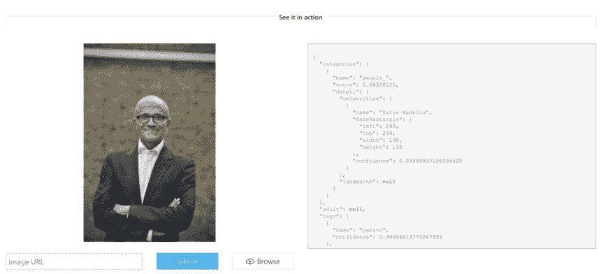
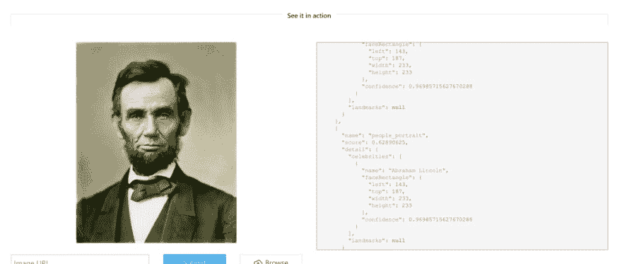
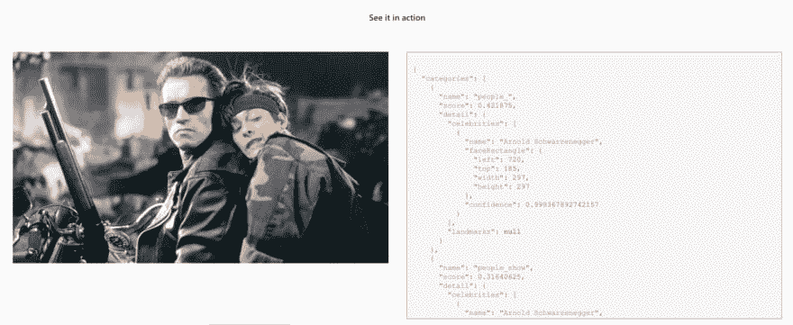

# 学习使用认知服务将人工智能添加到您的应用程序中

> 原文：<https://dev.to/azure/learn-to-add-ai-to-your-apps-with-cognitive-services-2c32>

在 [Twitter](https://twitter.com/chris_noring) 上关注我，很乐意接受您对主题或改进的建议/Chris

> 一个反人类的 AI 反派！作为一个在 80 年代长大的孩子，一些最酷的电影是阿诺德·施瓦辛格主演的《终结者》和《终结者 2》。icy mi——一个 AI 机器人(Arnold)被从未来送来，试图摧毁未来人类反抗的任何机会。

当时，我们人类建造一个像那样移动的机器人感觉很遥远，直到这个视频让互联网[https://www.youtube.com/watch?v=LikxFZZO2sk](https://www.youtube.com/watch?v=LikxFZZO2sk)
成为由波士顿动力公司建造的机器人。那天很多人被咖啡呛到了。

如果那东西变得聪明并对人类有敌意，我们需要加入太空中的埃隆·马斯克·特斯拉😉《终结者》中一个非常前沿的场景慢慢浮现在我的脑海中。终结者进入摩托车酒吧，扫描房间周围的人和物体，正确分类物体是什么，它们的颜色，大小以及它们是否是他的目标！[https://www.youtube.com/watch?v=zzcdPA6qYAU](https://www.youtube.com/watch?v=zzcdPA6qYAU)

那时候太神奇了，最好的科幻小说。事情是这样的，这不再是科幻小说了。机器学习领域发生了很多事情。机器学习行业雇佣了一大批数据科学家，他们构建的算法能够在给定训练数据的情况下，正确识别出它在看什么。
一个非常著名的例子是 pug 或 muffin 训练数据，其中我们可以看到这些算法是如何在无数像这样的图像上进行训练的:

[](https://res.cloudinary.com/practicaldev/image/fetch/s--PiguqxhL--/c_limit%2Cf_auto%2Cfl_progressive%2Cq_auto%2Cw_880/https://thepracticaldev.s3.amazonaws.com/i/3ono6o66n0wkurieguyk.jpeg)

我知道你们中的一些人现在可能在偷笑，认为我们不需要担心机器会很快超过我们😉。

我说过这不再是科幻小说了，现在也不是。微软提供了一整套名为 [Azure 认知服务](https://azure.microsoft.com/en-us/services/cognitive-services/?wt.mc_id=devto-blog-chnoring)的服务

以...为中心

*   [视觉](https://azure.microsoft.com/en-us/services/cognitive-services/directory/language/#vision?wt.mc_id=devto-blog-chnoring)，这是图像处理算法，可以识别`caption`、`index`、中度`pictures`和`videos`
*   [语音](https://azure.microsoft.com/en-us/services/cognitive-services/directory/language/#speech?wt.mc_id=devto-blog-chnoring)，可以将语音音频转换为文本，使用语音进行验证或为您的应用程序添加语音识别
*   [语言](https://azure.microsoft.com/en-us/services/cognitive-services/directory/language/#lang?wt.mc_id=devto-blog-chnoring)，允许您的应用程序使用预建脚本处理自然语言，评估情感，并学习如何识别用户想要什么
*   [知识](https://azure.microsoft.com/en-us/services/cognitive-services/directory/language/#know?wt.mc_id=devto-blog-chnoring)，映射复杂的信息和数据，以解决智能推荐、语义搜索等任务。
*   [搜索](https://azure.microsoft.com/en-us/services/cognitive-services/directory/language/#search?wt.mc_id=devto-blog-chnoring)，使应用和服务能够利用网络规模的无广告搜索引擎的力量进行搜索。使用搜索服务，在数十亿网页、图像、视频和新闻搜索结果中准确找到您想要的内容

正如你所注意到的，当你点击上面的任何一个类别时，每个区域都会导向大量的服务，并且他们可以免费尝试。我不知道你是怎么想的，但是当有人告诉我这里有一大堆 API 供你使用，特别是如果它使机器学习对我这样的开发人员有用时，我觉得自己就像一个在糖果店的孩子。
为了配合介绍的叙述，让我们深入到[视觉](https://azure.microsoft.com/en-us/services/cognitive-services/directory/language/#vision?wt.mc_id=devto-blog-chnoring)类别，因为我们想看像终结者对吗？；)

让我们点击图像中的[名人和地标识别](https://azure.microsoft.com/en-gb/services/cognitive-services/computer-vision/#celebrities-landmarks?wt.mc_id=devto-blog-chnoring)。哦，酷，我们有一个演示页面，我们可以看到工作中的算法，在你购买之前尝试一下:)

[](https://res.cloudinary.com/practicaldev/image/fetch/s--m3uqXbSh--/c_limit%2Cf_auto%2Cfl_progressive%2Cq_auto%2Cw_880/https://thepracticaldev.s3.amazonaws.com/i/t8vc1c75upgi77v7clcc.png)

上面我们可以看到，它要求我们输入一个图像的 URL，它似乎用 JSON 来响应。好吧，我们来点简单的，一张亚伯·林肯的照片:

[](https://res.cloudinary.com/practicaldev/image/fetch/s--teMM4E-T--/c_limit%2Cf_auto%2Cfl_progressive%2Cq_auto%2Cw_880/https://thepracticaldev.s3.amazonaws.com/i/pwr4msqhkjp0hyep6o5q.png)

获胜者是…亚伯·林肯。好的，这很简单，让我们试试别的:

我不得不承认。我对这个有点紧张。).好，让我们看看结果:

[](https://res.cloudinary.com/practicaldev/image/fetch/s--OsKMI9sB--/c_limit%2Cf_auto%2Cfl_progressive%2Cq_auto%2Cw_880/https://thepracticaldev.s3.amazonaws.com/i/ao57wg3p0rjobt252qpb.png)

好的，它认出了电影《终结者 2》中的阿诺德·施瓦辛格，很好。我发誓，如果它提到约翰·康纳，我会逃之夭夭，只是开玩笑:)

## 使用 Azure 认知服务

要开始使用认知服务 API，我们需要一个 API 密钥。我们需要采取一些步骤来获得所说的密钥，但它真的没那么多。认知服务驻留在 Azure 上。要获得免费 Azure 帐户，请点击此[链接](https://azure.microsoft.com/en-gb/free/?wt.mc_id=devto-blog-chnoring):

注册后，你可以使用 Azure 门户或 Azure CLI。Azure CLI 使我们能够从命令行与 Azure 对话，这通常比在 UI 中点击更快、更酷。

一旦我们走到这一步，只剩下四步了，所以和我在一起，我们很快就会像阿诺德一样看世界😃

剩下的内容如下:

*   **创建一个资源组**，这是一个目录，你可以把所有的东西放在一起，比如账户、数据库、应用程序，只需要一秒钟就可以创建
*   **创建一个认知服务账户**，这也只是一行代码，创建这个账户会给我们 API 密钥
*   **对 API** 进行 POST 调用，这是一个非常简单的 REST API 调用，给出了我们从构建认知服务帐户中获得的 API 密钥
*   **解析 JSON 响应**，我们将得到一个 JSON 返回，我们将看看它给我们的不同部分，看看我们可以向我们的用户显示什么

### 创建资源组

我们需要做的第一件事是使用 Azure CLI 登录 Azure。要使用 Azure CLI，我们首先需要安装它。点击此链接获取安装说明，不同的操作系统有不同的安装说明，请确保选择正确的安装说明:

> [https://docs . Microsoft . com/en-us/CLI/azure/install-azure-CLI？view=azure-cli-latest](https://docs.microsoft.com/en-us/cli/azure/install-azure-cli?view=azure-cli-latest)

让我们使用 Azure CLI 登录 Azure:

```
az login 
```

这将在浏览器中打开一个窗口，我们在这里登录我们的 Azure 帐户。此后，终端将有权访问 Azure。

现在让我们创建资源组:

```
az group create \

--name resourceforcogservices \

--location westeurope 
```

这里的命令是`az group create`，我们给它以下参数:

*   **名字**，这是我们选择的名字
*   **位置**，根据我们在世界上的位置，我们可以在这里的多个位置中进行选择

对于地点，我们选择了`westeurope`，因为那是我写这篇文章的地方。所以根据你所在的位置选择一个地区。以下是受支持地区的完整列表:

*   西部 2
*   中南半岛
*   美国中部
*   easeus
*   西欧
*   东南亚
*   日本东部
*   巴西南部
*   澳大利亚东南部
*   印度中部

### 创建 Azure 认知服务帐户

创建这个帐户非常容易。这是通过以下命令完成的:

```
az cognitiveservices account create \

--kind ComputerVision \

--name ComputerVisionService \

--sku S1 \

--resource-group resourceforcogservices \

--location westeurope 
```

好的，我们的基本命令是`az cognitiveservices account create`，之后我们给这个命令添加了一些参数:

*   这里我们需要输入我们将使用的认知服务，我们在这里的值需要是计算机视觉
*   **名字**，名字就是服务的名字，也就是`ComputerVisionService`
*   **sku** ，表示定价等级，在服务的生命周期内是固定的，我们选择 S1，它非常便宜。
*   **resourcegroup** ，我们之前已经创建了这个资源组，如前所述，这个资源组就像一个文件夹，所有相关的内容都应该组织在其中
*   **地点**，我们在这里继续使用西方欧洲，因为那是我们开始的地方，欢迎你继续使用你使用的地点

> [https://docs . Microsoft . com/en-us/azure/search/search-SKU-tier](https://docs.microsoft.com/en-us/azure/search/search-sku-tier)

一旦创建了认知服务帐户，我们就可以检索 API 密钥。以下命令将列出我们的认知服务帐户，包括 API 密钥:

```
az cognitiveservices account show \

--name ComputerVisionService \

--resource-group resourceforcogservices 
```

我们获取密钥的命令是`az cognitiveservices account show`,然后我们需要给这个命令一些参数:

*   名称，这是我们服务的名称
*   资源组，我们继续使用我们最初选择的资源组`westeurope`

### 对 API 进行 POST 调用

现在，为了在进行 REST 调用时更容易使用，我们将把 API 键赋给一个 shell 变量，当我们稍后进行 REST 调用时，我们可以引用该变量。让我们做作业:

```
key=$(az cognitiveservices account keys list \

--name ComputerVisionService \

--resource-group resourceforcogservices \

--query key1 -o tsv) 
```

上面列出了帐户上的所有键，挑出一个名为`key1`的键，并将其分配给变量 key。现在我们都设置好了，准备打电话休息。

让我们看看我们的 API，看看 URL 一般是什么样子:

```
https://[region].api.cognitive.microsoft.com/vision/v2.0/analyze?visualFeatures=<...>&details=<...>&language=<...> 
```

我们看到，我们需要用我们创建资源组和帐户时使用的区域来替换`[region]`，在我们的例子中是`westeurope`。此外，我们看到 API 使用了名为`analyze`的方法和参数`visualFeatures`、细节和`language`。

*   **明细**，这个可以有值`Landmarks`或者`Celebrities`
*   **视觉特征**，这是关于你想要回什么样的信息，`Categories`选项会对图像的内容进行分类，比如树木、建筑等等。`Faces`将识别人们的面孔，并给出他们的性别和年龄

好了，让我们看看实际调用是什么样子的:

```
curl "https://westeurope.api.cognitive.microsoft.com/vision/v2.0/analyze?visualFeatures=Categories,Description&details=Landmarks" \

-H "Ocp-Apim-Subscription-Key: $key" \

-H "Content-Type: application/json" \

-d "{'url' : 'https://raw.githubusercontent.com/MicrosoftDocs/mslearn-process-images-with-the-computer-vision-service/mastimg/mountains.jpg'}" \

| jq '.' 
```

上面我们调用`cURL`并将头`Ocp-Apim-Subscription-Key`设置为我们的 API 键，或者更具体地说，设置为包含我们的 API 键的变量`key`。我们看到，我们用属性`url`创建了一个 BODY 值，并将其设置为我们想要分析的图像。

### 看着回应

好吧，我们打电话，我们被告知会有 JSON。而且有，一大堆:)

```
{  "categories":  [{  "name":  "outdoor_mountain",  "score":  0.99609375,  "detail":  {  "landmarks":  []  }  }],  "description":  {  "tags":  [  "snow",  "outdoor",  "mountain",  "nature",  "covered",  "skiing",  "man",  "flying",  "standing",  "wearing",  "side",  "air",  "slope",  "jumping",  "plane",  "red",  "hill",  "riding",  "people",  "group",  "yellow",  "board",  "doing",  "airplane"  ],  "captions":  [{  "text":  "a snow covered mountain",  "confidence":  0.956279380622841  }]  },  "requestId":  "<undisclosed>",  "metadata":  {  "width":  600,  "height":  462,  "format":  "Jpeg"  }  } 
```

`score`表示对结果有多确定。值为`0.99609375`(最大值为 1.0)，我会说这是非常确定的。标题是算法试图给我们一个正常的句子，告诉我们这是什么。它说它是:`a snow-covered mountain`。让我们自己看看我们提供给服务呼叫的 URL:

[](https://res.cloudinary.com/practicaldev/image/fetch/s--d_GUQIhf--/c_limit%2Cf_auto%2Cfl_progressive%2Cq_auto%2Cw_880/https://thepracticaldev.s3.amazonaws.com/i/67zkyg3goby1w5ccd8z9.jpeg)

> 是的，在我看来像座山，好的天网；)

## 总结

我带你度过了我的童年，现在你知道我是一个电影呆子，有点怀疑所有这些人工智能，机器学习研究将我们带到哪里。与此同时，我对我可以用认知服务构建的所有酷应用感到兴奋。这里也有一些值得思考的问题。开机器人杀手的玩笑很容易，尤其是当它们来自电影世界的时候。对于所有伟大的技术，我们有责任用它做一些有用的事情，为人类服务。想象一下像这样的算法安装在无人机或直升机上。进一步想象一下，一场灾难发生了，你正在寻找幸存者，你有一些很好的算法可以快速帮助你找到人。这能带来真正的改变，拯救生命。
希望你和我一样兴奋，去试试吧。最好的开始方式是希望这篇博客，但是值得查看一下[学习](https://docs.microsoft.com/en-gb/learn/?wt.mc_id=devto-blog-chnoring)平台，尤其是这门课。祝你好运:)

如果你觉得这篇文章有用/好笑/有趣/什么的，请给我鼓掌:)