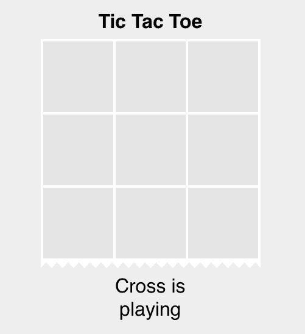
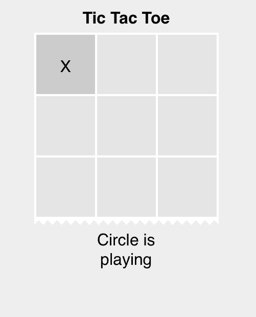
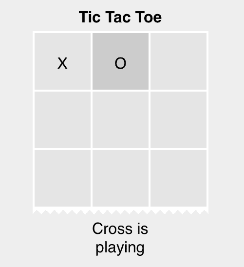
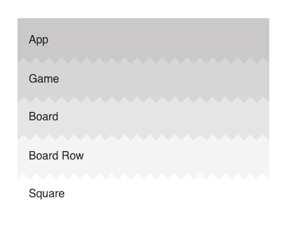
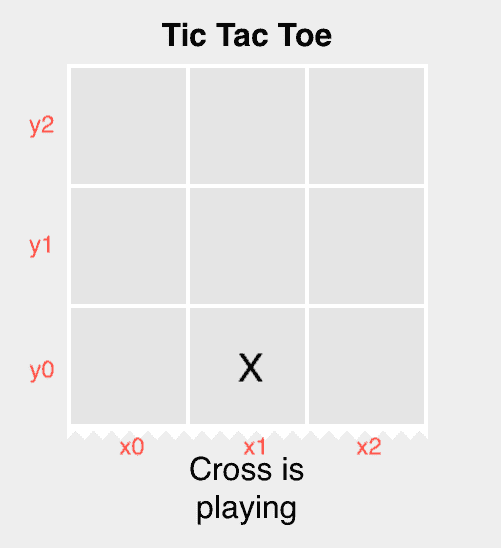

# 用模式匹配重构替换条件

> 原文：<https://dev.to/vaderdan/replace-conditional-with-pattern-matching-refactoring-3o96>

这是我最喜欢的重构之一。它有助于组织逻辑，使代码更容易阅读和扩展。

我写这篇博文是为了用作书签。

我经常看到类似下面的代码:

```
func fizzbuzz(i: Int) -> String {

  if i % 3 != 0 {
    if i % 5 != 0 {
      return "\(i)"
    } else {
      return "Buzz"      
    }
  } else if i % 5 != 0 {
    return "Fizz"
  } else {
    return "FizzBuzz"
  }
}

for i in 1...100 {
  print(fizzbuzz(i))
} 
```

看到所有可能的状态并预测给定的输入数将会发生什么，这是一个相当大的精神挑战。嵌套`if's`使得这个过程更加困难。
我们必须找到一种好的方法来代表基本情况，并使所有非法情况成为不可能。

**模式匹配**是一种比较值的技术(或者在我们的例子中:**元组**值)..在某种程度上，我们可以**解构复杂的数据结构，并将其内部值与模式** : `SomeComplexDataStructure == (0, 0) ?`进行匹配。

注意，我们可以使用`_`作为通配符，
`case(0, _)`将匹配所有值，其中`i%3=0`和`i%5=anyvalue`

```
func fizzbuzz(i: Int) -> String {
  let someComplexDataStructure = (i % 3, i % 5) // Tuple complex data structure

  switch someComplexDataStructure {
    case (0, 0): "FizzBuzz"
    case (0, _): "Fizz"
    case (_, 0): "Buzz"
    case (_, _): "\(i)"
  }
} 
```

### 在另一个层面上放松我们的游戏，

让我们疯狂地做一个**井字游戏**，用**枚举**存储它所有的内部状态，用*模式匹配*显示棋盘上每个玩家的移动，找出谁是赢家，...

*免责声明:我将使用新的 SwiftUI 语法来构建视图(下面有 github 下载链接)*

[](https://res.cloudinary.com/practicaldev/image/fetch/s--vxFodAQl--/c_limit%2Cf_auto%2Cfl_progressive%2Cq_auto%2Cw_880/https://thepracticaldev.s3.amazonaws.com/i/r4dgck6frgekcqvy628x.png)

[](https://res.cloudinary.com/practicaldev/image/fetch/s--RZ9PNiL6--/c_limit%2Cf_auto%2Cfl_progressive%2Cq_auto%2Cw_880/https://thepracticaldev.s3.amazonaws.com/i/d1o6lii97z9b94zwq388.png)

[](https://res.cloudinary.com/practicaldev/image/fetch/s--s53NhlON--/c_limit%2Cf_auto%2Cfl_progressive%2Cq_auto%2Cw_880/https://thepracticaldev.s3.amazonaws.com/i/azn49p6jqjq27v9lbppa.png)

[](https://res.cloudinary.com/practicaldev/image/fetch/s--PT4Xu5WF--/c_limit%2Cf_auto%2Cfl_progressive%2Cq_auto%2Cw_880/https://thepracticaldev.s3.amazonaws.com/i/u8sq9fvehdywgjszaurw.png)

这是我们游戏的积木**类型**:

`Player`代表游戏中的两个对手(`0`和`X` )
`Filed`代表棋盘上的方格:可以是空的，也可以由其中一个玩家标记
`GameState`代表轮到哪个玩家(`playing`)，哪个玩家赢了游戏或者两个玩家都没赢(平局)

```
enum Player {
  case cross, circle
}

enum Field {
  case empty, marked(Player)
}

enum GameState {
  case playing(Player), winner(Player), draw
} 
```

### SwiftUI

我们将使用 SwiftUI `Views`为我们的小游戏构建基本的 UI。
SwiftUI 是快速构建界面原型、声明式组合视图和子视图的好方法...

```
import SwiftUI
import PlaygroundSupport

struct App: View {
  var title: String
  var body: some View {
    VStack {
      Text(title).foregroundColor(.gray)
      Game()
    }
  }
}

PlaygroundPage.current.liveView = UIHostingController(rootView: App("TicTacToe")) 
```

我们有包含`Game`组件的`App`组件，该组件包含`Board > Board Row > Square`...

[](https://res.cloudinary.com/practicaldev/image/fetch/s--DDaEYy_a--/c_limit%2Cf_auto%2Cfl_progressive%2Cq_auto%2Cw_880/https://thepracticaldev.s3.amazonaws.com/i/8pvnvn1c92wd3gajuulw.png)

### SwiftUI @State 绑定

SwiftUI 最大的好处是状态变量的变化和组件本身的重绘/刷新之间的实时绑定。

如果我们用`@State`修饰符声明变量，我们所做的每一个改变都将**刷新**我们组件的子视图:

```
struct Game: View {
  @State var board: [[Field]]
  @State var gameState: GameState

  mutating func restart() {
    self.board = ....
  }
  mutating func clickSquare(_ x: Int, y: Int) {
    self.board = updateBoard(board, gameState, id: "\(x)  \(y)")
    self.gameState = updateGameState(board, gameState) 
  }

  var body: some View {
        Board(state, onRestart, clickSquare)
  }
} 
```

### 板变量[[字段]]

`board`变量是**二维矩阵**，所有棋盘方格由 x 轴和 y 轴坐标放置:每个方格的值由一些玩家(`X`、`O`)选择`empty`或`marked`

`let y = 0, x = 1`

`board[y][x] = .marked(.cross)`

[](https://res.cloudinary.com/practicaldev/image/fetch/s--oChGLvOn--/c_limit%2Cf_auto%2Cfl_progressive%2Cq_auto%2Cw_880/https://thepracticaldev.s3.amazonaws.com/i/i1l6xyh4t37dv7dcmefv.png)

当我们点击一个方块时，一个函数将设置`board[y][x] = .marked(.cross)`，然后 SwiftUI 将**刷新**视图，并在我们点击的方块下显示`x`(因为`board`是@状态变量)

### 让我们回到模式匹配！

但是我们怎么知道点击`board`到底是放`X`还是放`O`呢？

我要提醒大家 TicTacToe 的规则:

> 我们可以在黑板上标出一个阅读空白方格
> 
> 我们可以在里面画出`O`或`X`(取决于轮到谁了)

`updateBoard`函数执行该计算并改变 x，y 坐标上的`board`变量的字段。

```
func updateBoard(_ board: [[Field]], _ gameState: GameState, id: String) -> [[Field]] {
  return board.enumerated().map { (indy, row) in
    return row.enumerated().map { (indx, field) in
      if "\(indx)  \(indy)" != id { return field }   

            //if the board current field == clicked square field

      switch (gamestate, field) {
        //if square is alredy marked -> return same field 
        (.playing(_), .marked(_)) => return field,
                //if the square is empty -> modify it -> as marked by X or O player
        (.playing(let player), .empty) => return .marked(player),
        //otherwise in every other case, like when game is won, no started.. square is empty
        (_, _) => return .empty
      }
    }
  } 
```

Excelent 模式匹配将免费为我们处理所有的**其他默认情况**！

### 计算游戏赢家，或下一回合玩家

在下一部分，我们将计算游戏是否结束，谁是赢家，或者谁是下一个玩家。

我将把`updateGameState`函数分解成三个部分:

1.  让玩家进入下一回合

2.  将板 2 维矩阵展平为 1 维数组`[[x0y0, x1y0, x2y0] [x0y1, x1y1, x2y1]]`变为`(x0y0, x1y0, x2y0, x0y1, x1y1, x2y1)`

3.  检查棋盘是否包含 3 个标记的区域(水平、垂直、对角线)，如果是，将`gameState`改为`.winner`

我们在棋盘上的方格上做标记(或者是`X`或者是`O`)，然后我们计算——我们是否有 3 个方格排成一行，如果我们有 3 个方格排成一行`gameState = winner`
如果我们没有完成游戏(`gameState != winner` `gameState != draw`我们没有赢家，但也不是平局)，
我们将继续玩，`gameState = .playing(the other player)`

```
func updateGameState(_ board: [[Field]], _ state: GameState) -> GameState {
  // 1\. 
  func nextPlayer(state: GameState) -> GameStates {
    switch state {
      case .plaing(.cross): return .plaing(.circle)
      case .plaing(.circle): return .plaing(.cross)      
      default: return state
    }
  }

  // 2.
  let b = board.flatmap { $0 }
  let flatBoard = (b[0], b[1], b[2], b[3], b[4], b[5], b[6], b[7], b[8], b[9])

  // 3.
    switch flatBoard {
    //horizontal lines
    case (.marked(.X), .marked(.X), .marked(.X), _, _, _, _, _, _): return .winner(.cross)
    case (_, _, _, .marked(.X), .marked(.X), .marked(.X), _, _, _): return .winner(.cross)
    case (_, _, _, _, _, _, .marked(.X), .marked(.X), .marked(.X)): return .winner(.cross)
        case (.marked(.O), .marked(.O), .marked(.O), _, _, _, _, _, _): return .winner(.circle)
    case (_, _, _, .marked(.O), .marked(.O), .marked(.O), _, _, _): return .winner(.circle)
    case (_, _, _, _, _, _, .marked(.O), .marked(.O), .marked(.O)): return .winner(.circle)
    //vertical lines
    case (.marked(.X), _, _, .marked(.X), _, _, .marked(.X), _, _): return .winner(.cross)
    case (_, .marked(.X), _, _, .marked(.X), _, _, .marked(.X), _): return .winner(.cross)
    case (_, _, .marked(.X), _, _, .marked(.X), _, _, .marked(.X)): return .winner(.cross)
    case (.marked(.O), _, _, .marked(.O), _, _, .marked(.O), _, _): return .winner(.circle)
    case (_, .marked(.O), _, _, .marked(.O), _, _, .marked(.O), _): return .winner(.circle)
    case (_, _, .marked(.O), _, _, .marked(.O), _, _, .marked(.O)): return .winner(.circle)         
    // diagonal lines
    case (.marked(.X), _, _, _, .marked(.X), _, _, _, .marked(.X)): return .winner(.cross)
    case (_, _, .marked(.X), _, .marked(.X), _, .marked(.X), _, _): return .winner(.cross)
    case (.marked(.O), _, _, _, .marked(.O), _, _, _, .marked(.O)): return .winner(.circle)
    case (_, _, .marked(.O), _, .marked(.O), _, .marked(.O), _, _): return .winner(.circle)
    // default -> all fields filled -> draw
    case (.marked(_), .marked(_), .marked(_), .marked(_), .marked(.O), .marked(_), .marked(_), .marked(_), .marked(_)): return .draw
    // still unfilled fields -> switch to other player
    default: return nextPlayer(state)
  }
} 
```

实际上，这两个函数(`updateGameState`，`updateBoard`)处理了游戏中所有可能的业务逻辑情况:不超过 100 行代码。

### 结论

这是简单而自然的重构。

当您看到数据被映射到其他数据或行为时，请使用此重构。

从这里可以吸取一个教训:使用**数据驱动**而不是事件驱动(`if/else`)架构几乎总是更好。

并非每个案例都是一样的。有些时候你不容易将嵌套的`ifs`转换成`switch`，例如`updateGameState`函数- >有 9 个或更多值的元组很难编写和维护。