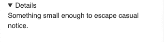
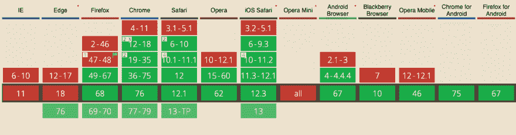

# 带有 HTML 和 CSS 的完全可访问的手风琴(无 JS)

> 原文：<https://dev.to/hozefaj/fully-accessible-accordion-with-html-css-no-js-59n9>

最近我碰到了`details`和`summary` HTML 标签。他们的基本用途是创建一个手风琴式的开箱 UX。

我以前曾使用`div`和`span`和 JS 创建一个类似手风琴的结构来处理打开和关闭。在 JS 上，有一个逻辑来跟踪当用户点击另一个元素时哪个元素是打开的。随着时间的推移，这可能会变得复杂。

发现这些标签后，我制作了一个原型，用普通的 HTML 和 CSS 实现了这个功能

让我们复习一下这个步骤

`details`标签是父标签，下面的 2 个标签被包含在其中。
`summary`标签是用户默认看到的标题(比如 FAQ 的问题)所在的位置。
`p`或`div`可以是标题周围的回复(常见问题解答)或更多细节。

每个浏览器都支持开箱即用的折叠式箭头。这里好的一面是使用 CSS 我们可以选择任何样式。

[](https://res.cloudinary.com/practicaldev/image/fetch/s--kW03eoXs--/c_limit%2Cf_auto%2Cfl_progressive%2Cq_auto%2Cw_880/https://thepracticaldev.s3.amazonaws.com/i/ovmpr3bdtauaizikgt6u.png)

现在，让我们试着按照我们选择的方式来设计它。我决定试试能否复制贝宝的模式。

为此，我们首先需要隐藏浏览器的默认`marker`

```
summary::-webkit-details-marker {
  display: none;
} 
```

Enter fullscreen mode Exit fullscreen mode

下一步，在我的例子中，为打开和关闭箭头添加样式。

```
// creates the close arrow
summary:after {
  content: "";
  width: 20px;
  height: 20px;
  transform: rotate(45deg);
  transition: all 0.3s ease-out;
  border-bottom: 1px solid #cbd2d6;
  border-right: 1px solid #cbd2d6;
  float: right;
}

// creates the open(inverted) arrow.
details[open] summary:after {
  content: "";
  transform: rotate(-135deg);
  margin-top: 8px;
} 
```

Enter fullscreen mode Exit fullscreen mode

在`details`标签上，还有一个默认打开的选项。使用`open`属性来做到这一点。就像`<details open>`一样。

[https://codesandbox.io/embed/accordion-with-details-tag-vqwsb](https://codesandbox.io/embed/accordion-with-details-tag-vqwsb)

除了 Edge & IE(当然)所有其他的[浏览器都支持这些标签](https://caniuse.com/#search=details)。

[](https://res.cloudinary.com/practicaldev/image/fetch/s--MY_sBmFt--/c_limit%2Cf_auto%2Cfl_progressive%2Cq_auto%2Cw_880/https://thepracticaldev.s3.amazonaws.com/i/4rybcsci0hoiks60blwd.png)

这是基本(入门)指南。对于更详细和更高级的例子，我推荐[这篇关于 CSS 技巧的文章](https://css-tricks.com/quick-reminder-that-details-summary-is-the-easiest-way-ever-to-make-an-accordion/)。