# 无服务器:通过 OpenFaaS et K3S 部署一个应用程序单页(SPA)

> 原文：<https://dev.to/deep75/serverless-deployer-une-application-single-page-spa-via-openfaas-et-k3s-41gk>

# 无服务器:通过 OpenFaaS et K3S 部署一个应用程序单页(SPA)

[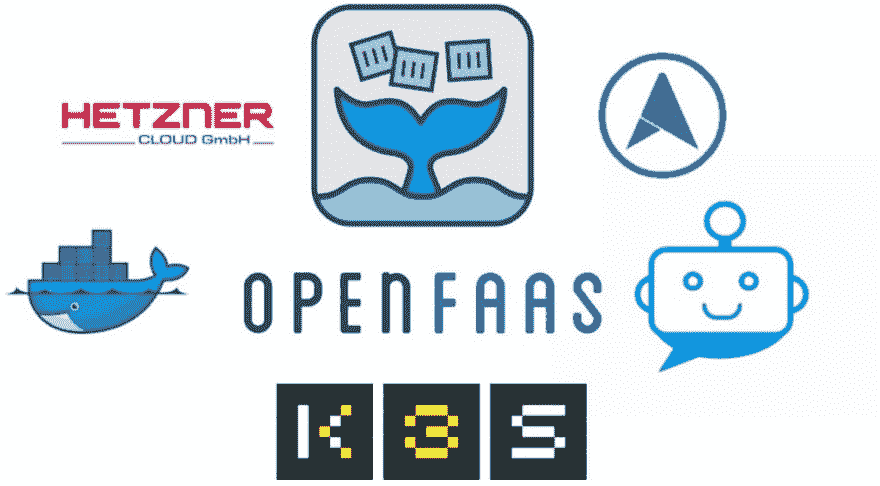](https://res.cloudinary.com/practicaldev/image/fetch/s--euTFPeik--/c_limit%2Cf_auto%2Cfl_progressive%2Cq_auto%2Cw_880/https://cdn-images-1.medium.com/max/1024/1%2AR-8Zu_DV5g2bdz3fv3HyLA.jpeg)

要开始此实验，请在 spreader cloud 中部署第一个 Ubuntu 18.04 lt 的 CX11 型节点(1 vCPU 和 2gb ram):

[](https://res.cloudinary.com/practicaldev/image/fetch/s--rlZTuE4C--/c_limit%2Cf_auto%2Cfl_progressive%2Cq_auto%2Cw_880/https://cdn-images-1.medium.com/max/1024/1%2A1xcsMMGBpDejcHJuMXOxWQ.jpeg)

使用 k3b 和此文件 *cloud-init* (作为库服务器群集的主节点) :

*   [k3s:轻量级 Kubernetes](https://k3s.io/)
*   [真正节俭的云托管-赫茨纳在线有限公司](https://www.hetzner.com/cloud)

[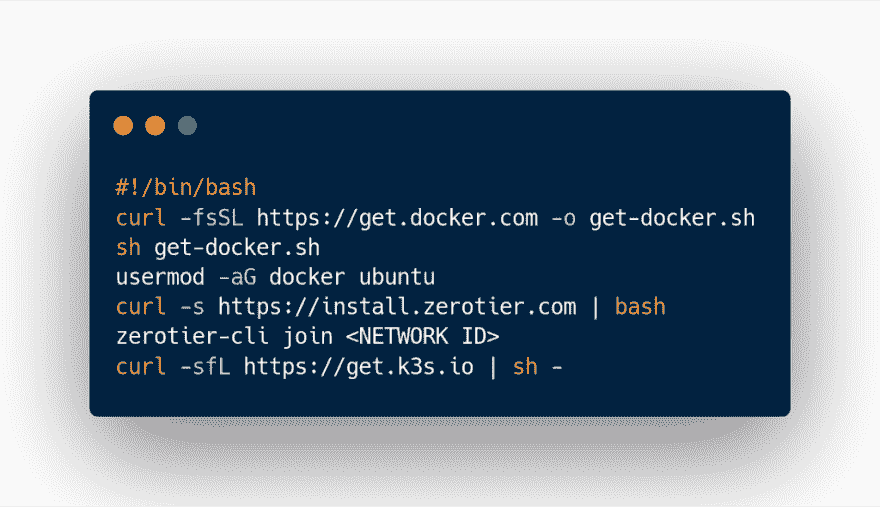](https://res.cloudinary.com/practicaldev/image/fetch/s--H641qnnC--/c_limit%2Cf_auto%2Cfl_progressive%2Cq_auto%2Cw_880/https://cdn-images-1.medium.com/max/1024/1%2A_Yd_QAfZj_0i3aomZJb90Q.png)

[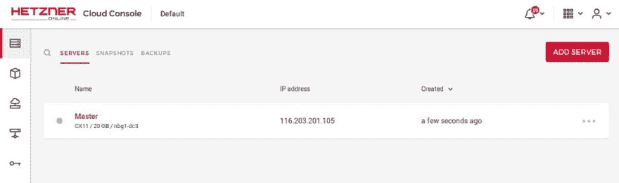](https://res.cloudinary.com/practicaldev/image/fetch/s--2ibqK1_I--/c_limit%2Cf_auto%2Cfl_progressive%2Cq_auto%2Cw_880/https://cdn-images-1.medium.com/max/1024/1%2AvqD3MUUbu7Ln3vteuIgzKQ.jpeg)

[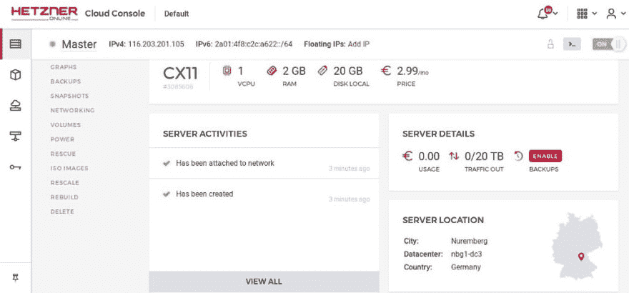](https://res.cloudinary.com/practicaldev/image/fetch/s--H8icUTbC--/c_limit%2Cf_auto%2Cfl_progressive%2Cq_auto%2Cw_880/https://cdn-images-1.medium.com/max/1024/1%2Ach6omo7gObjvlIXUXJOUPQ.jpeg)

主节点已就绪:

[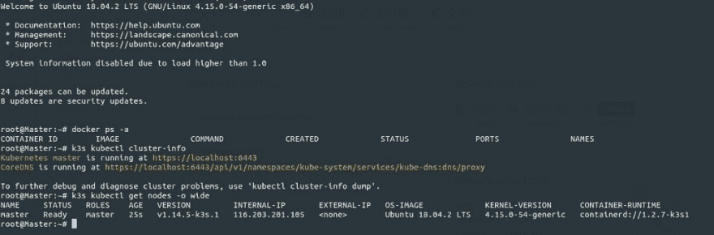](https://res.cloudinary.com/practicaldev/image/fetch/s--OwHuzapD--/c_limit%2Cf_auto%2Cfl_progressive%2Cq_auto%2Cw_880/https://cdn-images-1.medium.com/max/1024/1%2AfJXFhFW3lB-m68mv_V0_jg.jpeg)

然后，我将通过此文件*cloud-init*部署另外三个 Ubuntu 18.04 lt 节点(仍为 c11 至 1 vCPU 和 2gb ram):

[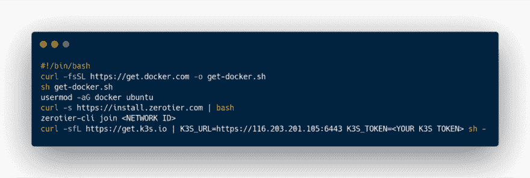](https://res.cloudinary.com/practicaldev/image/fetch/s--zCH2rThg--/c_limit%2Cf_auto%2Cfl_progressive%2Cq_auto%2Cw_880/https://cdn-images-1.medium.com/max/1024/1%2AScJgvQv_go5HR1P7Y_S7bQ.png)

[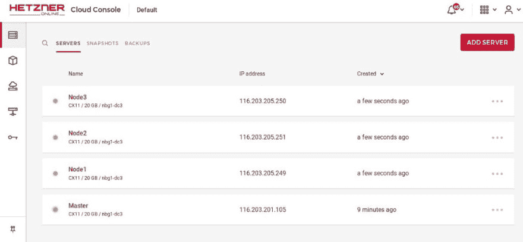](https://res.cloudinary.com/practicaldev/image/fetch/s--hoMxpjUh--/c_limit%2Cf_auto%2Cfl_progressive%2Cq_auto%2Cw_880/https://cdn-images-1.medium.com/max/1024/1%2A8cpeKCRG84IBlyW63epBjw.jpeg)

库服务器群集依赖于:

[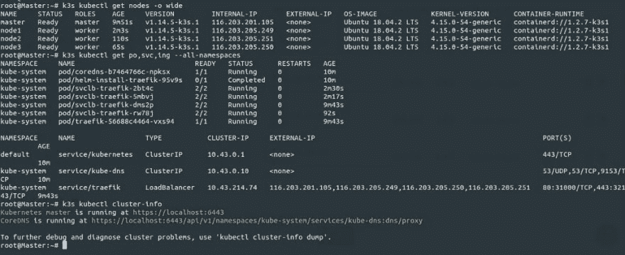](https://res.cloudinary.com/practicaldev/image/fetch/s--0Jwo4ObW--/c_limit%2Cf_auto%2Cfl_progressive%2Cq_auto%2Cw_880/https://cdn-images-1.medium.com/max/1024/1%2ASdlGmLk_scpbF5gVkYqJGg.jpeg)

我通常将 ZeroTier 与 metallb 结合使用，以提供此群集的负载平衡服务:

*   [金属磅](https://metallb.universe.tf/)
*   [下载](https://www.zerotier.com/download/)

[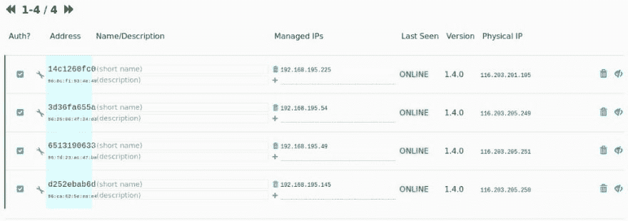](https://res.cloudinary.com/practicaldev/image/fetch/s--t3t1-X6P--/c_limit%2Cf_auto%2Cfl_progressive%2Cq_auto%2Cw_880/https://cdn-images-1.medium.com/max/1024/1%2AZ7LyTy_noDhdTsxOZqBa9A.jpeg)

[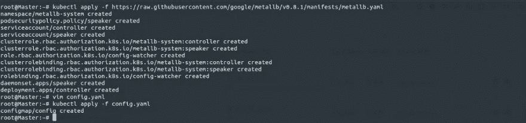](https://res.cloudinary.com/practicaldev/image/fetch/s--bjyvyQN9--/c_limit%2Cf_auto%2Cfl_progressive%2Cq_auto%2Cw_880/https://cdn-images-1.medium.com/max/1024/1%2AmCtR1Uoc0AmYsYFVr7kY5g.jpeg)T3】

```
$ kubectl apply -f [https://raw.githubusercontent.com/google/metallb/v0.8.1/manifests/metallb.yaml](https://raw.githubusercontent.com/google/metallb/v0.8.1/manifests/metallb.yaml)

$ kubectl apply -f config.yaml 
```

<figure>[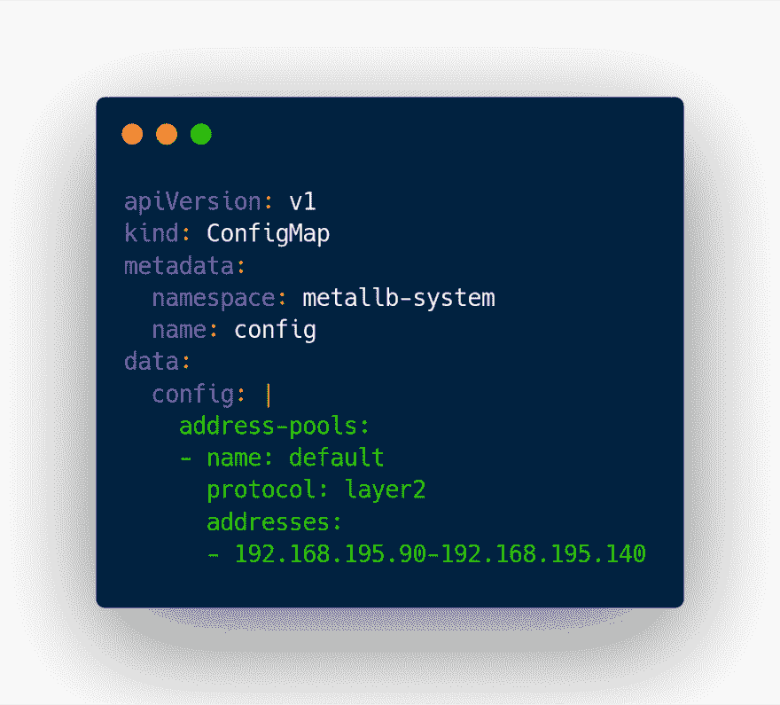](https://res.cloudinary.com/practicaldev/image/fetch/s--HE9ISfiA--/c_limit%2Cf_auto%2Cfl_progressive%2Cq_auto%2Cw_880/https://cdn-images-1.medium.com/max/908/1%2A16lvRGlAJTUswbyPav2sYQ.png)

<figcaption>config . YAML</figcaption>

T6】</figure>

从主节点 openfaas cli 恢复:

[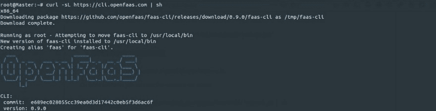](https://res.cloudinary.com/practicaldev/image/fetch/s--u77Zo944--/c_limit%2Cf_auto%2Cfl_progressive%2Cq_auto%2Cw_880/https://cdn-images-1.medium.com/max/1024/1%2AOJ_Fp9WIIiSAZd9Zw39LcQ.jpeg)

安装舵:

Helm——Kubernetes 的包装经理。

```
$ curl -L https://git.io/get\_helm.sh | bash

$ kubectl --namespace kube-system create serviceaccount tiller

$ kubectl create clusterrolebinding tiller-cluster-rule \
 --clusterrole=cluster-admin --serviceaccount=kube-system:tiller

$ kubectl --namespace kube-system patch deploy tiller-deploy \
 -p '{"spec":{"template":{"spec":{"serviceAccount":"tiller"}}}}' 
```

然后，我可以在群集中部署 openfaas:

[开放相位/相位网络](https://github.com/openfaas/faas-netes/blob/master/chart/openfaas/README.md)

[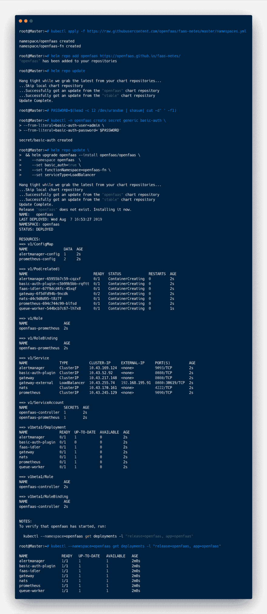](https://res.cloudinary.com/practicaldev/image/fetch/s--8vwDs1tz--/c_limit%2Cf_auto%2Cfl_progressive%2Cq_auto%2Cw_880/https://cdn-images-1.medium.com/max/1024/1%2AMdjz9hJO9oIogvM0G4ur6w.png)

通过负载平衡服务提供的 IP 地址，我可以访问 openfaas 门户:

[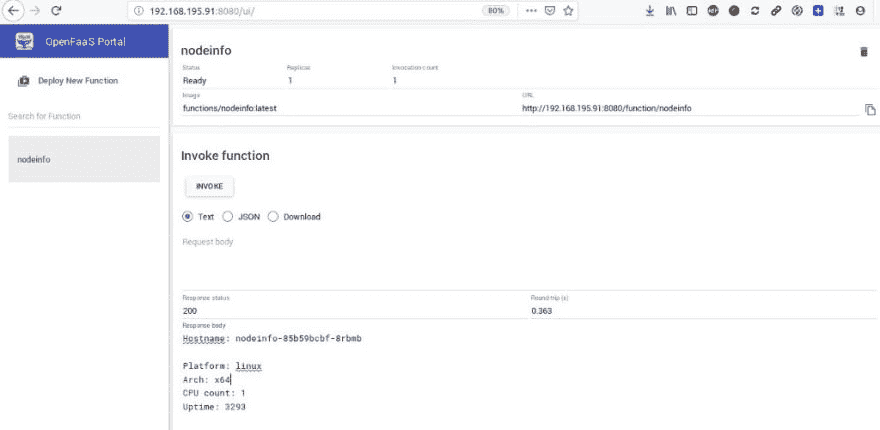](https://res.cloudinary.com/practicaldev/image/fetch/s--EXm1CTlw--/c_limit%2Cf_auto%2Cfl_progressive%2Cq_auto%2Cw_880/https://cdn-images-1.medium.com/max/1024/1%2Ab7BjQOtUctamBowibdY_TA.jpeg)

我将开始部署我的单页应用程序(在本例中为 mon chatbot):

*   [deep75/pwafcbot](https://github.com/deep75/pwafcbot)
*   [无服务器:Publier ses 渐进式网络应用程序 avec les Azure 函数代理…](https://medium.com/@abenahmed1/serverless-publier-ses-progressive-web-apps-avec-les-azure-functions-proxies-65e400a973d1)

> 通过基于 openfaas 模板(由 Alex Ellis 设计)的静态站点功能(使用 nginx 服务内容)。它首先在本地构建为 dock image，然后推送到 Docker Hub(也可以使用其专用 Docker Registry)，最后推送到 openfaas 平台:

[alexellis/静态站点模板](https://github.com/alexellis/static-site-template)

[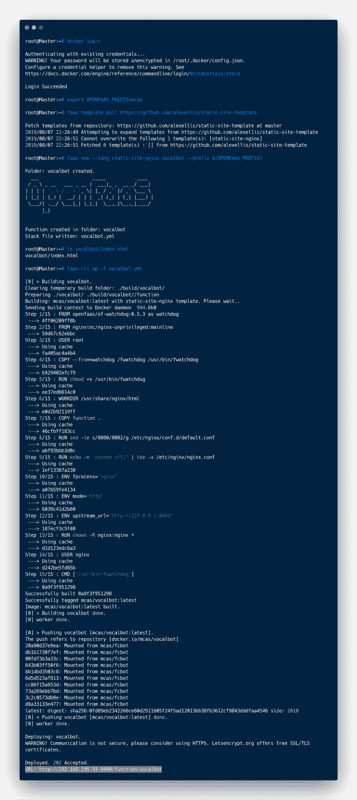](https://res.cloudinary.com/practicaldev/image/fetch/s--AXjwND0f--/c_limit%2Cf_auto%2Cfl_progressive%2Cq_auto%2Cw_880/https://cdn-images-1.medium.com/max/1024/1%2AJeHnThBfZSdHxx2Pm1Z_GA.png)

[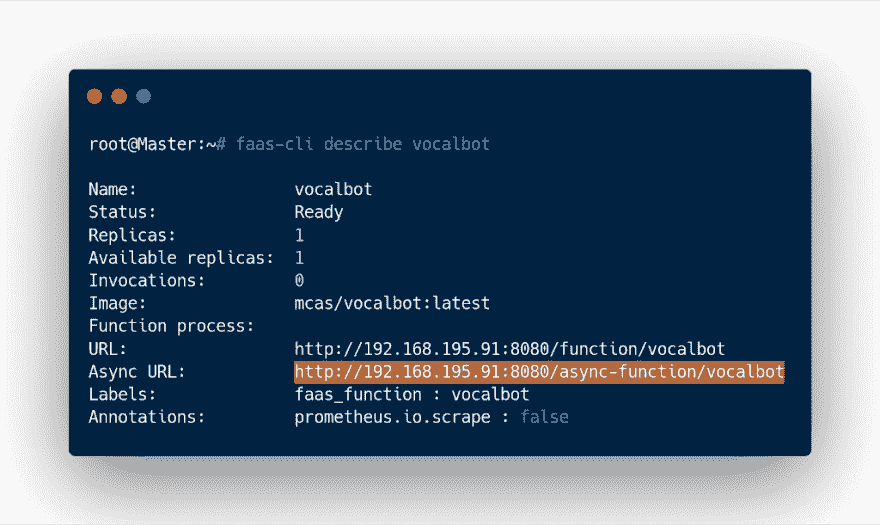](https://res.cloudinary.com/practicaldev/image/fetch/s--FdldfKtL--/c_limit%2Cf_auto%2Cfl_progressive%2Cq_auto%2Cw_880/https://cdn-images-1.medium.com/max/1024/1%2A8GYBaoUEanSrbr1l1EIr0A.png)

<figure>[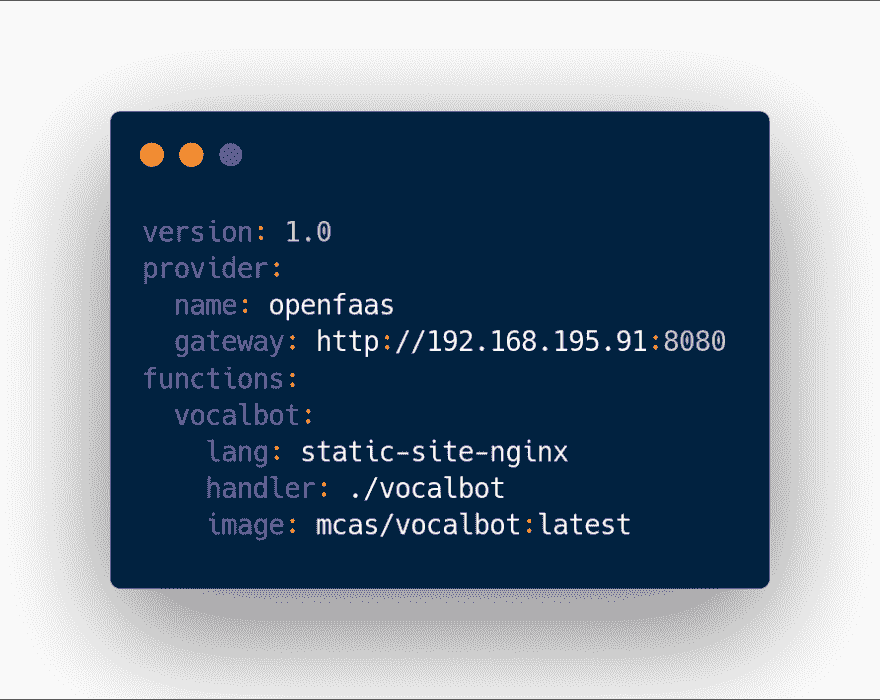](https://res.cloudinary.com/practicaldev/image/fetch/s--v1FNK7s3--/c_limit%2Cf_auto%2Cfl_progressive%2Cq_auto%2Cw_880/https://cdn-images-1.medium.com/max/892/1%2AD1j7ayMwtch3cmL57swcSw.png)

<figcaption>vocal bot . yml</figcaption>

</figure>

该功能将显示在 openfaas 门户上:

[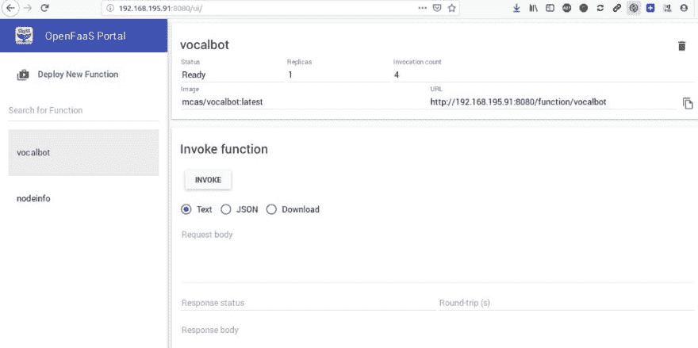](https://res.cloudinary.com/practicaldev/image/fetch/s--xzmUlriC--/c_limit%2Cf_auto%2Cfl_progressive%2Cq_auto%2Cw_880/https://cdn-images-1.medium.com/max/1024/1%2A742CfziIhzIvwor21yUmQA.jpeg)

我可以使用部署功能时提供的地址访问我的 chatbot:

[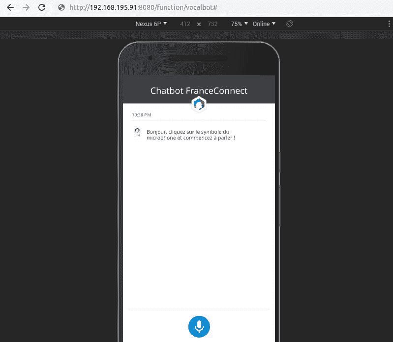](https://res.cloudinary.com/practicaldev/image/fetch/s--26SHf172--/c_limit%2Cf_auto%2Cfl_progressive%2Cq_auto%2Cw_880/https://cdn-images-1.medium.com/max/799/1%2AYbtUR2f5pJle1NJFEK3pvw.jpeg)

[](https://res.cloudinary.com/practicaldev/image/fetch/s--6mShK7Ws--/c_limit%2Cf_auto%2Cfl_progressive%2Cq_auto%2Cw_880/https://cdn-images-1.medium.com/max/702/0%2ArSs19Pty_iHdTFKa.jpg)

基于 openfaas node . js 10 express 模板的另一个变体:

[open FAAS-incubator/node 10-express-template](https://github.com/openfaas-incubator/node10-express-template)

我检索模板并根据 Github 上 Alex Ellis 的 Leaderboard-app 项目创建我的新功能:

*   [如何构建无服务器的单页面 App](https://www.openfaas.com/blog/serverless-single-page-app/)
*   [alexellis/排行榜-应用程序](https://github.com/alexellis/leaderboard-app)

[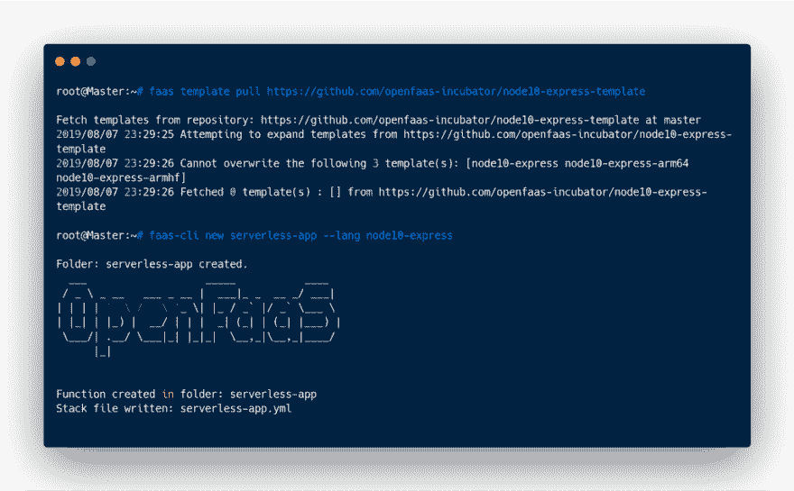](https://res.cloudinary.com/practicaldev/image/fetch/s--Hm_14QDb--/c_limit%2Cf_auto%2Cfl_progressive%2Cq_auto%2Cw_880/https://cdn-images-1.medium.com/max/1024/1%2AZwrdrzFcGBUDYvqeDukeuw.png)

它使用此文件 *handler.js* ，该文件指向包含 Chatbot 网页的目录:

<figure>[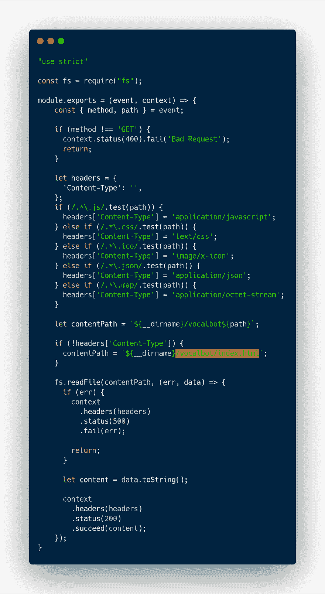T3】

<figcaption>handler . js</figcaption>](https://res.cloudinary.com/practicaldev/image/fetch/s--HJf4Sk5d--/c_limit%2Cf_auto%2Cfl_progressive%2Cq_auto%2Cw_880/https://cdn-images-1.medium.com/max/1024/1%2Ai2ZJDfbkSmJ2HE5AVh4X4w.png) </figure>

在这种最少依赖的情况下:

<figure>[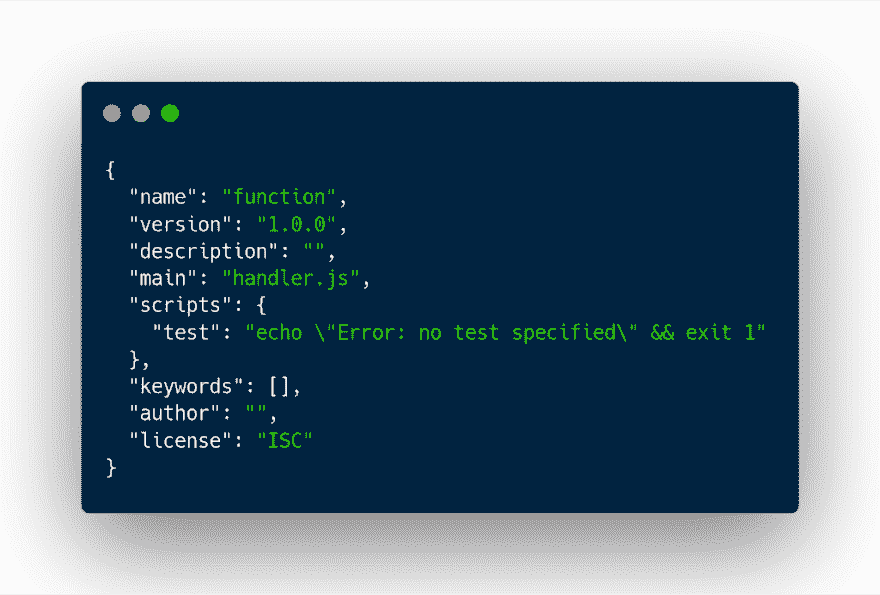](https://res.cloudinary.com/practicaldev/image/fetch/s--HBPCTz9w--/c_limit%2Cf_auto%2Cfl_progressive%2Cq_auto%2Cw_880/https://cdn-images-1.medium.com/max/1024/1%2Abkwlq1iuy7SsCBIWURoZ2A.png) 

<figcaption></figcaption>

</figure>

开始构造新特征:

[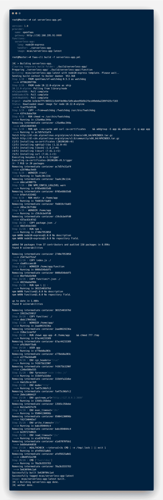](https://res.cloudinary.com/practicaldev/image/fetch/s--RpEANmjI--/c_limit%2Cf_auto%2Cfl_progressive%2Cq_auto%2Cw_880/https://cdn-images-1.medium.com/max/1024/1%2ARLmKGOXtScHkqFenzeVKxA.png)

从坞站枢纽向 openfaas 推进 T2 部署 T1 阶段后:

[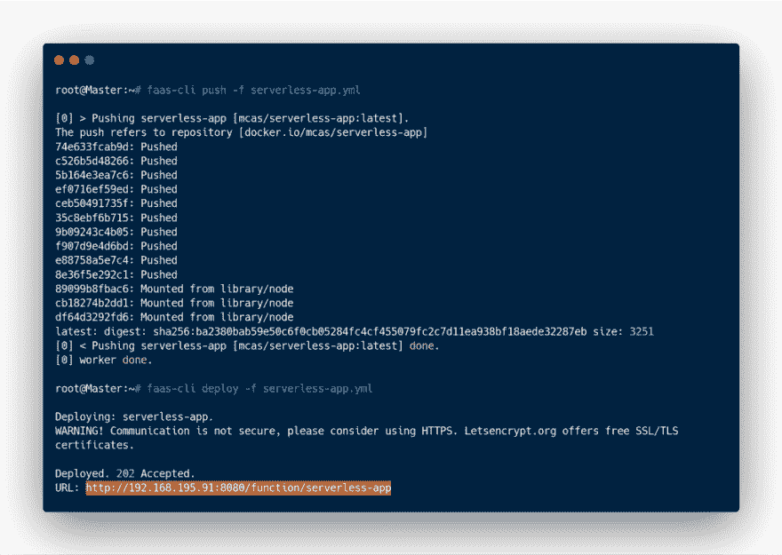](https://res.cloudinary.com/practicaldev/image/fetch/s--MSII-krN--/c_limit%2Cf_auto%2Cfl_progressive%2Cq_auto%2Cw_880/https://cdn-images-1.medium.com/max/1024/1%2AOMaSBbaCsdQfCE5MGC1EHw.png)

部署该功能:

[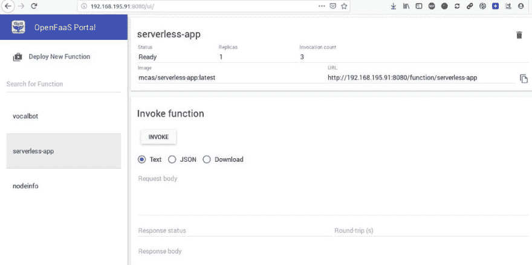](https://res.cloudinary.com/practicaldev/image/fetch/s--kzoQtnXz--/c_limit%2Cf_auto%2Cfl_progressive%2Cq_auto%2Cw_880/https://cdn-images-1.medium.com/max/1024/1%2AZwrGO1V4TkxX2jOlNo7Jzw.jpeg)

返回的地址允许我再次访问 chatbot 的静态内容:

[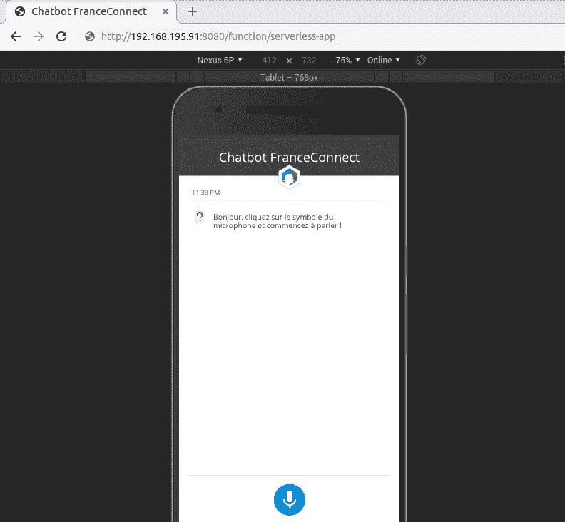](https://res.cloudinary.com/practicaldev/image/fetch/s--OiA9AxvH--/c_limit%2Cf_auto%2Cfl_progressive%2Cq_auto%2Cw_880/https://cdn-images-1.medium.com/max/792/1%2AkU9fnE3WmuFplVaRvu6AaA.jpeg)

[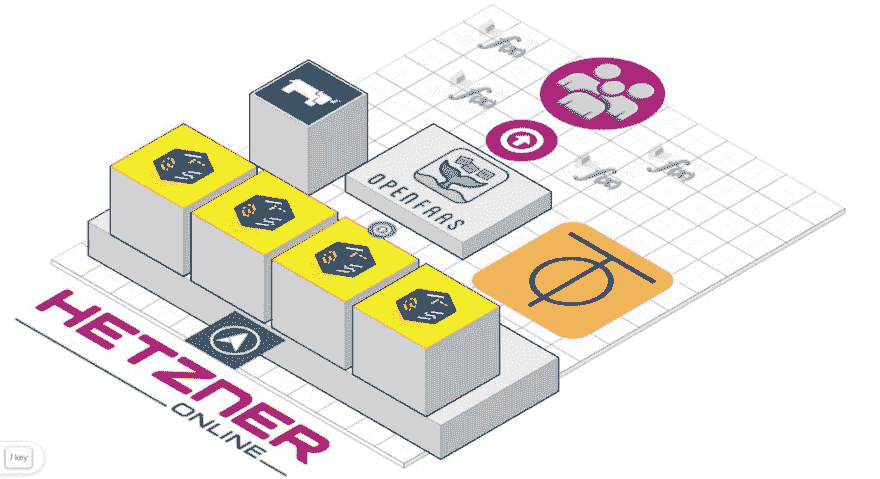](https://res.cloudinary.com/practicaldev/image/fetch/s--xXfxoWFQ--/c_limit%2Cf_auto%2Cfl_progressive%2Cq_auto%2Cw_880/https://cdn-images-1.medium.com/max/1024/1%2Aghe6pamrkAQLMinh2_x07A.jpeg)

我可以通过部署小型牧场服务器来验证所有这些都不需要大量资源:

[](https://res.cloudinary.com/practicaldev/image/fetch/s--7nIQBtZ4--/c_limit%2Cf_auto%2Cfl_progressive%2Cq_auto%2Cw_880/https://cdn-images-1.medium.com/max/1024/1%2ATUuo1gRi47MofYcVEDcpfg.jpeg)

[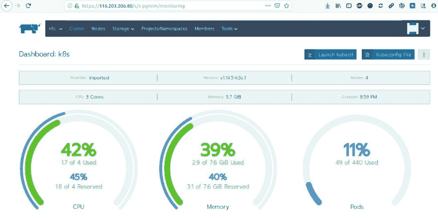](https://res.cloudinary.com/practicaldev/image/fetch/s--S-tvhhDR--/c_limit%2Cf_auto%2Cfl_progressive%2Cq_auto%2Cw_880/https://cdn-images-1.medium.com/max/1024/1%2AsleZqKRjDlJ30gspe4KXqA.jpeg)

[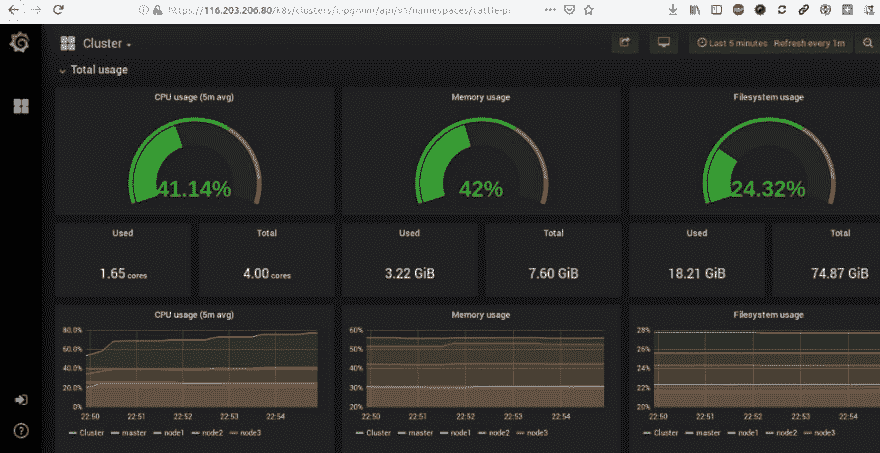](https://res.cloudinary.com/practicaldev/image/fetch/s--YXmyQMsk--/c_limit%2Cf_auto%2Cfl_progressive%2Cq_auto%2Cw_880/https://cdn-images-1.medium.com/max/1024/1%2AUpf6iKshUiZDRlzVCv3uFw.jpeg)

[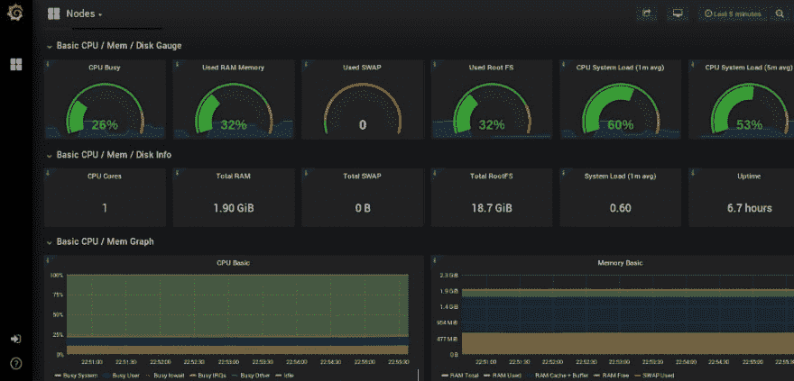](https://res.cloudinary.com/practicaldev/image/fetch/s--StMvDdMO--/c_limit%2Cf_auto%2Cfl_progressive%2Cq_auto%2Cw_880/https://cdn-images-1.medium.com/max/1024/1%2AD_IIE9Q7ybm8Xa55X0mTzw.jpeg)

Alex Ellis 建议使用一个新的 PLONK 堆栈，该堆栈显然得到了云计算基金会(CNCF)的支持:

[为云原生开发者介绍 PLONK 堆栈](https://www.openfaas.com/blog/plonk-stack/)

[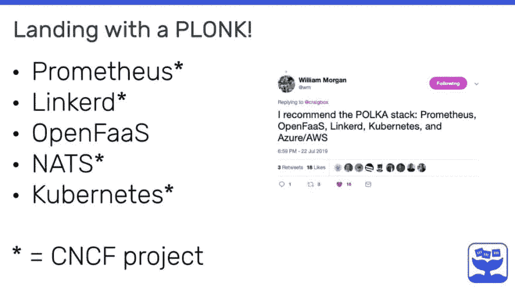](https://res.cloudinary.com/practicaldev/image/fetch/s--ApgUnt5R--/c_limit%2Cf_auto%2Cfl_progressive%2Cq_auto%2Cw_880/https://cdn-images-1.medium.com/max/1024/0%2AWQtjqYDVozm_s7_x.jpg)

这与 Serverless 公司在 Github 上提供的 fok 堆栈类似:

[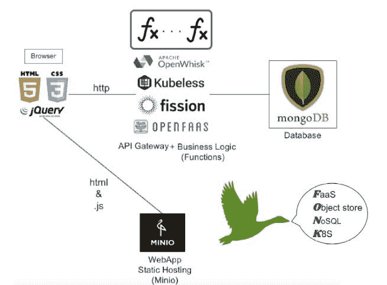](https://res.cloudinary.com/practicaldev/image/fetch/s--ZB-ww4Im--/c_limit%2Cf_auto%2Cfl_progressive%2Cq_auto%2Cw_880/https://cdn-images-1.medium.com/max/654/0%2AyG_DIpbINhQyIPTl.jpeg)

*   [FONK](http://fonk-apps.io/)
*   [fon-apps/fon-examples](https://github.com/fonk-apps/fonk-examples/blob/master/deploy.md)
*   [介绍 FONK:K8S 的无服务器灯组](https://serverless.com/blog/introducing-fonk/)

正如我以前的经历所提醒我们的:

[无服务器:通过…](https://medium.com/@abenahmed1/serverless-d%C3%A9ploiement-et-test-de-la-stack-fonk-faas-object-store-nosql-kubernetes-via-2b6ccf5ebf05) 部署和测试 fon 堆栈(FAAS—object store—nosql—ku brites)

看看新的 PLONK 堆栈是否能普及这种结合了这些技术的新一代 Web 架构*【本机云】*

[](https://res.cloudinary.com/practicaldev/image/fetch/s--dkALLFDS--/c_limit%2Cf_auto%2Cfl_progressive%2Cq_auto%2Cw_880/https://cdn-images-1.medium.com/max/604/0%2A5G8thvu0bc1ERciL.jpg)

下一个！