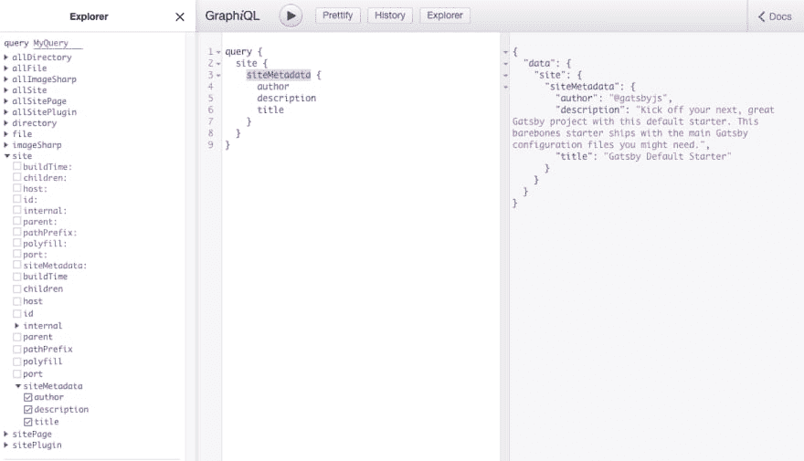
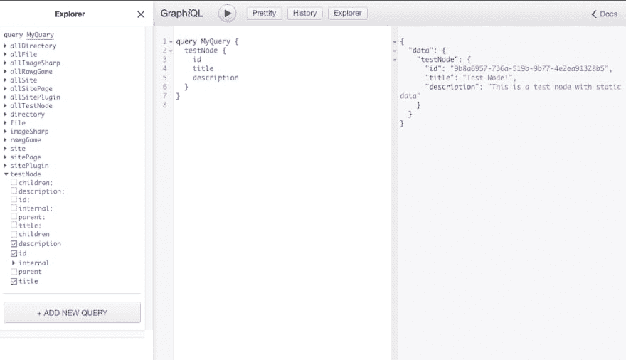
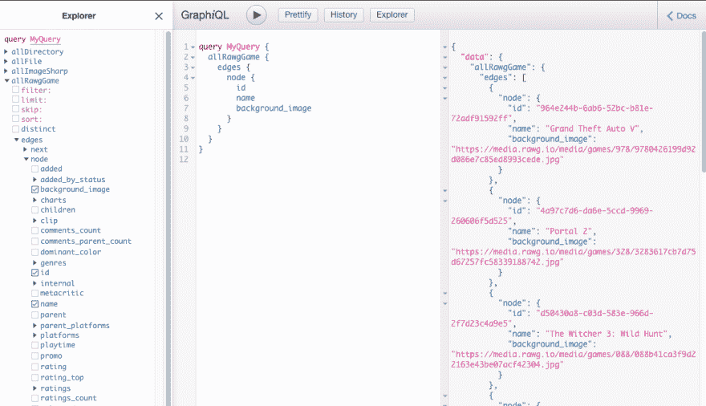

# 自定义 Gatsby.js 源代码插件

> 原文：<https://dev.to/changoman/custom-gatsby-js-source-plugin-3l90>

Gatsby.js 最大的超能力之一是它能够使用各种来源的数据和内容，比如 Wordpress、Markdown 文件或 API。在构建过程中，Gatsby 将查询数据并将其转换为静态站点的内容。有各种各样的插件，叫做[“源插件”](https://www.gatsbyjs.org/plugins/?=gatsby-source)，它们会帮助你从不同的地方拉取数据。今天我们将探讨如何制作我们自己的源码插件，以及它们是如何工作的。

#### [盖茨比自定义源码插件](https://gatsby-custom-source.surge.sh/) <small>( [查看源码](https://github.com/codebushi/gatsby-custom-source-plugin) )</small>

我们要的源码是[https://rawg.io/apidocs](https://rawg.io/apidocs)，是一个视频游戏的 API。在我们使用 API 之前，让我们看看数据和源在 Gatsby 中是如何工作的。我们将使用 Gatsby 默认启动程序来开始。

```
# Download and install the starter using the Gatsby CLI
gatsby new games-source https://github.com/gatsbyjs/gatsby-starter-default
cd games-source
gatsby develop 
```

Enter fullscreen mode Exit fullscreen mode

在 Gatsby 中，有一个 GraphQL 层可以帮助你获取数据。您可以在没有 GraphQL 层的情况下构建站点，但是 GraphQL 有助于组织数据并使其更容易使用。

在开发服务器运行的情况下，打开位于[http://localhost:8000/_ _ _ graphql](http://localhost:8000/___graphql)的 graph QL 游乐场。在左侧，您应该会看到 Explorer 侧边栏下的各种下拉框和复选框。这是您可以通过 GraphQL 数据层获得的当前数据，内置于 Gatsby 默认启动程序中。我们可以使用下面的查询来查询站点的元数据，它来自于`gatsby-config.js`文件:

```
query  {  site  {  siteMetadata  {  author  description  title  }  }  } 
```

Enter fullscreen mode Exit fullscreen mode

如果你把它粘贴到框中并点击“播放”按钮，你会看到站点元数据出现在右边的框中。

[](https://res.cloudinary.com/practicaldev/image/fetch/s--whR-5dO5--/c_limit%2Cf_auto%2Cfl_progressive%2Cq_auto%2Cw_880/https://thepracticaldev.s3.amazonaws.com/i/x8nd0busndeocon94kmu.png)

每当我们添加一个源码插件时，新的源码就会出现在浏览器的工具条中，我们可以对这些源码进行查询。为了看到这一点，我们可以在 Gatsby 中添加我们自己的定制测试源。

打开名为`gatsby-node.js`的文件。这个文件允许我们访问 Gatsby 的 API，我们今天要关注的是 [sourceNodes](https://www.gatsbyjs.org/docs/node-apis/#sourceNodes) API。我们现在可以为 GraphQL 数据层创建数据“节点”。

```
// In gatsby-node.js
exports.sourceNodes = async ({ actions, createNodeId, createContentDigest }) => {
  // We'll make the newNode object here for clarity
  const newNode = {
    title: 'Test Node!',
    description: 'This is a test node with static data',
    id: createNodeId('TestNode-testid'), // required by Gatsby
    internal: {
      type: 'TestNode', // required by Gatsby
      contentDigest: createContentDigest('testnode') // required by Gatsby, must be unique
    }
  };
  // This is where we actually create the data node, by passing in the newNode object.
  actions.createNode(newNode);
}; 
```

Enter fullscreen mode Exit fullscreen mode

我们使用`actions.createNode()`创建实际的节点，它接受一个对象。为了使节点工作，Gatsby 需要某些属性。我们使用`createNodeId`和`createContentDigest`，这是 Gatsby 提供的助手函数，来帮助使用填充那些必需的属性。

为了看到这个新节点，我们必须重启我们的开发服务器。在终端中，使用`control + c`终止服务器，并使用`gatsby develop`重启服务器。

再次打开 GraphiQL playground 并粘贴以下查询:

```
query  MyQuery  {  testNode  {  title  description  internal  {  contentDigest  type  }  }  } 
```

Enter fullscreen mode Exit fullscreen mode

正如您所看到的，我们现在已经显示了测试数据节点！

[](https://res.cloudinary.com/practicaldev/image/fetch/s--G-Dn_WjX--/c_limit%2Cf_auto%2Cfl_progressive%2Cq_auto%2Cw_880/https://thepracticaldev.s3.amazonaws.com/i/93s6gqbvrp1sbek6qtwd.png)

我们现在知道如何创建数据节点，所以下一步是使用我们的视频游戏 API 来获取真实数据并创建节点。`gatsby-node.js`中的所有功能都使用 Node.js 运行，因此我们需要安装一个额外的 npm 包，允许我们使用 Node.js 获取数据。

关闭开发服务器并安装软件包`node-fetch`

```
yarn add node-fetch 
```

Enter fullscreen mode Exit fullscreen mode

您可以使用`yarn add`或`npm install`，但是由于 Gatsby CLI 使用 yarn，它可能是目前更好的选择。

用下面的
再次打开`gatsby-node.js`

```
const fetch = require('node-fetch');

exports.sourceNodes = async ({ actions, createNodeId, createContentDigest }) => {
  try {
    // Fetch the data
    const res = await fetch(`https://api.rawg.io/api/games`);

    // Transform the data into json
    const data = await res.json();

    // Map over the results array, calling action.createNode on each item in the array
    data.results.forEach(game => {
      const node = {
        ...game, // We copy all of the properties from the game object
        id: createNodeId(`RAWG-game-${game.id}`), // Needs to be unique
        internal: {
          type: 'RAWGGame',
          contentDigest: createContentDigest(game) // We pass in the game object to make sure it's unique
        }
      };

      // Create the actual data node
      actions.createNode(node);
    });
  } catch (error) {
    console.log(error);
  }
}; 
```

Enter fullscreen mode Exit fullscreen mode

确保在文件的顶部需要`node-fetch`包。我们在端点`https://api.rawg.io/api/games`上执行一个 GET 请求。我喜欢这个例子，因为使用这个端点不需要其他参数。一旦我们得到了数据，我们就在`data.results`上循环，并使用数组中的每个游戏对象，我们制作我们的数据节点。

重启开发服务器并再次前往[http://localhost:8000/_ _ _ graph QL](http://localhost:8000/___graphql)。你现在可以像这样在游戏上运行查询:

```
query  MyQuery  {  allRawgGame  {  edges  {  node  {  id  name  background_image  }  }  }  } 
```

Enter fullscreen mode Exit fullscreen mode

[](https://res.cloudinary.com/practicaldev/image/fetch/s--6Au3d9jR--/c_limit%2Cf_auto%2Cfl_progressive%2Cq_auto%2Cw_880/https://thepracticaldev.s3.amazonaws.com/i/ojdtf70vfu9vk9id6ae7.png)

我们可以访问`allRawgGame > edges > node`下的所有数据。使用神奇的 GraphiQl explorer，我们可以轻松地切换所有可用的字段！现在我们有了这个数据，让我们在 Gatsby 站点中使用它。打开主`src/pages/index.js`页面。

```
import { graphql } from 'gatsby';
import React from 'react';
import Layout from '../components/layout';
import SEO from '../components/seo';

// The GraphQL data is passed into the component via props.data
const IndexPage = props => {
  return (
    <Layout>
      <SEO title="Home" />
      {props.data.allRawgGame.edges.map(({ node }) => {
        return (
          <div key={node.id} style={{ marginBottom: 20 }}>
            <p>{node.name}</p>
            <p>
              
            </p>
          </div>
        );
      })}
    </Layout>
  );
};

// We use the GraphiQL query here
export const query = graphql`
  query MyQuery {
    allRawgGame {
      edges {
        node {
          id
          name
          background_image
        }
      }
    }
  }
`;

export default IndexPage; 
```

Enter fullscreen mode Exit fullscreen mode

现在如果你去普通开发网站 [http://localhost:8000/](http://localhost:8000/) 你会看到我们的游戏！在`gatsby-build`过程中，这些数据将被注入我们的静态站点，我们可以以惊人的速度提供这些数据！

现在，如果你想把它变成一个独立的源代码插件，你可以在根文件夹中创建一个名为`plugins`的新目录。您将把`gatsby-node.js`文件复制到那个文件夹中，并创建一个 package.json 来描述源插件和依赖关系`node-fetch`。

要使用这个插件，你可以像其他插件一样把它添加到`gatsby-config.js`文件中。如果你的源 API 需要一个 API 键或者其他选项，你可以在把它添加到`gatsby-config.js`文件
时传递这些选项

```
plugins: [
  {
    resolve: `gatsby-source-rawg`,
    options: {
      apiKey: 'API_KEY_HERE'
    }
  }
]; 
```

Enter fullscreen mode Exit fullscreen mode

在`gatsby-node.js`文件中，你可以像这样访问`sourceNodes`中的这些新选项

```
exports.sourceNodes = async ({ actions, createNodeId, createContentDigest }, options) => {
  console.log(options); // The options are passed as another argument
  try {
    const res = await fetch(`https://api.rawg.io/api/games`);
    const data = await res.json();
    data.results.forEach(game => {
      const node = {
        ...game,
        id: createNodeId(`RAWG-game-${game.id}`),
        internal: {
          type: 'RAWGGame',
          contentDigest: createContentDigest(game)
        }
      };
      actions.createNode(node);
    });
  } catch (error) {
    console.log(error);
  }
}; 
```

Enter fullscreen mode Exit fullscreen mode

此外，值得注意的是，目前图像不是静态的，它们将从我们从端点返回的任何 url 加载。在以后的教程中，我们将使用 Gatsby Image 插件使这些静态。希望这是有帮助的！

#### [盖茨比自定义源码插件](https://gatsby-custom-source.surge.sh/) <small>( [查看源码](https://github.com/codebushi/gatsby-custom-source-plugin) )</small>