# 打破最后的垄断——微前端

> 原文：<https://dev.to/aregee/breaking-down-the-last-monolith-micro-frontends-hd4>

# 简介

[https://www.youtube.com/embed/9LsRoNV0vvg](https://www.youtube.com/embed/9LsRoNV0vvg)

## JsFoo 2019，班加罗尔

[https://www.youtube.com/embed/VMGmgwYNmQY](https://www.youtube.com/embed/VMGmgwYNmQY)

在过去的十年里，AngularJS 已经成为“街区里最酷的孩子”之一，取代了基于 jQuery 的网络工程解决方案的一些弱点。许多企业非常乐意用 AngularJS 构建他们的时尚门户网站，随着网络业务的指数级增长，AngularJS 让一些开发者的生活变得更加轻松。

在 web 开发世界里，每个人都很快乐，但是这种快乐并没有持续很久。

## JavaScript 和大泥球

> 虽然很多注意力都集中在高级软件架构模式上，但事实上，很少讨论什么是事实上的标准软件架构。本文研究了这种最常部署的软件架构:泥巴大球。一个大泥球是一个随意的，甚至是随意的，结构化的系统。它的组织，如果可以称之为组织的话，更多的是由权宜之计而非设计决定的。然而，它经久不衰的受欢迎程度并不仅仅是对建筑普遍漠视的表现。——[http://www.laputan.org/mud/](http://www.laputan.org/mud/)

我们于 2015 年 11 月开始开发 Innovaccer 的医疗保健数据平台；当时，我们的应用程序架构由一个用 Angular1.3 编写的单页应用程序组成，因为在那段时间，React 在为医疗保健构建复杂产品方面相对较新，团队中的每个人都更精通 AngularJs。此外，在那个时候，找到对这项技术有经验的开发人员也相对容易。

在创建的时候，我们的应用程序有一个定义良好的架构。任何卓越的体系所吸引的调整需求的无情冲击，都将逐步破坏其结构。随着零碎的增长逐渐允许系统的元素以不受控制的方式蔓延，曾经整洁的系统变得杂草丛生。

这一体系开始显示出不受监管的增长和反复权宜修补的明显迹象。就像我们的腐朽系统一样，一个向下的螺旋随之而来。由于系统变得越来越难理解，维护变得越来越昂贵和困难。在软件包中抑制熵的方法是重构它。持续致力于重构可以防止系统陷入混乱状态。
如果这种蔓延继续加剧，系统的结构将变得非常脆弱，因此应该放弃。

在 React 或 Vue 中重写整个前端对我们来说不是一个选项，尤其是在现代 JavaScript 生态系统中，这是一个高度不稳定且不断变化的趋势，我们希望创建一个架构，它可以不知道特定团队正在使用前端框架来构建他们的 web 界面，并提供一个脚手架来包含任何现有的前端框架或更好的东西，而不会完全粉碎现有的应用程序。

在我们努力将现有的单页架构重构为更优雅、更灵活的架构的过程中，我们最终创建了 UI Engine，它解决了设计大型 JavaScript 应用程序的复杂性。此外，它提供了对某些基本规则的灵活而严格的执行，这些规则是构建弹性 web 应用程序的先决条件，像医疗保健这样的关键业务部门可以依赖这些应用程序，并且这些应用程序更容易测试、维护、更改和保护。

> TLDR:近年来，多亏了 Node.js，JavaScript 已经成为前端和后端应用程序的“通用语言”。这催生了 Angular、React 和 Vue 等令人惊叹的项目，它们提高了开发人员的工作效率，并支持构建快速、可测试和可扩展的前端应用程序。然而，尽管存在大量优秀的 Node 库、助手和工具(以及服务器端 JavaScript ),但没有一个能有效地解决主要问题——架构。 [1](https://docs.nestjs.com/#philosophy)

引擎是控制容器的[反转，解决了大规模复杂 JavaScript 应用的架构问题。](http://martinfowler.com/articles/injection.html)

> 松散耦合允许您在不影响其他模块的情况下对一个模块进行更改。

编写 JavaScript 非常容易——几乎任何人都可以学习并开始用 JavaScript 或 jQuery、AngularJS、React、Vue 等开发用户界面。然而，困难的部分是编写可维护的 JavaScript。

我们通过将每个 AngularJS 应用程序迁移为 UI Engine 提供的应用程序外壳架构内的小型微前端来部署我们的重构前端应用程序，所有网络调用最初都是作为从浏览器到后端服务的跨源触发的，现在都通过 UI Engine 中注册的 API 网关进行代理。

需要进行更多的调整，在 Nginx 上启用 HTTP/2，并在 node.js 层使用压缩中间件来压缩所有的 JSON 和静态资源；下面是我们在 2018 年 4 月在 staging.innovaccer.com 进行的首次部署的一些截图，与我们在 qa.innovaccer.com 的传统单页 AngularJS 应用程序进行了比较。

[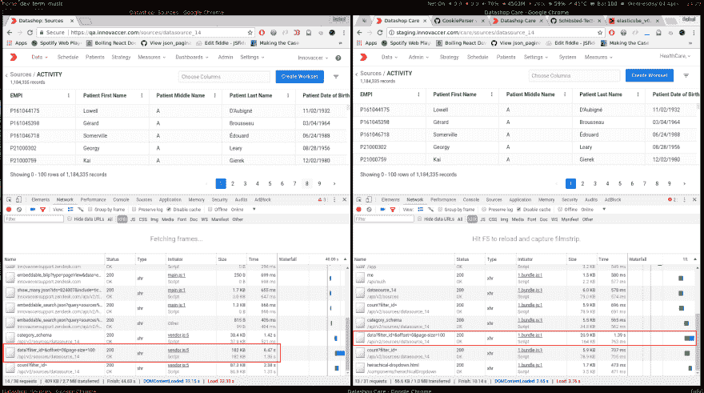](https://res.cloudinary.com/practicaldev/image/fetch/s--6-rRdjes--/c_limit%2Cf_auto%2Cfl_progressive%2Cq_auto%2Cw_880/https://thepracticaldev.s3.amazonaws.com/i/25eh5pkazdtnkortmsn1.png)

## 微前端

> 软件架构不应该是最终目标，而是达到目的的手段

当今的经济是由字节驱动的，在字节经济中，重点是快速将产品推向市场。

在这个充满竞争和混乱的创业十年里，我们看到软件公司成为世界上最有价值的公司，创业公司每天都在诞生和消亡。为了生存，我们必须保持并获得大量的市场份额，我们希望工厂以最高速度生产软件。这些工厂由有感知能力的人类编码员组成，他们不懈地工作，生产出一个又一个特性来交付用户故事，这是软件产品总体结构的一个复合部分。

起初...

[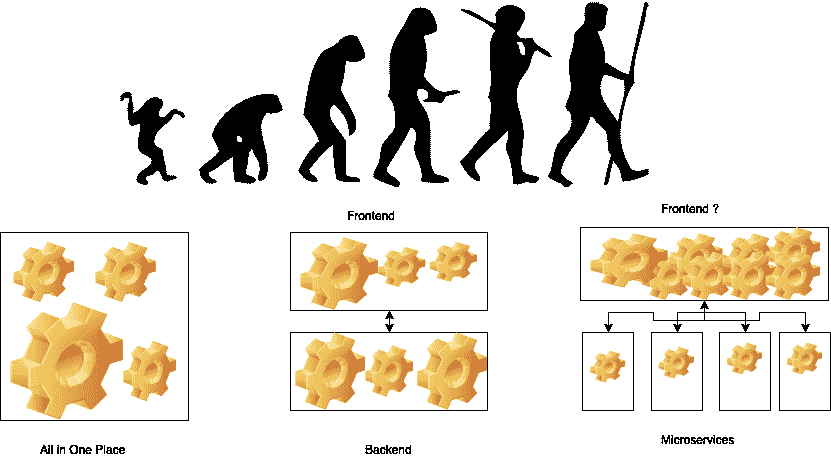](https://res.cloudinary.com/practicaldev/image/fetch/s---LROchVw--/c_limit%2Cf_auto%2Cfl_progressive%2Cq_auto%2Cw_880/https://thepracticaldev.s3.amazonaws.com/i/9a96s3q9alx1hranvmt4.png)

我们有古老的整体系统，所有的东西都被捆绑在一个可部署的单元中。这很可能是大部分交易的所在地。然而，需要注意的是，单体可以快速设计，区域单位可以简单部署，但它们提供的灵活性有限，因为即使是微小的变化也需要完全重新部署。此外，我们知道，随着软件系统的不断发展，monoliths 通常会发现自己在尝试各种各样的大杂烩。例如，几个单体系统采用分层设计，分层体系结构很容易被滥用(例如，跳过服务直接访问存储库/数据访问层)。

我们正在开发的应用程序是一个面向公众的大型 web 应用程序。从产品的最初概念开始，我们已经确定了几个独立的功能，并创建了微服务来提供每个功能。我们已经开发出了提供用户界面的基本要素，这是我们面向公众的 web 前端。这个微服务只有一个功能，就是提供用户界面。它可以扩展和部署，变得独立于复合后端服务。

> 如果你不能建立一个整体，是什么让你认为微服务是答案？

如果从技术意义上讲微服务，今天计算、存储、网络已经变得非常便宜，而且成本在快速下降。这一趋势导致了微小的、独立的全栈软件的开发，如果做得好，这只是轻量级面向服务架构的演变。

微服务使构建一个更小的、松散耦合的、可重用的、做好一件事和一件事的软件的古老思想焕发了青春，强调最短的上市时间和最低的成本。同样，需要注意的是，如果做得好，基于服务的架构可以为您带来很多灵活性和敏捷性，因为每项服务都可以单独开发、测试、部署、扩展、升级和重写，特别是在服务区域单元通过异步电子消息传递分离的情况下。缺点是增加了复杂性，因为你的软件有比滚石更多的移动元素。

> 复杂性还在，你只是把它移到了别的地方。

因此，同样的旧概念只是用远程网络调用替换了所有内存中的函数调用或共享库调用；现在，我们可以与独立团队一起独立地构建、更改、部署和扩展它们，而不必强迫他们理解不同团队的存在。

当你有一个巨大的单片前端，不能简单地分割，你必须考虑让它更小。您可以将前端分解成由完全不同的团队单独开发的独立部分。

> 当您实施微服务架构时，您希望保持服务规模较小。这也应该适用于前端。如果你不这样做，你只会收获后端服务的微服务的好处。一个简单的解决方案是将您的应用程序分成独立的前端。

我们有多个团队从事不同的应用。然而，你还没有完全到达那里；前端仍然是一个横跨不同后端的整体。这意味着在前端，您仍然会遇到一些在转向微服务之前遇到的问题。下图显示了当前架构的简化。

[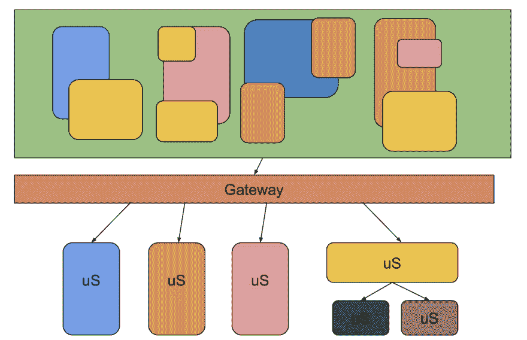](https://res.cloudinary.com/practicaldev/image/fetch/s--YQzsk7ne--/c_limit%2Cf_auto%2Cfl_progressive%2Cq_auto%2Cw_880/https://thepracticaldev.s3.amazonaws.com/i/s156vl6s5luo7648u5fl.png)

如果前端没有更新，后端团队就不能交付商业价值，因为没有用户界面的 API 做不了多少事情。越来越多的后端团队表示，为了集成新功能，前端团队面临着很多新的选择，因此也面临着更大的压力。

为了弥补这一点，可以扩大前端团队，或者让多个团队在同一个项目上工作。因为前端仍然必须一次性部署，所以团队不能独立工作。变更必须被集成到同一个项目中，并且整个项目需要被测试，因为一个变更会破坏其他特性。这基本上意味着团队不是独立工作的。

[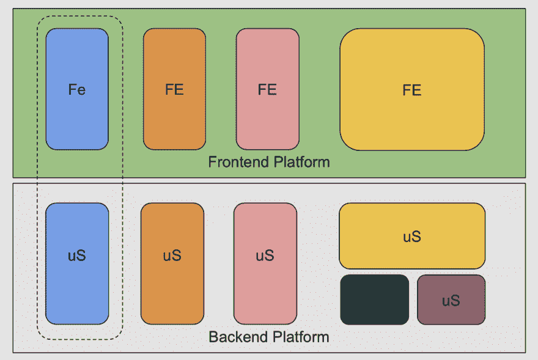](https://res.cloudinary.com/practicaldev/image/fetch/s--3Bq0kMq8--/c_limit%2Cf_auto%2Cfl_progressive%2Cq_auto%2Cw_880/https://thepracticaldev.s3.amazonaws.com/i/d1u8xqa4q0ymt73zzn63.png)

使用单片前端，您永远无法获得微服务所保证的跨组扩展的灵活性。除了无法扩展之外，还存在独立后端和前端团队的传统开销。每次某个服务的 API 发生重大变化时，前端都必须更新，特别是当一个功能添加到服务中时，前端必须更新，以确保您的客户可以使用该功能。

如果你有一个足够小的前端，可以由一个团队来维护，这个团队还负责一个或多个耦合到前端的服务，那么跨团队的通信就没有开销。但是，因为前端和后端不能独立工作，所以你并不是真正在做微服务。

[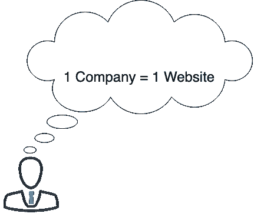](https://res.cloudinary.com/practicaldev/image/fetch/s--Q1Vcq7O9--/c_limit%2Cf_auto%2Cfl_progressive%2Cq_auto%2Cw_880/https://thepracticaldev.s3.amazonaws.com/i/il5y18joujt92khe8wup.png)

如果您有多个团队在您的平台上工作，但是也有多个更小的前端应用程序，就不会有问题。每个前端将充当一个或多个服务的接口。每个服务都有自己的持久层。这就是所谓的垂直分解。现在，用前端实现这种架构的主要问题是用户体验。
如今，现代应用产品的最终用户认为一家公司就意味着一个网站。
然而，正如我们上面讨论的，这种方法成为了一个开发瓶颈，并且不能有效地扩展。

我们将讨论一些最流行的方法来进行前端的垂直分解，以实现以下目标:

*   团队所有权
*   独立发展
*   独立运行
*   技术不可知
*   快速装载
*   本机支持
*   共享基础知识
*   模块化的
*   企业形象
*   流畅的用户交互

### 基于 Nginx 的硬核路由

如果我们想开始将我们的单片前端单页面应用程序分割成多个独立的单页面应用程序，这些应用程序在 Nginx 后面独立运行，我们该怎么做呢？

[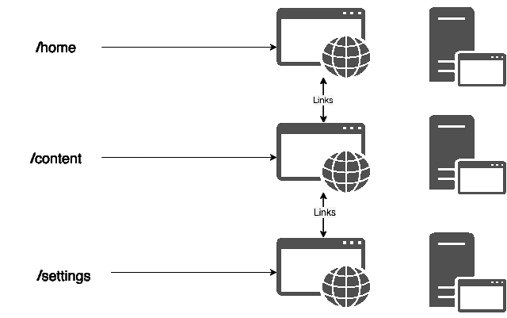](https://res.cloudinary.com/practicaldev/image/fetch/s--SzBPc6e4--/c_limit%2Cf_auto%2Cfl_progressive%2Cq_auto%2Cw_880/https://thepracticaldev.s3.amazonaws.com/i/tadi7g7h0742d2icvowk.png)

我们可以超链接不同的应用程序，但是，每个应用程序都需要在其代码中维护类似的基本应用程序模板，以实现品牌识别。

如您所见，这种方法很好，但是，首先，这里有四个非常关键的案例失败了。

| 通过 | 不成功的 |
| --- | --- |
| 团队所有权 | 共享基础知识 |
| 独立发展 | 模块化的 |
| 独立运行 | 企业形象 |
| 技术不可知 | 流畅的用户界面 |
| 快速装载 |  |
| 本机支持 |  |

那么，我们还有其他选择吗？

### 服务器端包括

我们可以使用另一种有趣的方法来实现这一点，最常见的方法是 Edge Side Includes [ESI](https://en.wikipedia.org/wiki/Edge_Side_Includes) 。

> Edge Side Includes 或 ESI 是一种用于边缘级动态 web 内容组装的小型标记语言。

[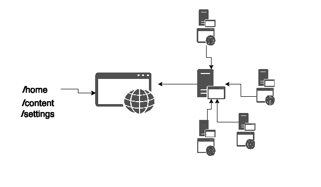](https://res.cloudinary.com/practicaldev/image/fetch/s--F_WFaxUX--/c_limit%2Cf_auto%2Cfl_progressive%2Cq_auto%2Cw_880/https://thepracticaldev.s3.amazonaws.com/i/zmiih89as9tqbis5gui9.png)

| 及格 | 不成功的 |
| --- | --- |
| 团队所有权 | 快速装载 |
| 独立发展 | 本机支持 |
| 独立运行 | 流畅的用户界面 |
| 技术不可知 |  |
| 共享基础知识 |  |
| 模块化的 |  |
| 企业形象 |  |

### 代码级集成

这就是我们现有的前端模块的工作方式，我们在代码级别将多个角度模块集成到最终的 SPA 构建中。

[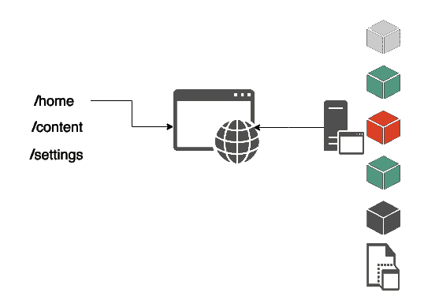](https://res.cloudinary.com/practicaldev/image/fetch/s--JlvD7pZE--/c_limit%2Cf_auto%2Cfl_progressive%2Cq_auto%2Cw_880/https://thepracticaldev.s3.amazonaws.com/i/p114rzleah5ht6p2x8ok.png)

| 及格 | 不成功的 |
| --- | --- |
| 团队所有权 | 快速装载 |
| 独立发展 | 技术不可知 |
| 本机支持 | 独立运行 |
| 流畅的用户界面 |  |
| 共享基础知识 |  |
| 模块化的 |  |
| 企业形象 |  |

显然，我们有一些变通办法可以有所帮助，但这种方法从长远来看也是不可持续的。

### App 外壳

> 让我们稍微改变一下视角，跳出框框思考

这里有一个关于这种方法的很好的介绍，它应该设置这个概念的背景。

[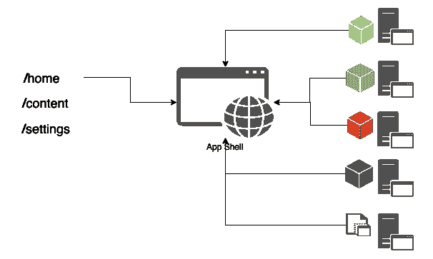](https://res.cloudinary.com/practicaldev/image/fetch/s--z1WAClhd--/c_limit%2Cf_auto%2Cfl_progressive%2Cq_auto%2Cw_880/https://thepracticaldev.s3.amazonaws.com/i/zisxi10x6d5j8rcyg952.png)

> 应用程序“外壳”是支持用户界面所需的最少 HTML、CSS 和 JavaScript，当离线缓存时，可以确保用户在重复访问时获得即时、可靠的良好性能。这意味着应用程序外壳不是每次用户访问时都从网络加载的；仅需要来自网络的必要内容。

这种方法提供了在第一次访问时立即加载我们的应用程序外壳的能力，并且所需的最少量的静态资源被缓存在浏览器上。

现在，我们可以根据用户需求或意图将称为微前端的独立单页面应用程序延迟加载到我们的 shell 中。

[](https://res.cloudinary.com/practicaldev/image/fetch/s--jdH-KW7h--/c_limit%2Cf_auto%2Cfl_progressive%2Cq_auto%2Cw_880/https://thepracticaldev.s3.amazonaws.com/i/jacxwd3k6ibpnjrxaknf.png)

我们可以通过为每个微前端提供路由信息来做到这一点。

[](https://res.cloudinary.com/practicaldev/image/fetch/s--KmgO0Dkb--/c_limit%2Cf_auto%2Cfl_progressive%2Cq_auto%2Cw_880/https://thepracticaldev.s3.amazonaws.com/i/1vfwp1vox0bwdug1n60s.png)

然后为每个微前端提供清单 JSON。

[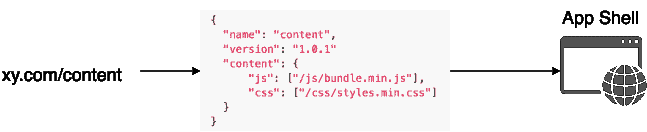](https://res.cloudinary.com/practicaldev/image/fetch/s--PiDYb5pI--/c_limit%2Cf_auto%2Cfl_progressive%2Cq_auto%2Cw_880/https://thepracticaldev.s3.amazonaws.com/i/lffupvb6ayihdn124ojn.png)

一旦我们加载了应用程序所需的所有资源，我们就可以通过以下方式初始化微前端应用程序:

[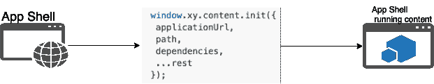](https://res.cloudinary.com/practicaldev/image/fetch/s--2irpFTne--/c_limit%2Cf_auto%2Cfl_progressive%2Cq_auto%2Cw_880/https://thepracticaldev.s3.amazonaws.com/i/w8kals9yhbbmsdbe1tc8.png)

如果我们在测试用例中评估这种方法:

| 及格 | 挑战 |
| --- | --- |
| 团队所有权 | 模块化的 |
| 独立发展 | 技术不可知 |
| 本机支持 | 共享基础知识 |
| 流畅的用户界面 | 独立运行 |
| 超快速装载 |  |
| 企业形象 |  |

有了这个，App Shell 感觉是解决我们前端问题的最合适的方法。

该引擎是为利用应用程序外壳架构而全新设计的。我们通过在浏览器和 Nodejs 层引入称为控制反转(Inversion of Control，简称 IOC)容器的设计模式来实现这一点，这有助于我们的应用程序进行依赖注入，而不是直接导入源代码；这种模式帮助我们构建提供低耦合和高内聚的应用程序。

因此，使用 UI Engine，开发人员可以构建他们的微前端，每个应用程序都可以与一个服务器部件耦合，该服务器部件提供视图级 RESTful APIs 或通过 API 网关公开某些下游服务，这些 API 网关支持在应用程序外壳中注册的应用程序。

## UI 引擎

> 松散耦合允许您在不影响其他模块的情况下对一个模块进行更改。

Engine 是一个可插拔的基于组件的应用组合层；它提供了一个定义明确的地方，用于创建、配置和*非侵入性地*将应用程序的组件或应用程序的部分连接在一起。

> **Web 应用模块** -一个独立的功能单元，是 Web 应用总体结构的一部分。

使用 Engine，您可以专注于编写组件的应用程序逻辑，并让 Engine 处理引导和将它们连接在一起的粘合剂。您编写简单的、声明性的 JavaScript 模块，描述组件应该如何组合在一起，wire 将加载、配置和连接这些组件以创建应用程序，并在以后清理它们。

Engine 旨在处理现有流行框架之间的连接点，并解决工程大规模复杂 JavaScript web 应用程序中出现的常见集成问题，从而将整个应用程序与每个垂直应用程序的实现细节分离，允许从 Angular、React、Vue、Mithril 等中自由选择 UI 堆栈。

### 特性

发动机提供:

*   简单的声明性依赖注入
*   灵活的非侵入式连接基础设施
*   应用生命周期管理
*   强大的核心工具和插件架构，用于集成流行的框架和现有代码
*   应用外壳架构和可插拔微前端
*   支持浏览器和服务器环境

使用引擎构建的应用程序:

*   具有高度的模块化
*   可以很容易地进行单元测试，因为它们本质上将应用程序逻辑从应用程序组合中分离出来
*   允许独立于应用程序逻辑重构应用程序结构
*   不依赖于 DOM Ready、DOM 查询引擎或 DOM 事件库
*   旨在为您提供一种快速而有条理的方式，开始在 PWA shell 中开发微前端
*   鼓励构建一个更小的、松散耦合的、可重用的软件的古老想法，它做一件事情，并且做好一件事情，以更快的上市时间和更低的变更成本
*   引擎包系统允许开发人员创建模块化代码，提供其他引擎开发人员可以使用的有用工具。这些包在发布时是即插即用的，使用方式非常类似于传统的 npm 包
*   引擎包系统将所有包集成到引擎项目中，就好像代码是引擎本身的一部分一样，并向开发者提供将他们的包集成到宿主项目中所需的所有必要工具
*   设置可以分散运行，作为**分布式前端**架构。

> Engine 提供了一个开箱即用的应用程序架构，允许轻松创建高度可测试、可伸缩、松散耦合且易于维护的大规模前端 web 应用程序，作为一组独立的微前端。

Engine 被开发成一个非常轻量级和优雅的层，它允许我们将现有的前端模块(Angular1.x)移植到可单独安装的包中。每个包现在可以单独安装到引擎中；每个包都可以提供一个完整的前端和 Rest-API，将引擎应用程序集成到一个即插即用的应用程序框架中。

如果引擎中的任何模块依赖于引擎中的任何其他功能模块，那么将没有显式的源代码级依赖，但是我们利用依赖注入来使用由特定模块公开的功能。

下面附加的代码片段描述了如何在引擎中定义一个包。

**浏览器**

```
import { skeletonEngine } from 'skeletonpwa';
const mdrun = function(dashboard, router) {
  router.addRoute({
    action: () => dashboard('dashboardspage', 'dashboards', app),
    path: '/dashboards',
    name: 'ingraph'
  });
};
skeletonEngine.shell('datashop').defineConfig(mdrun,['dashboard', 'router']); 
```

**node . js**T2】

```
const engine = require('engine-core');
const Module = engine.Module;
const Dashboards = new Module('ingraph');//  Defining the Package
const ESI = require('nodesi').middleware;
/*
 * All engine packages require registration
 * Dependency injection is used to define required modules
 */
Dashboards.register((app, datastore, database, gateway, admin, sources, worksets) => {
  app.use(ESI(config.esiSettings));
  Dashboards.menus.add({
    title: 'Dashboards',
    link: '/app/dashboards/main#/home',
    weight: 19,
    name: 'dashboards',
    menu: 'care'
  });
  Dasboards.routes(app, datastore, database, admin);
  return Dashboards;
}); 
```

Engine 为我们提供了在不完全放弃现有系统的情况下进行某种垂直分解的能力，而不是提高现有 angular 应用程序的性能，以及开发新功能和将现有功能重写为更现代和面向性能的引擎库的能力，如 React、Preact、Vue、Svelte 等。

### 发动机测试案例

| 通过 | 不成功的 |
| --- | --- |
| 团队所有权 | 独立运行 |
| 独立发展 |  |
| 本机支持 |  |
| 流畅的用户界面 |  |
| 超快速装载 |  |
| 企业形象 |  |
| 共享基础知识 |  |
| 模块化的 |  |
| 共享基础知识 |  |
| 技术不可知 |  |

Engine 为每一位 JavaScript 开发人员提供了一个漂亮而熟悉的生态系统，使用本机提供的 NPM cli 工具以真正的即插即用格式构建、发布和安装他们的微前端到任何基于 engine 的项目中。

[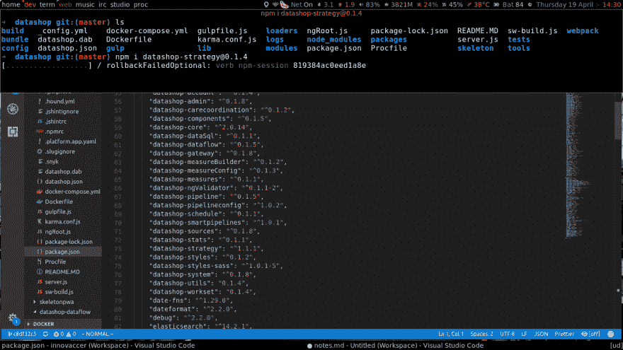](https://res.cloudinary.com/practicaldev/image/fetch/s--IhukqR0f--/c_limit%2Cf_auto%2Cfl_progressive%2Cq_auto%2Cw_880/https://thepracticaldev.s3.amazonaws.com/i/tukj6z1bmzozbnnz9wb7.png)

为 Engine 创建的所有应用程序以及任何需要重用或即插即用的 JavaScript 模块都发布到托管在我们网络内部的私有 NPM 注册中心。

### 灵活、强大而又简单的架构

[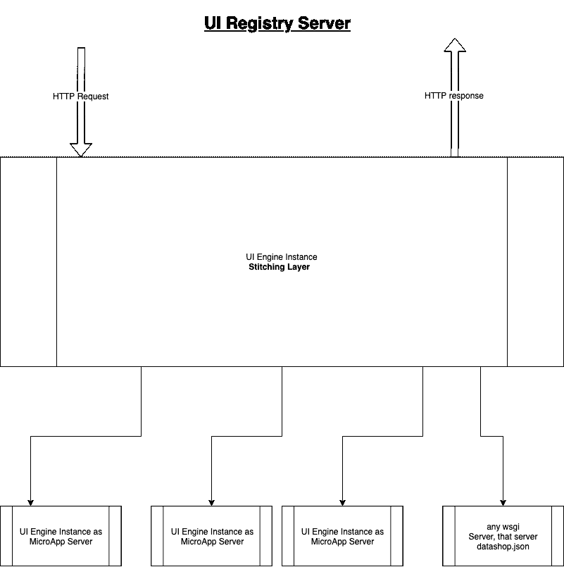](https://res.cloudinary.com/practicaldev/image/fetch/s--WNN8Xe8w--/c_limit%2Cf_auto%2Cfl_progressive%2Cq_auto%2Cw_880/https://thepracticaldev.s3.amazonaws.com/i/k7ha11kwg0qqe2ztbdx5.png)

到目前为止，我们已经能够将我们的大型遗留 UI monolith 分解为独立的微应用程序，这些应用程序可以像传统的 npm 包一样使用，因为每个引擎包都是一个 web 应用程序中间件。UI Engine 提供的应用程序外壳作为缝合层工作，因为它由各个包组成无缝的 UI，并为 UI 发布一个 dockerized 图像。

为了将每个引擎包作为独立的微应用程序运行，从而以分布式方式散开，我们需要了解满足下面陈述的微前端架构的基本要求的主要组件。

### 客户端

*   管弦乐编曲
*   按指定路线发送
*   微应用的隔离
*   应用程序对应用程序通信
*   微应用程序用户界面之间的一致性

### 服务器端

*   服务器端渲染
*   按指定路线发送
*   依赖性管理

为了解决客户端的需求，UI 引擎提供了四个基本结构:PWAManager、Loader、Router 和 UI 引擎存储。

[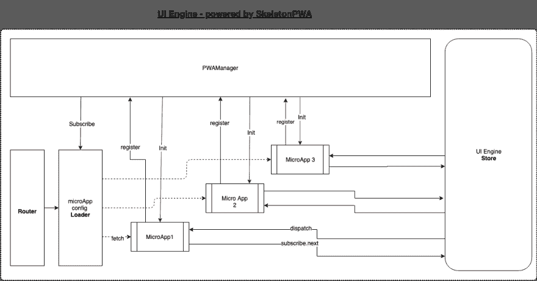](https://res.cloudinary.com/practicaldev/image/fetch/s--XEYMTzNg--/c_limit%2Cf_auto%2Cfl_progressive%2Cq_auto%2Cw_880/https://thepracticaldev.s3.amazonaws.com/i/40un5whwwwd6xi437ut6.png)

### PwaManager

PwaManager 是客户端微应用编排的核心。PwaManager 的主要功能是创建一个依赖树。一旦解决了微应用的所有依赖性，PwaManager 就启动微应用。

### 装载机

Loader 是 UI Engine 提供的客户端解决方案中最重要的部分之一。从服务器获取未解析的微应用程序是加载程序的责任。

### 路由器

为了解决客户端路由问题，UI 引擎提供了路由器；路由器主要用于通过处理每个应用的顶级路由并将进一步的处理委托给相应的微应用来解析微应用。假设我们有一个 URL 类似于`/sources/view/123`的应用程序和一个名为 SourcesApp 的应用程序。在这个场景中，UI 引擎路由器将解析到`/sources/*`的 URL，并用`/view/123`部分调用 SourcesApp。

### 商店

store 用于解决客户端多个应用之间的通信问题；这家商店是按照 Redux 的模式建造的。

### 微应用服务器

[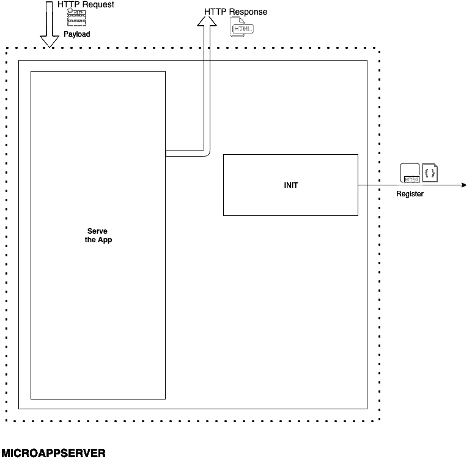](https://res.cloudinary.com/practicaldev/image/fetch/s--D6o5_nxn--/c_limit%2Cf_auto%2Cfl_progressive%2Cq_auto%2Cw_880/https://thepracticaldev.s3.amazonaws.com/i/nam1xfsk94799vof057d.png)

微应用服务器负责初始化和服务微应用。每当产生一个微应用服务器时，它做的第一件事就是用应用清单调用 StitchingServer 提供的注册端点，应用清单定义了依赖关系、类型和 URL 模式。

### 拼接服务器

StitchingServer 为微应用服务器提供了一个注册挂钩。一旦微应用服务器向 StitchingServer 注册了自己，stitching server 就会记录微应用服务器的清单。

稍后，StitchingServer 使用清单声明从所请求的统一资源定位符解析微应用服务器。

解析后，MicroAppServer 及其每一个依赖项，CSS、JS、超文本标记语言中的所有相关方法都以 MicroAppServer 公共统一资源定位符为前缀并与之连接。下一步是在 CSS 选择器前面加上一个单数符号 MicroAppServer，以防止客户端的微应用程序之间发生冲突。

然后 StitchingServer 的最大职责就出现了——从所有收集到的组件组合并返回一个无缝的超文本标记语言页面。

[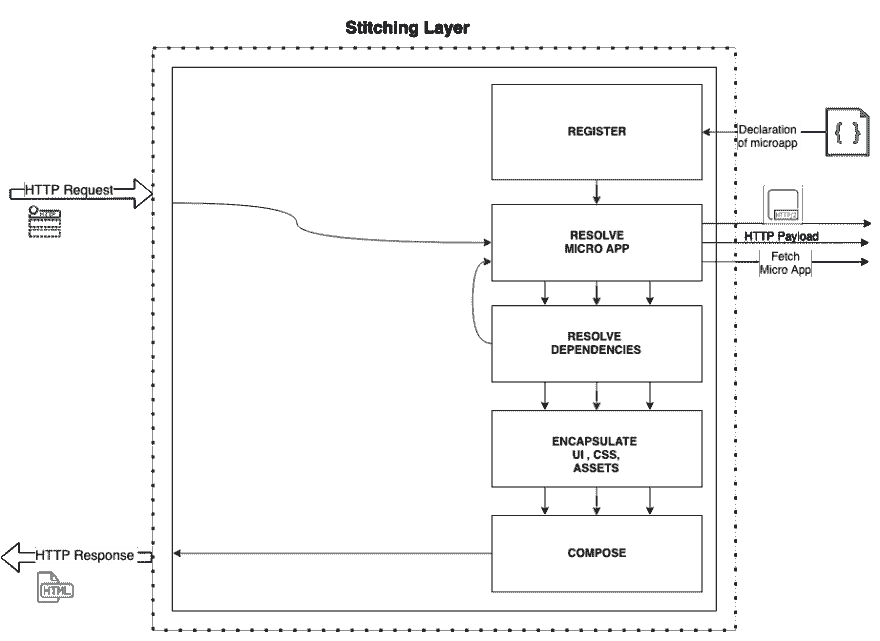](https://res.cloudinary.com/practicaldev/image/fetch/s--6NkFPi87--/c_limit%2Cf_auto%2Cfl_progressive%2Cq_auto%2Cw_880/https://thepracticaldev.s3.amazonaws.com/i/l3i84ex2etk7dbp01jkn.png)

## 结论

微前端是相对较新的术语，最近在 2016 年创造；然而，已经有很多大公司试图解决类似的问题，比如脸书的大管道公司。

Zalando 将其解决方案开源，称为 [Project Mosaic](https://mosaic9.org) 。

已经有一个框架叫做[单 spa](https://single-spa.js.org) 。

微前端的话题被讨论了很多；基于 web 组件的开发策略已经获得了很大的发展势头，我相信这个话题将会被更频繁地讨论。

在接下来的几年里，我希望这将成为大型团队事实上的发展方式。

## 资源

读者应该浏览一下 Nicholas Zakas 的这个[演示](https://www.slideshare.net/nzakas/scalable-javascript-application-architecture)，他一直是 Engine 背后的灵感和动力。

[在通往持久耐用、面向未来的新型前端架构的道路上蓄势待发！](https://micro-frontends.zeef.com/elisabeth.engel?ref=elisabeth.engel&share=ee53d51a914b4951ae5c94ece97642fc)

[微前端上的 Youtube 播放列表](https://www.youtube.com/playlist?list=PLI1AtZo9B3YL_xpi19IuxFcTuCi2_thQT)

[清理代码](https://www.amazon.com/Clean-Coder-Conduct-Professional-Programmers-ebook/dp/B0050JLC9Y?tag=googinhydr18418-21&tag=googinkenshoo-21&ascsubtag=_k_EAIaIQobChMI4ICrysKc5AIVjYRwCh2_yQJ-EAYYBCABEgLYFvD_BwE_k_&gclid=EAIaIQobChMI4ICrysKc5AIVjYRwCh2_yQJ-EAYYBCABEgLYFvD_BwE)

[领域驱动设计](https://www.amazon.com/Domain-Driven-Design-Tackling-Complexity-Software-ebook/dp/B00794TAUG?tag=googinhydr18418-21&tag=googinkenshoo-21&ascsubtag=_k_EAIaIQobChMIwPPhx8Kc5AIVECUrCh2rUgEPEAQYAiABEgLbD_D_BwE_k_&gclid=EAIaIQobChMIwPPhx8Kc5AIVECUrCh2rUgEPEAQYAiABEgLbD_D_BwE)

[独立系统](https://scs-architecture.org/)

[简单易行](https://www.infoq.com/presentations/Simple-Made-Easy/)