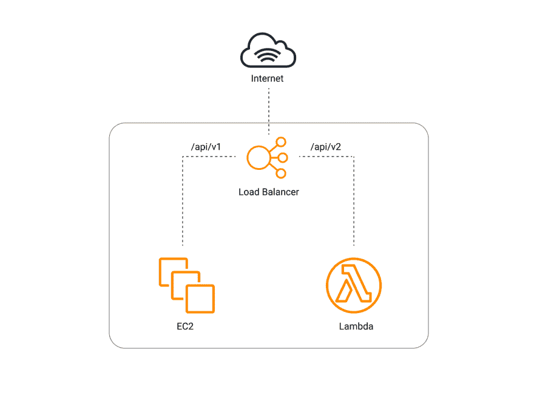
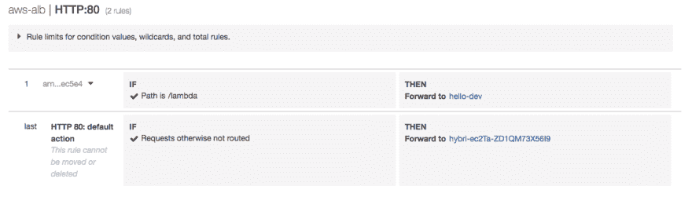

# EC2 和 Lambda 函数之间的混合负载平衡流量——有用的 API 迁移模式

> 原文：<https://dev.to/rafalwilinski/hybrid-load-balancing-traffic-between-ec2-and-lambda-functions-useful-api-migration-pattern-3bam>

随着版本`1.45`中包含了[这个](https://github.com/serverless/serverless/pull/6073)特定的 PR，无服务器框架团队最终实现了使用应用负载平衡器作为事件源而不是使用 API 网关的可能性。

我们很少听说过用 ALB 替换昂贵的 API Gateway 节省了数千美元的故事，这真的很棒，但在这里我想谈谈可能对迁移真正有帮助的另一个方面:

# 混合负载均衡

想象一下下面的场景:你的公司想通过一条一条地剥离 monolith web 服务器，从 ECS/EC2 迁移到 Lambda。这似乎可以通过与负载平衡器相关联的多个目标组轻松实现。不仅仅是一个，您可以指定许多，并基于请求路径(或您喜欢的任何路径)将请求路由到 EC2/ECS 或 Lambda。

[](https://res.cloudinary.com/practicaldev/image/fetch/s--g5HTgyrk--/c_limit%2Cf_auto%2Cfl_progressive%2Cq_auto%2Cw_880/https://thepracticaldev.s3.amazonaws.com/i/sx6aanbuysdwuyip73vg.png)

# 怎么做到的？

1.  如果您没有现有的 infra，最好在单独的文件中提供 [VPC](https://github.com/RafalWilinski/hybrid-load-balancing/blob/master/infra/vpc.yml) 、 [EC2](https://github.com/RafalWilinski/hybrid-load-balancing/blob/master/infra/ec2.yml) 和 [ALB](https://github.com/RafalWilinski/hybrid-load-balancing/blob/master/infra/alb.yml) ，以保持简洁明了。否则，使用现有的 ALB ARN。

2.  参考主`serverless.yml`文件中的补充云信息文件:

```
resources:
  - ${file(./infra/alb.yml)}
  - ${file(./infra/ec2.yml)}
  - ${file(./infra/vpc.yml)} 
```

<svg width="20px" height="20px" viewBox="0 0 24 24" class="highlight-action crayons-icon highlight-action--fullscreen-on"><title>Enter fullscreen mode</title></svg> <svg width="20px" height="20px" viewBox="0 0 24 24" class="highlight-action crayons-icon highlight-action--fullscreen-off"><title>Exit fullscreen mode</title></svg>

1.  用`alb`代替传统的`http`事件，在这里您可以指定负载平衡器、条件和优先级。在这种情况下，所有到路径`/lambda`的请求将被路由到无服务器解决方案。其余的将根据此处指定的[规则路由至 EC2](https://github.com/RafalWilinski/hybrid-load-balancing/blob/master/infra/alb.yml#L23-L34)

```
functions:
  hello:
    handler: handler.handle
    events:
      - alb:
          listenerArn:
            Ref: albListener
          priority: 1
          conditions:
            path: /lambda 
```

<svg width="20px" height="20px" viewBox="0 0 24 24" class="highlight-action crayons-icon highlight-action--fullscreen-on"><title>Enter fullscreen mode</title></svg> <svg width="20px" height="20px" viewBox="0 0 24 24" class="highlight-action crayons-icon highlight-action--fullscreen-off"><title>Exit fullscreen mode</title></svg>

这里值得注意的一点是，Lambda 的优先级应该大于 server 的优先级，所以应该是这样的:

[](https://res.cloudinary.com/practicaldev/image/fetch/s--Pk9DTjL4--/c_limit%2Cf_auto%2Cfl_progressive%2Cq_auto%2Cw_880/https://thepracticaldev.s3.amazonaws.com/i/ziejuyps1ta12f84at5o.png)

如果你想检查完全工作的例子，源代码可以在[这里找到](https://github.com/RafalWilinski/hybrid-load-balancing)

只需运行它:

```
serverless deploy 
```

<svg width="20px" height="20px" viewBox="0 0 24 24" class="highlight-action crayons-icon highlight-action--fullscreen-on"><title>Enter fullscreen mode</title></svg> <svg width="20px" height="20px" viewBox="0 0 24 24" class="highlight-action crayons-icon highlight-action--fullscreen-off"><title>Exit fullscreen mode</title></svg>

本文原载于 [servicefull.cloud](https://servicefull.cloud/blog/hybrid-elb/)