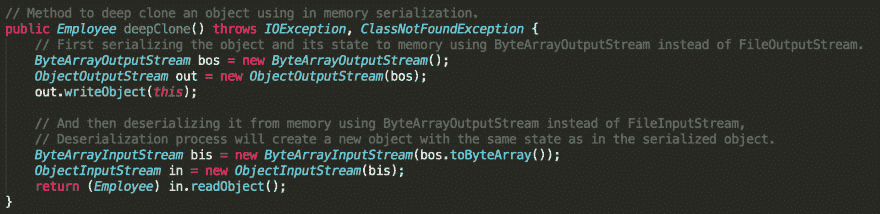

# 如何在内存序列化中使用 Java 深度克隆对象

> 原文：<https://dev.to/njnareshjoshi/how-to-deep-clone-an-object-using-java-in-memory-serialization-43a2>

在我以前的文章中，我已经解释了深度克隆和浅层克隆的区别以及复制构造器和防御性复制方法优于默认 java 克隆的原因。

使用[复制构造函数](https://www.programmingmitra.com/2017/01/Java-cloning-copy-constructor-versus-Object-clone-or-cloning.html)和[防御性复制方法](https://www.programmingmitra.com/2017/01/java-cloning-why-copy-constructors-are-not-sufficient-or-good.html)的 Java 对象克隆当然有一些优势，但是我们必须显式地编写一些代码来实现所有这些方法中的深度克隆。尽管如此，我们还是有可能错过一些东西，没有得到深度克隆的对象。

正如在 [5 种在 java 中创建对象的不同方法](https://www.programmingmitra.com/2016/05/different-ways-to-create-objects-in-java-with-example.html)中所讨论的，反序列化一个序列化对象会创建一个新对象，其状态与序列化对象中的状态相同。因此，与上述克隆方法类似，我们也可以使用对象[序列化和反序列化](https://www.programmingmitra.com/2019/08/what-is-serialization-everything-about-java-serialization-explained-with-example.html)来实现深度克隆功能，使用这种方法，我们不必担心或编写深度克隆代码，我们默认获得它。

然而，使用序列化来克隆对象会带来一些性能开销，如果我们只需要克隆对象，而不需要将它保存在文件中以供将来使用，我们可以通过使用**内存序列化**来改进它。

我们将使用下面的`Employee`类作为一个例子，其状态为`name`、`doj`和`skills`，对于深度克隆，我们不需要担心代码>名称字段，因为它是一个字符串对象，默认情况下，所有的[字符串本质上都是不可变的](https://www.programmingmitra.com/2018/02/why-string-is-immutable-and-final-in-java.html)。

> 你可以在[如何在 Java 中创建一个不可变的类](https://www.programmingmitra.com/2018/02/how-to-create-immutable-class-in-java.html)和[为什么 String 是不可变的和 Final](https://www.programmingmitra.com/2018/02/why-string-is-immutable-and-final-in-java.html) 上阅读更多关于不变性的内容。

```
class Employee implements Serializable {
    private static final long serialVersionUID = 2L;

    private String name;
    private LocalDate doj;
    private List<String> skills;

    public Employee(String name, LocalDate doj, List<String> skills) {
        this.name = name;
        this.doj = doj;
        this.skills = skills;
    }

    public String getName() { return name; }
    public LocalDate getDoj() { return doj; }
    public List<String> getSkills() { return skills; }

    // Method to deep clone a object using in memory serialization
    public Employee deepClone() throws IOException, ClassNotFoundException {
        // First serializing the object and its state to memory using ByteArrayOutputStream instead of FileOutputStream.
        ByteArrayOutputStream bos = new ByteArrayOutputStream();
        ObjectOutputStream out = new ObjectOutputStream(bos);
        out.writeObject(this);

        // And then deserializing it from memory using ByteArrayOutputStream instead of FileInputStream.
        // Deserialization process will create a new object with the same state as in the serialized object,
        ByteArrayInputStream bis = new ByteArrayInputStream(bos.toByteArray());
        ObjectInputStream in = new ObjectInputStream(bis);
        return (Employee) in.readObject();
    }

    @Override
    public String toString() {
        return String.format("Employee{name='%s', doj=%s, skills=%s}", name, doj, skills);
    }

    @Override
    public boolean equals(Object o) {
        if (this == o) return true;
        if (o == null || getClass() != o.getClass()) return false;

        Employee employee = (Employee) o;

        return Objects.equals(name, employee.name) &&
            Objects.equals(doj, employee.doj) &&
            Objects.equals(skills, employee.skills);
    }

    @Override
    public int hashCode() {
        return Objects.hash(name, doj, skills);
    }
} 
```

<svg width="20px" height="20px" viewBox="0 0 24 24" class="highlight-action crayons-icon highlight-action--fullscreen-on"><title>Enter fullscreen mode</title></svg> <svg width="20px" height="20px" viewBox="0 0 24 24" class="highlight-action crayons-icon highlight-action--fullscreen-off"><title>Exit fullscreen mode</title></svg>

为了深度克隆一个`Employee`类的对象，我提供了一个`deepClone()`方法，通过使用`ByteArrayOutputStream`而不是`FileOutputStream`将对象序列化到内存中，并使用`ByteArrayInputStream`而不是`FileInputStream`将其反序列化。在这里，我们将对象序列化为字节，并再次将它从字节反序列化为对象。

[](https://1.bp.blogspot.com/-mVY5K1h2smA/XVj7JdqZxGI/AAAAAAAAVzI/rCOaiHV5znMf1KmTgLdmySVTV8amaPEKACLcBGAs/s1600/Java-Deep-Cloning-Using-Serialization.png)

Employee 类实现了`Serializable`接口来实现序列化，这有其自身的缺点，我们可以通过[使用外部化接口](https://www.programmingmitra.com/2019/08/how-to-customize-serialization-in-java-by-using-externalizable-interface.html)定制序列化过程来克服这些缺点。

我们可以运行下面的测试，看看我们的克隆方法是深度的还是仅仅是浅度的，这里所有的`==`操作都将返回 false(因为两个对象是分开的)，所有的`equals`都将返回 true(因为两者具有相同的内容)。

```
public static void main(String[] args) throws IOException, ClassNotFoundException {
 Employee emp = new Employee("Naresh Joshi", LocalDate.now(), Arrays.asList("Java", "Scala", "Spring"));
 System.out.println("Employee object: " + emp);

 // Deep cloning `emp` object by using our `deepClone` method.
 Employee clonedEmp = emp.deepClone();
 System.out.println("Cloned employee object: " + clonedEmp);

 System.out.println();

 // All of this will print false because both objects are separate.
 System.out.println(emp == clonedEmp);
 System.out.println(emp.getDoj() == clonedEmp.getDoj());
 System.out.println(emp.getSkills() == clonedEmp.getSkills());

 System.out.println();

 // All of this will print true because `clonedEmp` is a deep clone of `emp` and both have the same content.
 System.out.println(Objects.equals(emp, clonedEmp));
 System.out.println(Objects.equals(emp.getDoj(), clonedEmp.getDoj()));
 System.out.println(Objects.equals(emp.getSkills(), clonedEmp.getSkills()));
} 
```

<svg width="20px" height="20px" viewBox="0 0 24 24" class="highlight-action crayons-icon highlight-action--fullscreen-on"><title>Enter fullscreen mode</title></svg> <svg width="20px" height="20px" viewBox="0 0 24 24" class="highlight-action crayons-icon highlight-action--fullscreen-off"><title>Exit fullscreen mode</title></svg>

我们知道，反序列化过程每次都会创建一个新的对象，如果我们必须使我们的类是单例的，这是不好的。这就是为什么我们需要为我们的 singleton 类覆盖和禁用序列化，这可以通过提供 writeReplace 和 readResolve 方法来实现。

类似于序列化，Java 克隆也不符合单例模式，这就是为什么我们也需要覆盖和禁用它。我们可以通过这样的方式实现克隆，每次它要么抛出`CloneNotSupportedException`要么返回相同的实例。

> 你可以在 [Java 克隆](https://www.programmingmitra.com/search/label/Java%20Cloning)和 [Java 序列化](https://www.programmingmitra.com/search/label/Serialization)主题上阅读更多关于 Java 克隆和序列化的内容。

您可以在这个 [Github 资源库](https://github.com/njnareshjoshi/exercises/blob/master/src/org/programming/mitra/exercises/DeepCloningUsingSerializationExample.java)上找到本文的完整源代码，请随时提供您的宝贵反馈。