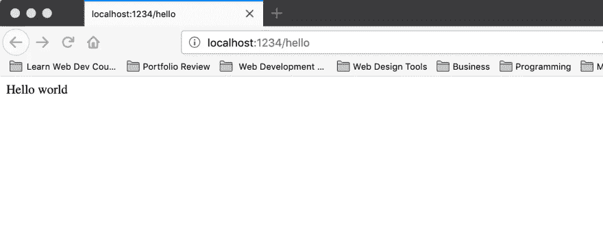
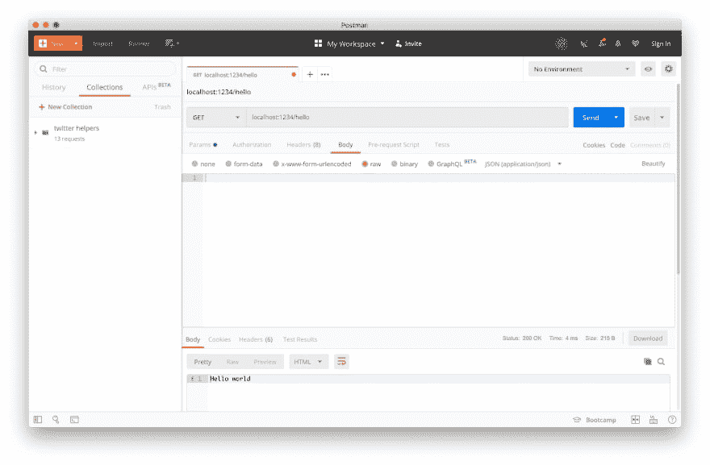
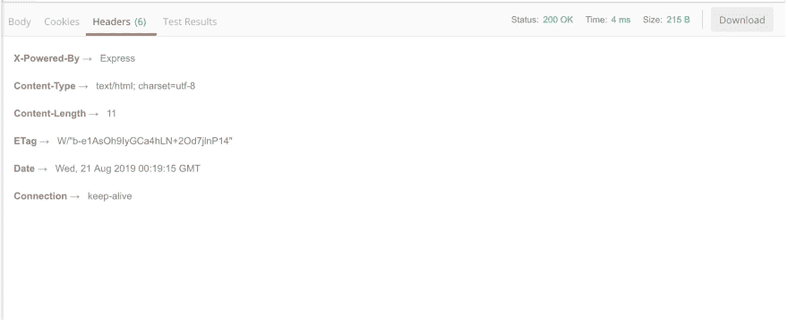
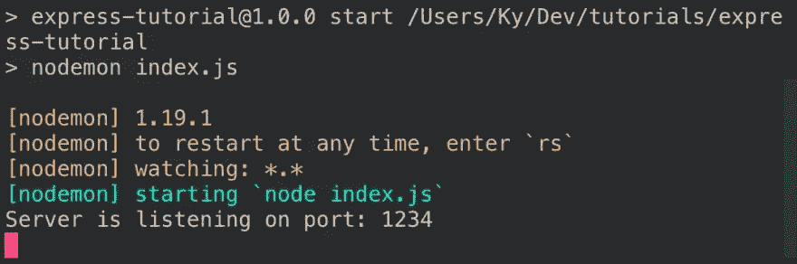

# 如何在 Node.js 中设置 Express.js 服务器

> 原文：<https://dev.to/kyrelldixon/how-to-setup-an-express-js-server-in-node-js-56hp>

本教程旨在向您展示如何使用 Express framework 和 Node.js 从零开始构建并运行一个简单的服务器。它深入探讨了测试服务器的不同方法，而无需编写前端程序。

## 理解术语

在根本不知道代码在做什么的情况下，仅仅复制粘贴一些代码示例来让某些东西运行起来是太容易了。为了避免这种情况，我将简要定义几个重要的术语和概念，以帮助填补一些概念上的空白。

*   REST 或 RESTful 架构:表述性状态转移(REpresentational State Transfer)或 REST 是一种标准化的方法，用于设计一个代码库，以方便客户端和服务器之间的通信。
*   **客户机**:向服务器发送请求(例如 GET、POST 和 DELETE)。客户端经常与应用程序的“前端”混淆，但是有明显的区别。*任何发送请求的东西都是客户端，包括服务器、bash 脚本和网站。*
*   **服务器**:响应来自客户端的请求。响应可以是很多东西，但是来自 API 的最常见的响应是 JSON 文件。
*   JSON : JavaScript 对象符号是一种使用 JavaScript 语法格式化数据的标准方法。
*   **API(应用编程接口)**:允许客户端与服务器交互的代码。

在阅读本教程时，您将会看到这些术语的更多实际例子。

## 要求

对于本教程，您需要一个 Unix shell 来运行 bash 命令。在 Mac 和 Linux 上，您可以使用终端毫无问题地运行命令。在 Windows 上，你可能想要使用 [Git Bash](https://gitforwindows.org/) 、 [Linux for Windows](https://itsfoss.com/install-bash-on-windows/) 、 [Cmder](https://cmder.net/) ，或者其他一些 Unix shell。

您还需要安装[节点](https://nodejs.org/en/download/package-manager/)和 [npm](https://www.npmjs.com/get-npm) 。

要检查您是否安装了节点，请打开您的终端并运行:

```
node -v 
```

要检查您是否安装了 npm，请打开您的终端并运行:

```
npm -v 
```

这样一来，您就可以设置项目了！

## 设置你的项目

首先，为您的项目创建并更改一个文件夹。

```
mkdir express-tutorial && cd $_ 
```

这里我们使用了`$_`，它是最后一个命令输入的别名。`mkdir`命令的输入是`express-tutorial`，所以`cd $_`翻译成`cd express-tutorial`。

**专业提示:**我使用`git`对我的文件夹进行版本控制，所以在这一点上我也做了一个`git init`。为了简单起见，我将把`git`排除在本教程之外，但是在一个实际的项目中，现在是开始跟踪你的变更的好时机。

从这里我们想创建一个`package.json`文件，它将跟踪我们的项目依赖关系，并允许我们在以后做一些很酷的事情。要运行:

```
npm init -y 
```

这将创建一个`package.json`文件，并对所有问题回答“是”,因为有了`-y`标志。

如果您检查您的`package.json`文件，它看起来应该类似于这个:

```
{  "name":  "express-tutorial",  "version":  "1.0.0",  "description":  "",  "main":  "index.js",  "scripts":  {  "test":  "echo \"Error: no test specified\" && exit 1"  },  "keywords":  [],  "author":  "Kyrell Dixon",  "license":  "MIT"  } 
```

如果你的`package.json`不完全一样，那也没关系。您可以添加您想要匹配的字段，但是我会指出当这个文件改变时您需要注意哪些字段。

我们现在需要设置的最后一件事是添加 Express 框架。Express 是 Node.js 框架，我们将使用它来创建实际的 API 端点，所以我们需要安装这个包。为此，请使用:

```
npm i express 
```

这里`npm i`是`npm install`的缩写，因为你输入的字母越少，患腕管综合症的风险就越小(也因为最好的开发人员都很懒)。

运行该命令将添加几个新文件:

```
.
├── node_modules #new
├── package-lock.json #new
└── package.json 
```

**专业提示**:为了显示这个，我使用了一个名为`tree`的命令。[这个](https://askubuntu.com/questions/431251/how-to-print-the-directory-tree-in-terminal)链接会帮你在 MacOS 和 Ubuntu 上安装。

文件夹是 Express 框架代码及其所有依赖项所在的地方。如果你使用 git，你要确保你**永远不**提交这个文件夹，除非绝对必要，因为它*巨大*。

**专业提示:**如果你想从你电脑上未使用的项目中轻松移除 node_modules，请查看 [`npkill`](https://medium.com/better-programming/npkill-the-easy-solution-to-deleting-node-modules-with-style-1c591126f7a5) 。

`package-lock.json`文件是自动生成的，主要是作为跟踪项目依赖关系的一种方式，但是它有多种用途。更多信息，请查看 npm 文档对这个文件的[描述。](https://docs.npmjs.com/files/package-lock.json)

至此，我们完成了所有的初始设置。为了这个项目。现在我们可以开始创建服务器了。

## 创建初始服务器

首先我们要创建一个文件来存储我们的主服务器代码:

```
touch index.js 
```

使用`index.js`作为根文件是非常标准的，因为这向其他开发人员传达了这是您的应用程序开始的地方。

然而，如果这只是一个只有你会看到的个人项目，请随意享受乐趣，并将其命名为你想要的名称。实际上，您将文件命名为什么并不重要。

从这里开始，您想取您命名的文件，并键入:

```
const express = require("express");

const app = express();

app.listen(1234, () => {
  console.log("Server is listening on port: 1234");
}); 
```

这是怎么回事？

第 1 行负责将之前安装的 express 包导入到服务器文件中。

第 3 行调用 express 函数，该函数返回一个 express 应用程序。

第 5-7 行告诉您的应用程序监听来自端口 1234 的任何请求。现在，您可以将端口视为 url 的一个更具体的地址，类似于街道号码。

要测试代码，返回命令行并运行:

```
node index.js # or node your-filename.js 
```

如果到目前为止您已经遵循了每一步，那么您应该会在您的终端中看到一条消息:

```
Server is listening on port: 1234 
```

如果没有，试着调试一下！如果你得到了某种类型的错误信息，试着自己破译或者直接复制粘贴到谷歌上。

如果所有这些都失败了，伸出手来，我或社区里的其他人会很乐意帮助你。

一旦一切正常，就差不多可以创建一些 API 端点了！嗯，*差不多*准备好了。首先，我们想对端口进行快速重构。

## 快速重构的`PORT`

作为一个快速重构，我们将把端口移动到它自己的变量中，就像这样:

```
const express = require("express");

const PORT = 1234;
const app = express();

app.listen(PORT, () => {
  console.log(`Server is listening on port: ${PORT}`);
}); 
```

这消除了开发人员所说的“幻数”幻数只是一个没有标签的数字。在这种情况下，如果我们不显式地将`1234`保存在`PORT`常量中，任何阅读代码的人都不会知道这个数字的用途。

另一个微妙的好处是，我们现在可以重用`console.log`中的端口变量，这样如果我们改变端口，我们只需要在一个地方改变它。

像这样简单的重构可以帮助你获得清晰的代码，易于理解和操作。

这样一来，我们就可以开始创建 API 端点了。

## 创建 REST API 端点

我们将创建的第一个端点将处理一个 GET 请求。

```
const express = require("express");

const PORT = 1234;
const app = express();

app.get("/hello", (req, res) => {
  res.send("Hello world");
});

app.listen(PORT, () => {
 console.log(`Server is listening on port: ${PORT}`);
}); 
```

我们来分析一下。

首先我们有`app.get("/hello", ...)`，它告诉服务器我们希望能够处理对`/hello`端点的 GET 请求。

端点之后是`(req, res) => {...}`，它是一个 ES6 [箭头函数](https://developer.mozilla.org/en-US/docs/Web/JavaScript/Reference/Functions/Arrow_functions)，带有两个参数`req`和`res`。

第一个参数`req`是一个变量，它存储来自客户端的传入`req` uest 的所有信息。服务器`res`响应功能存储在`res`参数中。

在这种情况下，我们使用`res.send`来响应字符串`"Hello world"`。

那么，在服务器启动并运行之后，如何对其进行测试呢？我将介绍三种无需编写代码就能测试 api 端点的方法。

## 测试 API 端点的三种方式

为了测试出`"/hello"`端点，我们想要在`localhost:1234/hello`向完整的服务器 url 发送一个 GET 请求。

我们使用`localhost`,因为我们在本地运行服务器，使用`:1234`,因为这是服务器监听的端口。

测试这一点的第一个方法是在浏览器中！

### 从浏览器测试一个 GET 端点

打开 Chrome、Firefox、Safari 或任何你觉得舒服的浏览器。只是请，**请**不要用 ie 浏览器。微软，它的创造者，[甚至不希望你](https://www.theverge.com/2019/2/8/18216767/microsoft-internet-explorer-warning-compatibility-solution)。

如果你得到一个错误，一定要用`ctrl+c`后跟`node index.js`来重启你的服务器。(稍后，我将向您展示一种避免忘记重启服务器而导致错误的方法。)

您的浏览器应该是这样的:

[](https://res.cloudinary.com/practicaldev/image/fetch/s--eOfrgeKk--/c_limit%2Cf_auto%2Cfl_progressive%2Cq_auto%2Cw_880/https://www.kyrelldixon.com/static/e0ab551bfccd1e9eab4bb2da69714864/4b668/hello-endpoint.webp)

为什么会这样？

每当你进入浏览器的地址栏时，它实际上是在向你给它的任何 URL 发出 GET 请求。举例来说，每次你去 google.com，你的浏览器都会进行 GET 操作，谷歌服务器会向你发送显示谷歌搜索栏所需的 HTML、CSS 和 JavaScript。

`"hello"`端点的 GET route 当前正在向下发送字符串`"Hello world"`，但是我们可以让它发送几乎任何包含文本的文档——这就是 JSON 或 HTML 文件的全部内容。

浏览器对于快速测试我们的 GET 端点非常有用，但是如果您需要测试任何其他类型的请求，比如 POST 或 DELETE，您将需要一个完全不同的方法。下一个方法将向您展示如何使用 cURL 完全从命令行测试您的端点。

### 用 cURL 从命令行测试任何 API 端点

有时，您希望快速测试 API 端点，而不必离开代码编辑器。如果您正在使用 Visual Studio 代码，那么您可以测试您的 API 端点，而无需打开另一个应用程序。(如果没有，您可以打开终端，仍然可以利用这种方法。)

**亲提示:**使用 Visual Studio 代码。这是最好的。

要用 cURL 测试您的端点，请在命令行中键入:

```
curl localhost:1234/hello 
```

您应该会得到与浏览器相同的`"Hello world"`响应。

使用 cURL，您还可以执行其他类型的请求，如 POST、PUT 和 DELETE，修改标题，使用 cookies，以及测试 API 所需的几乎所有其他操作。这是一个非常强大的学习工具，但是如果你不是一个使用命令行的爱好者，它会变得很乏味。

这就是最终解决方案的来源。

### 用 Postman 测试您的 API 端点

[](https://res.cloudinary.com/practicaldev/image/fetch/s--ruBzvfRI--/c_limit%2Cf_auto%2Cfl_progressive%2Cq_auto%2Cw_880/https://www.kyrelldixon.com/static/01a21035897cd75cbf2b94e1b14e9acf/c3bcd/postman.webp)

Postman 提供了一个漂亮的 GUI(读作“gooey”)或者图形用户界面，可以轻松地向你的端点发出请求。在提到的技术中，我个人最常使用这种方法，因为它使得 API 很容易测试。当您的 API 变得越来越复杂，并且您有各种各样的端点需要测试时，这一点尤其有用。

在这种情况下，你需要做的就是传入如上图所示的 url，然后点击 send。`"Hello world`响应像平常一样显示，但是您也可以看到与响应一起返回的头。

[](https://res.cloudinary.com/practicaldev/image/fetch/s--oW5_IdY0--/c_limit%2Cf_auto%2Cfl_progressive%2Cq_auto%2Cw_880/https://www.kyrelldixon.com/static/3b6bb5b0c4a95ed92e088510a529494a/78593/postman-headers.webp)

您可以将标头简单地视为关于请求或响应的数据。在图片中，你可以看到一个`X-Powered-By: Express`标题，告诉你 Express 负责发送这个响应。

另一个值得注意的头是`Content-Type`头，它让客户端知道如何解释响应的主体。这里是`text/html; charset=utf-8`，因为当使用`res.send`进行响应时，这是默认的`Content-Type`。

Postman 解析出了其他几个默认头，并使其易于查看，但在每种技术中，发送的头和响应体都是完全相同的。这只是说明使用不同的工具有各种利弊，有时你可以通过尝试不同的方法来完成相同的任务。

既然测试已经不存在了，我想展示一种可选的方法来防止您在职业生涯中不可避免地会遇到的常见错误。

## 加成:用`nodemon`减少开发错误

每当您对服务器进行更改时，您都必须停止并重新启动服务器才能测试这些更改。忘记重启服务器会导致几个小时的沮丧和怀疑，因为你认为你的代码没有工作，而实际上服务器只是没有加载更改。

如果你没有感受到这种挣扎，你是少数幸运者之一。这个建议会让你永远不会遇到它。解决方案是安装一个名为`nodemon`的 npm 包。

有了`nodemon`，你再也不用手动重启你的服务器了。它在后台运行，监视你所有文件的变化。当它检测到一个，它会自动重启服务器，这样你就可以专注于编写代码。

要开始使用，您需要安装它:

```
npm i --save-dev nodemon 
```

这里您使用`--save-dev`或者`-D`标志将 nodemon 添加到您的`package.json`文件中的`devDependencies`。

您的`package.json`文件现在应该包含一个类似如下的对象:

```
{  "devDependencies":  {  "nodemon":  "^1.19.1"  }  } 
```

我们将它添加到`devDependicies`中，因为这只是运行服务器的一种方便的方式，使开发更容易，并且不需要有一个工作的应用程序。

要使用`nodemon`来运行服务器，首先您需要向`"scripts"`对象
中的`package.json`添加一个`"start"`脚本

```
"scripts":  {  "start":  "nodemon index.js",  "test":  "echo \"Error: no test specified\" && exit 1"  }, 
```

然后运行服务器，您可以使用:

```
npm start 
```

这将创建一个如下所示的显示:

[](https://res.cloudinary.com/practicaldev/image/fetch/s--JvklkU1H--/c_limit%2Cf_auto%2Cfl_progressive%2Cq_auto%2Cw_880/https://www.kyrelldixon.com/static/0847f9990467c8ed1ebfe4e10ffb0913/a0dba/nodemon.webp)

另一种使用`nodemon`的方法是进行全局安装，这将允许你从命令行为任何*项目运行它，而不需要将其作为`devDependency`安装。*

要运行:

```
npm i -g nodemon 
```

这将在系统范围内安装软件包，而不仅仅是针对特定项目。这允许您简单地从命令行运行`nodemon index.js`，而不必在`package.json`文件中设置脚本。

## 整理完毕

本教程介绍了 Express 服务器的初始设置，创建 GET 端点，并使用`cURL`、浏览器和 Postman 测试端点。

现在，您应该拥有了探索和测试其他类型端点所需的一切。至此，我将留给你一些实用的练习，供那些想超越本教程所展示的内容的人使用。

### 习题

*   将您的代码推送到 GitHub
*   向服务器添加发布、上传和删除端点
*   通读 Express.js [文档](https://expressjs.com/en/api.html)
*   创建一个简单的表单并将其连接到服务器
*   在 [DigitalOcean](https://www.digitalocean.com/) 或无服务器云提供商上部署服务器

如果您有任何问题或反馈，请通过 [Twitter](https://www.twitter.com/kyrelldixon) 联系我！