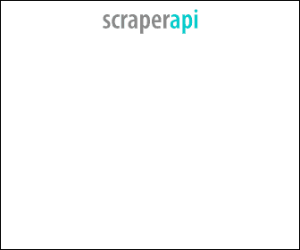
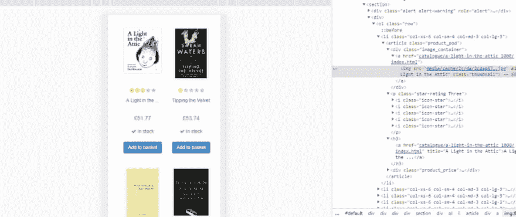

# python 网页抓取简介

> 原文：<https://dev.to/lewiskori/introduction-to-web-scraping-with-python-24li>

最初发布于我的网站

## 什么是网页抓取？

这是利用网页底层代码中的模式从网页中提取信息的过程。我们可以使用网络抓取从互联网上收集非结构化数据，对其进行处理，并以结构化格式存储。在本演练中，我们将把数据存储在一个 JSON 文件中。

## 网页抓取的替代品

虽然网络抓取是从网站中提取数据的有用工具，但它不是完成这项任务的唯一手段。
在开始网络抓取之前，先弄清楚你要提取数据的页面是否提供了 API。

## robots.txt 文件

在制作剪贴簿之前，请确保检查网站的 robots.txt 文件。这个文件告诉我们网站是否允许抓取。
要检查文件，只需键入基本 URL，后跟“/robots . txt”
例如，“mysite.com/robots.txt”。
更多关于 robots.txt 文件的信息[点击这里](https://varvy.com/robottxt.html)。

### 其他潜在问题

其他问题可能会遇到，而网页抓取是你的 IP 地址被列入黑名单的可能性。我与 scraper API 合作，这是一家专门研究策略的初创公司，可以缓解你在抓取网页时 IP 地址被阻止的担忧。他们利用 IP 轮换，所以你可以避免检测。拥有超过 2000 万个 IP 地址和无限带宽。

除此之外，它们还为你提供了 CAPTCHA 处理功能，并启用了一个无头浏览器，这样你就看起来像一个真正的用户，而不会被检测为网页抓取者。更多关于它的用法，请查看我在 scrapy 上的帖子。虽然你可以把它和 BeautifulSoup 和 selenium 一起用。

[](/lewiskori) [## 使用 python 的 selenium 进行 web 抓取的初学者指南

### 刘易斯·科里 9 月 4 日 1915 分钟阅读

#tutorial #beginners #python](/lewiskori/beginner-s-guide-to-web-scraping-with-python-s-selenium-3fl9)

使用这个 [scraperapi 链接](https://www.scraperapi.com?_go=korilewis)和代码
lewis10，您将在首次购买时获得 10%的折扣！

[](https://www.scraperapi.com?fpr=lewiskori)

# **入门**

在本教程中，我们将从[书中提取数据来抓取](http://books.toscrape.com/) ，你可以用它来练习你的网络抓取。
我们将提取书名、评分、关于该书的更多信息的链接以及该书的封面图片。

在 [github](https://github.com/lewis-kori/webcrawler-tutorial) 上找到代码。

### 1。导入库

```
import requests
import json
from bs4 import BeautifulSoup 
```

<svg width="20px" height="20px" viewBox="0 0 24 24" class="highlight-action crayons-icon highlight-action--fullscreen-on"><title>Enter fullscreen mode</title></svg> <svg width="20px" height="20px" viewBox="0 0 24 24" class="highlight-action crayons-icon highlight-action--fullscreen-off"><title>Exit fullscreen mode</title></svg>

python 库执行以下任务。

1.  请求-将用于向网页发出 Http 请求。
2.  json——我们将使用它将提取的信息存储到一个 JSON 文件中。
3.  BeautifulSoup -用于解析 HTML。

### 2。游戏攻略

```
header = {'User-Agent': 'Mozilla/5.0 (Windows; U; Windows NT 5.1; en-US; rv:1.9.0.7) Gecko/2009021910 Firefox/3.0.7'}

base_url = "http://books.toscrape.com/"

r = requests.get(base_url,headers=header) 
```

<svg width="20px" height="20px" viewBox="0 0 24 24" class="highlight-action crayons-icon highlight-action--fullscreen-on"><title>Enter fullscreen mode</title></svg> <svg width="20px" height="20px" viewBox="0 0 24 24" class="highlight-action crayons-icon highlight-action--fullscreen-off"><title>Exit fullscreen mode</title></svg>

我们在这里初始化三个变量。

1.  header-HTTP 头为 HTTP 事务提供了额外的参数。通过发送适当的 HTTP 头，可以访问不同的[格式](http://go-colly.org/articles/scraping_related_http_headers/)的响应数据。

2.  base _ url——是我们想要抓取的网页，因为我们会经常需要这个 URL，最好进行一次初始化，并在以后重用这个变量。

3.  r——这是 get 方法返回的响应对象。这里，我们将 base_url 和 header 作为参数传递。

```
if r.status_code == 200:
  soup = BeautifulSoup(r.text, 'html.parser')
  books = soup.find_all('li',attrs={"class":"col-xs-6 col-sm-4 col-md-3 col-lg-3"})
  result=[]
  for book in books:
    title=book.find('h3').text
    link=base_url +book.find('a')['href']
    stars = str(len(book.find_all('i',attrs=  {"class":"icon-star"}))) + " out of 5"
    price="$"+book.find('p',attrs={'class':'price_color'}).text[2:]
    picture = base_url + book.find('img')['src']
    single ={'title':title,'stars':stars,'price':price,'link':link,'picture':picture}
    result.append(single)
    with open('books.json','w') as f:
      json.dump(result,f,indent=4)
else:
  print(r.status_code) 
```

<svg width="20px" height="20px" viewBox="0 0 24 24" class="highlight-action crayons-icon highlight-action--fullscreen-on"><title>Enter fullscreen mode</title></svg> <svg width="20px" height="20px" viewBox="0 0 24 24" class="highlight-action crayons-icon highlight-action--fullscreen-off"><title>Exit fullscreen mode</title></svg>

为了确保我们的 scraper 在 HTTP 响应正常时运行，我们将使用 if 语句进行检查。数字 200 是 Ok 的状态代码。要获得所有代码及其含义的列表[，请查看此资源](https://www.restapitutorial.com/httpstatuscodes.html)。
然后，我们将使用 BeautifulSoup 方法解析响应对象，并将新对象存储到一个名为 Soup 的变量中。

根据上述定义，

> 网页抓取利用网页底层代码中的模式从网页中提取信息的过程。

让我们来看看网页上的一条记录，以确定模式。一旦我们可以看到页面，我们将遍历页面上的每个记录，因为它们包含相似的特征。
[](https://res.cloudinary.com/practicaldev/image/fetch/s--_BwOwR81--/c_limit%2Cf_auto%2Cfl_progressive%2Cq_auto%2Cw_880/https://res.cloudinary.com/practicaldev/image/fetch/s--0vJGh1fH--/c_imagga_scale%2Cf_auto%2Cfl_progressive%2Ch_420%2Cq_auto%2Cw_1000/https://thepracticaldev.s3.amazonaws.com/i/pdfw0kcge1v8le01c1q5.PNG) 
从上图中，我们会注意到所有的书都包含在一个带有

`col-xs-6 col-sm-4 col-md-3 col-lg-3`
类的列表项中

通过使用 find_all()方法，我们可以在网页中找到这个 HTML 标签的所有引用。我们将标签作为第一个参数传递，然后使用 python 字典中的 attrs 参数，我们可以指定所选 HTML 标签的属性。在本例中，它是上面提到的一个类，但是您甚至可以使用 id 作为属性。

将结果存储在一个变量中，我选择了 books 这个名称。

```
title=book.find('h3').text
link=base_url +book.find('a')['href'] 
```

<svg width="20px" height="20px" viewBox="0 0 24 24" class="highlight-action crayons-icon highlight-action--fullscreen-on"><title>Enter fullscreen mode</title></svg> <svg width="20px" height="20px" viewBox="0 0 24 24" class="highlight-action crayons-icon highlight-action--fullscreen-off"><title>Exit fullscreen mode</title></svg>

如果我们仔细观察，我们会注意到我们想要提取的每个元素都嵌套在列表项标记中，都包含在类似的标记中，如上例所示。书名在 h3 标签之间。方法返回第一个匹配的标签。
text 将简单地返回在指定标签中找到的任何文本。
对于锚标签，我们将提取超链接。
与 h3 标签相反，href 元素在 HTML 的 anchor 标签中。像这样

`<a href="somelink.com"></a>`

在这种情况下，返回的对象将表现得像一个字典，其中有一个

`dictionary_name[key]`

我们对所有想要提取的值重复地这样做，因为我们利用了网页底层代码中的模式。因此使用 python for 循环。

```
single ={'title':title,'stars':stars,'price':price,'link':link,'picture':picture}
result.append(single)
with open('books.json','w') as f:
    json.dump(result,f,indent=4) 
```

<svg width="20px" height="20px" viewBox="0 0 24 24" class="highlight-action crayons-icon highlight-action--fullscreen-on"><title>Enter fullscreen mode</title></svg> <svg width="20px" height="20px" viewBox="0 0 24 24" class="highlight-action crayons-icon highlight-action--fullscreen-off"><title>Exit fullscreen mode</title></svg>

提取的元素然后被存储在各自的变量中，我们将把它们放在一个字典中。有了这些信息，我们就可以轻松地在 for 循环之前将 dictionary 对象附加到初始化的结果列表集。

最后，将 python 列表存储在一个名为“books.json”的 JSON 文件中，为了便于阅读，缩进量为 4。

这样，您就有了一个简单的 web scraper 并开始运行。要了解更多关于网页抓取器的信息，请阅读库或 youtube 上的文档。

如果你喜欢这个演练，[订阅我的邮件列表](https://mailchi.mp/c42286076bd8/lewiskori)以便在我发布新帖子时得到通知。

谢了。