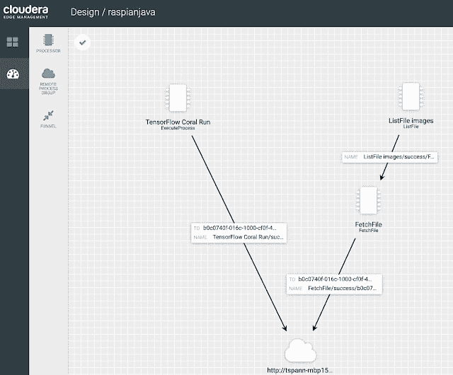
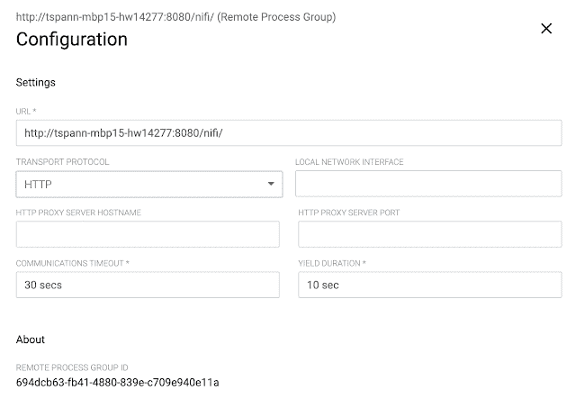
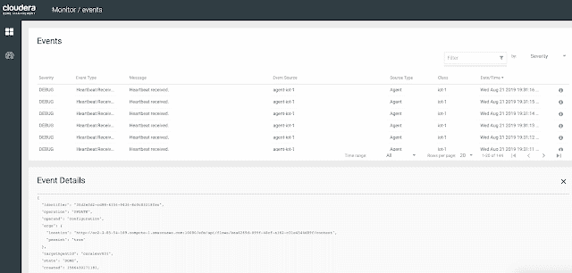
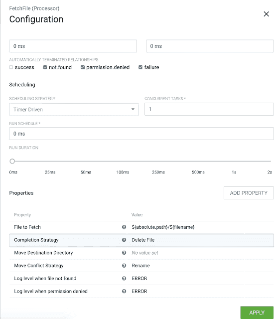
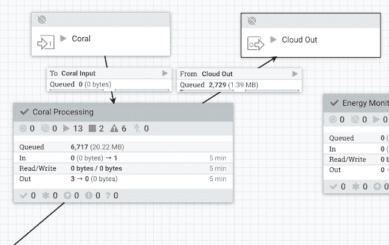
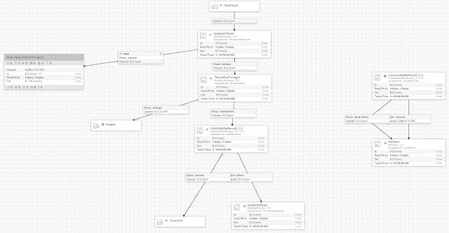
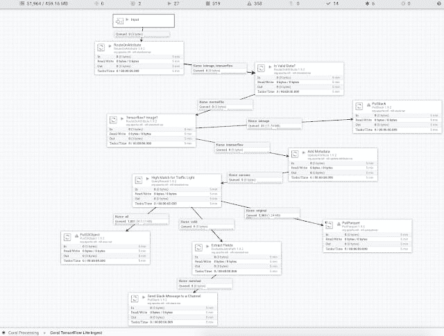
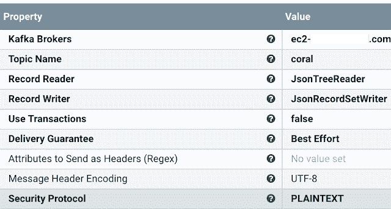

# 谷歌珊瑚 TPU 与边缘设备和迷你

> 原文：<https://dev.to/tspannhw/google-coral-tpu-with-edge-devices-and-minifi-e6n>

### 用 Edge 设备和 MiNiFi 谷歌珊瑚 TPU

使用 Cloudera Edge Flow Manager 设计我们的 Edge AI 流程。

配置您的远程进程组，将数据发送到您的 NiFi 集群

从事件窗口监控您的代理

让我们抓住所有的新图像，然后删除完成

我们有输入和输出端口，可以与 0-n MiNiFi 代理进行双向通信

我们的 NiFi 流程处理来自运行 Coral TPUs 的 MiNiFi 代理的呼叫

我们运行一个查询来检查 TensorFlow Lite 分类结果，并发出一条 slack 消息。

让我们将 JSON 数据推送到 AWS 中的 Kafka 集群

