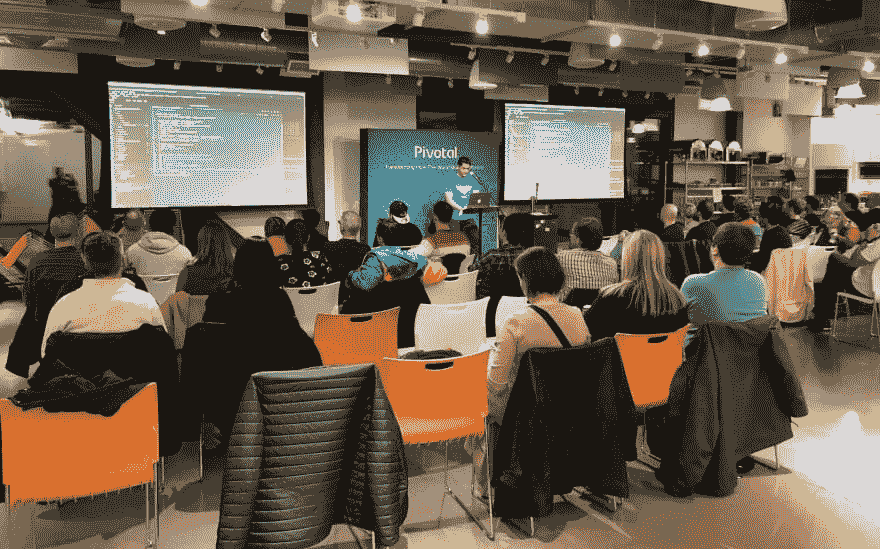
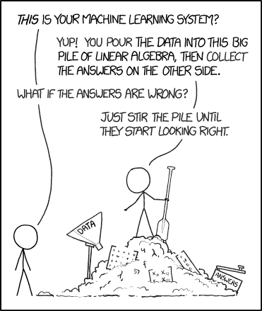
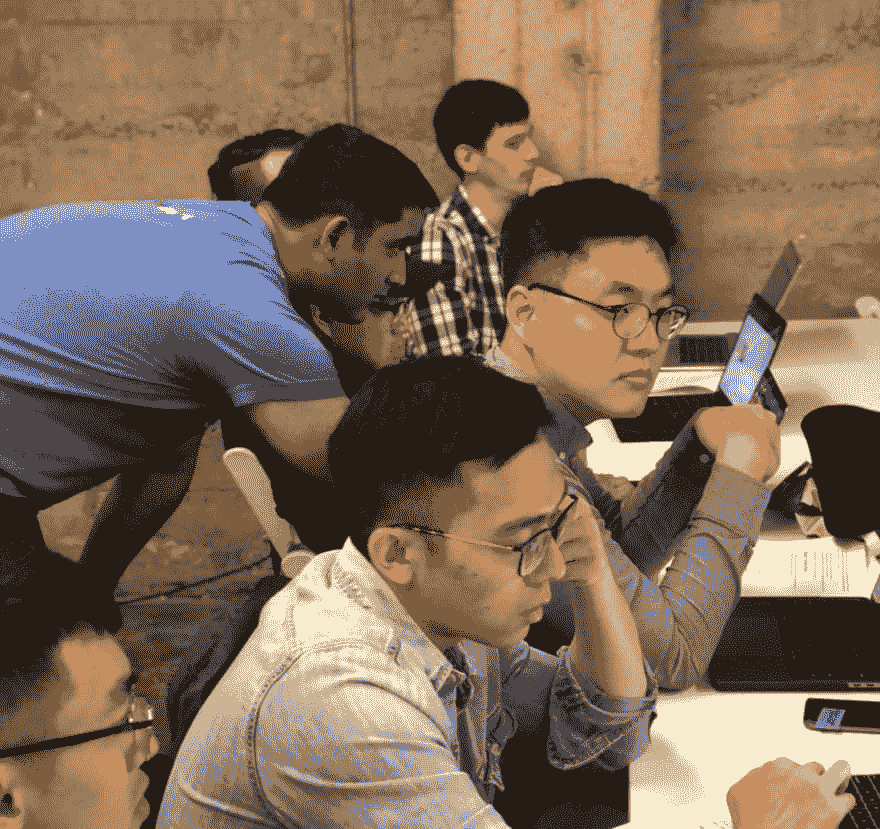
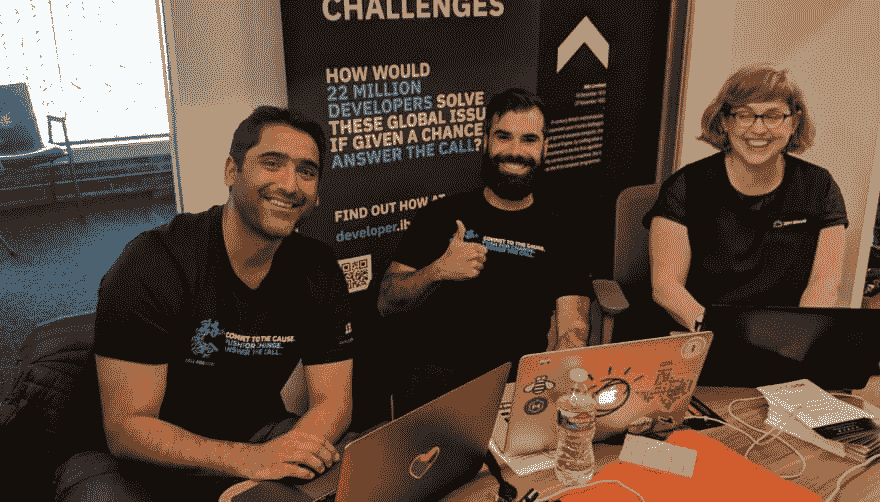
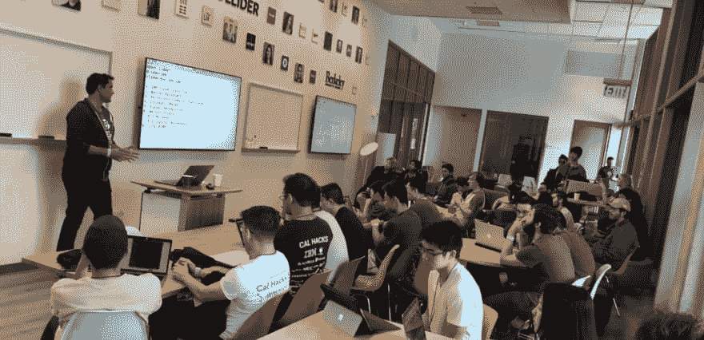

# 为数据科学和人工智能产品调整您的 DevRel 策略

> 原文：<https://dev.to/drnugent/adapting-your-devrel-strategy-for-data-science-and-ai-products-1816>

根据市场研究公司 Tractica 的数据，到 2025 年，全球人工智能产品市场预计将增长约 10 倍，达到近 1200 亿美元。许多公司都试图占领这个市场，包括 IBM 的 Watson 开发工具套件 T1。我和我的同事 Upkar Lidder 讨论了如何使 DevRel 策略适应当前和未来几代面向开发者的 AI 产品。

## 目录

*   [AI 开发和 app 开发有什么不同？](#q1)
*   [如何向非技术用户解释 AI？](#q2)
*   [是什么让你对 AI 感兴趣？](#q3)
*   什么样的开发人员战术对人工智能/人工智能有效？
*   如何从实践研讨会中获得最大价值？
*   在 DevRel 中，你希望谁表现出色？

Upkar Lidder 是一名全栈开发人员和数据辩论者，拥有十年的开发经验，担任过各种角色。可以看到他在各种会议上发言，并参加当地的技术团体和会议。Upkar 在加拿大读研究生，目前居住在美国。

### 问:你曾经和从事各种人工智能项目的开发人员一起工作过，从简单的 101 风格的教程到客户实现巨大的系统。AI 开发与更常规的编程有什么不同？

在软件开发的人工智能方面有很多学习、尝试和实验。人工智能项目的目标可能是模糊的，例如:“减少客户投诉的数量”。

相比之下，经典的软件开发可能包含这样的目标:“给我一个上面有按钮的对话框。”非常具体，定义明确。当然，有很多用户研究和设计进入到软件规范中以达到那个点，并且作为一个开发者，你按照那个规范工作。相反，作为一名数据科学家，你可能只会被指向一个非结构化数据集——然后真正的乐趣就开始了！你开始*探索*它。我喜欢人工智能开发中的数据争论。你可以进入一个 [Jupyter 笔记本](https://ibm.biz/BdzKnB)，开始探索特定的异常值、数据形状、数据类型，并通过不同的视觉表现来查看数据的外观。

然后，你做决定:我如何处理丢失的值？这将如何影响我的预期结果？即使在前两个阶段，也有很多未知。在软件开发中，许多程序员走着他们的同事和前辈已经走了几十年的老路(即使我们不一定一直做得很好！)在数据科学中，您有一个探索期，在此期间您试图找到一条道路，一旦您完成清理和转换，您将选择一种合适的建模技术并继续进行分析。很多探索都是蛮力。 [XKCD 有我最喜欢的关于数据科学的漫画:](https://xkcd.com/1838/)

就像我说的，很多数据科学只是蛮力。即使有了 helper 库，您也必须自己勾画出一个受过教育的起点，让库自己完成剩下的大部分工作。之后，您将分析结果如何与您的其他基准算法进行比较，并重复该过程。

### 问:这就引出了一个问题，你如何向非技术用户解释你的项目和模型？

这是一个很好的问题:你希望在多大程度上能够向商业用户解释你的思维过程和决策？像决策树这样的一些模型很容易解释，而用神经网络或机器学习构建的模型可能会变得更复杂，更难解释。与计算机科学相比:除了一些棘手的错误，像这样的解释问题是不会发生的。

现在有了更先进的系统，比如自动驾驶仪，你把数据交给系统，它会替你处理更多的繁重工作。例如，我正在与一些数据科学家合作一个项目，为一些内部部门分析 NPS 分数。我们正在构建一个系统，当支持电话正在进行时，该系统可以识别电话中显示“走下坡路”的红旗，并在电话*仍在进行中*时提醒经理。我们可以访问通话时长、客户层级和情绪分析等数据点，因此我们可以使用这些数据在问题爆发前自动标记它们。有趣的是，我们尝试对数据运行 AutoAI 数据科学家不喜欢它！主要问题是它可能有点像“黑箱”，科学家们希望能够解释他们是如何得出结论的。

在年度数据科学调查中，数据科学中最大的差距之一是*技能组合。*因此，一方面，我们需要这样的黑盒系统，你不必拥有数学博士学位就能理解系统的工作原理:它会进行特征工程、[超参数优化](https://en.wikipedia.org/wiki/Hyperparameter_optimization) -与此同时，数据科学家并不完全信任它。

### 问:你已经在 IBM 工作了几年——你在进入 AI 之前是做什么的，你是如何实现转变的？

我是通过 IBM 的支持小组加入的，所以我会接到世界各地有问题的客户的电话，并尽力帮助他们解决问题。我是 2-3 级，所以问题会升级到我。所以顾客和我说话的时候已经很生气了！在很多方面，我觉得最初的角色和我们现在做的很相似。我们与开发人员打交道，并试图找出如何帮助他们，即使我们从教育的角度而不是支持的角度来处理这个问题。然后我是一名 Java 开发人员，用 Eclipse 构建产品。从那以后，我去了一个面向客户的技术岗位，从事客户项目，与产品开发非常不同。从那以后，我成为了一名职能领导，这实际上是一个项目管理角色。我有一个开发团队，我将与他们一起工作来确定解决方案的范围，并确保他们按时交付。两年后，我搬进了德弗雷尔。

在从事开发人员关系之前，我喜欢辅导编码学校和训练营的学生；所以，当这个 DevRel 的工作出现时，我想，“哇，把它作为一份工作来做，并获得报酬，这将是很棒的！”

### 问:你以前提倡像 API 和无服务器架构这样的产品和技术。你开发了哪些新战术来谈论人工智能和机器学习？

用 AI/ML 你必须做的。少说多做。对于其他软件开发主题，比如无服务器，你可以做一个更长的讲座，然后进行演示。人工智能/人工智能强调实验。你必须把手弄脏，否则就没用了。我喜欢 Jupyter 笔记本，因为你可以做一些事情，看到因果关系，看到结果，然后*才*思考为什么。

我觉得数据科学背后有更多的抽象理论、数学和直觉。你总是可以记住一个公式，但是能够对某件事有一种直觉，那是理想的。这来自于实验。通过可视化和绘图，您可以理解不同数据科学概念背后的数学原理。与更面向 DevOps 的东西相比，这是一种不同的方法。因此，在数据科学和人工智能开发中，你必须确保参与者正在做一些事情并参与进来。否则你会很快失去它们，因为这涉及到数学！

对我有用的一件事是花很多时间在我的工作室里，非常详细地解释每一个步骤。在我的幻灯片中，我将使用箭头、带注释的矩形等来确保学生能够轻松自然地理解。当我教 Jupyter 笔记本的时候，我精心制作了一个半成品的解决方案，在这里我构建了一个在某一点上有效的解决方案，然后接下来的两个单元格将是问题:找到我们刚刚查询的数据的频率。你可以做一个演示，在那里你做，他们看；然后你可以做一个跟进，你们两个同时做；最后，你走一遍锻炼方法，他们先做工作。最后两个对数据科学概念最有用。

### 问:再来说说动手工作坊。我们发现自己在 IBM 做越来越多的研讨会。您可以分享哪些最佳实践？

在研讨会上对我有用的五件事:

*   **先决条件。**让研讨会与会者在研讨会前完成一些先决条件。如果您有特殊代码供与会者使用，请提前分发。当他们注册时，你做的第一件事就是添加代码来升级他们的帐户。研讨会的很多时间都浪费在了准备上:演讲者花了前十分钟说“嘿，跟我来。”如果可能的话，提前做好准备以避免这种情况。当然，尽管你尽了最大努力，但在开始之前，不可能让每个人都准备好；在你开始演讲之前，你必须迎合这些用户。
*   **逐步说明。**即使与会者没有任何问题，也要准备一份备份计划，上面有幻灯片编号，他们可以回去继续看。谁会看吸尘器附带的书？没有人，但如果您有问题，可能需要稍后再咨询。
*   准备好最终的解决方案。如果你使用 GitHub，不同的步骤有不同的分支；如果用户不太懂技术或者需要跳过某个部分，他们可以检查那个分支，并且仍然能够跟上研讨会。这种类型的内容需要时间来开发。
*   **延伸目标。**你会有各种背景和经历的观众，尽可能地迎合他们是很重要的。)你要么会失去新手——重要的是不要失去他们，因为这可能是他们第一次做某件事！但是你也不想失去中级和高级用户，这就是延伸目标的重要性。
*   **资源。**告诉您的学生，除了研讨会的后勤工作之外，下一步该去哪里，做什么。确保你在会议期间也有助教作为资源。

### 问:在 DevRel 世界中，你希望谁表现出色，或者拓展了开发者关系的边界？

[要编辑的 Upkar

### 下一步步骤:

*   [在 twitter 上关注 Upkar](https://twitter.com/lidderupk)
*   听一听 Upkar 在 [IBM 开发者 SF 会议](https://www.meetup.com/IBM-Developer-SF-Bay-Area-Meetup/)上的演讲