# 用纯 CSS 创建一个整洁的 RSVP 卡。

> 原文：<https://dev.to/alanmynah/create-a-neat-rsvp-card-with-pure-css-4fg1>

[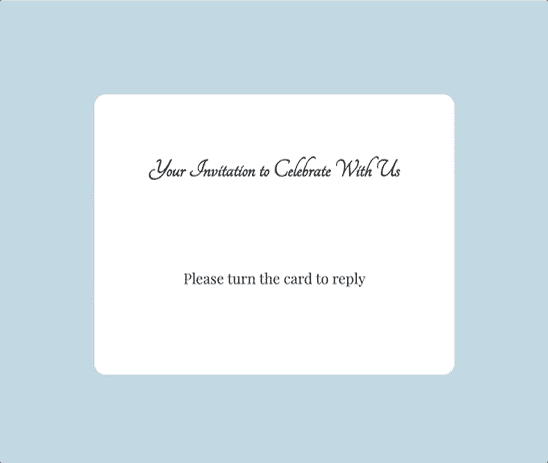](https://res.cloudinary.com/practicaldev/image/fetch/s--ZIX_jiKB--/c_limit%2Cf_auto%2Cfl_progressive%2Cq_66%2Cw_880/https://thepracticaldev.s3.amazonaws.com/i/2twcm93y5nw196fdbkc2.gif)

我是在 Scrimba 上预览[@ kevinj Powell](https://twitter.com/KevinJPowell)[响应式网络开发者训练营的少数幸运者之一。我不能高度推荐它，因为观看课程对我写这篇文章帮助很大！](https://scrimba.com/g/gresponsive)

通过这篇文章，你将学习如何用 CSS 和 HTML 为任何场合创建一个 RSVP 卡！

此外，我必须承认，我是 Scrimba 的忠实粉丝已经很长时间了，我总是告诉我在每次聚会上遇到的每个人它有多棒！

自然，如果你喜欢玩我的代码，[有一个游乐场](https://scrimba.com/c/cR4b8JuQ)。

如果英语不是你的母语，像我一样，并且你以前从未遇到过 RSVP 卡，RSVP 是法语的*répondez s ' il vous plat*，意思是“请回复”，在英国、美国、加拿大等国广泛使用。作为婚礼和其他正式场合的请柬。

# 从简单 HTML 开始

让我们从卡片的 HTML 表示开始，卡片的正面和背面有单独的`div`。

```
<html>
  <head>
    <link rel="stylesheet" href="index.css" />
  </head>
  <body>
    <div class="container">
      <div class="card">
        <div class="front">
          <h1>Front</h1>
        </div>

        <div class="back">
          <h1>Back</h1>
        </div>
      </div>
    </div>
  </body>
</html> 
```

<svg width="20px" height="20px" viewBox="0 0 24 24" class="highlight-action crayons-icon highlight-action--fullscreen-on"><title>Enter fullscreen mode</title></svg> <svg width="20px" height="20px" viewBox="0 0 24 24" class="highlight-action crayons-icon highlight-action--fullscreen-off"><title>Exit fullscreen mode</title></svg>

[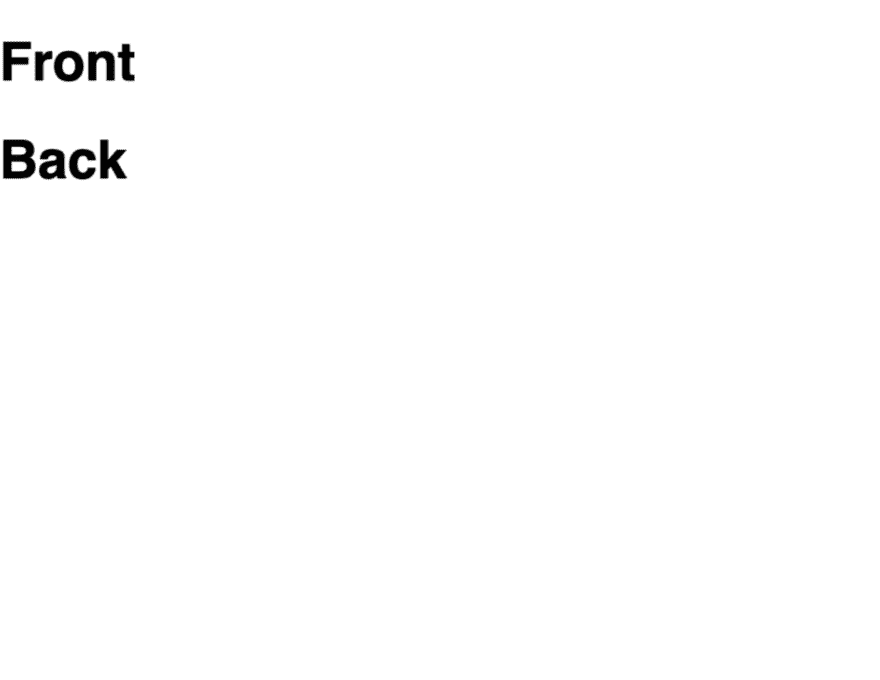](https://res.cloudinary.com/practicaldev/image/fetch/s--nYL1U8Gb--/c_limit%2Cf_auto%2Cfl_progressive%2Cq_auto%2Cw_880/https://thepracticaldev.s3.amazonaws.com/i/wuxsasguli1hmnb6yy8v.png)

现在让我们添加一些基本的 CSS 来准备一个放置卡片的容器。我们可以使用相对%单位来确保一切都居中。

```
body {
  background: #b6d4df;
}

.container {
  position: absolute;
  background: none;
  top: 50%;
  left: 50%;
  transform: translate(-50%, -50%);
} 
```

<svg width="20px" height="20px" viewBox="0 0 24 24" class="highlight-action crayons-icon highlight-action--fullscreen-on"><title>Enter fullscreen mode</title></svg> <svg width="20px" height="20px" viewBox="0 0 24 24" class="highlight-action crayons-icon highlight-action--fullscreen-off"><title>Exit fullscreen mode</title></svg>

[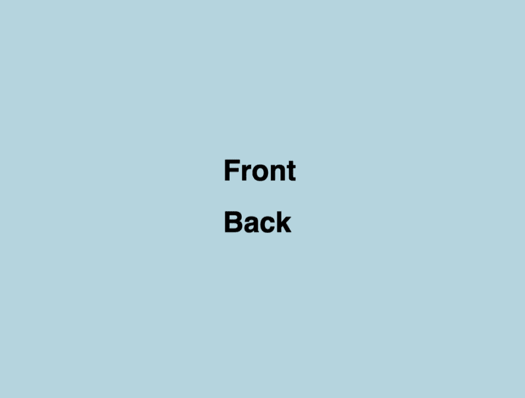](https://res.cloudinary.com/practicaldev/image/fetch/s--JuUx6DoX--/c_limit%2Cf_auto%2Cfl_progressive%2Cq_auto%2Cw_880/https://thepracticaldev.s3.amazonaws.com/i/o9y2dqpexebpjui2aef9.png)

现在让我们添加卡片。

百分比值是父容器的百分比值。所以当我们在`.card`类上使用 100%的宽度和高度时，它会取和`.container`类一样的大小。

```
body {
  background: #b6d4df;
}

.container {
  position: absolute;
  width: 60%;
  height: 60%;
  background: none;
  top: 50%;
  left: 50%;
  transform: translate(-50%, -50%);
}

.card {
  position: relative;
  top: 0;
  left: 0;
  width: 100%;
  height: 100%;
} 
```

<svg width="20px" height="20px" viewBox="0 0 24 24" class="highlight-action crayons-icon highlight-action--fullscreen-on"><title>Enter fullscreen mode</title></svg> <svg width="20px" height="20px" viewBox="0 0 24 24" class="highlight-action crayons-icon highlight-action--fullscreen-off"><title>Exit fullscreen mode</title></svg>

我们现在还可以为卡片的每一面添加样式。

```
.front,
.back {
  position: absolute;
  top: 0;
  left: 0;
  width: 100%;
  height: 100%;
  text-align: center;
  border-radius: 15px;
  overflow: hidden;
  background: #fafafa;
  color: #333;
} 
```

<svg width="20px" height="20px" viewBox="0 0 24 24" class="highlight-action crayons-icon highlight-action--fullscreen-on"><title>Enter fullscreen mode</title></svg> <svg width="20px" height="20px" viewBox="0 0 24 24" class="highlight-action crayons-icon highlight-action--fullscreen-off"><title>Exit fullscreen mode</title></svg>

[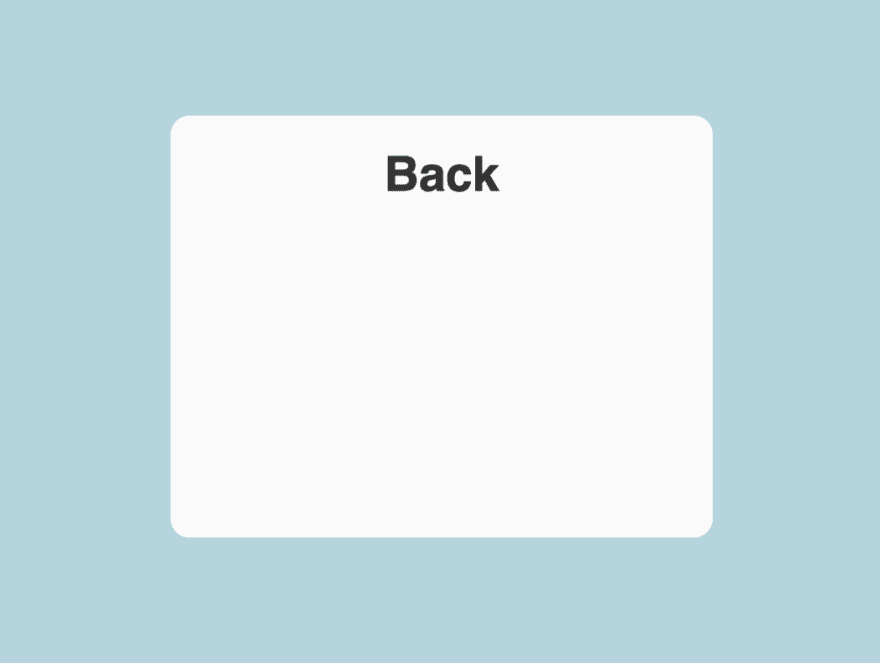](https://res.cloudinary.com/practicaldev/image/fetch/s--0admuc_D--/c_limit%2Cf_auto%2Cfl_progressive%2Cq_auto%2Cw_880/https://thepracticaldev.s3.amazonaws.com/i/ytcfwuepzgk5q5r7l9zb.png)

卡在那里，但是我们看到了它的背面。那是因为`back`渲染的比较晚，所以覆盖了`front`。为了显示`front`，我需要在两边添加`backface-visibility: hidden;`，现在只需要旋转它。

```
.front,
.back {
  /* the rest of CSS */
  backface-visibility: hidden;
}

.back {
  transform: rotateY(180deg);
} 
```

<svg width="20px" height="20px" viewBox="0 0 24 24" class="highlight-action crayons-icon highlight-action--fullscreen-on"><title>Enter fullscreen mode</title></svg> <svg width="20px" height="20px" viewBox="0 0 24 24" class="highlight-action crayons-icon highlight-action--fullscreen-off"><title>Exit fullscreen mode</title></svg>

[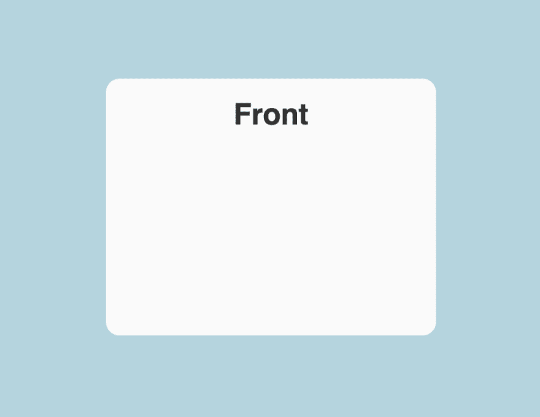](https://res.cloudinary.com/practicaldev/image/fetch/s--wWD0V2GL--/c_limit%2Cf_auto%2Cfl_progressive%2Cq_auto%2Cw_880/https://thepracticaldev.s3.amazonaws.com/i/39r4t7sma2n7filbsah0.png)

那好多了。让我们试着让它在我们悬停在卡片上时翻转过来。

```
.card:hover {
  transform: rotateY(180deg);
} 
```

<svg width="20px" height="20px" viewBox="0 0 24 24" class="highlight-action crayons-icon highlight-action--fullscreen-on"><title>Enter fullscreen mode</title></svg> <svg width="20px" height="20px" viewBox="0 0 24 24" class="highlight-action crayons-icon highlight-action--fullscreen-off"><title>Exit fullscreen mode</title></svg>

[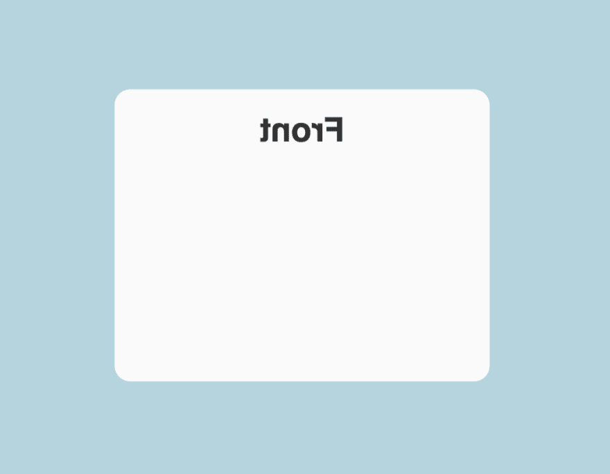](https://res.cloudinary.com/practicaldev/image/fetch/s--bqTn6Pvs--/c_limit%2Cf_auto%2Cfl_progressive%2Cq_auto%2Cw_880/https://thepracticaldev.s3.amazonaws.com/i/bqarrh9q35gldeujkkb1.png)

我们正在努力，但这不是我们想要的。翻牌的魔法 CSS 线是`transform-style: preserve-3d;`。我还打算给`.card`加上`transition: all 0.8s ease;`，让动画过渡看起来更自然。

```
.card {
  position: relative;
  top: 0;
  left: 0;
  width: 100%;
  height: 100%;
  transform-style: preserve-3d;
  transition: all 0.8s ease;
} 
```

<svg width="20px" height="20px" viewBox="0 0 24 24" class="highlight-action crayons-icon highlight-action--fullscreen-on"><title>Enter fullscreen mode</title></svg> <svg width="20px" height="20px" viewBox="0 0 24 24" class="highlight-action crayons-icon highlight-action--fullscreen-off"><title>Exit fullscreen mode</title></svg>

o 让这个过渡看起来稍微漂亮一点，让我们添加`perspective: 1000px;`。

```
.container {
  perspective: 1000px;
  position: absolute;
  width: 60%;
  height: 60%;
  background: none;
  top: 50%;
  left: 50%;
  transform: translate(-50%, -50%);
} 
```

<svg width="20px" height="20px" viewBox="0 0 24 24" class="highlight-action crayons-icon highlight-action--fullscreen-on"><title>Enter fullscreen mode</title></svg> <svg width="20px" height="20px" viewBox="0 0 24 24" class="highlight-action crayons-icon highlight-action--fullscreen-off"><title>Exit fullscreen mode</title></svg>

[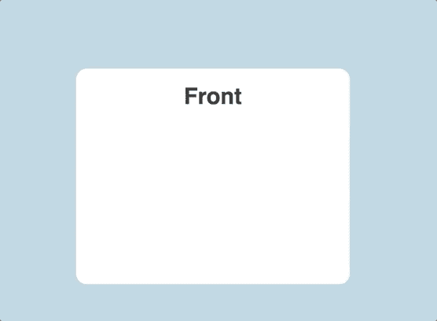](https://res.cloudinary.com/practicaldev/image/fetch/s---GQyrV5---/c_limit%2Cf_auto%2Cfl_progressive%2Cq_66%2Cw_880/https://thepracticaldev.s3.amazonaws.com/i/8zshrdpu43tcbyukxzai.gif)

让我们修饰一下措辞，让这个设计尽可能贴近现实生活，这样你就可以在自己的派对上重复使用它了！

我们在这里的时候，我会添加一些字体。

```
<html>
  <head>
    <link rel="stylesheet" href="index.css" />
    <link
      href="https://fonts.googleapis.com/css?family=Tangerine&display=swap"
      rel="stylesheet"
    />
    <link
      href="https://fonts.googleapis.com/css?family=Playfair+Display&display=swap"
      rel="stylesheet"
    />
  </head>
  <body>
    <div class="container">
      <div class="card">
        <div class="front">
          <h1>Your Invitation to Celebrate With Us</h1>
          <p>Please turn the card to reply</p>
        </div>

        <div class="back">
          <h1>RSVP</h1>
          <p>We would be thrilled for you to celebrate with us.</p>
          <button>Yes, I'd love to come</button>
          <button>Unfortunately, I'm busy</button>
        </div>
      </div>
    </div>
  </body>
</html> 
```

<svg width="20px" height="20px" viewBox="0 0 24 24" class="highlight-action crayons-icon highlight-action--fullscreen-on"><title>Enter fullscreen mode</title></svg> <svg width="20px" height="20px" viewBox="0 0 24 24" class="highlight-action crayons-icon highlight-action--fullscreen-off"><title>Exit fullscreen mode</title></svg>

[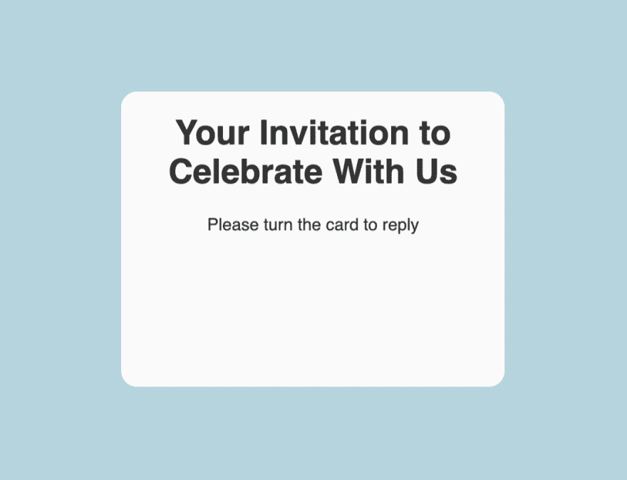](https://res.cloudinary.com/practicaldev/image/fetch/s--g1UbErxo--/c_limit%2Cf_auto%2Cfl_progressive%2Cq_auto%2Cw_880/https://thepracticaldev.s3.amazonaws.com/i/zpq93wjv9iph4ec2fqoi.png)
[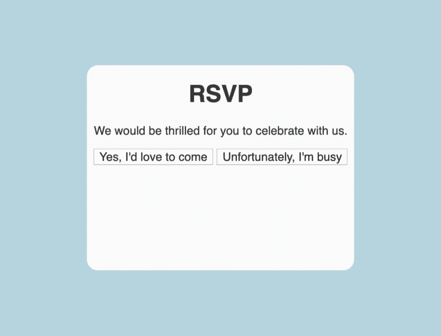T6】](https://res.cloudinary.com/practicaldev/image/fetch/s--1KEB6COu--/c_limit%2Cf_auto%2Cfl_progressive%2Cq_auto%2Cw_880/https://thepracticaldev.s3.amazonaws.com/i/dfm96dt0fd2zofdraj77.png)

# 响应式排版

有好的效果是好的，但是如果文字看起来平淡无奇，卡片就不能满足它。

通常，CSS 有两个最常见的问题。能够以最小的变化对不断变化的需求做出反应，并在任何地方保持`px`值。:D

这就是`rem`前来救援的时候。

rem 是根元素的字体大小值，即`<html>`元素。

默认不写，但是好像:

```
html {
  font-size: 16px;
} 
```

<svg width="20px" height="20px" viewBox="0 0 24 24" class="highlight-action crayons-icon highlight-action--fullscreen-on"><title>Enter fullscreen mode</title></svg> <svg width="20px" height="20px" viewBox="0 0 24 24" class="highlight-action crayons-icon highlight-action--fullscreen-off"><title>Exit fullscreen mode</title></svg>

这意味着当我们设置`font-size: 1rem;`时，它与`font-size: 16px;`相同。因此，如果我们想要横向扩展，我们只需更改一个值，一切都会随之改变。

让我们看看用我们的卡会是什么样子。

```
h1 {
  font-family: 'Tangerine', cursive;
  font-weight: bold;
  font-size: 1.8rem;
  text-align: center;
}

.front h1 {
  padding: 3rem;
}

.back h1 {
  padding: 2rem;
}

p {
  font-family: 'Playfair Display', serif;
  padding: 1.8rem;
  font-size: 1rem;
  font-weight: normal;
  text-align: center;
}

button {
  padding: 1rem;
  font-size: 0.75rem;
} 
```

<svg width="20px" height="20px" viewBox="0 0 24 24" class="highlight-action crayons-icon highlight-action--fullscreen-on"><title>Enter fullscreen mode</title></svg> <svg width="20px" height="20px" viewBox="0 0 24 24" class="highlight-action crayons-icon highlight-action--fullscreen-off"><title>Exit fullscreen mode</title></svg>

[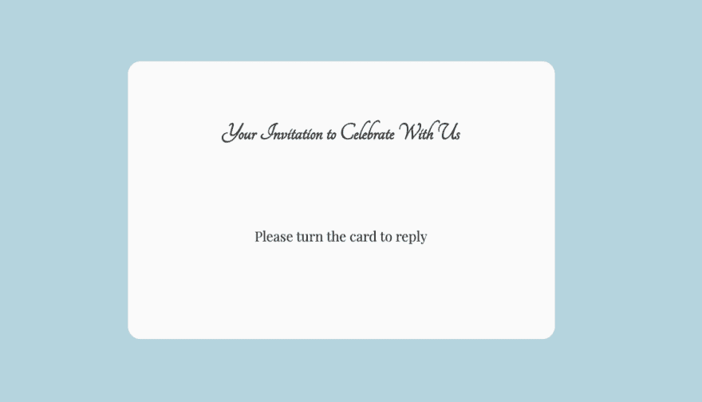](https://res.cloudinary.com/practicaldev/image/fetch/s--s485RLWA--/c_limit%2Cf_auto%2Cfl_progressive%2Cq_auto%2Cw_880/https://thepracticaldev.s3.amazonaws.com/i/2z0tu5bbhyqqa04ss3kk.png)
[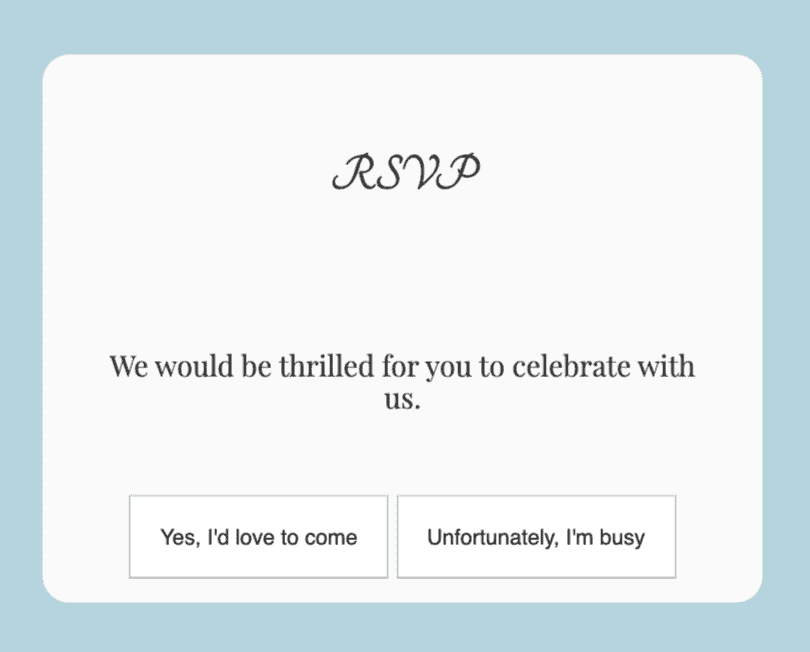T6】](https://res.cloudinary.com/practicaldev/image/fetch/s--UY9hvMBA--/c_limit%2Cf_auto%2Cfl_progressive%2Cq_auto%2Cw_880/https://thepracticaldev.s3.amazonaws.com/i/s8rw5h9bodltsbpxyg4v.png)

当鼠标悬停在按钮上时，给按钮添加一些颜色会是一个不错的选择。

```
button:hover {
  cursor: pointer;
  background-color: lightgray;
} 
```

<svg width="20px" height="20px" viewBox="0 0 24 24" class="highlight-action crayons-icon highlight-action--fullscreen-on"><title>Enter fullscreen mode</title></svg> <svg width="20px" height="20px" viewBox="0 0 24 24" class="highlight-action crayons-icon highlight-action--fullscreen-off"><title>Exit fullscreen mode</title></svg>

[](https://res.cloudinary.com/practicaldev/image/fetch/s--ZIX_jiKB--/c_limit%2Cf_auto%2Cfl_progressive%2Cq_66%2Cw_880/https://thepracticaldev.s3.amazonaws.com/i/2twcm93y5nw196fdbkc2.gif)

但是，当窗口被调整大小时，它破坏了卡片的外观。看起来不太好。

[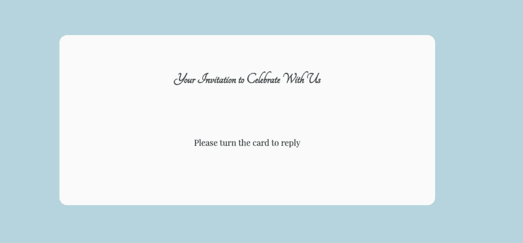](https://res.cloudinary.com/practicaldev/image/fetch/s--9Zbsd1Y5--/c_limit%2Cf_auto%2Cfl_progressive%2Cq_auto%2Cw_880/https://thepracticaldev.s3.amazonaws.com/i/i2yrz9xshlkz9tfar3sx.png)

[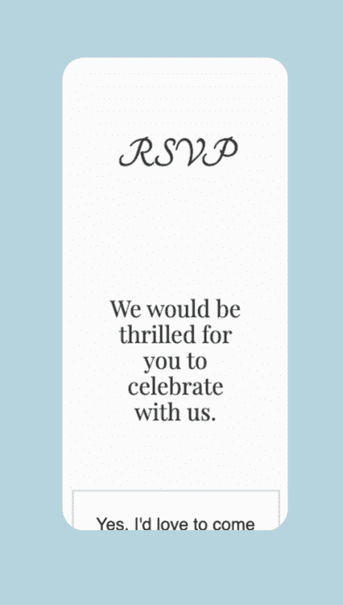](https://res.cloudinary.com/practicaldev/image/fetch/s--vPpVRxg6--/c_limit%2Cf_auto%2Cfl_progressive%2Cq_auto%2Cw_880/https://thepracticaldev.s3.amazonaws.com/i/9vn4szoe3b98jaz26lpd.png)

要修复它，我们可以在`width`和`height`上使用`min-` `max-`前缀。

```
container {
  perspective: 1000px;
  position: absolute;
  width: 60%;
  max-width: 30rem;
  min-width: 25rem;
  height: 60%;
  min-height: 17rem;
  max-height: 20rem;
  background: none;
  top: 50%;
  left: 50%;
  transform: translate(-50%, -50%);
} 
```

<svg width="20px" height="20px" viewBox="0 0 24 24" class="highlight-action crayons-icon highlight-action--fullscreen-on"><title>Enter fullscreen mode</title></svg> <svg width="20px" height="20px" viewBox="0 0 24 24" class="highlight-action crayons-icon highlight-action--fullscreen-off"><title>Exit fullscreen mode</title></svg>

[](https://res.cloudinary.com/practicaldev/image/fetch/s--tscdGYkn--/c_limit%2Cf_auto%2Cfl_progressive%2Cq_auto%2Cw_880/https://thepracticaldev.s3.amazonaws.com/i/tvx04wyfhdw7hq38vqkv.png)

就是这样！希望你喜欢这篇文章！欢迎评论，如果你想聊天，我是推特上的 [@michael_mynah](https://twitter.com/michael_mynah) 。

特别感谢  启发了这个帖子；)