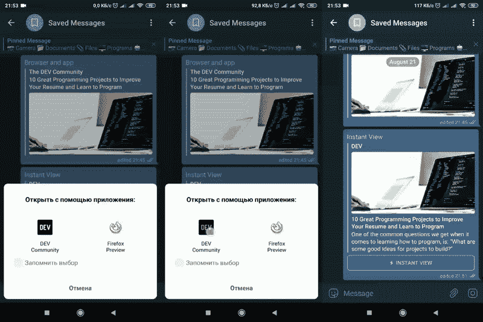
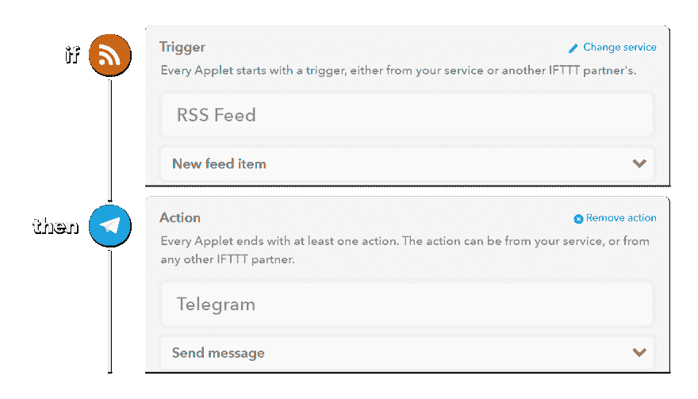
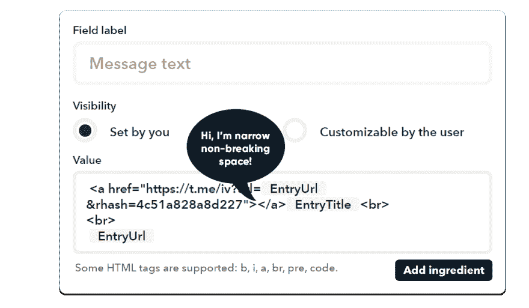
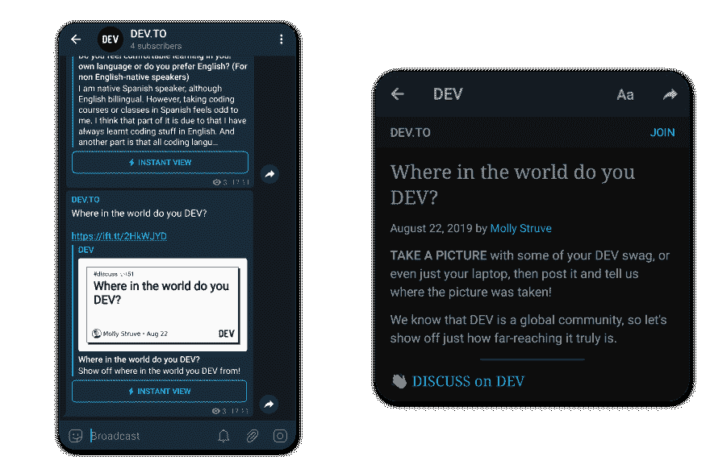

# 电报刮刀的研制🌚

> 原文：<https://dev.to/corbee/dev-to-scraper-made-of-telegram-102j>

我喜欢不需要等待浏览器/应用程序打开来阅读新文章的时候。我喜欢自动化。

所以我创建了 [DEV Telegram Channel](https://t.me/devtotg) ，在这里你可以阅读 dev.to 的文章。而且可以做到 <u>***瞬间***</u>

<figure>[](https://res.cloudinary.com/practicaldev/image/fetch/s--wVDnggKA--/c_limit%2Cf_auto%2Cfl_progressive%2Cq_66%2Cw_880/https://telegra.ph/file/0e4afe6d30b3978041d16.gif) 

<figcaption>**对比:**浏览器| App |电报中即时查看</figcaption>

</figure>

## 什么是即时观？

即时查看是一个内置的电报工具，允许阅读文章没有巨大的加载时间。

IV 的主要概念是模板。它告诉 Telegram 服务器缓存什么数据，删除什么数据。

所以所有的过程都很简单:

1.  通过电报发送的文章
2.  模板的电报检查
3.  电报碎片和缓存物品
4.  提供给用户的纯 HTML 文章

### 什么是模板？

模板是一个代码，它告诉电报刮刀如何处理页面。

IV 模板语言基于:

*   YAML 语法
*   选择节点的 XPath
*   正则表达式到...重组🌚

这段代码足够废弃 dev.to:
上 50%的文章

```
~version: "2.1"
body:     //div[@id="article-body"] # Use <div id="article-body"> as main article
title:    //h1[0] # First h1 header on page used as title 
```

是的，3 行代码。

### 如何使用你的模板？

一旦你在[我的模板页面](https://instantview.telegram.org/my/)上完成了你的代码，按下“在电报中查看”按钮。您将得到类似这样的内容:
[](https://res.cloudinary.com/practicaldev/image/fetch/s--5CSiw5tr--/c_limit%2Cf_auto%2Cfl_progressive%2Cq_auto%2Cw_880/https://telegra.ph/file/a8f05672b77a1cb68429d.png) 
现在您可以使用这个模板为任何文章创建 IV:`t.me/iv?url=LINK&rhash=XXX`

#### 所以现在我们有 2 个目标:

1.  自动过账
2.  做一个漂亮的帖子~~，去掉这个难看的长链接~~

## 什么是 IFTTT？

[IFTTT](https://ifttt.com)(“if this，then that”)-服务，允许你通过小程序连接不同的服务。小程序在触发时做出反应，并以动作做出响应(例如在电报中发布新的 RSS 文章)
[](https://res.cloudinary.com/practicaldev/image/fetch/s--7lvKJ20C--/c_limit%2Cf_auto%2Cfl_progressive%2Cq_auto%2Cw_880/https://thepracticaldev.s3.amazonaws.com/i/5qghxi9haqgm1bdl5o5h.png) 
您所需要的只是在 [IFTTT 平台](https://platform.ifttt.com)上创建小程序。

#### 提示如何让所有人看起来漂亮

你可以在'⁠'隐藏所有丑陋的链接-狭窄的非破坏空间。是的，引号之间有一个字符。
[](https://res.cloudinary.com/practicaldev/image/fetch/s--QFow-N9V--/c_limit%2Cf_auto%2Cfl_progressive%2Cq_auto%2Cw_880/https://thepracticaldev.s3.amazonaws.com/i/06fnxgv1eorotrez78ws.png) 
于是乎——一片通情达理:
[](https://res.cloudinary.com/practicaldev/image/fetch/s--tej5odaY--/c_limit%2Cf_auto%2Cfl_progressive%2Cq_auto%2Cw_880/https://thepracticaldev.s3.amazonaws.com/i/vqvtr5sggj5orke3u44d.png)

# 后记

文章结束，所以如果你不知道下一步该怎么做，你可以考虑:

*   [订阅 DEV。到我制作的*或*的电报频道](https://t.me/devtotg)
*   使用 [IFTTT Applet](https://platform.ifttt.com/p/corbee/applets/rAwazVhv) 向您的渠道/群组发送全新的 dev.to 文章
*   用详细记录的静脉模板(66 LOC)检查[要点](https://gist.github.com/cor-bee/af5cb955ddf2e7d918b06b403b2b759e)
*   [发送问题](https://instantview.telegram.org/contest/dev.to/template28/)如果生成的文章有任何问题(丢失图像、文本等。)
*   [成为顾客](https://www.patreon.com/bePatron?u=23562941)，这样我就可以买披萨了(我爱披萨！🍕👋🏻（👀)👍🏻)