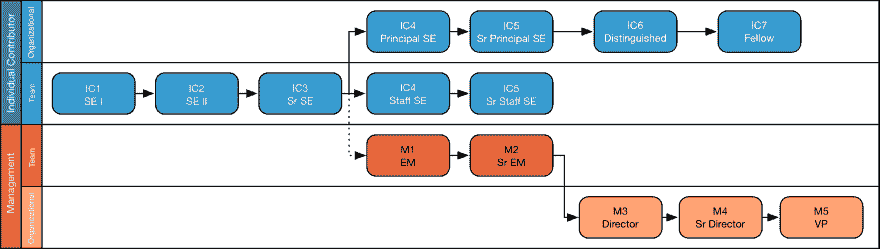

# 你工作的职业轨迹是什么？

> 原文：<https://dev.to/theoutlander/what-is-the-career-track-at-your-job-3l5b>

我在 Shutterstock 阅读了一篇关于[工程文化的有趣文章，关于 IC 与管理职业轨迹的插图让我思考整个行业的不一致性。
T3T5】](https://jasonoh.org/2018/08/31/Designing-Engineering-Culture-Shutterstock.html)

我发现 [Levels.fyi](http://levels.fyi) 有助于阐明这些级别在组织间的平等性。

我很好奇在你的工作中，职业轨迹是什么样的。