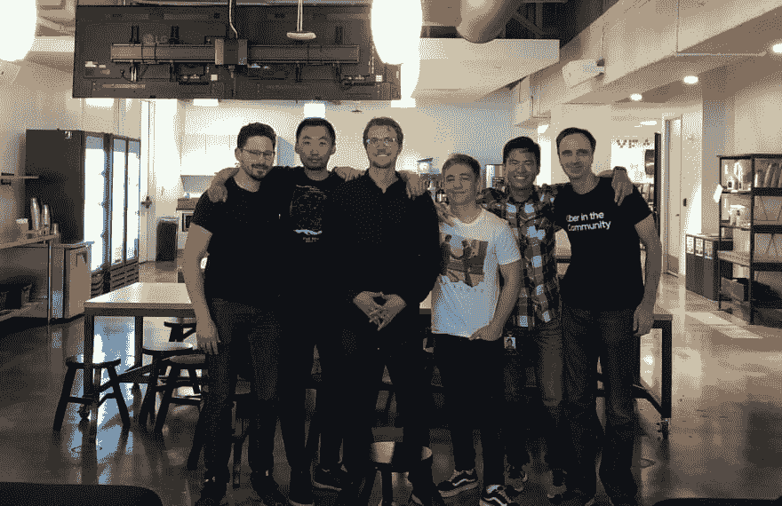
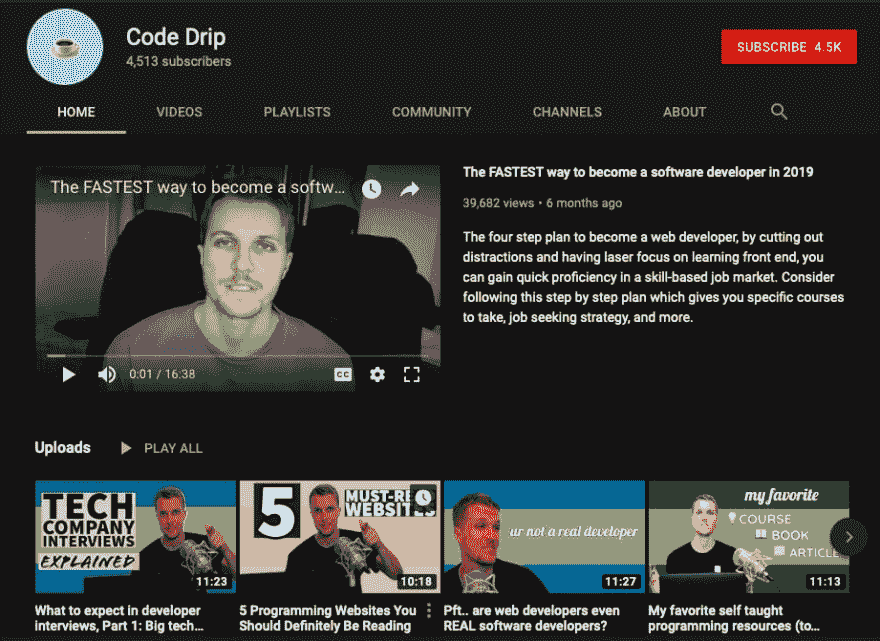

# 8 个月从国外的英语老师到优步的软件工程师

> 原文：<https://dev.to/petecodes/from-broke-english-teacher-abroad-to-uber-software-engineer-in-8-months-4fi1>

我收到很多人的电子邮件，他们希望被采访，询问他们是如何在没有计算机科学学位的情况下进入 web 开发行业的。我突然想到的一封邮件来自 Aaron Pietsch，他在邮件的主题行中提供了标题。艾伦通过自学编程扭转了自己的职业生涯，并在优步找到了一份工作，现在这份工作已经很遥远了。尽情享受吧！

## 嘿，你能给我们介绍一下你自己，你的背景和你现在正在做的事情吗？

我叫 Aaron，我是一名英语教师出身的软件开发人员。从开始写代码开始，我花了大约 8 个月的时间在旧金山的优步找到了一份工作。这确实发生得很快，但我采取的方法并不适合所有人。我把自己放在了一个“不能失败”的位置上。我有很多债务要还，所以可以肯定地说，我真的很有动力！

得到优步大学的聘用，我觉得自己“成功了”，但最初的几个月有一个严重的学习曲线，因为我必须学习大量的新工具和概念。最终我很幸运地领导了一些项目并得到了提升。

在优步呆了一年后，我准备继续自己的项目。我的经理不想失去我，所以让我远程留下来，这就是我现在的位置。这让我在做副业时更加灵活。我的主要副业是 YouTube 上的[Code Drip](https://youtube.com/c/codedrip),它提供学习编码和进入科技行业的建议😀我已经有了几千名订户，我希望能有更多的订户，并在不久的将来开设课程。

## 我知道你曾在越南教过一段时间英语。据我所知，除了大学生的生活方式，这是一种很难的谋生方式。你是如何摆脱那种状态并进入编码领域的？

是的，我在大学休学一年后去了那里。我开始没钱了，决定教书是“继续冒险”的一种方式。我做了一些研究，越南似乎是教师生活成本与工资的最佳比例。

是的，你可以靠英语老师的工资在越南过上相当不错的生活，但是如果你想旅行或者坐飞机回家，那就需要几个月的积蓄。另外，如果你回到美国，你的存款基本上将会化为乌有。然后，另一件事开始让我更加烦恼:我没有真正建立任何长期技能。如果我回到美国，我会从头开始。

于是越南的雨季开始了。每天在倾盆大雨中驾驶摩托车是可怕的，所以我准备离开。所以我开始思考我的下一步工作。也许是技术贸易，回到大学，或者…等等…也许是编程？

## 你是如何进入 web 开发的？你参加过训练营吗？如果参加过，他们是如何帮助你提高技能的？

我想我在 Reddit 上找到了一个关于“web 开发”的帖子，说你不需要一个学位，但它仍然是一份有程序员工资的编程工作。所以我的未来再次属于我，我接受了这个挑战。

从那里，我找到了哈佛 CS50 在线课程，并被介绍到免费在线学习的世界。有*所以*大部分是用于编程的，所以一旦你知道去哪里找，互联网真的是你的牡蛎。

问题是，对我来说，这门课太难了。(我确实回来修完了这门课，尽管它可能仍然是我最喜欢的课程)。在此期间，我尝试了一些不同的东西来学习前端，对我来说更直观和直观:HTML，CSS 和 Javascript。

我记得从一堆不同的资源中学习。奥丁计划、[自由代码营](https://www.freecodecamp.org)、 [Udemy](https://www.udemy.com) 和 [CodeWars](https://www.codewars.com) 等等。即使你看到的是相同的概念，以不同的形式重复也是掌握的关键之一。

## **想要一份开发人员的工作却没有学位？通过 [Triple Byte 的测验](https://triplebyte.com/a/Ww4mbM6/d)，直接进入顶级科技公司的最终现场面试**

## 即使在训练营结束后，你也进行了大量的自学。你能告诉我们你是如何自学的吗？

我认为我在网上读过的最重要的文章是[这篇文章](https://haseebq.com/how-to-break-into-tech-job-hunting-and-interviews/):(警告，不是针对完全初学者的，但是保存并回头再看)。这家伙是个扑克玩家出身的新兵训练营毕业生，我想大概有 8 家不同的科技公司给了他工作机会？他还写了一份学习计划的循序渐进指南。

我大致遵循了这一点，因为它的很多部分(尤其是数据结构和算法部分)对于 web 开发工作来说都是多余的，但是至少接触它们会给你带来词汇。

还有，我认为很多人在训练营结束后犯的一个错误是休假。训练营的很大一部分是养成每天大量编码的习惯，以及解决问题的心态。如果你真的去了训练营，我会说要一直保持动力。

## 我听说你在优步工作。对于一个没有计算机科学学位的人来说，这是一个地狱般的旅程！你觉得面试过程怎么样？那里有很多没有学位的程序员吗？

谢谢！到目前为止，我已经面试了大约 20 个人，所以我站在了两边。我真的为面试感到紧张——对于所有的大型科技公司来说，都有四五轮不同主题的现场面试，问题可能是任何事情。

实际上，这是…是的，和我想象的一样难！但后来我意识到，得到“正确”的答案只是面试的一小部分——更多的是寻找“信号”,表明你在面试的工作中解决问题的效率有多高。

另外，他们在面试中做的很多事情都是在“测试”你，所以他们可能会给你一个很难的问题，并不指望你能走得很远，但你已经走得足够远了，可以通过初级开发人员的考试。

## 成为职业程序员后，你的生活发生了怎样的变化？(也许在另一个维度你在越南还是个一文不名的英语老师！)

当然，我对自己的年薪是透明的，年薪是 11 万美元，外加 2.5 万美元的股票，然后涨到 14 万美元，外加 5 万美元的股票(还有年终现金奖励)。这是一个很好的问题，但对我来说，这很无聊，因为这些钱大部分都花在了偿还贷款和储蓄上，以备有朝一日我真的有希望全职创业。不管怎样，我相信英语老师版的我会很自豪😉

## 对于那些想获得第一份编程工作，但没有时间或金钱攻读计算机科学学位的人，你有什么建议？

如果你有自学的能力，我认为这是目前最好的方法。我的方法是从每天 30 分钟增加到一个小时，最终达到全职(在我的高峰期，我认为我每天做 4 个小时，这对你来说是一个很大的进步)。重要的是在前一天晚上为第二天设定一个目标，并记录下你学习的每一个时间段。

对一些人来说，去训练营是一个不错的选择，但是我的心情很复杂。即使你去训练营，你也必须在进入之前和之后进行自学，以填补空缺并获得那份工作。

训练营的内容我也不觉得是最好的。我们只有 2 天时间学习 React，这几乎是你在许多前端工作中要做的 100%。然后，我训练营的整个后半段时间都在做那些我可以自己完成的项目。也就是说，沉浸和被其他学习者包围是很难定价的。但是它值 2 万美元或更多吗？只有你能决定。

## 我看你拿到了开发者的圣杯:用你的 SF 工资 100%远程！对于想要这个选项的程序员有什么小技巧吗？你打算去哪里流浪？

耶！我刚到塞尔维亚的贝尔格莱德，那是一个被低估了的地方(物价低，人好，集中在巴尔干半岛旅游)。我的情况有点独特，因为我在我的团队中有很大的影响力——我们有很多不同的产品需要领域知识——所以有很强的动机留下我。

很多人想直接去远程学习，但我的建议是绝对要在一家公司亲自学习至少一年。亲自看开发者你会吸收这么多。

我认为在公司内部转移到远程是一个巨大的优势，因为你已经见过每个人，并证明你可以亲自做好工作。这是可能的一个好迹象，如果有其他远程团队成员，如果这是优先事项，你可以在面试过程中问这个问题。否则，获得一年或两年的经验，去寻找一份偏远的工作。[远程 OK](https://remoteok.io/%20) 是一个结账的地方。

## 你能告诉我们关于你的 Youtube 频道节目和你的其他副业项目吗？

当然可以！我的频道叫做 [Code Drip](https://youtube.com/c/codedrip) ，我得到了职业/编程方面的建议，以及教程。建议视频更受欢迎，所以我将更多地关注未来的建议。我很高兴能继续发展它，并随时欢迎主题建议！

我还创建了一个“易于消化的微型课程”的概念——每个人的注意力持续时间都很短，所以我试图将这些 20 多个小时的在线课程中最重要的主题浓缩到微型课程中，这些课程既可以用于复习，也可以用于在实践或深入研究之前获得对概念的高层次理解。我真的很高兴分享这些，名称仍在进行中，但我将很快在我的频道上宣布[,所以如果感兴趣就订阅吧😀](https://youtube.com/c/codedrip)

## 对于困在自己不喜欢的职业中而想从事编程的人，还有什么其他的建议吗？

耶！由于编程在精神上具有挑战性，如果你有一份要求很高的工作，那么下班后编程真的很难。有几种方法可以解决这个问题:

一种方法是工作前编程！这是你最好的时光，起床后你的大脑几乎没有时间找借口。我听说在你目前的工作中注入编程对某些人来说很有效。因此，如果有什么事情你可以自动化，甚至与工作效率无关，就从那里开始吧。

如果你没有家庭或严重的经济负担，我会建议你考虑存点钱，然后开始全职学习。这就是“跳进深水区”

无论哪种情况，我都会重申“每天多做一点”的咒语，并记录你的学习时间。你能行的！

## [没有 CS OK——没有学位的开发者的工作板](https://nocsok.com)

