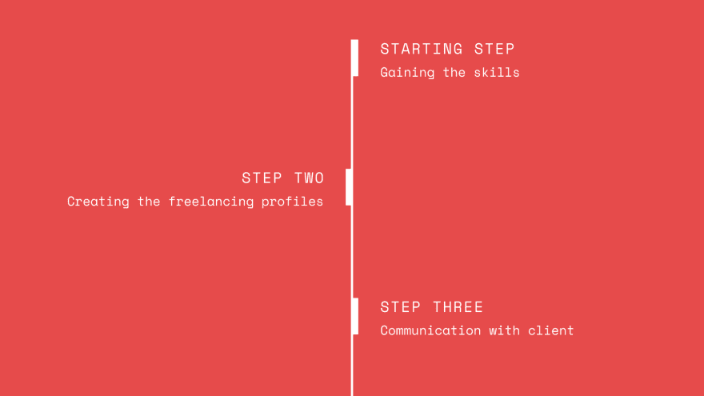
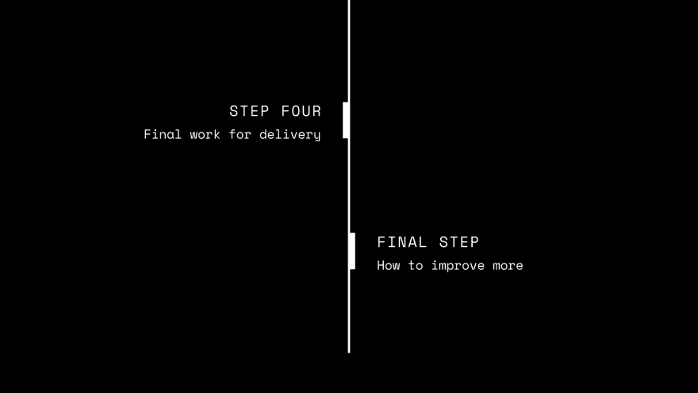

# 2019 年如何做一名自由职业者？

> 原文：<https://dev.to/nerdjfpb/how-to-be-a-freelancer-in-2019-iaj>

2019 年，自由职业与往年不同。有很多人想成为自由职业者，竞争非常激烈。要成为一名优秀的自由职业者，首先，任何人都应该专注于自己的技能。如果你是一个完全的初学者，对自由职业或任何事情没有任何想法，那么我的建议将会发现一些你可以做得更好的技能，而且你也喜欢它们。那么如何进行这项研究呢？

我将首先调查现在每天从事自由职业的最佳领域。为此，我会研究一些谷歌博客，并尝试将其与我目前的职业结合起来。对我来说，我已经完成了计算机科学的本科学位。我很了解编程，所以我从编程开始我的职业生涯，但是如果你做的事情不是一个好的技能，那么学习一些新的技能成为一名自由职业者。一些受欢迎的领域是

*   内容写作
*   数字营销
*   社交媒体营销
*   装帧设计艺术
*   移动和网页设计
*   Web 开发
*   移动应用程序开发

还有很多。选择他们中的任何一个或研究你的兴趣，如果你擅长，你可以开始你的自由职业生涯。

我的自由职业生涯始于网络开发。所以我会告诉你我的旅程，这样你就能明白我是如何开始的，你也可以如何开始你的旅程。我会在每个部分留下提示。我把我的旅程分成了 5 个主要部分。他们是

[T6】](https://res.cloudinary.com/practicaldev/image/fetch/s--MlQUCNBk--/c_limit%2Cf_auto%2Cfl_progressive%2Cq_auto%2Cw_880/https://thepracticaldev.s3.amazonaws.com/i/fcq1nyt51ujt55fn626e.png)

## 获得技能

这部分是开始任何自由职业之旅前的先决条件。我很幸运和我现在工作的领域是同一个研究领域。我的大学课程没有一门帮助我成为一名网站开发人员，是的，其中一些是兼职的(编码课程)，但大部分是我独自学习的。所以我是一个自学者，你也可以是一个自学者。如果你可以在谷歌和 youtube 上搜索，那么你可以在这里或那里学到很多东西。当我还是 web 开发新手时，我是从零开始的，尽管我知道一些编程语言，如- C & Java。然后我先学习 HTML。Html 对我来说似乎超级简单，然后我对 CSS 有了一点了解。之后我把自己变成了一名后端开发人员。如果你不知道什么是后端开发，这是一种连接数据库的方法，用于在由 HTML、CSS 和 Javascript 构建的前端页面中加载数据。后端对我来说很有趣，因为我知道如何编程，起初，我不觉得我需要学习前端，因为我认为我可以终身使用免费模板，我不需要学习它。但是几天后我明白了，没有人会给只知道事情一半的人以价值。所以我学习了前端。我开始更喜欢它，并开始看到它的潜力。如果你从未深入了解某件事，你永远不会知道它的潜力。我还学习了部署到服务器。在我过去的日子里，我帮助我父亲进行商业设计，所以我也了解设计。通过利用所有的经验和我制作的虚拟项目向客户展示，我最终把自己变成了一名设计师&开发者。
那么，你怎样才能更多地了解自己的技能呢？

*   谷歌永远是你的朋友，搜索一切
*   持续关注一些与你的技能相关的博客
*   尝试获得一些证书(这有助于扩大你的社区)
*   尝试一些比赛(这也有助于扩大你的社区)
*   尝试通过博客/视频或任何其他方式分享你所学到的东西
*   制作新的社交媒体资料，用你渴望的专业人士来更新
*   上一些不同平台的课程。像 udemy，coursera，udacity 等等，你也可以做很多其他的事情来提升你的技能，但是记住永远不要停止学习。如果你曾经认为你知道关于它的一切，那么相信我的朋友，你什么都不知道。你走得越深，你就会明白有很多东西要学，这个列表会有规律地增长。最后每天练习。

## 创建自由职业者轮廓

获得技能后，现在看看如何创建自由职业者档案。有很多平台可以让你开始自由职业生涯。喜欢

*   向上工作
*   五元
*   总面积
*   每小时的人和更多。选择平台完全是你的兴趣所在。我正在做 Upwork & Fiverr。创建个人资料真的很重要，因为它代表了你的技能，你的客户会根据这些信息雇用你。选择专业的照片真的很重要，请不要上传任何自拍。我看着就讨厌。我只为 Upwork & Fiverr 工作，所以我会告诉你。如果你愿意，你可以试试其他。

### 自由职业者

Upwork 是你向客户发送建议的地方，客户会在看了你的建议和个人资料后雇用你(大多数情况下)。客户在看你的简介之前会先看建议书，所以你应该把建议书做好。有很多方法可以改进你的提案。但是保持简短和专业，这会给你带来你想要的线索。你的个人资料应该适当地代表你的作品和技能。这将有助于获得客户的邀请。在 upwork 中，当我们与您联系时，客户会接受一个简短的采访。你需要在这方面做得更好，否则他们会雇佣其他人。在这段时间里，你应该提供你如何工作的细节，你要花多少时间来做这件事。告诉他们你所有的问题，如果可能的话，帮助他们做出比他们期望的更好的东西。我的一个客户写道—
**“这是穆罕默德的第一个项目，他尽全力帮助我完成需要做的事情。虽然这是一个小项目，但执行的每一步总是 100%令人满意，没有任何延误。出色的工作，我期待着与穆罕默德再次合作。”当你恰当地帮助了你的客户，他们会重新雇用你。在 upwork 中，这非常有趣，因为你可以只为 2-3 个客户做一个，就能赚很多钱。**

### 自由职业者

Fiverr 与 upwork 稍有不同。在这个平台上，客户来找你。你需要开一些演唱会，客户会来找你并雇佣你。但是为了保持第一，这里的竞争非常激烈。因为当客户在 Fiverr 上搜索时，他们大多试图从第 1 页上雇人，如果你的工作不在第 1 页上，那么就很难从 Fiverr 上得到订单。Fiverr 主要是关于小工程，这里大多数客户都有一个小问题。大多数问题你可以在一周内解决。这个平台没有像 upwork 长时间工作。Upwork 是以小时和项目为基础的。Fiverr 也有相同的，但这里的项目雇用的人最多，在 Fiverr 上有 3 个级别。他们是——无卖家、一级卖家和二级卖家。如果你能通过努力工作一段时间将你的账户转换到 1 级/2 级，那么你会从这里得到很多客户，你会赚很多钱。你应该打开好的演出，试着用合适的图片恰当地描述它。因此，要想在自由职业平台上出人头地，你需要建立一个良好的个人档案，这样才能产生你的潜在客户。

## 与客户沟通

假设我们已经创建了一些很棒的档案，最后我们得到了客户的一些很好的回应，但请相信我，如果你不善于与客户沟通，那么几天后你甚至不会得到任何客户，因为如果一些客户对你的评价很差，那么这将损害你的档案，你的档案将不会显示给其他客户。每个人都需要学习如何接待顾客，如何专业地交谈。如果你能表现出你的职业精神，那你就走了。如今你无法生存。你需要对信息反应灵敏，因为这是他们与你交谈的唯一方式。在几个小时内不断更新他们的工作进度，向他们展示你正在制作的原型或实时视图。这就是你与客户沟通的方式，这将帮助你成为一个长期客户，甚至可以改变你的一生。甚至有时客户每月租用。所以你甚至可以从自由职业者的工作中获得固定的工资。

## 交付的最终工作

所以你有一个客户，也很好的沟通，但如果你擅长交付产品，那么这也会伤害你的职业生涯。因为如果客户得不到他想要的东西，这件事就不会成功。你需要知道他想要什么类型的文件，并给他适当的方式。对我来说，我主要从事网络开发。我以 zip 格式给他们发送文件，有时我从他们那里创建共享的 GitHub/bitbucket/Gitlab 项目并在那里共享。有时候我直接把代码上传到他们的服务器上。所以我按他们想要的方式做。如果你帮助他们，让他们的工作变得容易，那么他们也会让你的生活变得容易。这是一个简单的规则。但是要经常检查你是否给了他们正确的文件？有什么改变可以改善吗？这是完整的吗？如果可能的话，也添加一个驱动链接，这将有助于他们更容易地下载整个程序。当然，这取决于客户，但你总能为他们做得更好。

## 如何提高更多？

这永远是个问题。工作一段时间后，如果你为特殊技能工作，那么就会有很多共同点，对吗？比如，一个项目的开始，有多少部分，你如何分配你的项目时间。所以会有很多常见的问题，你可以帮助客户很容易地理解一件事。那么你怎样才能让它变得更棒呢？对我来说，我为我的客户制作了一些 trello 板，在那里我向他们展示创建一个网站需要什么。我还做了一个 Behance 项目，让他们更容易做到这一点。你也可以从 behance 网站查看。你可以做很多额外的事情，但这取决于你，每个客户都是不同的，记住这一点。你不能写一个通用的建议/通用的方法来使超级容易。但是你可以写下一些基本原则，这会帮助你比以前更容易完成工作。所以这都是为了提高。找到你的弱点并加以改进。

这就是我在 2019 年成为自由职业者的方式。网上有很多提示，继续研究吧。继续学习会帮助你得到更多的作品，但记住在不久的将来会有更多的比赛，但如果你能提供一些独特的东西或一些好的技能，那么你就有机会展示。人们正在做伟大的自由职业者的工作，你也可以这样做。相信自己，开始吧。让你的研究与你的正确目标保持一致。