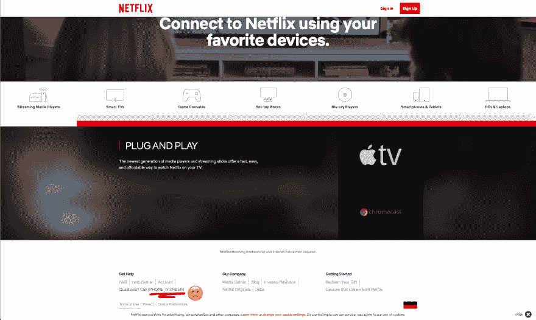
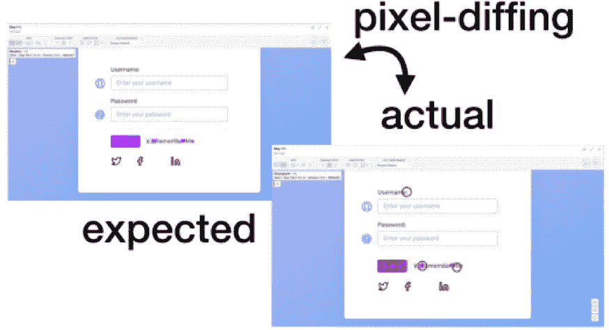
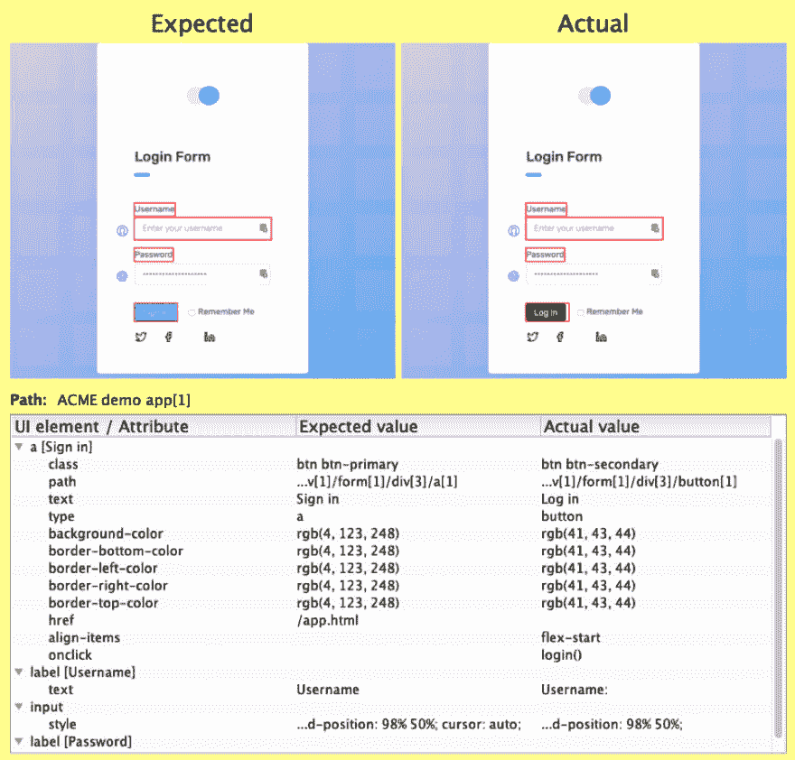
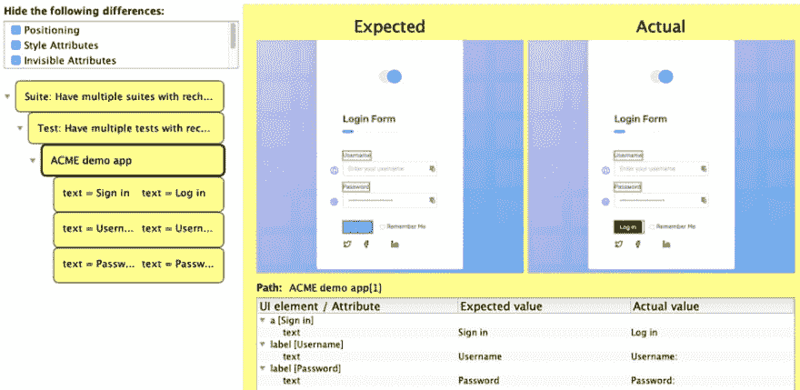
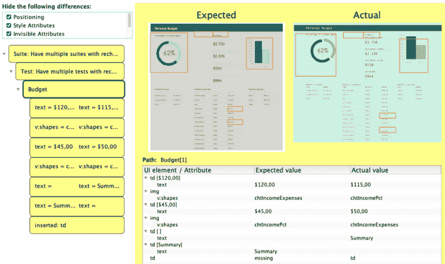

# 您的两个基本视觉回归测试选项

> 原文：<https://dev.to/roesslerj/your-2-basic-visual-regression-testing-options-13jg>

# 基于像素比较的视觉回归测试

当你看到网飞在他们的网站上有一个简单的视觉 bug，持续了[三个多月](https://twitter.com/beatngu1101/status/1126438865525514240/)(截至 2019 年 8 月的静物，访问[http://devices.netflix.com/en/](http://devices.netflix.com/en/)，网站视觉回归测试的趋势是可以理解的。这种方法可以防止意外的变化(因为编写断言是不可能的)，并且比基于断言的测试更加完整。目前大多数方法都是基于像素的，也就是说，它们逐个像素地比较页面截图。这很有道理:

*   纯像素区分工具的第一个版本很容易实现。
*   它适用于任何浏览器、app 或其他情况，只要能检索到截图。
*   它能立竿见影。

然而，基于像素的视觉回归测试也有一些缺点:

*   类似的变化不容易被识别:例如，如果网站的页眉或页脚发生变化，这将影响所有的测试。
*   您通常会得到很多误报，因为即使是很小的变化也会导致许多元素发生变化，例如位置。
*   过滤这些误报是很棘手的，因为它可能导致太多的误报(无关的变更被报告)或漏报(重要的变更被遗漏)。

在下面的例子中，你会看到这一切。演示工具使用人工智能算法来过滤伪像的差异。正如你所看到的，它既产生了假阴性——遗漏了“密码”后添加的冒号——也产生了假阳性—“记住我”复选框没有改变，只是整个移到了左边。

# 深度视觉回归测试

web 走了一条不同的路线，比较所有呈现的元素和它们各自的 CSS 属性。因此，与其报告页面像素不同，需要人工检查并解释差异，不如重新检查报告它们不同的确切方式:

如您所见，随着按钮的文本从“Sign in”变为“Log in”，元素的类型从`a`(一个链接)变为`button`。另外，班级从`btn-primary`变成了`btn-secondary`。对按钮的所有其他更改可能是最后两个更改的结果。如实报告了标签的变化(添加冒号)。

由于这些现在是与像素差异相反的语义变化，所以很容易添加规则和过滤器来处理它们。查看 GUI 和 CLI 都带有预定义的过滤器。例如，对于给定的情况，您可以选择忽略所有不可见的差异(类别、类型、背景颜色等)。).您也可以选择忽略对任何 CSS 样式属性的所有更改，只关注相关的内容更改(即文本)。

# 过滤变化

在更改登录按钮的情况下，过滤所有这些按钮将只显示下面的更改。

这个强大的机制可以让你快速关注与你相关的变化。这适用于 CSS 动画(尝试像素区分:[http://www.csszengarden.com/215/](http://www.csszengarden.com/215/))以及在布局上完全不同但在内容上完全不同的网站。通过这种机制，您可以很容易地忽略字体，但不能忽略文本或颜色，但不能忽略大小。
它让你看到这两者在内容上的不同:

甚至更好——您可以使用简单的类似 git 的语法创建自己的过滤器。例如，您可以使用`matcher: type=meta`过滤特定的元素(例如标签 meta 的元素)。要对属性进行全局过滤(如 class 属性)，请使用:`attribute=class`。要忽略特定元素的属性(如图像的 alt)，请使用:`matcher: type=img, attribute: alt`。也可以对元素或属性都使用 regex:`attribute-regex=data-.*`。

更多细节和示例可在[文档](https://docs.retest.de/recheck/how-ignore-works/)中找到。

在你自己的自动化测试中使用 recheck([https://retest.de/recheck-open-source/](https://retest.de/recheck-open-source/))或者使用 Chrome 扩展([https://retest.de/recheck-web-chrome-extension/](https://retest.de/recheck-web-chrome-extension/))进行演示。