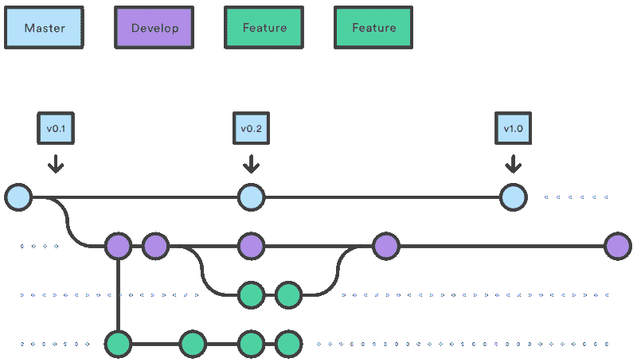
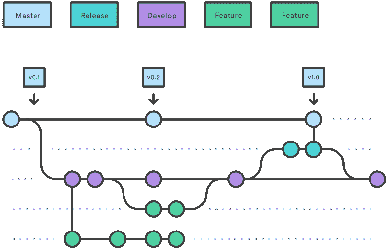
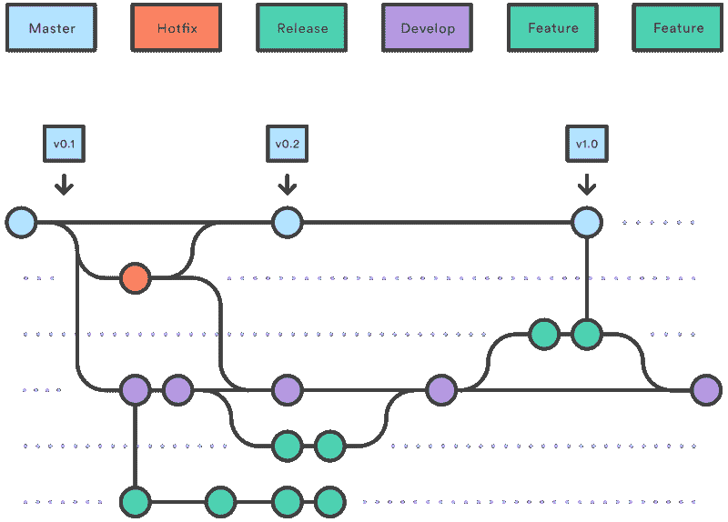

# Git 流:一个成功的 Git 分支模型

> 原文：<https://dev.to/heratpatel/git-flow-a-successful-git-branching-model-1j6f>

Gitflow 是一个 Git 工作流设计，由 nvie 的 Vincent Driessen 首次发布并广受欢迎。Gitflow 定义了一个围绕项目发布设计的严格的分支模型。这为管理大型项目提供了一个健壮的框架。

Gitflow 非常适合有预定发布周期的项目。除了[特征分支工作流](https://www.atlassian.com/git/tutorials/comparing-workflows/feature-branch-workflow)所要求的以外，该工作流没有添加任何新的概念或命令。相反，它将非常具体的角色分配给不同的分支，并定义它们应该如何以及何时交互。除了特性分支之外，它使用单独的分支来准备、维护和记录发布。当然，您还可以利用 Feature Branch 工作流的所有优势:拉请求、独立实验和更高效的协作。

## 入门

* * *

### 安装

*   对于 **MAC OS** : `brew install git-flow`
*   对于**窗口** : `https://git-scm.com/download/win`
*   对于 **Linux/Ubuntu** : `sudo apt-get install git-flow`

* * *

### 初始化

该工作流使用两个分支来记录项目的历史，而不是一个主分支。**主**分支存储官方发布历史，**开发**分支作为特性的集成分支。用版本号标记主分支中的所有提交也很方便。

1.  打开终端或命令提示符，进入你的项目目录(必须用 git 初始化)。
2.  运行`git flow init`

    它将询问一些关于不同分支的命名结构的问题。请像下面这样写答案。

    *   生产发布的分支名称:`master`
    *   “下一版本”开发的分支名称:`development`
    *   特色分支？:`feature/`
    *   Bugfix 分支？:`bugfix/`
    *   释放分支？:`release/`
    *   热修复分支？:`hotfix/`
    *   支持分支机构？:`support/`
    *   版本标签前缀？:`v`
    *   钩子和过滤器目录？:按下回车键

> **注:**以上选项可能会因操作系统而异。
> 在一些操作系统中，你不会发现**错误修复**或**支持**功能。但是你可以手动处理这些特性。

* * *

### 特征分支

特性分支用于为即将到来的或遥远的未来版本开发新特性。特性分支的本质是，只要特性在开发中，它就存在，但最终会被合并回开发或丢弃。

[](https://res.cloudinary.com/practicaldev/image/fetch/s--80ZOUids--/c_limit%2Cf_auto%2Cfl_progressive%2Cq_auto%2Cw_880/https://thepracticaldev.s3.amazonaws.com/i/gk3yk0u24k5849fplyy2.png)

#### 创建特征分支

*   运行`git flow feature start <<FEATURE_NAME>>`。
*   例如`git flow feature start authentication`，其创建分支**特征/认证**。
*   进行与该功能相关的更改，并将其推至原点。

#### 整理一个特征分支

*   运行`git flow feature finish <<FEATURE_NAME>>`。
*   例如`git flow feature finish authentication`，将**特征/认证**分支合并为**开发**分支，**将**本身从**本地**和**原点**中删除。

#### 汇总动作

*   创造了一个最新的**发展**分支。
*   完成**特征**分支后，并入**开发**分支，**从**本地**和**原点**删除**特征分支。

* * *

### 修复分支错误

bugfix 分支用于 bug/缺陷修复。

#### 创建一个 bugfix 分支

*   运行`git flow bugfix start <<BRANCH_NAME>>`。
*   例如`git flow bugfix start login-bug`，它创建分支**错误修复/登录错误**。
*   进行与 bug 相关的更改，并将其推送到原点。

#### 完成一个 bug 修复分支

*   运行`git flow bugfix finish <<BRANCH_NAME>>`。
*   例如`git flow bugfix finish login-bug`，将 **bugfix/login-bug** 分支合并到**开发**分支，**从**本地**和**原点**删除**自身。

#### 汇总动作

*   创造了一个最新的**发展**分支。
*   完成 **bugfix** 分支后，并入**开发**分支，**从**本地**和**原点**删除** bugfix 分支。

* * *

### 发布分支

发布分支支持新的产品发布的准备。它们允许为发布准备元数据(版本号、构建日期等)。).通过在一个发布分支上完成所有这些工作，开发分支就可以接收下一个大发布的特性了。

[](https://res.cloudinary.com/practicaldev/image/fetch/s--A57dbxFl--/c_limit%2Cf_auto%2Cfl_progressive%2Cq_auto%2Cw_880/https://thepracticaldev.s3.amazonaws.com/i/pyeszwkiezdk5owzq2tq.png)

#### 创建发布分支

*   运行`git flow release start <<VERSION_NUMBER>>`。
*   例如`git flow release start 0.0.1`，创建分支 **release/0.0.1** 。
*   进行与发布相关的更改，并将其推至原点。

#### 整理一个发布分支

*   运行`git flow release finish <<VERSION_NUMBER>>`。
*   如`git flow release finish 0.0.1`。
*   它将要求释放标签信息，写适当的标签描述。
*   例如

```
 ********************************************************
   V0.0.1
   - Integrated Authentication 
   - Implemented Login flow
   ******************************************************** 
```

Enter fullscreen mode Exit fullscreen mode

*   它创建标签 **v0.0.1** 。
*   **释放**分支并入**开发**和**主控**分支**从**本地**和**原点**删除**自身。
*   别忘了把**发展**和**主**推到**原点**。
*   在 **github / gitlab / bitbucket** 中创建一个**标签**，并提供一个**标签消息**。
*   在 **github / gitlab / bitbucket** 中创建一个 **release / change_log** ，并提供一个合适的 **release 消息**。
*   将您的更改从主版本部署到生产版本。
*   这有助于很好地记录您的发布历史。

#### 汇总动作

*   创造了一个最新的**发展**分支。
*   完成**发布**分支后，并入**主控**和**开发**分支，**从**本地**和**原点**删除**发布分支。
*   创建**发布标签**，帮助记录**发布历史**。

* * *

### 热修复分支

热修复分支非常类似于发布分支，因为它们也是为新的产品发布做准备，尽管没有计划。它们产生于对实时产品版本的不良状态立即采取行动的必要性。当必须立即解决生产版本中的关键错误时，可以从标记生产版本的主分支上的相应标记中分支出热修复分支。它用于发布后的维护或快速修补。

[](https://res.cloudinary.com/practicaldev/image/fetch/s--hFtoPgwf--/c_limit%2Cf_auto%2Cfl_progressive%2Cq_auto%2Cw_880/https://thepracticaldev.s3.amazonaws.com/i/wo935eqxtakkfylqzn7y.png)

#### 创建热修复分支

*   运行`git flow hotfix start <<VERSION_NUMBER>>`。
*   例如`git flow hotfix start 0.0.2`，创建分支 **hotfix/0.0.2** 。
*   进行与修补程序相关的更改，并将其推送到原始位置。

#### 完成一个热修复分支

*   运行`git flow hotfix finish <<VERSION_NUMBER>>`。
*   如`git flow hotfix finish 0.0.2`。
*   它将要求释放标签信息，写适当的标签描述。
*   例如

```
 ********************************************************
   V0.0.2
   - Quick patches
   ******************************************************** 
```

Enter fullscreen mode Exit fullscreen mode

*   它创建标签 **v0.0.2** 。
*   **Hotfix** 分支并入**开发**和 **master** 分支**从 **local** 和 **origin** 删除** it self。
*   别忘了把**发展**和**主**推到**原点**。
*   在 **github / gitlab / bitbucket** 中创建一个**标签**，并提供一个**标签消息**。
*   在 **github / gitlab / bitbucket** 中创建一个 **release / change_log** ，并提供一个合适的 **release 消息**。
*   将您的更改从主版本部署到生产版本。
*   这有助于很好地记录您的发布历史。

#### 汇总动作

*   创建到最新的**主**分支。
*   完成 **hotfix** 分支后，并入 **master** 和 **development** 分支，**从 **local** 和 **origin** 中删除** hotfix 分支。
*   创建**发布标签**，帮助记录**发布历史**。

* * *

### 支持分支

除了主分支 master 和 develop 之外，我们的开发模型使用各种支持分支来帮助团队成员之间的并行开发，简化功能跟踪，为产品发布做准备，并帮助快速修复实际生产问题。与主枝不同，这些分枝的寿命总是有限的，因为它们最终会被除去。

#### 创建支持分支

*   运行`git flow support start <<SUPPORT_BRANCH_NAME>> <<EXISTING/ORIGIN/PARENT_BRANCH_NAME>>`。
*   例如，`git flow support start stage-development development`从**开发**创建**支持/阶段开发**分支。
*   别忘了把支持分支推到原点。

#### 汇总动作

*   根据提供的现有分支创建。
*   我们可以使用的不同类型的分支有:
    *   特征分支
    *   释放分支
    *   修补程序分支

* * *

核心上，开发模型很大程度上受到了现有模型的启发。中央回购拥有两个无限期的主要分支:

*   掌握
*   发展

* * *

### 参考文献:

*   [https://www . atlassian . com/git/tutorials/comparising-workflows/git flow-workflow](https://www.atlassian.com/git/tutorials/comparing-workflows/gitflow-workflow)
*   [https://nvie.com/posts/a-successful-git-branching-model/](https://nvie.com/posts/a-successful-git-branching-model/)