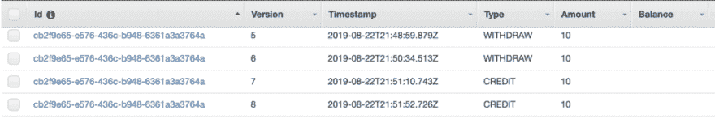
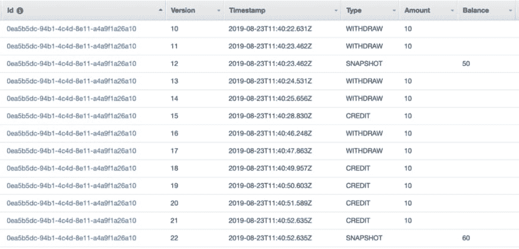
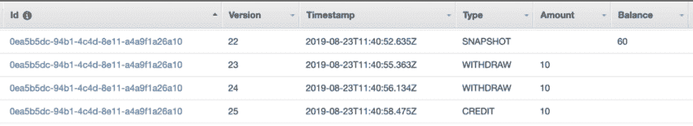
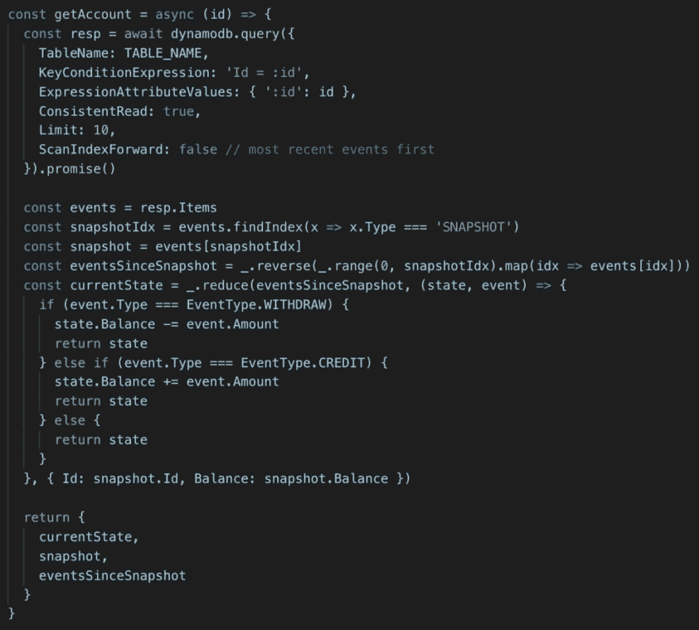
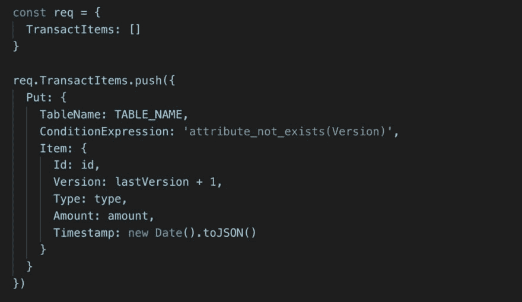
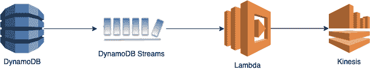
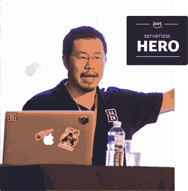

# 一个简单的事件源示例，使用 Lambda 和 DynamoDB 创建快照

> 原文：<https://dev.to/theburningmonk/a-simple-event-sourcing-example-with-snapshots-using-lambda-and-dynamodb-a5l>

最近，我一直在帮助一个客户实现一个基于事件的系统。在这个过程中，我做了一个非常简单的演示程序，可以在 GitHub [**这里**](https://github.com/theburningmonk/event-sourcing-demo) 找到。

该演示应用程序使用银行示例，用户可以:

*   创建一个帐户
*   查看他/她的余额
*   取钱
*   记入账户的贷方

DynamoDB 是数据存储。

### 事件

每当账户持有人从账户中提款或存款时，我都会记录一个事件。

这意味着当我需要计算账户的当前余额时，我必须从这些事件中建立账户的当前状态。

### 快照

关于事件源系统，人们问的一个常见问题是“如何避免在每次请求时读取大量数据？”

解决方案是不时地创建快照。在这个演示应用程序中，我确保有当前状态的常规快照。准确地说，表中每 10 行有一个快照。

这些快照允许我限制每次请求需要获取的行数。在这种情况下，我每次获取 10 个项目的成本是不变的。

### 重建当前状态

为了重建当前状态，我找到了最近的快照，并应用了自拍摄快照以来的事件。

例如，假设如下:

最近的快照是`Version` 22，而`Balance`是 60。从那以后已经有 3 场比赛了。所以现在的余额是 60–10–10+10 = 50。

下面是它在代码中的样子:

### 乐观锁定

为了防止对帐户的并发更新，`Version`属性被配置为`RANGE`键。每当我向 DynamoDB 表添加一个事件时，我都会检查该版本是否已经不存在。

### 优化

以降低端点的冷启动和升温性能。我应用了一些基本优化:

*   [为 AWS SDK 启用 HTTP keep-alive】](https://theburningmonk.com/2019/02/lambda-optimization-tip-enable-http-keep-alive/)
*   [不要引用完整的 AWS SDK](https://theburningmonk.com/2019/03/just-how-expensive-is-the-full-aws-sdk/)
*   [使用 webpack 捆绑功能](https://theburningmonk.com/2019/03/just-how-expensive-is-the-full-aws-sdk/)

### 将事件流传送给其他消费者

它没有包含在演示应用程序中，但您也可以通过以下方式将这些事件传输到其他系统:

a)让其他服务订阅 DynamoDB 表的流

b)创建另一个 Kinesis 流，将这些 DynamoDB `INSERT`事件转换成`AccountCreated`和`BalanceWithdrawn`等域事件。

我个人倾向于选项 b。它允许其他消费者处理域事件，并将它们从服务的实现细节中分离出来。

从这里，您还可以将 Kinesis 流连接到 Kinesis Firehose，将数据作为数据湖保存到 S3。然后，您可以使用 Athena 对所有历史数据运行复杂的特别查询，或者生成每日报告，或者提供给 QuickSight 中托管的 BI 仪表板。

### 进一步阅读

如果您想了解更多关于现实世界中的事件源(和规模！)，我推荐跟随 Rob Gruhl 的这个系列[。](https://medium.com/tech-at-nordstrom/adventures-in-event-sourced-architecture-part-1-cc21d06187c7)[第 2 部分](https://medium.com/tech-at-nordstrom/event-sourcing-at-nordstrom-part-2-f64c416d1885)有一些你可以使用的令人愉快的模式。你也应该看看他们的 [Hello-Retail](https://read.acloud.guru/serverless-event-sourcing-at-nordstrom-ea69bd8fb7cc) 演示应用。

嗨，我的名字是**崔琰**。我是一个 **[AWS 无服务器英雄](https://aws.amazon.com/developer/community/heroes/yan-cui/)** 和 [**量产无服务器**](https://bit.ly/production-ready-serverless) 的作者。我已经在 AWS 中运行了近 10 年的大规模生产工作负载，我是一名架构师或首席工程师，涉足从银行、电子商务、体育流媒体到移动游戏等多个行业。我目前是一名专注于 AWS 和无服务器的独立顾问。

你可以通过[邮箱](//mailto:theburningmonk.com)、[推特](https://twitter.com/theburningmonk)和 [LinkedIn](https://www.linkedin.com/in/theburningmonk/) 联系我。

雇用我。

帖子[一个使用 Lambda 和 DynamoDB](https://theburningmonk.com/2019/08/a-simple-event-sourcing-example-with-snapshots-using-lambda-and-dynamodb/) 的简单事件源示例首先出现在 theburningmonk.com[的](https://theburningmonk.com)上。

