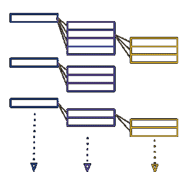
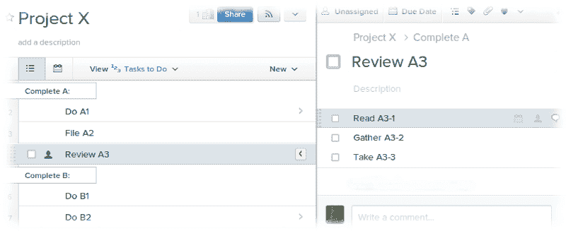
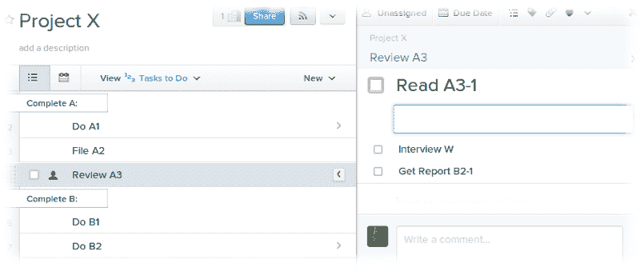
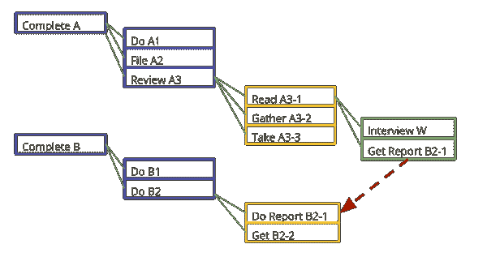
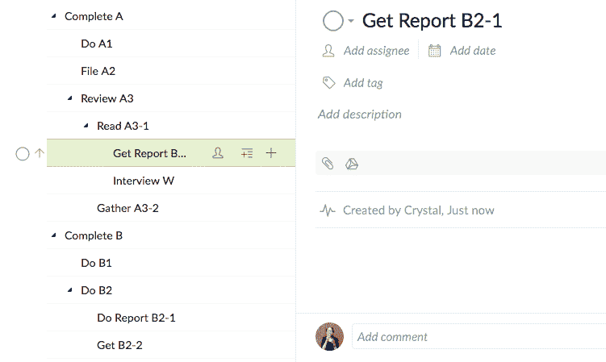
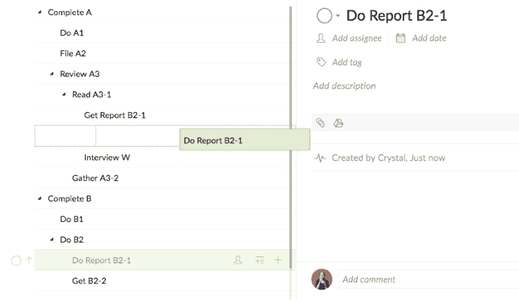

# 为什么我们放弃了待办事项清单

> 原文：<https://dev.to/olivier32621338/why-we-abandoned-the-to-do-list-561n>

大多数[任务管理软件](https://quire.io/compare/best-task-management-software-for-creative-teams)的核心是一个传统的待办事项列表，它存储了所有可能的任务。但是待办事项列表从来都不是为了处理隐藏在任务中的错综复杂的事情，这些事情保证了任务管理系统的治理。

* * *

> 待办事项列表的目的是什么？

当任务太多，我们无法很好地管理时，我们就开始写下它们。任务可以更好地优先化，并以书面或视觉形式跟踪其完成情况，以便它们在某种程度上变得“有形”。简单来说， ***待办事项清单帮助我们记忆(追踪)和比较(排列)我们的任务*** 。

* * *

> 但是在某些情况下，待办事项清单并不能达到它们的目的。

随着任务数量的增加，查看一个扩展的列表对我们比较和区分任务的优先级没有太大帮助。结果是一长串看起来同样重要的任务。清单上有大量同等重要的任务，这又一次让我们难以跟踪和排列任务。

当我们写下“不可比的”任务，形成一个异质的列表时，我们使得任务难以比较或排序。任务是“不可比较的”,因为它们的范围和背景差异太大；因此，对它们进行比较或排名是没有意义的。

例如，如果我们的任务清单上有“*阅读 n 页书 X* ”和“*获得驾驶执照*”，只有当我们理解阅读任务所属的上下文时，它们才会变得可比较。假设，我们记得“明天到期的项目”将要求我们首先消化第 X 本书中的那 n 页材料，然后我们可以权衡“明天到期的项目”和“*获得飞行员执照*”之间的优先级。因此，异构列表要求我们记住与每个任务相关的所有上下文，这将被证明是困难的。

不用穷尽所有可能的方法来伪造待办事项列表的有用性，让我们注意到，当任务的数量大到足以使它们同等重要时，或者当列表变得异构时*，待办事项列表不再足够。*

 ** * *

> 我们放在传统任务管理系统中的任务是否与这些限制相冲突？

范围大、持续时间长的任务不可避免地需要分解成更易管理的行动项目，以便能够执行。当一些大的任务被分解和扩展时，将会有其他的没有进行到它们生命周期的那个阶段，因此我们无意中创建了一个异类列表。混乱将会出现，直到所有的任务被分解成列表中的同质状态。到那时，膨胀的待办事项清单将变成一份同样重要的任务的冗长清单。需要任务管理系统治理的任务通常范围大，持续时间长。将这样的任务输入到传统的待办事项列表中不可避免地会使其变得异构，并且这些任务最终将演变成具有同等的重要性；这无形中降低了它们的重要性。T3】

* * *

> 任务管理软件如何处理待办事项的局限性？

鉴于这些限制，流行的解决方案是将原始的待办事项列表 ***分成几个其他的列表*** 。例如,“兄弟”任务通常被放入称为“子任务”的另一列表 中的**中，而“父”任务可以被指定给“部分”或其他同义词的列表** 中的 ***。***

一个更灵活的系统可以允许一个子任务承担它自己的子任务，这实际上是 ***无限期地将另一个列表附加到它自己*** 。该方案产生如下所示的分层结构:

灵活地将另一个子任务列表附加到任何给定的任务或另一个子任务，可以确保我们总是能够“放大”和分解任务。 ***这个过程产生了一个层次结构，这个层次结构又指示了它们的依赖关系*** 。因此，我们消除了同样重要的任务的简单列表的问题。因为** *我们现在有了任务的层次结构，我们可以这样组织任务，以便** *我们可以实现每个任务级别的同质性* **。

* * *

> 但是你如何传达嵌套的任务列表呢？

即使最灵活的任务管理工具允许不确定的层次结构，但是从 UI 设计的角度来看，显示嵌套列表是不实际的。

但是如果不显示层次结构中的所有任务，我们很容易会丢失监控任务所需的上下文。以下面的任务结构为例:

“完成 A”下的“获取 B2-1 报告”要求完成“完成 B”下的“做 B2-1 报告”。但是由于显示嵌套列表的限制，折衷的视图将显示:

或者

无论是哪种情况，我们都会完全错过“评审 A3”对“做 B2”的依赖，因为它属于隐藏在视图中的子任务列表。这两种观点都没有表达这样的上下文，即一个任务层次结构中的一个子任务依赖于另一个子任务。本质上，用户看到的仍然是原始形式的待办事项列表，但现在是多个，没有呈现任务的上下文和关系 。

* * *

### 我们的解决方案是在树形结构中保留任务的自然层次

***将列表链接在一起以形成必要的层次结构的问题******是列表作为单独的实体保存。*** 考虑到用户界面中的约束，显示传达上下文所需的列表数量是不可行的。

相反，我们认识到这种层次结构最好用树结构来表示。每个子任务都成为一个任务的子节点。 ***当一个任务被检索时，组成整个上下文*** 的所有父任务节点和子任务节点也被检索。

在这种结构下，任务及其依赖关系清晰地呈现在任务管理系统中。

一项任务开始时可能是一个粗略的目标，没有计划或背景知识来完成它。实现目标的必要步骤只有通过更多的思考和合作才能实现。

在我们计划和组织任务的过程中，用树节点表示的任务可以通过拖放根据它们的依赖关系轻松地重新排列，如下所示:

为了避免任务弄乱我们的视线并失去我们的注意力，我们可以简单地折叠与我们手头的直接任务无关的任务树。

* * *

待办事项列表帮助我们使我们的目标更加“有形”,但它从来没有成为任务管理软件的支柱。

嵌套的待办事项列表提供了逻辑层次来适应更复杂的任务，例如我们在需要团队工作和协作的项目中发现的那些任务。但是嵌套列表仍然是分开任务上下文的单独列表，这种上下文也不能有效地显示在用户界面中。

我们看到 ***一个树形结构的层次自然地捕捉到了任务如何在它们的生命周期*** 中演化。它提供了任务关系的鸟瞰图。一棵 ***任务树*** 作为一个任务管理系统更好的骨干。我们很想知道这个想法是否适合你；给任务树一个[试试](https://quire.io/)。*