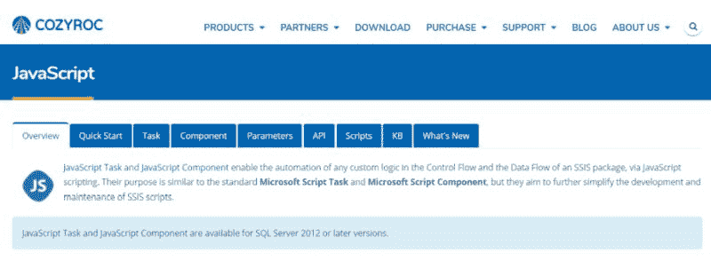

# 用 JavaScript - COZYROC 重新发明 SSIS 脚本

> 原文：<https://dev.to/cozyroc/reinventing-ssis-scripting-with-javascript-cozyroc-1k37>

SSIS 是自动化你的 ETL 场景的一个极好的平台。它提供了许多现成的有用的适配器和转换。此外，当你需要处理任何不寻常的事情时，你可以用 C#或 VB.NET 创建一个脚本。您可以充分利用。NET 框架，并满足任何特殊的要求。

尽管如此，每个使用过 SSIS 脚本的人都知道它有几个痛点:

*   将脚本升级到 SQL Server 的下一个版本并不容易，因为脚本很早就绑定到了当前的 SSIS 框架模块。
*   脚本代码被编译成中间语言(CIL)并作为每个包的一部分嵌入。这使得通过编程来设置或更改 SSIS 包中的脚本代码变得非常困难。

##### [JavaScript 任务](http://cozyroc.com/ssis/javascript-task)和 [JavaScript 组件](http://cozyroc.com/ssis/javascript-component)通过 JavaScript 脚本实现 SSIS 包的控制流和数据流中任何自定义逻辑的自动化。它们的目的类似于标准的微软脚本任务和微软脚本组件，但是它们旨在进一步简化 SSIS 脚本的开发和维护。

##### 您可以从 COZYROC 网站【http://cozyroc.com/ssis/javascript下载 JavaScript 任务和 JavaScript 组件。

[COZYROC SSIS+组件套件是](http://cozyroc.com/download)

*   在 Visual Studio 中免费进行测试和开发
*   支持 SQL Server 2005、2008、2012、2014、2016、2017、2019
*   200 多个可重复使用的组件

全文:[http://cozy roc . com/blog/reinventing-ssis-scripting-JavaScript](http://cozyroc.com/blog/reinventing-ssis-scripting-javascript)