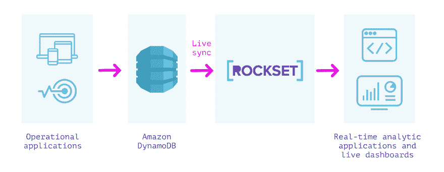
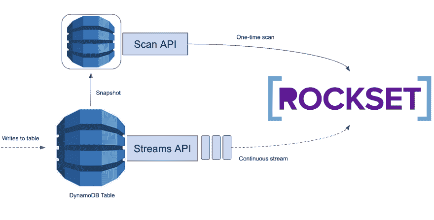
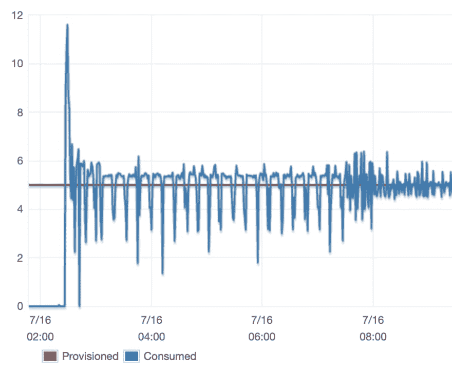
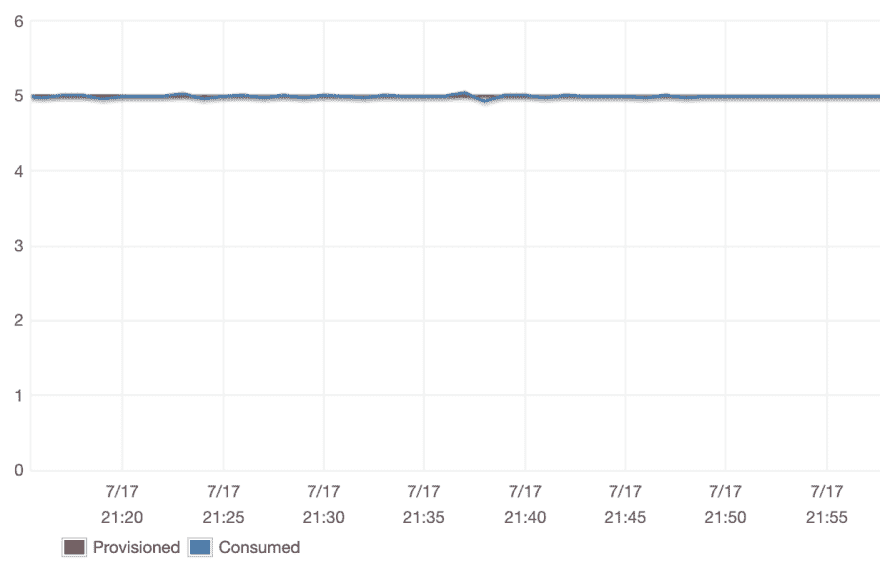
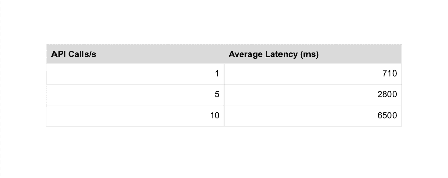
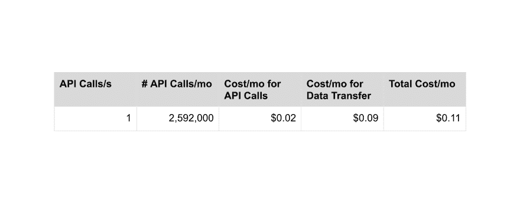

# 我们如何通过更高效地使用 DynamoDB 流和扫描来降低 DynamoDB 成本

> 原文：<https://dev.to/rocksetcloud/how-we-reduced-dynamodb-costs-by-using-dynamodb-streams-and-scans-more-efficiently-1173>

*作者[阿迪提·斯里尼瓦桑](https://www.linkedin.com/in/aditi-srinivasan-403076137/)T3】*

我们的许多用户使用 Rockset 作为 SQL 智能层，在 DynamoDB 上实施运营报告和分析，以服务于实时仪表盘和应用程序。作为一个工程团队，我们一直在寻找机会改善他们的 SQL-on-DynamoDB 体验。

[](https://res.cloudinary.com/practicaldev/image/fetch/s--tJNh1tl6--/c_limit%2Cf_auto%2Cfl_progressive%2Cq_auto%2Cw_880/https://images.ctfassets.net/1d31s1aajogl/2gcSBdWNCBZlR5knpIZ5C2/b243ad3fd5244421a1d3bb1fe3dd9394/dynamodb-12-rockset.jpg)

在过去的几周里，我们一直在努力调整我们的 [DynamoDB 摄取](https://docs.rockset.com/amazon-dynamodb/)进程的性能。这个过程的第一步是深入 DynamoDB 的文档并做一些实验，以确保我们使用 DynamoDB 的 read APIs 的方式能够最大限度地提高系统的稳定性和性能。

## DynamoDB API 背景

AWS 提供了一个[扫描 API](https://docs.aws.amazon.com/amazondynamodb/latest/developerguide/Scan.html) 和一个[流 API](https://docs.aws.amazon.com/amazondynamodb/latest/developerguide/Streams.html) ，用于从 DynamoDB 读取数据。Scan API 允许我们线性扫描整个 DynamoDB 表。这很昂贵，但有时是不可避免的。我们第一次将数据从 DynamoDB 表加载到 Rockset 集合时使用 Scan API，因为除了扫描数据之外，我们没有收集所有数据的方法。在这个初始加载之后，我们只需要监视更新，所以使用 Scan API 是非常浪费的。相反，我们使用 Streams API，它为我们提供了一个应用于 DynamoDB 表的按时间排序的更新队列。我们读取这些更新并将它们应用到 Rockset 中，让用户可以实时访问他们在 Rockset 中的 DynamoDB 数据！ [](https://res.cloudinary.com/practicaldev/image/fetch/s--QikGky8y--/c_limit%2Cf_auto%2Cfl_progressive%2Cq_auto%2Cw_880/https://images.ctfassets.net/1d31s1aajogl/2YM6aNY0S6fKT2VwRNz97B/d20af09fccadcee75bd7e6d4c5d2909a/image__2_.png) 鉴于 DynamoDB 等数据源带来的限制，我们面临的挑战是尽可能无缝、经济高效地将数据从 [DynamoDB 接收到 Rockset](https://rockset.com/blog/analytics-on-dynamodb-athena-spark-elastic/) 中。接下来，我将讨论我们在调整和稳定 DynamoDB 摄取过程的两个阶段时遇到的一些问题，同时保持用户的低成本。

## 扫描

### 我们如何衡量扫描性能

在扫描阶段，我们的目标是一致地最大化我们从 DynamoDB 的读取吞吐量，而每个表消耗的 [RCU](https://docs.aws.amazon.com/amazondynamodb/latest/developerguide/HowItWorks.ReadWriteCapacityMode.html) 不超过用户指定的数量。我们希望将数据高效地接收到 Rockset 中，而不干扰在用户的实时 DynamoDB 表上运行的现有工作负载。

### 了解如何设置扫描参数

从非常初步的测试中，我们注意到我们的扫描阶段花了相当长的时间来完成，所以我们做了一些挖掘来找出原因。我们将 DynamoDB 表放入 Rockset，观察扫描阶段发生了什么。我们期望持续消耗所有调配的吞吐量。

最初，我们的 RCU 消耗看起来如下: [](https://res.cloudinary.com/practicaldev/image/fetch/s--1qFHiYtS--/c_limit%2Cf_auto%2Cfl_progressive%2Cq_auto%2Cw_880/https://images.ctfassets.net/1d31s1aajogl/7mU36VvbPoDMFngSdagkd/361ba32f960f8a4c9dcdfb65832533ba/image__3_.png) 随着时间的推移，我们看到了 RCU 消耗中令人费解的波动水平，特别是在扫描的前半部分。这些波动是不好的，因为每次吞吐量大幅下降时，我们最终都会延长摄取过程并增加用户的 DynamoDB 成本。

问题很明显，但根本原因并不明显。当时，我们天真地控制了一些变量。DynamoDB 公开了两个重要的变量:[页面大小和段计数](https://aws.amazon.com/blogs/developer/rate-limited-scans-in-amazon-dynamodb/)，这两个变量我们都设置为固定值。我们也有自己的速率限制器，限制我们调用 DynamoDB Scan API 的次数。我们还将这个速率限制器执行的限制设置为一个固定值。我们怀疑，这些变量中的一个配置不佳，可能是我们观察到的大规模波动的原因。

一些调查显示，波动的原因主要是限速器。事实证明，我们在限速器上设置的固定限制太低了，所以我们被自己的限速器限制得太厉害了。我们决定通过基于分配给表的 RCU 量配置我们的限制器来解决这个问题。我们可以很容易地(并且确实计划)过渡到为每个表使用用户指定数量的 RCU，这将允许我们限制 Rockset 的 RCU 消耗，即使用户启用了 RCU 自动缩放。

```
public int getScanRateLimit(AmazonDynamoDB client, String tableName,
                            int numSegments) {
    TableDescription tableDesc = client.describeTable(tableName).getTable();
    // Note: this will return 0 if the table has RCU autoscaling enabled
    final long tableRcu = tableDesc.getProvisionedThroughput().getReadCapacityUnits();
    final int numSegments = config.getNumSegments();
    return desiredRcuUsage / numSegments;
} 
```

<svg width="20px" height="20px" viewBox="0 0 24 24" class="highlight-action crayons-icon highlight-action--fullscreen-on"><title>Enter fullscreen mode</title></svg> <svg width="20px" height="20px" viewBox="0 0 24 24" class="highlight-action crayons-icon highlight-action--fullscreen-off"><title>Exit fullscreen mode</title></svg>

对于每个分段，我们执行一次扫描，消耗速率限制器的容量，就像消耗 DynamoDB RCU 的一样。

```
public void doScan(AmazonDynamoDb client, String tableName, int numSegments) {
    RateLimiter rateLimiter = RateLimiter.create(getScanRateLimit(client, 
                                                 tableName, numSegments))
    while (!done) {
        ScanResult result = client.scan(/* feed scan request in */);
        // do processing ...
        rateLimiter.acquire(result.getConsumedCapacity().getCapacityUnits());
    }
} 
```

<svg width="20px" height="20px" viewBox="0 0 24 24" class="highlight-action crayons-icon highlight-action--fullscreen-on"><title>Enter fullscreen mode</title></svg> <svg width="20px" height="20px" viewBox="0 0 24 24" class="highlight-action crayons-icon highlight-action--fullscreen-off"><title>Exit fullscreen mode</title></svg>

我们新扫描配置的结果如下:
[](https://res.cloudinary.com/practicaldev/image/fetch/s--hizctDEc--/c_limit%2Cf_auto%2Cfl_progressive%2Cq_auto%2Cw_880/https://thepracticaldev.s3.amazonaws.com/i/82ykvr75meze3gxizj66.png)

我们很高兴地看到，通过我们的新配置，我们能够可靠地控制我们消耗的吞吐量。我们发现的速率限制器的问题揭示了我们对更动态的 DynamoDB 扫描配置的潜在需求。我们继续进行实验，以确定如何基于特定于表的数据动态设置页面大小和段数，但我们也着手处理我们在 DynamoDB 流中面临的一些挑战。

## 溪流

### **我们如何衡量流媒体性能**

在摄取的流阶段，我们的目标是在 DynamoDB 中应用更新后，最大限度地减少更新进入 Rockset 的时间，同时尽可能降低用户使用 Rockset 的成本。DynamoDB 流的主要成本因素是我们进行的 API 调用的数量。 [DynamoDB 的定价](https://aws.amazon.com/dynamodb/pricing/on-demand/)允许用户进行 250 万次免费 API 调用，并对超过这一数量的每 10 万次请求收取 0.02 美元。我们希望尽可能接近免费层。

以前我们以每秒 300 个请求的速度查询 DynamoDB，因为我们在读取的流中遇到了很多空碎片。我们相信，无论我们查询的速率是多少，我们都需要遍历所有这些空碎片。为了减轻我们给用户的 Dynamo 表(以及他们的钱包)带来的负担，我们为这些读取设置了一个计时器，然后如果我们没有找到任何新记录，就停止读取 5 分钟。鉴于这种机制最终会向那些在 DynamoDB 中甚至没有太多数据的用户收费，并且在最坏的情况下仍有 5 分钟的延迟，我们开始研究如何做得更好。

### **降低流式通话的频率**

我们运行了几个实验来阐明我们对 DynamoDB Streams API 的理解，并确定我们是否可以减少我们的用户被收费的 DynamoDB Streams API 调用的频率。对于每个实验，我们改变了 API 调用之间的等待时间，并测量了 DynamoDB 表的更新反映在 Rockset 中所花费的平均时间。

以每秒 2 条记录的恒定速率向 DynamoDB 表中插入记录，结果如下: [](https://res.cloudinary.com/practicaldev/image/fetch/s--dWyTf89---/c_limit%2Cf_auto%2Cfl_progressive%2Cq_auto%2Cw_880/https://images.ctfassets.net/1d31s1aajogl/62UIMPSvNFAWaCIMPiHbvz/7ee852076d07a80b7429c73a33b8255b/image.png) 以突发模式向 DynamoDB 表中插入记录，结果如下: [](https://res.cloudinary.com/practicaldev/image/fetch/s--dMGQUL6y--/c_limit%2Cf_auto%2Cfl_progressive%2Cq_auto%2Cw_880/https://images.ctfassets.net/1d31s1aajogl/2lhhr8hckzbDZQMZrMmBLv/3741ca9e7c4d04eca5ae21ab2ee5aeae/image.png) 以上结果表明，每秒进行 1 次 API 调用足以确保我们维持亚秒级延迟。我们最初的假设是错误的，但这些结果照亮了前进的道路。我们迅速修改了我们的摄取过程，每秒只查询一次 DynamoDB 流中的新数据，以便以更低的成本为用户提供我们想要的性能。

### **计算我们的成本削减**

由于使用 DynamoDB 流，我们直接负责我们的用户成本，我们决定需要精确计算由于我们使用 DynamoDB 流的方式而导致的用户成本。有两个因素完全决定了对 DynamoDB 流向用户收取的费用:进行的流 API 调用的数量和传输的数据量。传输的数据量很大程度上超出了我们的控制。每个 API 调用响应不可避免地传输少量(768 字节)数据。剩下的都是用户数据，只读入 Rockset 一次。我们专注于控制我们对用户表进行的 DynamoDB 流 API 调用的数量，因为这在以前是我们用户 DynamoDB 成本的驱动因素。

以下是我们对新改造的摄取流程的成本估算: [](https://res.cloudinary.com/practicaldev/image/fetch/s--joc1Vunn--/c_limit%2Cf_auto%2Cfl_progressive%2Cq_auto%2Cw_880/https://images.ctfassets.net/1d31s1aajogl/6rob5j3EvnlskD3Y9m4kao/7355321cf505d5a85005eeb238e9566a/image.png) 我们很高兴地看到，通过我们的优化，我们的用户几乎不会因为 Rockset 而在 DynamoDB 表上产生额外的成本！

## 结论

我们真的很兴奋，我们所做的工作已经成功地为我们的用户降低了 DynamoDB 的成本，同时允许他们在 Rockset 中与他们的 DynamoDB 数据进行实时交互！

这只是我们在努力尽可能无缝地将数据从 DynamoDB 接收到 Rockset 时所面临的一些挑战和权衡的一瞥。如果您有兴趣了解更多关于如何使用 Rockset 操作您的 DynamoDB 数据的信息，请查看我们的一些[最新资料](https://rockset.com/blog/tableau-operational-dashboards-reporting-dynamodb-redshift-athena/)，并关注我们继续构建 Rockset out 的更新！