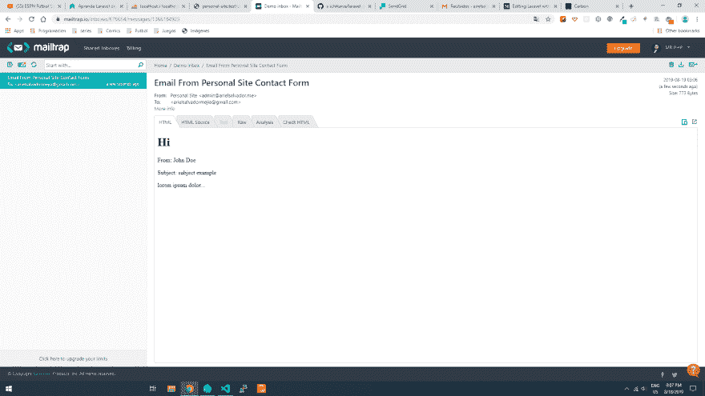
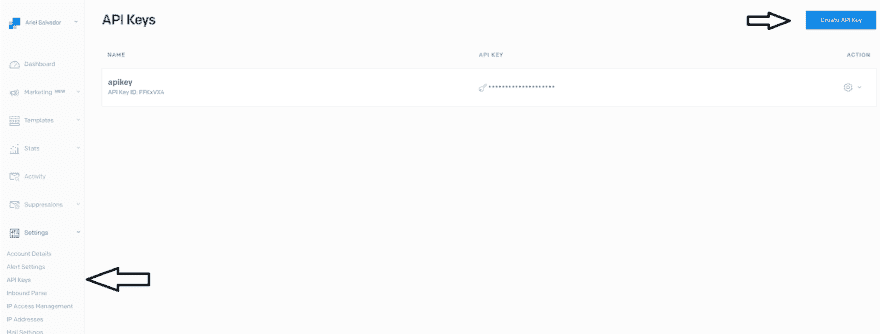
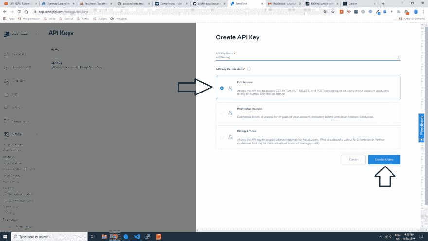

# 用 Mailtrap.io 和 Sendgrid 设置 Laravel 邮件程序。

> 原文：<https://dev.to/arielmejiadev/set-laravel-mailer-with-mailtrap-io-and-sendgrid-1n4a>

# 为日志设置邮件

要添加电子邮件设置，Laravel 提供了一个。env "文件，我们需要编辑:

```
MAIL_DRIVER=log
MAIL_HOST=smtp.mailtrap.io
MAIL_PORT=2525
MAIL_USERNAME=<mailtrapuser>
MAIL_PASSWORD=<mailtrappassword>
MAIL_ENCRYPTION=null
MAIL_FROM_ADDRESS=admin@yourapp.co
MAIL_FROM_NAME=YourApp 
```

要尝试，您可以使用 artisan 命令“make:auth”中的“忘记密码”链接。

转到“存储/日志”目录，你会发现日志文件，在文件的最底部，你可以看到你的电子邮件的代码预览。

* * *

# 用 Mailtrap.io 为开发设置邮件

您只需要添加“smtp”作为驱动程序，并添加您的用户名和密码 mailtrap.io 您可以创建一个免费帐户，并再次尝试提交另一个联系形式。

```
MAIL_DRIVER=smtp
MAIL_HOST=smtp.mailtrap.io
MAIL_PORT=2525
MAIL_USERNAME=<mailtrapuser>
MAIL_PASSWORD=<mailtrappassword>
MAIL_ENCRYPTION=null
MAIL_FROM_ADDRESS=admin@yourapp.co
MAIL_FROM_NAME=YourApp 
```

如果一切正常，您可以访问您的 mailtrap.io 收件箱，您将会看到如下内容:

[](https://res.cloudinary.com/practicaldev/image/fetch/s--QcHWc8_g--/c_limit%2Cf_auto%2Cfl_progressive%2Cq_auto%2Cw_880/https://thepracticaldev.s3.amazonaws.com/i/9lls7yabx88sr6xkn5g7.png)

你现在可以使用 mailtrap 来设置你所有的电子邮件。

* * *

# 为生产设置邮件

首先我们需要安装一个包[https://github.com/s-ichikawa/laravel-sendgrid-driver](https://github.com/s-ichikawa/laravel-sendgrid-driver)安装它你只需要下一个命令

```
$ composer require s-ichikawa/laravel-sendgrid-driver 
```

当软件包安装完成后，我们需要在“config/service.php”目录下添加服务。

```
'sendgrid' => [
  'api_key' => env('SENDGRID_API_KEY'),
], 
```

现在我们需要改变”。env "文件添加 SendGrid 值，您可以在[https://app.sendgrid.com](https://app.sendgrid.com)使用免费帐户登录，并免费获得 100 封每月电子邮件，或者获得更多的付款计划。

“登录”或“注册”的用户名和密码将用于”。env”文件，并生成一个“apikey”你可以去设置侧边栏，点击“API keys”选项，然后按下蓝色按钮“创建 API Key”，你可以设置任何名称的 API 键，并在“API key permissions”默认情况下是选择“完全访问”，所以创建它与“完全访问”。

[](https://res.cloudinary.com/practicaldev/image/fetch/s--G_PLXq8z--/c_limit%2Cf_auto%2Cfl_progressive%2Cq_auto%2Cw_880/https://thepracticaldev.s3.amazonaws.com/i/yo9u7l9yx4hsnjq5fzgu.png)

[](https://res.cloudinary.com/practicaldev/image/fetch/s--lhbGKMmO--/c_limit%2Cf_auto%2Cfl_progressive%2Cq_auto%2Cw_880/https://thepracticaldev.s3.amazonaws.com/i/exjnvwjax2gjrwm379ag.png)T3】

```
MAIL_DRIVER=smtp
SENDGRID_API_KEY='apikeyAsString'
MAIL_HOST=smtp.sendgrid.net
MAIL_PORT=587
MAIL_USERNAME=<sendgridUser>
MAIL_PASSWORD=<sendgridPassword>
MAIL_ENCRYPTION=tls
MAIL_FROM_ADDRESS=admin@yourapp.co
MAIL_FROM_NAME=YourApp 
```

现在，您可以管理不同的开发和生产环境。记住，免费计划的 sendgrid 每月只能处理 100 封邮件。