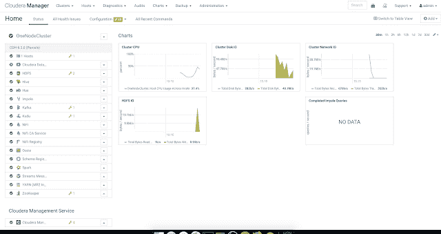
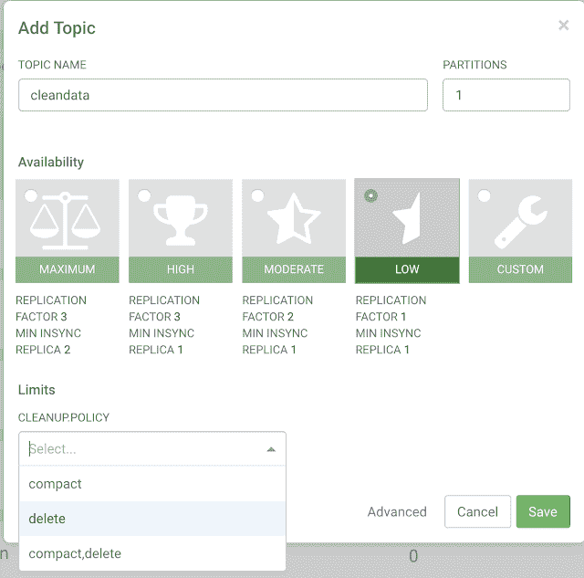
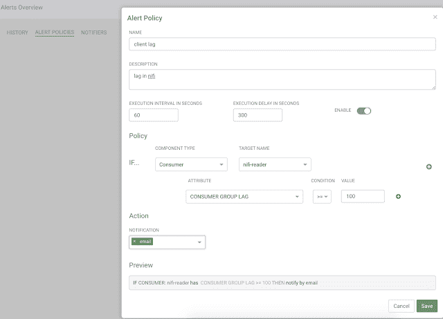
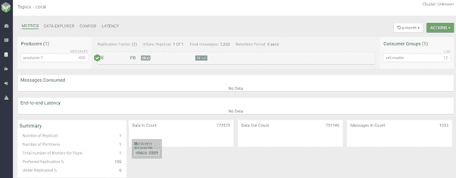
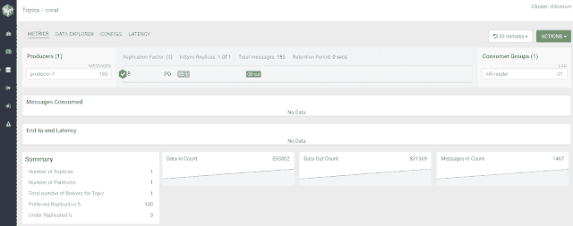
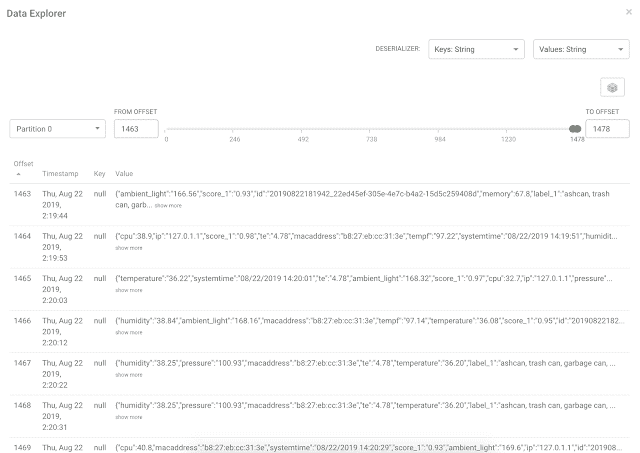
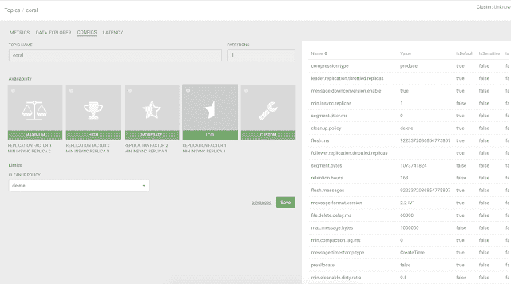

# 使用 cloud era Streams Messaging Manager 进行 Apache Kafka 监控、管理、分析和 CRUD

> 原文：<https://dev.to/tspannhw/using-cloudera-streams-messaging-manager-for-apache-kafka-monitoring-management-analytics-and-crud-41fb>

#### 使用 cloud era Streams Messaging Manager 进行 Apache Kafka 监控、管理、分析和 CRUD

SMM 是一个强大的工具，可以与阿帕奇卡夫卡一起工作，并为您提供监控，管理，分析和创建卡夫卡主题。您将能够监控服务器，经纪人，消费者，生产者，主题和消息。您还可以根据这些实体可能发生的各种事件轻松构建警报。

通过 Cloudera Manager，我们现在可以安装和管理 Kafka、SMM、NiFi 和 Hadoop 服务。

让我们创建一个卡夫卡主题，没有命令行！

对于一个简单的主题，我们为复制因子和**副本**计数**选择低大小。我们还设置了**删除**的清理策略。**

让我们创建一个**警报。**

对于这一点，如果 nifi-reader 消费者群体有延迟，请给我发电子邮件。

让我们在 AWS Cloudera Kafka 集群中浏览我们的 Kafka 基础架构，这样很容易导航。

你可以深入到一个主题中，查看单个消息，看到偏移量、键、值、时间戳等等。

放大主题中的一条消息。

让我们分析一个主题的配置。

我们构建的**警报**的结果是一封发送给我的电子邮件，其中包含以下数据:

**示例警报已发送**

通知 id:56d 35 DCC-8fc 0-4c 59-b70a-ccbd 1 bb 35681，

根资源名称:nifi-reader，

根资源类型:消费者，

创建时间戳:周四 8 月 22 日 18:42:41 UTC 2019 : 1566499361366，

最后更新时间戳:周四 8 月 22 日 18:42:41 UTC 2019

**消息:**

预警策略:“如果(CONSUMER(name = " nifi-reader ")CONSUMER _ GROUP _ LAG>= 100)被评估为真，则发出预警”条件:“CONSUMER_GROUP_LAG > =100”被评估为真，用于以下消费者- CONSUMER = "nifi-reader”具有以下属性值* CONSUMER_GROUP_LAG = 139

#### 软件

*   CSP 2.1
*   CDH 6.3.0
*   Cloudera 模式注册中心 0.80
*   CFM
*   Apache NiFi 注册表 0.3.0
*   Apache NiFi 1.9.0.1.0 版
*   JDK 1.8

#### **资源**

*   [https://www.cloudera.com/products/cdf/csp.html](https://www.cloudera.com/products/cdf/csp.html)
*   [https://docs . Horton works . com/HDP documents/CSP/CSP-1 . 0 . 0/index . html](https://docs.hortonworks.com/HDPDocuments/CSP/CSP-1.0.0/index.html)
*   [https://docs . Horton works . com/HDP documents/SMM/SMM-1 . 2 . 1/monitoring-Kafka-clusters/content/SMM-monitoring-clusters . html](https://docs.hortonworks.com/HDPDocuments/SMM/SMM-1.2.1/monitoring-kafka-clusters/content/smm-monitoring-clusters.html)