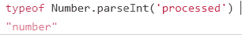
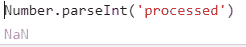
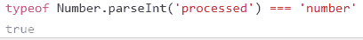

# 南是什么类型的？

> 原文：<https://dev.to/clarity89/what-is-the-type-of-nan-815>

*这篇文章最初发表在我的[个人博客](https://claritydev.net/blog/what-is-the-type-of-nan)T3 上。*

我最近在堆栈溢出上回答了一个有趣的关于`NaN`类型的[问题](https://stackoverflow.com/q/57546335/4468021)。

<header>

#  [非字母数字字符串的 Number.parseInt 给出一种类型的‘数字’](https://stackoverflow.com/questions/57546335/number-parseint-of-a-not-alphanumeric-string-gives-a-typeof-number)

Aug 18 '19 Comments: 2 Answers: 2[1](https://stackoverflow.com/questions/57546335/number-parseint-of-a-not-alphanumeric-string-gives-a-typeof-number) </header>

这就是正在发生的事情

`typeof Number.parseInt('processed')`打印`'number'`。

[](https://i.stack.imgur.com/1mpaI.png)

* * *

但是如果`Number.parseInt('processed')`给`NaN`。

[](https://i.stack.imgur.com/gVVgV.png)

[](https://i.stack.imgur.com/VxmeL.png)

<button class="ltag__stackexchange--btn" type="button">[Open Full Question](https://stackoverflow.com/questions/57546335/number-parseint-of-a-not-alphanumeric-string-gives-a-typeof-number)</button>

事实上，如果你在你的浏览器控制台输入`typeof NaN === 'number'`你会得到真的。对答案的评论让我意识到这不是 JavaScript 的另一个怪癖，事实上这是所有实现浮点运算 IEEE 标准 (IEEE 754)的编程语言的标准特性。

例如，在 Ruby 中，`NaN`可以是`Float`或`BigDecimal`的实例。

事实上，如果我们看一下 [ECMA-262，第 10 版](https://www.ecma-international.org/ecma-262/10.0/index.html)，ECMAScript 语言规范，[第 4.3.21 节](https://www.ecma-international.org/ecma-262/10.0/index.html#sec-terms-and-definitions-number-type)声明数字类型表示“一组所有可能的数字值，包括特殊的“非数字”(NaN)值、正无穷大和负无穷大”。在下面的几个小节中，[第 4.3.24 节](https://www.ecma-international.org/ecma-262/10.0/index.html#sec-terms-and-definitions-nan)阐明了 NaN 是一个“IEEE 754-2008 的数值”，而不是一个“数值”。

##### 那么这个 IEEE 754 标准是什么呢？

首次发表于 1985 年，其主要目的是提供一种具有浮点数的计算方法，该方法将具有相同的结果，而与处理完成的环境无关，无论该环境是软件、硬件还是两者的混合。除了为计算机编程环境中的浮点运算指定格式和方法，IEEE 754 还定义了一组特殊值:`0` ( `-0`和`+0`是不同的值，尽管它们都相等；这里有一篇[深入的文章](https://2ality.com/2012/03/signedzero.html)关于 JS 中的零值、[反规格化数](https://en.wikipedia.org/wiki/Denormal_number)、正负数`Infinity`和`NaN`，标准将它们描述为不能在计算系统中表示的数字数据类型。事实上，IEEE 754 定义了两种类型的`NaN`——安静的`NaN` ( `qNaN`)和发信号的`NaN` ( `sNaN`)。两者最重要的区别是`sNaN`在算术运算中使用时会引发异常而`qNaN`不会。似乎在 JavaScript 中所有的`NaN`都是安静的，至少我找不到任何相反的信息。

此外，该标准定义了特殊操作及其结果的有趣列表:

```
number ÷ Infinity               = 0
number ÷ -Infinity              = -0

±Infinity × ±Infinity           = ±Infinity
±non zero number ÷ ±0           = ±Infinity
number × ±Infinity              = ±Infinity
Infinity + Infinity             = ±Infinity
Infinity – -Infinity            = +Infinity
-Infinity – Infinity            = Infinity
-Infinity + – Infinity          = Infinity

±0 ÷ ±0                         = NaN
±Infinity ÷ ±Infinity           = NaN
±Infinity × 0                   = NaN
NaN == NaN (also '===' in JS)   //False 
```

##### 测试 NaN 值

JavaScript 没有单一的`NaN`值，事实上，根据 [ECMA-262](https://www.ecma-international.org/ecma-262/10.0/index.html#sec-ecmascript-language-types-number-type) ，IEEE 标准有“9007199254740990(即 253 - 2)个不同的“非数字”值[...]在 ECMAScript 中表示为单个特殊 NaN 值。在一些实现中，外部代码可能能够检测各种非数字值之间的差异，但是这种行为是依赖于实现的；对 ECMAScript 代码来说，所有 NaN 值都是无法区分的。

因为`NaN`不等于自身(事实上在一些编程语言中，自比较是一种广泛使用的测试`NaN` s 的方法)，我们需要使用一种特殊的`Number.isNaN()`或`isNaN()`方法来检测`NaN` s。两者的区别在于，如果值当前为`NaN`或**，则`isNaN()`返回`true`，如果值当前为`NaN`，则强制为数值**后将为 NaN，只有当值当前为`NaN`时`Number.isNaN()`才会返回`true`。一般来说，`Number.isNaN()`更准确，因为它也检查值的类型是否是数字。 [MDN](https://developer.mozilla.org/en-US/docs/Web/JavaScript/Reference/Global_Objects/NaN#Testing_against_NaN) 有一个关于测试 NaN 的简单解释。

将“非数字”值作为一种数字类型是非常不合逻辑的，也许更好的名称应该是“非实数”或类似的名称。然而，在这种情况下，这在 JavaScript 中并不是一种奇怪的行为，而是一种通用的编程原则。

对这篇文章有任何问题/评论或其他类型的反馈吗？请在评论中或在 Twitter 上告诉我。