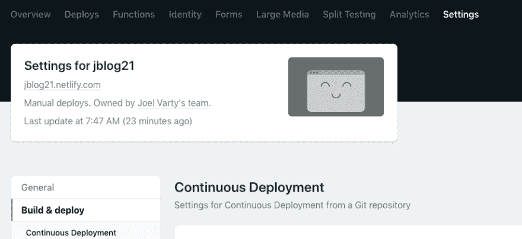
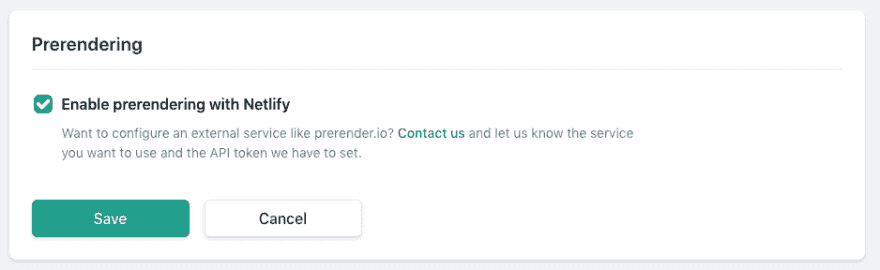
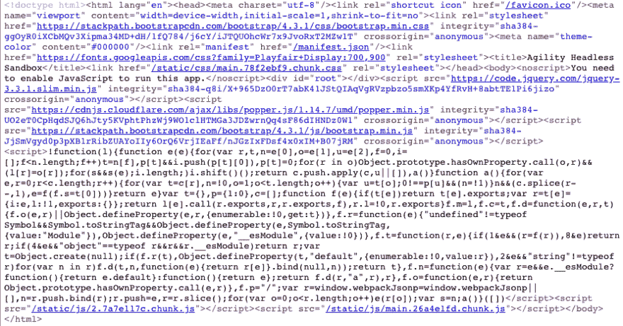
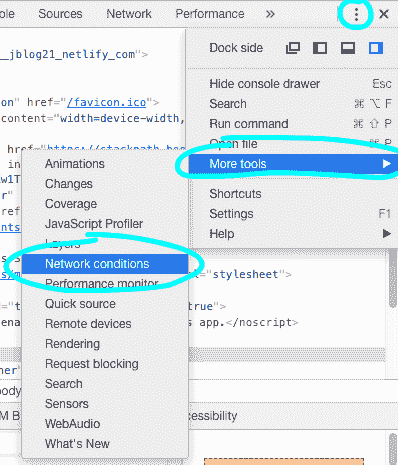
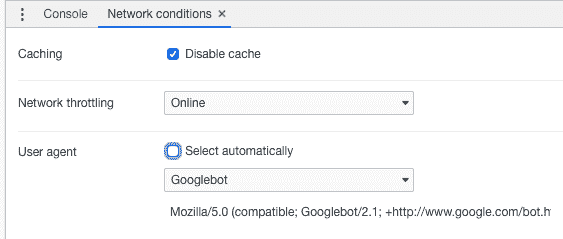
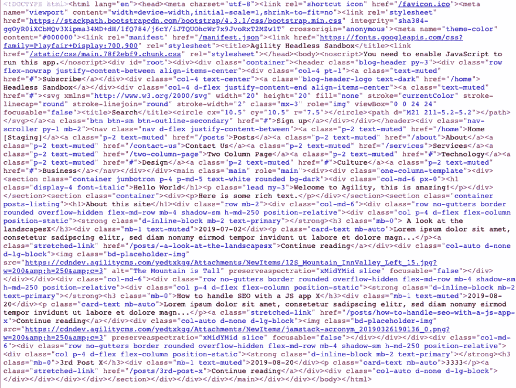

# 使用 netlify 更好地冒充您的 spa

> 原文：<https://dev.to/joelvarty/prerender-your-spa-using-netlify-for-better-seo-3h87>

对于那些编写和部署了 ReactJS SPAs(单页应用程序)却发现他们没有最好的 SEO 的人来说，这篇文章是为你准备的。

有一个非常简单的修复方法，不需要打开服务器端渲染。

首先，如果你没有尝试过 Netlify，我鼓励你这样做。这是一项可以免费运行的服务，它直接与 Github 集成——你甚至可以使用你的 Github 证书登录。

我的朋友 James Vidler 有一篇非常好的文章，描述了如何从命令行使用 cli 将你的站点部署到 netlify。

基本上就这么简单——假设您的构建输出在/build 目录中:

```
> npm run build
> npm install -g netlify-cli
> netlify login
> netlify deploy --dir=build --open 
```

Enter fullscreen mode Exit fullscreen mode

我鼓励你阅读维德勒关于这方面的文章。一旦你这样做了，如果你真的登录到 Netlify 本身，一旦你点击设置>构建&部署
[](https://res.cloudinary.com/practicaldev/image/fetch/s--f1fzPsp1--/c_limit%2Cf_auto%2Cfl_progressive%2Cq_auto%2Cw_880/https://thepracticaldev.s3.amazonaws.com/i/i7mmm1cdmnjnvk2nw7r5.png) ，你会看到一些额外的设置

向下滚动，直到看到预渲染部分。
[T3】](https://res.cloudinary.com/practicaldev/image/fetch/s--Wk1M1spO--/c_limit%2Cf_auto%2Cfl_progressive%2Cq_auto%2Cw_880/https://thepracticaldev.s3.amazonaws.com/i/u4gn3c6deoyxzv180hnu.png)

这项服务在 Netlify 上有记录，但总的来说，只要检测到一个机器人试图攻击你的网站，它就会得到一个网站的预渲染版本。

作为一个例子，下面是我的测试 SPA 通常的来源:
[](https://res.cloudinary.com/practicaldev/image/fetch/s--DkFlTC6M--/c_limit%2Cf_auto%2Cfl_progressive%2Cq_auto%2Cw_880/https://thepracticaldev.s3.amazonaws.com/i/t3v9v3z977yspne653pc.png)

退一步说，它对 SEO 不太友好。

现在让我们使用 Chrome 的开发工具来设置我的用户代理，我们可以假装是谷歌搜索机器人。你必须打开“网络条件”标签来做到这一点。
[T3】](https://res.cloudinary.com/practicaldev/image/fetch/s--H272NQ2G--/c_limit%2Cf_auto%2Cfl_progressive%2Cq_auto%2Cw_880/https://thepracticaldev.s3.amazonaws.com/i/60rg2f3abi826p0xgt5e.png)

现在，您可以轻松地设置您的用户代理。
[T3】](https://res.cloudinary.com/practicaldev/image/fetch/s--JKgidr__--/c_limit%2Cf_auto%2Cfl_progressive%2Cq_auto%2Cw_880/https://thepracticaldev.s3.amazonaws.com/i/o4y75dhwmu3qh7ujeiob.png)

让我们刷新同一个页面，看看会得到什么。

在 SEO 方面看起来好多了。
[T3】](https://res.cloudinary.com/practicaldev/image/fetch/s--mW9RoTOj--/c_limit%2Cf_auto%2Cfl_progressive%2Cq_auto%2Cw_880/https://thepracticaldev.s3.amazonaws.com/i/hvt03wan8v3ym2jc8528.png)

现在，只要你表现得体

tags and content, you should be good to go!

* * *

仅供参考-我为 [Agility CMS](https://agilitycms.com/) 工作-免费使用 React + Netlify！