# LambdaTest 现在与在线应用程序移动网络自动化网格一起运行

> 原文：<https://dev.to/lambdatest/lambdatest-is-now-live-with-online-appium-mobile-web-automation-grid-4egb>

2019 年初，我们制作了第一个发布 LambdaTest online Selenium Grid 的 live，拥有 2000+桌面浏览器和操作系统组合。它使您能够自动化跨浏览器测试体验，并以比以前更快的速度向您的受众交付无缝网站。

从那时起，我们一直在努力扩展我们的平台，为 CI/CD、项目管理、无代码自动化等第三方应用带来更多集成，以帮助您在我们的云上使用 Selenium 执行[自动化测试时带来最大的便利和生产力。然而，有一个问题经常被推到我们的支持。](https://www.lambdatest.com/selenium-automation?utm_source=dev&utm_medium=Blog&utm_campaign=Harshit-22082019&utm_term=Harshit)

> "我们什么时候能获得移动网络体验的自动化测试？"

好吧，我们很高兴地通知你，等待终于结束了！！今天，LambdaTest 将使用 Appium 网格来帮助客户大规模执行移动 web 自动化测试。

## 我们的 Appium 网格提供了什么？

我们的 Appium 网格将提供我们的云上 Selenium 网格所提供的一切。你将在 2000 多个真实的浏览器和浏览器版本上进行测试。只是现在，您将有更多的设备进行测试。以前，您只能在桌面设备上测试您的 web 应用程序以进行自动化的跨浏览器测试，而现在，您也可以在移动设备上执行 Selenium 自动化测试！

我们的 Appium 网格也与支持我们的 Selenium 网格的每个测试自动化框架兼容。

LambdaTest Appium Grid 还集成了我们的云 Selenium 网格中可用的所有第三方工具。

[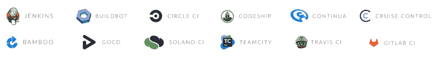](https://res.cloudinary.com/practicaldev/image/fetch/s--Z4ohaG19--/c_limit%2Cf_auto%2Cfl_progressive%2Cq_auto%2Cw_880/https://cdn.lambdatest.com/blog/wp-content/uploads/2019/08/cicd-tools.png)

[检查所有 LambdaTest 集成](https://www.lambdatest.com/integrations?utm_source=dev&utm_medium=Blog&utm_campaign=Harshit-22082019&utm_term=Harshit)

## 如何声明我想要的移动 Web 自动化功能？

如果您一直在使用 LambdaTest 提供的 Selenium Grid 执行自动化测试，那么您应该已经知道我们的[Selenium Desired Capabilities Generator](https://www.lambdatest.com/capabilities-generator/?utm_source=dev&utm_medium=Blog&utm_campaign=Harshit-22082019&utm_term=Harshit)，它根据您期望的测试需求为您提供要在测试套件中声明的编程值。这些值指定了我们的云服务器关于您希望运行测试的测试环境细节。

我们在 LambdaTest Desired Capabilities Generator 中嵌入了一个名为 Appium 的新标签，以帮助您获取移动 web 自动化测试所需的值。

[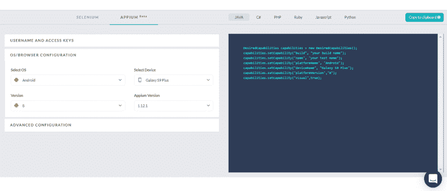](https://res.cloudinary.com/practicaldev/image/fetch/s--2pbF7RjF--/c_limit%2Cf_auto%2Cfl_progressive%2Cq_auto%2Cw_880/https://cdn.lambdatest.com/blog/wp-content/uploads/2019/08/capabilitie-generator.png)

**注意:**不要忘记选择您希望运行移动 web 自动化测试套件的正确语言。

## LambdaTest 的自动化控制台有什么变化吗？

为了避免任何歧义，并保持事情简单。我们没有在 LambdaTest 上的自动化仪表板和控制台中执行任何应用内更改。也就是说，您只需访问自动化仪表板，就可以在同一个屋檐下找到您的 Appium & Selenium 测试套件。

### 时间轴

在时间线下面，您会发现 Selenium 和 Appium 的测试构建被集中列出。当您点击一个测试构建时，您将会找到相应的测试样本以及测试它们的环境细节。下面是在 Appium 网格上运行的测试版本的截图。您可以注意到“环境”选项卡下的(移动设备+操作系统)配置。

[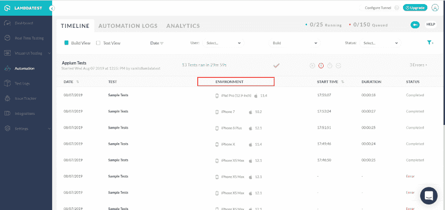](https://res.cloudinary.com/practicaldev/image/fetch/s--zH4PaTse--/c_limit%2Cf_auto%2Cfl_progressive%2Cq_auto%2Cw_880/https://cdn.lambdatest.com/blog/wp-content/uploads/2019/08/test-suite-env.png)

### 自动化日志

自动化日志将有助于详细了解移动 web 自动化测试的测试构建执行情况。您可以在左侧和右侧找到测试环境的详细信息，您可以找到自动化测试脚本、命令日志、网络日志、应用程序日志、元数据、异常等等的视频记录。

[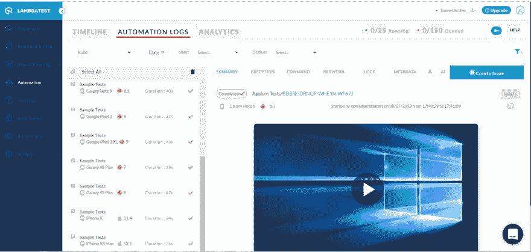](https://res.cloudinary.com/practicaldev/image/fetch/s--5C4mnIdY--/c_limit%2Cf_auto%2Cfl_progressive%2Cq_auto%2Cw_880/https://cdn.lambdatest.com/blog/wp-content/uploads/2019/08/automation-logs.png)

如果您切换到 metadata 选项卡，那么您会发现下载录制的视频和您的测试执行的命令截图的选项。

[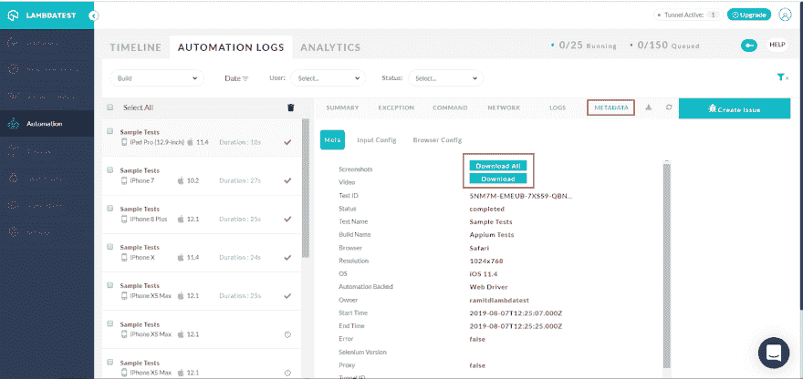](https://res.cloudinary.com/practicaldev/image/fetch/s--gzUGIRLy--/c_limit%2Cf_auto%2Cfl_progressive%2Cq_auto%2Cw_880/https://cdn.lambdatest.com/blog/wp-content/uploads/2019/08/metadata.png)

### 分析学

分析将帮助您监督执行了多少构建，消耗的总分钟数，通过或失败的构建数，以及记录的错误总数。您可以每月、每周甚至每天过滤这些信息。

[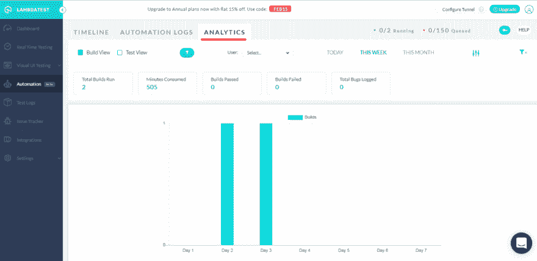](https://res.cloudinary.com/practicaldev/image/fetch/s--Xm-tRjK3--/c_limit%2Cf_auto%2Cfl_progressive%2Cq_auto%2Cw_880/https://cdn.lambdatest.com/blog/wp-content/uploads/2019/08/analytics.png)

LambdaTest analytics 将确保您不会错过任何细节。

## 可以用并行执行进行移动 Web 自动化测试吗？

测试用例的并行执行可以帮助您大大加快走向市场的步伐。我们明白这就是为什么我们提供一个可扩展的云上应用网格来帮助你并行执行你的移动 web 自动化测试用例。

您可以在一个实例中运行多个测试用例。并行测试会话的数量将取决于您的 LambdaTest 帐户的并发会话数量。

拥有复杂的移动 web 自动化测试套件？想知道应该进行多少个并发会话？

查看我们的[并发计算器](https://www.lambdatest.com/concurrency-calculator/?utm_source=dev&utm_medium=Blog&utm_campaign=Harshit-22082019&utm_term=Harshit) &确保您的规模适当。

## 我可以通过 LambdaTest Appium Grid 测试我的本地托管网页吗？

是的，你可以！LambdaTest 提供了一个 SSH(安全外壳)隧道，它在你的本地计算机和我们的云服务器之间提供了一个连接，我们称之为 Lambda 隧道。使用 Lambda Tunnel，你可以在众多移动设备上运行的 2000 多种真实浏览器上测试本地托管的网页。

要配置 Lambda 隧道，您需要访问自动化控制台→配置隧道。

[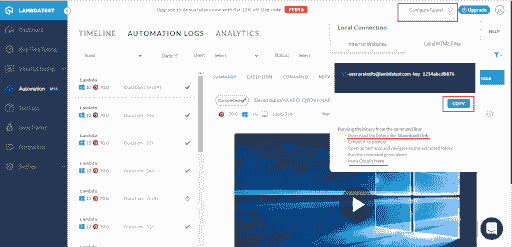](https://res.cloudinary.com/practicaldev/image/fetch/s--Wj4eXQnq--/c_limit%2Cf_auto%2Cfl_progressive%2Cq_auto%2Cw_880/https://cdn.lambdatest.com/blog/wp-content/uploads/2019/08/lambdatest-appium-grid.png)

[访问我们关于配置 Lambda 隧道的文档，测试您本地托管的网页](https://www.lambdatest.com/support/docs/testing-locally-hosted-pages/?utm_source=dev&utm_medium=Blog&utm_campaign=Harshit-22082019&utm_term=Harshit)

一旦你完成了 Lambda 隧道的配置，你会发现它在应用程序中被激活。

[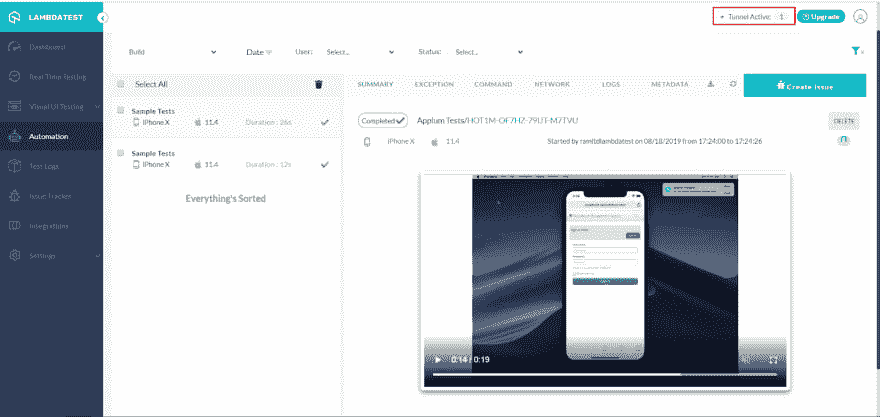](https://res.cloudinary.com/practicaldev/image/fetch/s--ldb2Ft4S--/c_limit%2Cf_auto%2Cfl_progressive%2Cq_auto%2Cw_880/https://ucarecdn.com/c33bcd2b-a8b3-4524-b890-1cc2ada203d4/)

使用 Lambda Tunnel 测试本地托管的网页，并确保在将更改发布到生产环境中后，用户界面不会崩溃。

## 发现 Bug 怎么办？

别担心，我们会掩护你的。LambdaTest 提供了一个名为“标记为 bug”的特性，只需点击一下，就可以将一个 Bug 记录到各自的项目管理工具中。您可以使用 bug 图标来标记 bug。

[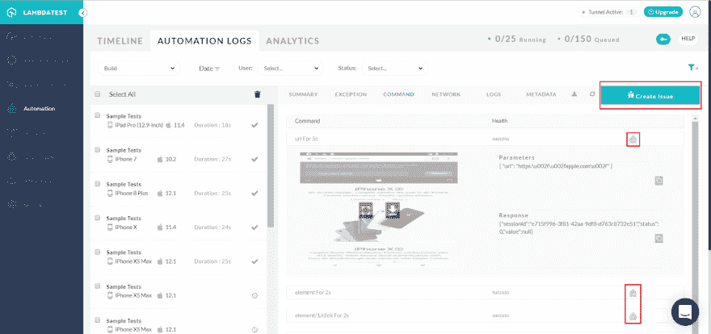](https://res.cloudinary.com/practicaldev/image/fetch/s--OYIHjiyo--/c_limit%2Cf_auto%2Cfl_progressive%2Cq_auto%2Cw_880/https://ucarecdn.com/4e931642-4371-4441-8378-4a0514605d34/)

当您点击 bug 图标时，您会发现一个与您的集成项目管理工具相关的表单。您可以填充详细信息并记录错误。下面的截图是指与 JIRA 的集成，只需点击一下就可以记录错误。

[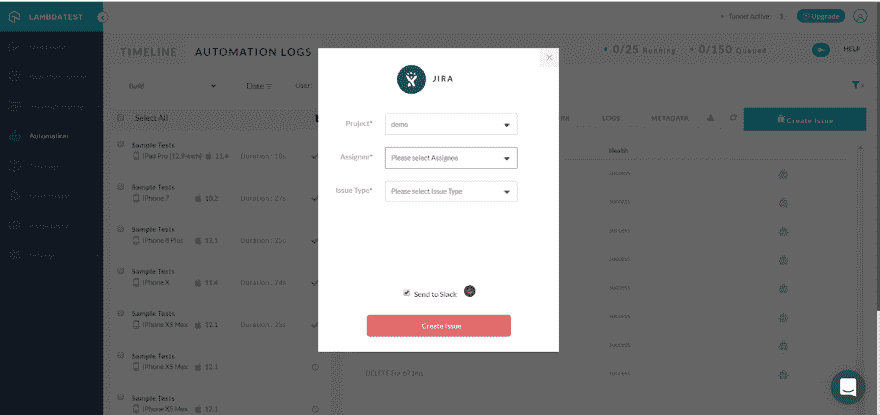](https://res.cloudinary.com/practicaldev/image/fetch/s--F38zVtu0--/c_limit%2Cf_auto%2Cfl_progressive%2Cq_auto%2Cw_880/https://ucarecdn.com/063aaa05-8249-46e7-ae0e-2e1ad97ef5f5/)

除了 JIRA，LambdaTest 还提供与以下项目管理工具的集成:

1.  阿萨纳
2.  松弛的
3.  特雷罗
4.  开源代码库
5.  GitLab
6.  Bitbucket
7.  Azure devOps(以前称为微软 VSTS)
8.  佩莫
9.  储备
10.  体育俱乐部会所；音频社交软件（网友戏称“聊斋”）
11.  BugHerd
12.  螳螂

[查看所有与第三方 CI/CD 工具的 LambdaTest 集成&无代码自动化](https://www.lambdatest.com/integrations?utm_source=dev&utm_medium=Blog&utm_campaign=Harshit-22082019&utm_term=Harshit)

## 但是等等！还有更多

在这次产品更新中，我们想出了一种方法来帮助您删除 LambdaTest 自动化仪表板中的测试用例，以帮助您根据自己的方便保持事物的有序和整洁。

您可以在我们的自动化控制台中找到垃圾箱图标。

[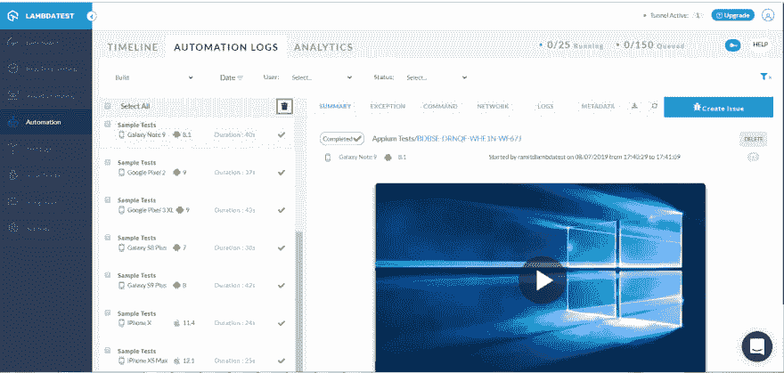](https://res.cloudinary.com/practicaldev/image/fetch/s--AWBkJSfK--/c_limit%2Cf_auto%2Cfl_progressive%2Cq_auto%2Cw_880/https://ucarecdn.com/e4ac71cf-e561-4a4f-bb2c-21ef87714d30/) 
这个 bin 图标将帮助你根据你的选择删除测试用例。您可以通过点击 Select All 复选框来选择删除每个测试用例，或者您可以选择您想要删除的特定测试用例&，然后点击 bin 图标。

## 可以对原生应用进行移动测试吗？

**截至目前**，这是不可能的，但我们的路线图中确实有。我们的开发者已经为原生移动应用测试做好了准备，你可以期待它很快在我们的平台上实现。

## 那都是乡亲们！

这就概括了一切。我们对我们的移动 web 自动化发布感到非常兴奋，并且已经开始为您带来更多令人兴奋的产品更新。

请务必给 LambdaTest 移动自动化一个旋转，并与我们分享您的反馈，无论是好的还是坏的。作为一个以用户为中心的平台，我们总是优先考虑所有的反馈，与像您这样的用户进行讨论有助于我们完善平台，使其对整个开发人员和测试社区更有用。

**注意:**如果您是现有的 LambdaTest automation 用户，并且希望升级您的移动 web 自动化计划，那么请确保向我们的客户 [**聊天支持**](https://dev.tojavascript:void(0)) 喊一声，以享受您的独家定价。😉

如果你有任何问题，请告诉我们。你可以给我们发电子邮件到 support@lambdatest.com，或者给我们打个招呼。我们全天候为您服务。测试愉快！🙂

