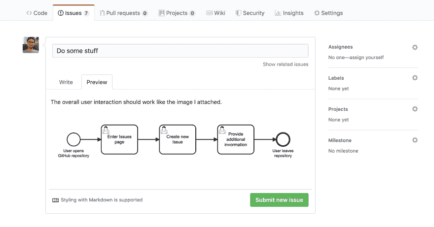
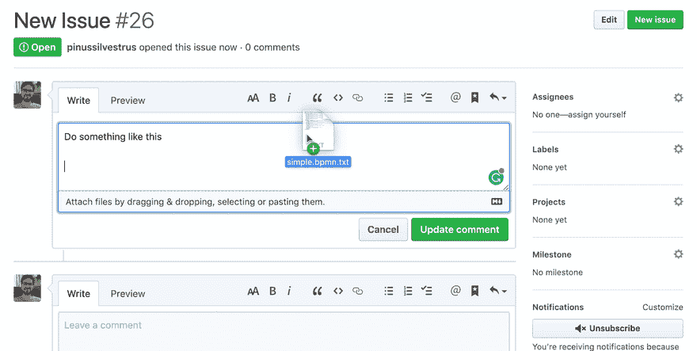

# render-bpmn:在 Github 上上传和显示 BPMN | CMMN | DMN 图

> 原文：<https://dev.to/pinussilvestrus/render-bpmn-upload-and-display-bpmn-cmmn-dmn-diagrams-on-github-2mbo>

2019 年的[卡蒙达夏季休闲日](https://twitter.com/Camunda/status/1164197803792490502)是一个很好的地方，可以进行我过去几个月没有时间的长期计划项目。三天后，我们就如何在 GitHub 上呈现 BPMN 图构建了一个很好的工作原型。结账并留下一些反馈或一颗星在那里⭐️.

### 一般问题

目前很难在 GitHub 上显示 BPMN 的文件。对于图像，应用程序提供上传文件的后处理，以便快速显示它们。不幸的是，这不适用于流程图。这种图表对于概述特性需求或者 bug 根源分析非常有帮助。此时，需要在外部工具中打开这些 BPMN 文件，如 [bpmn.io](https://bpmn.io) ，以正确显示它们*或*以将文件转换为图像。

### 黑客攻击原型

在 2019 年的 Camunda Hackdays 中，我们希望创建几个原型，以便自动渲染 GitHub 存储库中的 BPMN 文件。在[结果库](https://github.com/pinussilvestrus/github-bpmn)中，我们提供了这些解决方案。它以两种方式解决问题:

**在问题和拉取请求中自动呈现 BPMN 文件**

自托管的 [probot](https://github.com/probot/probot) 应用程序通过 bpmn.io 自动呈现上传的 BPMN 文件

**通过悬停自动渲染存储库文件树中的 BPMN、CMMN 和 DMN 图**

你可以很容易地通过 Tampermonkey 包含最终的 userscript，或者使用修改过的 Chrome 扩展。

### 结论

由此产生的项目提供了一种简单的方法来快速显示 GitHub 存储库中您喜爱的 BPMN、CMMN 或 DMN 文件。我们[计划尽快增加特性集](https://github.com/pinussilvestrus/github-bpmn/issues)，只要我们有时间。请随意尝试这些解决方案，我们希望听到一些反馈，❤️，并收到一些🌟在 GitHub 上。