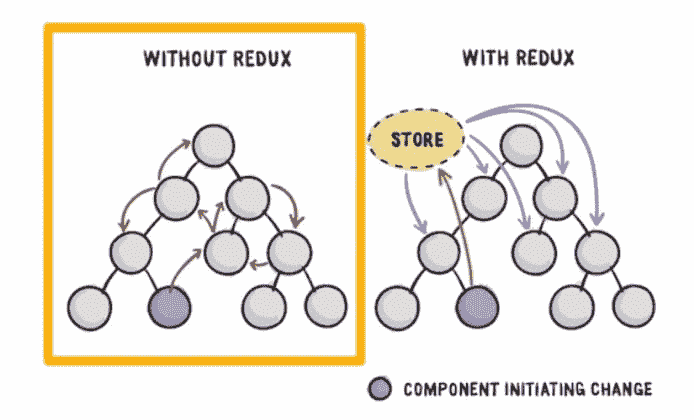
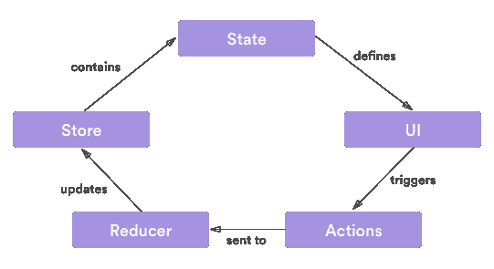
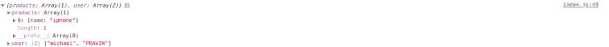

# Redux 第一天指南

> 原文：<https://dev.to/voralagas/first-day-to-redux-531>

我刚刚学会 Redux，我在这里分享让我明白发生了什么的事情...

## 先说为什么要用 Redux:

在 [stackoverflow](https://stackoverflow.com/questions/51064041/why-we-need-redux-in-react) 中有一个有趣的讨论，解释了我们为什么以及何时需要 Redux。

除此之外:
假设一个 app 有 50 个组件，每个组件都有自己的状态，它们互相通信，更新彼此的状态。

[](https://res.cloudinary.com/practicaldev/image/fetch/s--6FBCjTcb--/c_limit%2Cf_auto%2Cfl_progressive%2Cq_auto%2Cw_880/https://thepracticaldev.s3.amazonaws.com/i/u4jh8mkvtnzrhzdfwtam.png)

现在，在第一棵树中，应用程序的状态变得如此复杂和混乱，而在第二棵树中，由于主状态，它变得非常清晰。组件发送更新主状态的请求，并将主状态的更改传递给组件。

### 安装:

**考虑:**你已经在 react 项目，并安装了纱线。你也可以使用 npm，但我更喜欢纱线。

```
 yarn add redux react-redux 
```

### 存储，减速，动作

1.  STORE:
    Store 基本上是应用程序的整个状态所在。这只是一个大物体。改变状态的唯一方法是为它分派一个动作。

2.  Action:
    Action 只是一个对象，它的类型和有效负载是从视图发送或调度到 Reducer 的。

3.  Reducer:
    Reducer 是一个读取状态和动作的纯函数。它处理如何根据动作道具更新状态，并返回下一个状态。

    <figure>

    [](https://res.cloudinary.com/practicaldev/image/fetch/s--fCDvEpjd--/c_limit%2Cf_auto%2Cfl_progressive%2Cq_auto%2Cw_880/https://i.stack.imgur.com/LNQwH.png)

    <figcaption>Fig: Redux flow</figcaption>

    </figure>

### 创建店铺:

从 index.js 文件中的 redux 导入 createStore。

```
 import { createStore } from 'redux'; 
```

请记住，一个应用程序中只有一个商店。

现在创建一个商店。

```
const store = createStore(
  reducer,
  {
    products: [{ name: "iphone" }],
    user: ["michael"]
  },
  allenhancer
); 
```

createStore()函数有三个参数，第一个是 reducer 函数，第二个是初始或预加载状态，最后一个是 store enhancer。

我们将在下次讨论存储增强器，现在让我们写这个

```
const allenhancer = window.devToolsExtension && window.devToolsExtension(); 
```

这是为了 Redux devtools。您可以在浏览器扩展中添加它。对于 [chrome](https://chrome.google.com/webstore/detail/redux-devtools/lmhkpmbekcpmknklioeibfkpmmfibljd?hl=en) ，可以从这里添加。

### 创建并调度一个动作:

动作只是一个有类型和负载的对象，我们来创建:

```
const action = {
type:'changestate' ,
payload:{
    newState:'New state'
 }
}; 
```

现在，使用我们刚刚在上面创建的 store 对象分派一个 action 对象:

```
store.dispatch(action); 
```

### 定义一个减速器功能并处理动作道具:

```
function reducer(state , action){
if(action.type=== 'changeState'){
   return action.payload.newState;
}
return 'default-value';
} 
```

Reducer 函数有两个参数，state 和 action，由 store 调度并返回下一个状态。

您可以通过
来控制存储状态

```
console.log(store.getState()); 
```

在这里，我们可以看到状态已更改为“新状态”。 **store.getState()** 返回应用程序的当前状态树。它等于存储缩减器返回的最后一个值。

### 用多个减速器划分状态:

将所有更新或处理逻辑放在单个 reducer 函数中会变得难以管理。因此，我们所做的就是将逻辑拆分成多个函数，并从父函数中调用这些函数。
所有函数都有`(state , action)`作为参数。
您可能在想“如果我们有多个减速器，如何调用不同的减速器？”。好了，救命恩人来了:`combineReducers()`。
为此，从 redux 导入。上面的导入行是这样的:

`javascriptimport { combineReducers, createStore } from 'redux'`

### 减速器功能的重构:

这是我们的 reducer 函数，它将用户或产品添加到我们的状态中，并返回新的状态，根据“类型”将有效负载添加到产品或用户:

```
function reducer(state = "", action) {
 switch (action.type) {
  case "UPDATE_USER":
    let temp_state_user = Object.assign({}, state);
    temp_state_user.user.push(action.payload);
    return temp_state_user;
  case "UPDATE_PRODUCT":
    let temp_state_product = Object.assign({}, state);       
    temp_state_product.product.push(action.payload);
    return temp_state_product;
  default:
      return state;
   }
  } 
```

Reducer 函数处理调用调度的动作为:

```
store.dispatch({ type: "UPDATE_USER", payload: "PRAVIN" });
console.log(store.getState()); 
```

console.log()给出的控制台输出为:
[](https://res.cloudinary.com/practicaldev/image/fetch/s--sgIg0Hdc--/c_limit%2Cf_auto%2Cfl_progressive%2Cq_auto%2Cw_880/https://thepracticaldev.s3.amazonaws.com/i/5c64p0w9larumwhhk23s.png) 
上面的 Reducer 函数在同一个函数内进行开关操作来处理用户和产品的更新。这可能是笨拙的，如果这种增长。我们现在想要获取这个渲染逻辑的一部分，并把它放在单独的函数中。为我们提供此功能，以组合不同的归约逻辑，并使父渲染函数可由存储调度调用。

*让我们重构上面的渲染函数*

```
const initialState = null;
function user_reducer(state = initialState, action) {
  switch (action.type) {
    case "UPDATE_USER":
      let users = state;
      users.push(action.payload.user);
      return users;
    default:
      return state;
  }
}
function product_reducer(state = initialState, action) {
  switch (action.type) {
    case "UPDATE_PRODUCT":
      let temp_state_product = Object.assign({}, state);
      temp_state_product.push(action.payload);
      return temp_state_product;
    default:
      return state;
  }
} 
```

combineReducer()组合了两个 Reducer，并返回可以与 store 连接的父 reducer。

```
const allReducers = combineReducers({
  products: product_reducer,
  user: user_reducer
}); 
```

现在我们有了商店创建代码:

```
 const store = createStore(
  allReducers,
  {
    products: [{ name: "iphone" }],
    user: ["michael"]
  },
  allenhancer
); 
```

这也在 `console.log(store.getState())`之后的控制台中给出了相同的结果

暂时就这样了，

这不是在 index.js 中编写所有代码的好方法，所以下次我们将从目录/文件层次结构开始，并将这种状态传递给视图或组件。