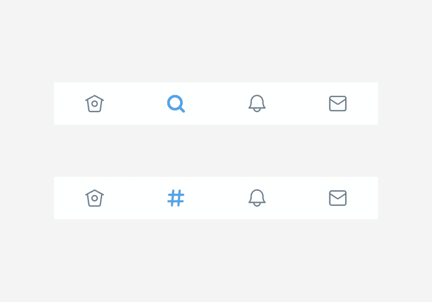
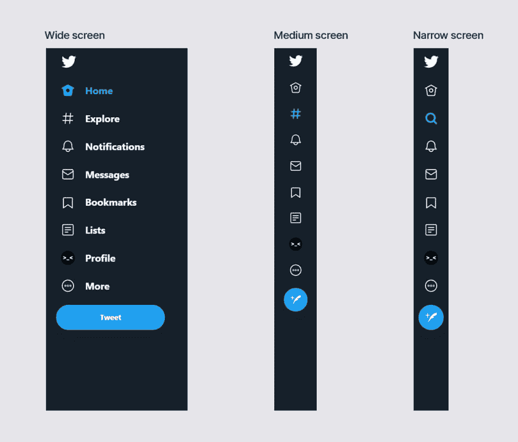

# Twitter 和他的搜索

> 原文：<https://dev.to/dtroode/twitter-and-his-search-55go>

最近 Twitter 在网页版中把搜索图标改成了 hashtag。这不是最好的解决方案。

*   将图标换成另一个图标总是很困难——你必须习惯这一点，尤其是在一个拥有 10 亿用户的社交网络中。
*   长期以来，所有界面中的搜索都与放大镜图标相关联，因此为了个人主义而将图标更改为其他图标并不酷。

但是推特还有另一个原因。最初，主页总是按照时间顺序排列，只显示用户订阅的推文。然后 Twitter 决定使用这些算法，但是用户不喜欢它，他们开始将反馈切换回时间顺序。

Twitter 决定创建第二个 feed，并将其放在搜索菜单上，就像它现在在 Instagram 中一样。因此不再有搜索菜单，搜索字符串成为新提要的一部分，这就是 Twitter 决定改变图标的原因。但用户仍然没有将这个菜单与标签或第二盘磁带联系起来，而是与搜索联系起来，所以实验失败了。

但与此同时，Twitter 仍然在每个页面上有一个单独的搜索菜单，所以看起来合乎逻辑的只是选择:感兴趣的磁带或搜索菜单——不要干涉。

现在，他们已经做到了以下几点:在宽屏幕上，有签名的图标，搜索由单词签名，并用标签图标标记；在窄屏幕上，没有签名，图标变成放大镜。但是在这两种状态之间有一个中间状态，这里没有签名，但是图标上有一个标签——这是令人困惑的。