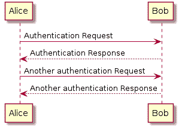
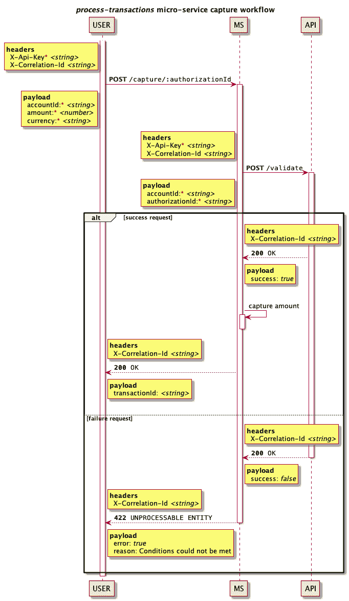

# 设计 API

> 原文：<https://dev.to/jccguimaraes/designing-an-api-1e3d>

在过去的一年里，我有机会和一些了不起的人一起工作，我们都在开发公开 RESTful APIs 的微服务。

在这一年中，我们不得不集成其他 API，如 RESTful、NVP - Name-Value Pair 等，以及内部或外部第三方。

确保项目运行没有任何重大事故是一项艰巨的工作。它涉及来自许多部门的许多人，他们共享信息的能力是开发 API 之前最重要的部分。

> 我绝不是说这些是设计 API 时应该采取的正确方法。我只是在分享我辛苦学到的东西。

因此，我发现在接受新任务，也就是建立一个新的微服务时，需要记住以下几点。

*   了解 API 依赖关系；
    *   *依赖关系*可以是内部 API、外部 API 或者你需要集成的 AWS 服务，等等...
*   了解这些依赖关系是否提供了 API 需要的所有功能(技术和业务)；
    *   是否符合目的；
    *   记录/支持的情况如何；
    *   是不是太严格了；
    *   如何灵活应对不可预见/未来的变化。
*   了解 API **必须**交付什么；
    *   当前交付；
    *   未来交付*(尽管在敏捷环境中这是一个模糊的话题)*。
*   API 合同；
    *   *合同*是开发/消费 API 的两方或多方之间的协议。
*   API 文档；
*   API 测试。

所有上述主题可以分为三大类:

1.  API 依赖关系
2.  美国石油学会技术规格
3.  API 开发

## API 依赖关系

如上所述，这通常是您有业务和技术需求的地方，您或您的团队开始就最佳行动方案进行头脑风暴/讨论。

这意味着，理解什么是 API 依赖项及其附加值。

从个人经验来看，您总是会错过一些边缘情况，所以使用 UML 序列图来帮助您构建端点的行为方式是一个很好的实践，比如请求头、有效负载、响应等。

### 什么是 UML 序列图？

一个 **UML 序列图**描述了操作是如何以一种交互的格式执行的。它们是基于时间的，并且它们显示了那些相互作用的顺序。它们还指定了工作流中的所有参与者。

直观的解释有助于您跟踪工作流程，定义满意的路径以及来自任何第三方 API 的错误，以及您自己的 API 应该如何处理这些信息。

作为开发人员，我们如何利用序列图呢？通过使用诸如 PlantUML 或 T2 的工具，我们可以从文本表示中生成图表。

PlantUML 的一个简单例子(摘自官网):

```
@startuml
Alice -> Bob: Authentication Request
Bob --> Alice: Authentication Response

Alice -> Bob: Another authentication Request
Alice <-- Bob: Another authentication Response
@enduml 
```

这将生成下一幅图像:

[](https://res.cloudinary.com/practicaldev/image/fetch/s--plC5r96I--/c_limit%2Cf_auto%2Cfl_progressive%2Cq_auto%2Cw_880/https://thepracticaldev.s3.amazonaws.com/i/6d99osiyx4nluwrjastf.png)

这是一个很酷的特性，因为它可以被控制版本。

我发现 [mermaidJS](https://mermaidjs.github.io/) 在集成和功能性方面仍然有点落后于 [PlantUML](http://plantuml.com/) ，但它们都是强大的工具，我在不同的环境中使用过。您应该使用最符合您需求的产品。

如果你使用 [Confluence](https://www.atlassian.com/software/confluence) ，有一个很好的 [PlantUML](http://plantuml.com/) 插件。

## API 规范

在您定义了图表之后，下一步是开始起草合同。

该合同应该以大多数开发人员都熟悉的标准规范“签署”。幸好 **[OpenAPI 规范](https://www.openapis.org/)** 已经有一段时间了。

规范是用 yaml 编写的，也可以控制版本。

再一次，从个人经验来看，起草的合同可能会有小到中等的变化。这很正常，这是一份涉及多个团队的合同，反馈总是一件好事。

永远接受建议，但是不要忘记你的团队拥有 API。

讨论是健康的，可以让我们看到不同的角度来实现相同的目标。

请记住，您的 API 将来也可能会发生变化，这可能会影响生产环境。因此，明智地考虑通过路径版本化来对 API 进行版本化，例如`/v1`等。或者通过 GitHub 的例子`Accept: application/vnd.github.v3+json`这样的头。

> 如果你像我一样，当“API 版本控制”这个话题被提到桌面上时，你的强迫症发作了，那么请阅读这篇来自法格纳·布拉克的关于可演化 API 的有趣的文章- [要创建一个可演化的 API，停止考虑 URL](https://medium.com/@fagnerbrack/to-create-an-evolvable-api-stop-thinking-about-urls-2ad8b4cc208e)。

## API 开发

是时候将我们之前获得的所有价值转化为代码来实现了。只要确保遵守合同，保护微服务，防止意外的 5xx 突然出现在生产中。

但是根据你选择的编码语言，开发的很大一部分是测试——单元、功能等...

使用正确的工具，你可以通过使用[邮递员](https://www.getpostman.com/)或[失眠](https://insomnia.rest/)来准备功能测试场景。

[Postman](https://www.getpostman.com/) 有一个被称为 [Newman](https://github.com/postmanlabs/newman) 的简洁功能，你可以对一个文件运行一个集合来检查你的端点是否遵循合同。

在这一点上，我已经共享了可以和当前代码一起进行版本控制的工具。使得保持所有这些同步变得容易。

# 用例子演示

没有什么比一个“几乎真实”的例子更好的来证明上述的一切了。

这个例子是基于在给定授权标识符的情况下进行捕获、作废和退款交易。

> 授权标识符意味着我们从客户使用的支付方式中锁定了一些金额。

## 虚构需求

*   获取授权；
    *   以指定货币向账户收取低于或等于锁定资金的金额；
    *   返回可能退款的交易标识符。
*   授权无效；
    *   释放被冻结的资金。
*   退款账户；
    *   提供有效的交易标识符；
    *   返回退款交易标识符。
*   所有上述动作**必须**根据另一个虚构的内部 API 进行验证；
    *   验证 accountId 是否链接到 authorizationId。
*   所有上述动作**必须**有一个必需的 [X-Api-Key](https://api.data.gov/docs/api-key/) 头；
    *   出于安全考虑。
*   所有上述动作**应该**有一个 [X-Correlation-Id](https://hilton.org.uk/blog/microservices-correlation-id) 头。
    *   用于跟踪工作流程。

我们先把微服务命名为`process-transactions`。

## 用序列图进行规划

根据前面的虚构需求，我们可以定义 3 个参与者:

*   **用户**-API 消费者；
*   **MS**-API 微服务；
*   **API** -消耗的 API。

图表的草稿应类似于下图:

[](https://res.cloudinary.com/practicaldev/image/fetch/s--SYMGLoo1--/c_limit%2Cf_auto%2Cfl_progressive%2Cq_auto%2Cw_880/https://thepracticaldev.s3.amazonaws.com/i/hw2d3up9w0aqav7ey0xc.png)

### 用于 PlantUML 的工具

考虑下面的文件结构。

```
./images
./plantuml
├── capture.puml

```

其中`capture.puml`有以下内容。

```
@startuml

participant "USER" as A
participant "MS" as B
participant "API" as C

title //process-transactions// micro-service capture workflow

rnote left A
**headers**
  X-Api-Key<font color="red">*</font> //<string>//
  X-Correlation-Id //<string>//
end note

activate A
A -> B: **POST** ""/capture/:authorizationId""

rnote left A
**payload**
  accountId:<font color="red">*</font> //<string>//
  amount:<font color="red">*</font> //<number>//
  currency:<font color="red">*</font> //<string>//
end note

rnote left B
**headers**
  X-Api-Key<font color="red">*</font> //<string>//
  X-Correlation-Id //<string>//
end note

activate B
B -> C: **POST** ""/validate""

rnote left B
**payload**
  accountId:<font color="red">*</font> //<string>//
  authorizationId:<font color="red">*</font> //<string>//
end note

alt success request

rnote right B
**headers**
  X-Correlation-Id //<string>//
end note

activate C
B <-- C: ""**200** OK""

rnote right B
**payload**
  success: //true//
end note

|||

B -> B: capture amount
activate B
deactivate B

rnote right A
**headers**
  X-Correlation-Id //<string>//
end note

A <-- B: ""**200** OK""

rnote right A
**payload**
  transactionId: //<string>//
end note

|||

else failure request

rnote right B
**headers**
  X-Correlation-Id //<string>//
end note

B <-- C: ""**200** OK""
deactivate C

rnote right B
**payload**
  success: //false//
end note

rnote right A
**headers**
  X-Correlation-Id //<string>//
end note

A <-- B: ""**422** UNPROCESSABLE ENTITY""
deactivate B

rnote right A
**payload**
  error: //true//
  reason: Conditions could not be met
end note

|||

end
deactivate A

@enduml 
```

我们可以使用包`node-plantuml`将序列图生成为图像。

*   `npm install node-plantuml`
*   `puml generate -s -oimg/capture.svg ./plantuml/capture.puml`

现在我们有了一个描述我们的`/capture`端点的版本控制文件。

## 编写 OpenAPI 规范中的契约

`PlantUML`让我们很好地了解了`capture`端点对请求和响应的期望。

记住，在这一点上，微服务逻辑仍然是一个**黑盒**，并且现在应该保持这种状态。

我们正努力达成一份符合商业预期的合同。

我们还希望微服务对第三方/内部 API 的所有依赖都清楚它们的目的，以及它们的哪个端点适合我们的需求。

在我们的`capture`端点中，我们假设了一些通用的响应。但是如果需要的话，我们可以在`capture`回复之前调用 x 个端点。

不管怎样，OpenAPI 被定义为一个包含所有规范的 yaml 文件。

但是，如果我们有几个端点和许多响应，那么为规范的每一部分建立单独的文件可能是有用的。

最终这将减轻维护规范的负担。

### 组织合同结构

更新上述文件结构。

```
./images
├── capture.svg
./plantuml
├── capture.puml
./open-api
├── components
│   ├── headers
│   │   └── x-correlation-id.yaml
│   ├── headers.yaml
│   ├── parameters
│   │   ├── authorization-id.yaml
│   │   └── x-correlation-id.yaml
│   ├── responses
│   │   ├── capture-200.yaml
│   │   └── capture-422.yaml
│   ├── responses.yaml
│   ├── schemas
│   │   ├── capture-200.yaml
│   │   ├── capture-422.yaml
│   │   └── capture.yaml
│   └── schemas.yaml
├── components.yaml
├── index.yaml
├── info.yaml
├── paths
│   └── capture.yaml
└── paths.yaml

```

> ref 不是使用普通的`'#/components/...'`，而是一个到文件的相对链接，在编译步骤之后，它将被正确地“重新馈送”。

`./open-api/index.yaml`的内容:

```
openapi: 3.0.2
tags:
  - name: capture
info:
  $ref: './info.yaml'
paths:
  $ref: './paths.yaml'
components:
  $ref: './components.yaml'
security:
  - X-Api-Key: [] 
```

`./open-api/paths.yaml`的内容:

```
/capture/{authorizationId}:
  post:
    $ref: './paths/capture.yaml' 
```

`./open-api/paths/capture.yaml`的内容:

```
summary: Capture an amount
tags:
  - capture
operationId: capturePost
parameters:
  - $ref: '../components/parameters/authorization-id.yaml'
  - $ref: '../components/parameters/x-correlation-id.yaml'
requestBody:
  content:
    application/json:
      schema:
        $ref: '../components/schemas/capture.yaml'
responses:
  '200':
    $ref: '../components/responses/capture-200.yaml'
  '422':
    $ref: '../components/responses/capture-422.yaml' 
```

### 用于办公自动化系统的工装

我们可以使用包`swagger-cli`来生成编译后的规范文件。

*   `npm install swagger-cli`
*   `swagger-cli bundle -o open-api.yaml --type yaml open-api/index.yaml`。

及完整规格:

```
openapi: 3.0.2
tags:
  - name: capture
info:
  version: 1.0.0
  title: Process Transactions Micro-service
  description: 'Capture,  void  and  refund  an  account.'
paths:
  '/capture/{authorizationId}':
    post:
      summary: Capture an amount
      tags:
        - capture
      operationId: capturePost
      parameters:
        - name: authorizationId
          description: Authorization Id which allows to capture the locked funds
          in: path
          required: true
          schema:
            type: string
        - name: X-Correlation-Id
          description: Correlation Id to keep track of workflow
          in: header
          schema:
            type: string
      requestBody:
        content:
          application/json:
            schema:
              $ref: '#/components/schemas/capture'
      responses:
        '200':
          $ref: '#/components/responses/capture-200'
        '422':
          $ref: '#/components/responses/capture-422'
components:
  securitySchemes:
    X-Api-Key:
      type: apiKey
      in: header
      name: X-Api-Key
  responses:
    capture-200:
      description: Capture of funds has succedeed
      headers:
        X-Correlation-Id:
          $ref: '#/components/headers/X-Correlation-Id'
      content:
        application/json:
          schema:
            $ref: '#/components/schemas/capture-200'
    capture-422:
      description: Capture did not succeed
      headers:
        X-Correlation-Id:
          $ref: '#/components/headers/X-Correlation-Id'
      content:
        application/json:
          schema:
            $ref: '#/components/schemas/capture-422'
  schemas:
    capture:
      type: object
      required:
        - accountId
        - amount
        - currency
      properties:
        accountId:
          type: string
        amount:
          type: number
          example: 9.99
        currency:
          type: string
          example: EUR
    capture-200:
      type: object
      properties:
        transactionId:
          type: string
          description: The transaction id which will allow to refund
    capture-422:
      type: object
      properties:
        success:
          type: boolean
          default: false
        reason:
          type: string
          example: Conditions could not be met
  headers:
    X-Correlation-Id:
      schema:
        type: string
security:
  - X-Api-Key: [] 
```

## 对照 API 进行测试

既然我们已经定义了图表，契约也已经达成，我们就可以开始实现它了。

假设您有一台服务器，并且已经满足了所有的要求。

有一个基于 OAS 的 Postman 集合不是比手工创建更好吗？

### 将 OpenAPI 转换为 Postman 集合

我们可以使用包`openapi-to-postmanv2`来生成邮递员集合。

*   `npm install openapi-to-postmanv2`
*   它将生成一个几乎预填充的邮递员集合。

显然，你需要填充空白，如`X-Api-Key`等。

## 结论

通过 OpenAPI 规范构建 Postman 集合将有助于发现开发中的漏洞。

请记住，合同的变更经常发生在开发过程中，甚至是在测试所有功能的时候。

希望这个工作流程有助于以任何可能的方式来加快和加强开发。

> 你有什么想法？请分享您的经验，并欢迎所有建设性的反馈！

# 链接

**规格**

*   [UML 规范](https://www.omg.org/spec/UML/)
*   [OpenAPI 规范](https://www.openapis.org/)

**工具**

*   [计划](http://plantuml.com/)
*   美人鱼
*   [邮递员](https://www.getpostman.com/)
*   [失眠](https://insomnia.rest/)
*   纽曼
*   [招摇编辑](https://editor.swagger.io/)
*   [LiveUML](https://liveuml.com/)
*   [node-plantuml](https://github.com/markushedvall/node-plantuml)
*   swagger-cli
*   [openapi-to-postmanv2](https://github.com/postmanlabs/openapi-to-postman)