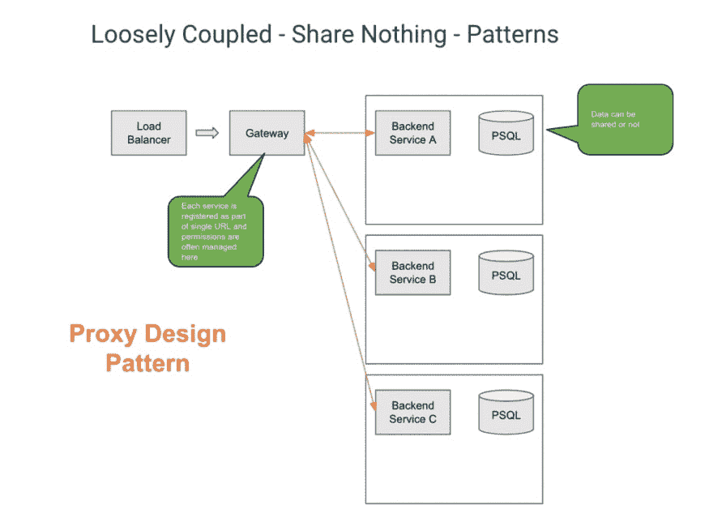
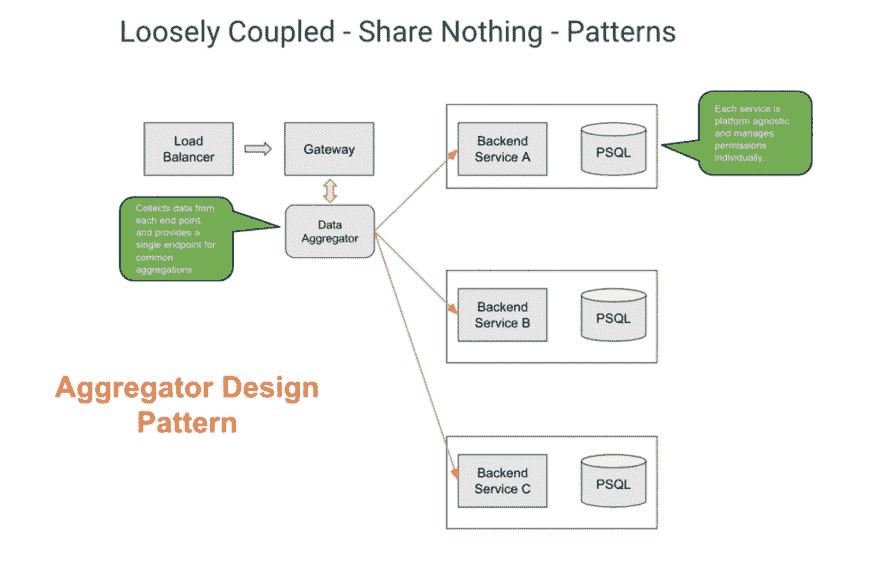
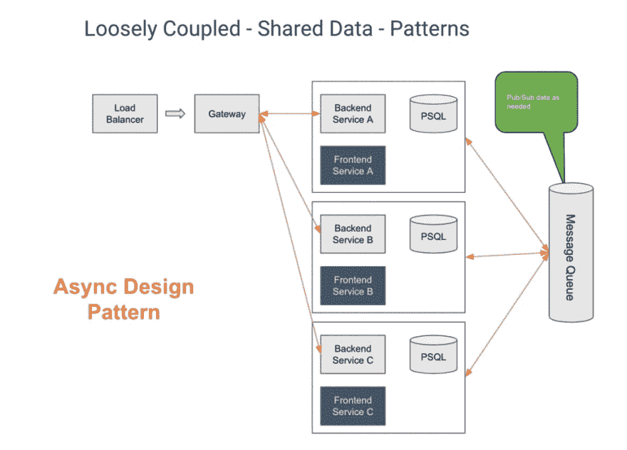
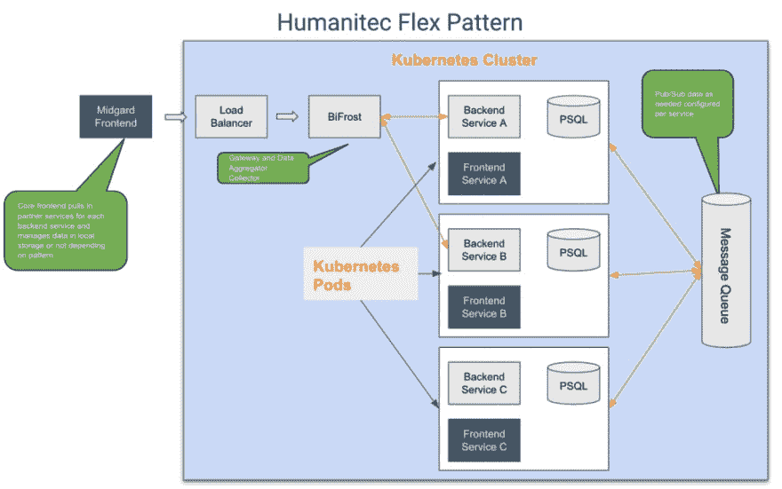
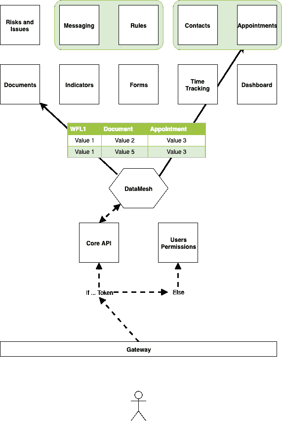

# 云本机模式

> 原文：<https://dev.to/buildly/cloud-native-patterns-ic7>

Buildly 是一个开源的云本地或微服务网关，充当预配置和自定义前端客户端与后端服务之间的桥梁。Buildly core api 服务提供多种轻量级服务，如可配置的灵活 api 网关([核心](https://buildly.io/buildly-core/))、数据网格聚合服务([网格](https://buildly.io/buildy-mesh/))和认证授权层([用户](https://buildly.io/buildly-users/))。它是围绕一个解耦的微服务架构模式构建的，但提供了比大多数微服务更大的灵活性，让开发人员可以选择他们希望用于每个独立服务的每个无共享、代理或共享数据微服务模式的部分。

为了更好地理解这是如何工作的，让我们首先回顾一下许多开发人员使用的一些更流行的微服务模式，以及如何实现它们。

代理设计模式

代理模式提供了单个 url 端点以及跨多个端点的基本身份验证和授权。这种模式为前端或客户端开发人员提供了一个单一的 URL 和端点来管理所有数据请求。它还可以扩展为通过令牌认证过程提供直通认证，如 JWT，为每个微服务提供基本认证。

聚合器模式

代理模式的扩展是聚合设计模式。这种常见的模式通常使用 GraphQL 这样的工具作为其中心，并允许您将所有或部分端点数据聚合到一个网关服务中，作为数据查询工具。这允许分离服务，同时仍然通过网关为每个服务提供单个 URL。它还为前端开发人员提供了一个端点来查询每个微服务端点，并执行基本的数据链接或聚合。在我们的例子中，我们提供了一个数据网格工具，它使用 Swagger docs 为所有相关的端点创建一个简单的 REST API 数据网格，并允许开发人员预先配置所需的连接查询和缓存级别。

异步设计模式

异步设计模式可以与网关一起使用，也可以不使用，但每个微服务都可以将数据发布到 RabbitMQ 这样的消息队列，并从其他服务订阅它需要的数据。这需要为每个服务进行更多的前期配置，但为每个端点提供所需的数据，并且只提供所需的数据，与聚合服务相比，这有助于减少查询时间。

建筑灵活模式

Buildly 内置的 Flex 模式允许每个 LogicModule 的开发人员选择他们想要如何共享数据，或者通过消息队列或网关和 API 数据网格，或者完全解耦的后端用于前端模式。Buildly 服务提供了一种简单的方法，通过在 Buildly 中生成的 UUID 将“工作流”用作唯一标识符，这些标识符可以注册到核心服务和每个相关的 LogicModule 条目，然后用作每个后端服务端点中条目之间的查找服务。

数据网格

Flex 模式不需要开发人员预先订阅特定的模式，因为所有需要的服务都在 Buildly 核心中运行。这种方式取决于进入服务的数据的用例、类型和形状，开发人员可以选择如何以该服务的最佳方式实现每个微服务。唯一的要求是每个服务为每个服务提供一个 [OpenAPI](https://www.openapis.org/) swagger doc。这有助于确保每个 API 服务的标准风格和实践，而且还允许我们在需要时将服务聚合到网关和数据网格中。

这些服务还允许开发人员在需要时创建查找服务作为跨微服务的数据连接表，并为它们应用灵活的基于角色的集中权限。它为开发人员提供了很大的灵活性，让他们可以按照自己的方式设计应用程序，根据自己的需要分离和分配工作，并专注于构建创新和灵活的应用程序。

* * *