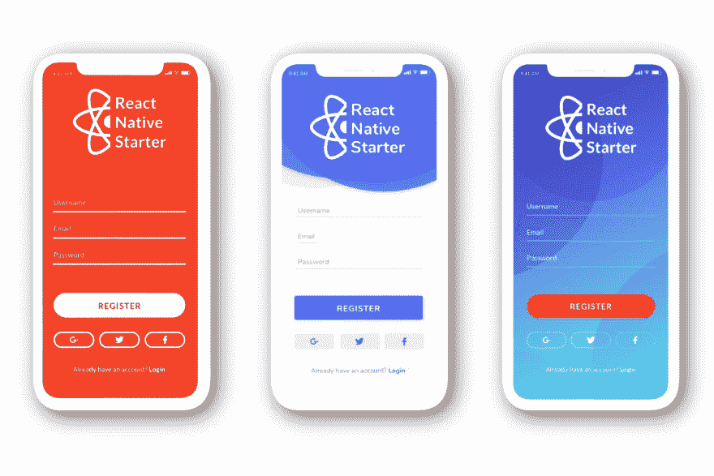
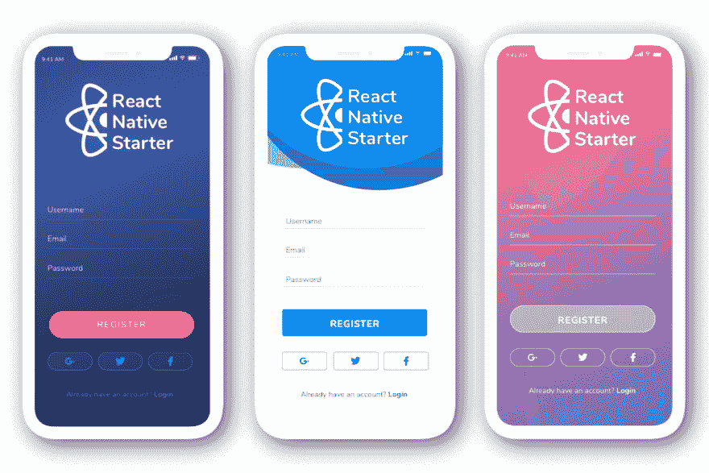

# React 原生 Starter 更新。添加了新的颜色主题

> 原文：<https://dev.to/flatlogic/react-native-starter-update-new-color-themes-added-5e0>

我们知道你们都想让自己的应用独一无二、与众不同。但有时你需要尽快完成你的应用程序，或者你需要一个原型来代表你的想法，具有专业的外观和令人印象深刻的现代设计。使用初学者工具包可能是个好主意。

我们试图从客户那里收集尽可能多的信息。这包括对设计的要求。特别是，我们收到了很多关于不同颜色主题的请求。

我们的设计师 Natalie Ermolenka 从项目一开始就为 React Native Starter 设计了两个不同的主题。现在，她又利用 2019 年最具影响力的设计趋势设计了四款。
 
毫无疑问，要给你的应用留下好印象，你只有几秒钟的时间来抓住用户的注意力。截图和描述应该引人注目，令人难忘。

过时的外观会降低你的转化率和参与度。如果你使用 React Native Starter，那么我们有责任给你专业的建议，告诉你什么能在你的应用程序设计中工作，什么不能。

## **渐变和双色调**

在过去的几年里，我们可以追溯渐变和双色调使用的演变。这种多用途的趋势会持续很长时间，因为它几乎适用于任何类型的设计。所以好消息是这种趋势将会持续几年。使用渐变是为了增加色彩，突出特定内容，并创建一个迷人的背景。
[T3】](https://res.cloudinary.com/practicaldev/image/fetch/s--6mxPaefR--/c_limit%2Cf_auto%2Cfl_progressive%2Cq_auto%2Cw_880/https://flatlogic.com/blog/wp-content/uploads/2019/05/3-2.png)

## **线条自然流畅**

自然流畅线条的运用给我们一种舒适的感觉。有机的形状增加了布局的深度，因为它们天生就是不完美的。我们试图使它不完美，这样它可以显得人性化，可以打破单调。

## **拇指友好导航**

最流行的 UX 设计趋势之一是拇指友好的导航。你的用户一只手拿着一杯咖啡，另一只手拿着圣诞礼物。所以 UX 设计者的主要任务是让所有的 UI 元素都是拇指可访问的。大屏幕导航可能是手机杀手。

## **充满活力的色彩**

使用充满活力的调色板是一种令人眼花缭乱的引人注目的趋势，它广告了色彩的飞溅，并照亮了一个组成部分。它是最好的吸引注意力的东西，我们应该说，让明亮的颜色搭配起来需要一点练习。利用这种趋势，我们做了一个非常简单的布局，非常流行。

我们要感谢所有给我们写信、在 GitHub 上提交、在我们的社交媒体上留下评论的人。没有你，我们就没有所有必要的信息来改进我们的产品。当我们开始 [React Native Starter](https://reactnativestarter.com) 的时候，我们仅仅依赖于我们的需求。我们只是在积累创建移动应用的经验。但在过去的几个月里，我们设法获得了许多对未来有用的见解和想法。我们向你保证，在几周内，你将会收到我们更多的更新和令人兴奋的消息。

最初发布于[flatlogic.com](https://flatlogic.com/blog/react-native-starter-update-various-color-schemes-added/)
flat logic 创建了顶级 Vue、Angular 和 React [管理模板](https://flatlogic.com/admin-dashboards)，具有令人惊叹的设计和最好的 React 原生[移动模板](https://reactnativestarter.com/)。