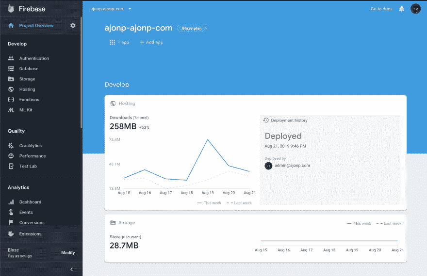
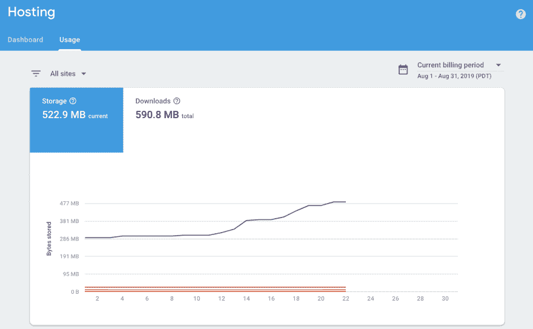
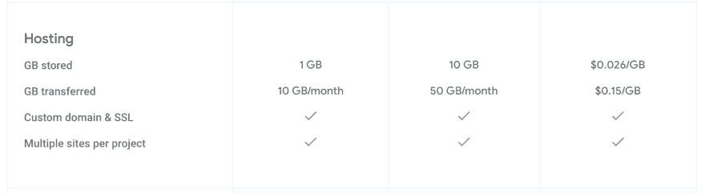
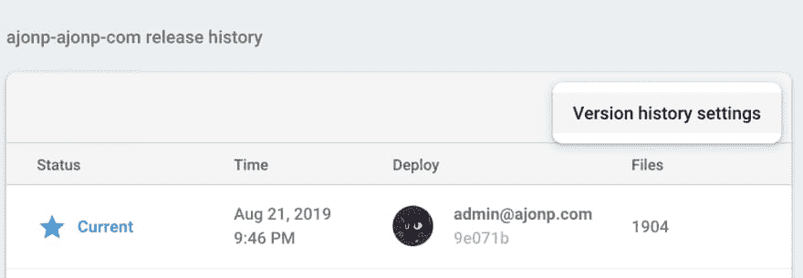
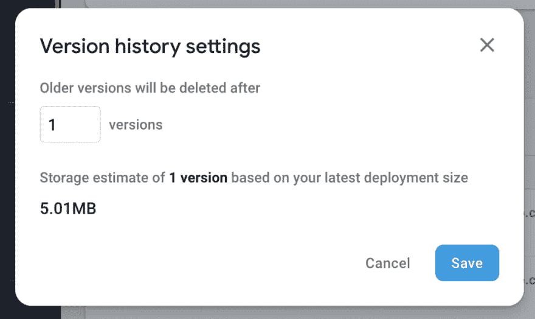
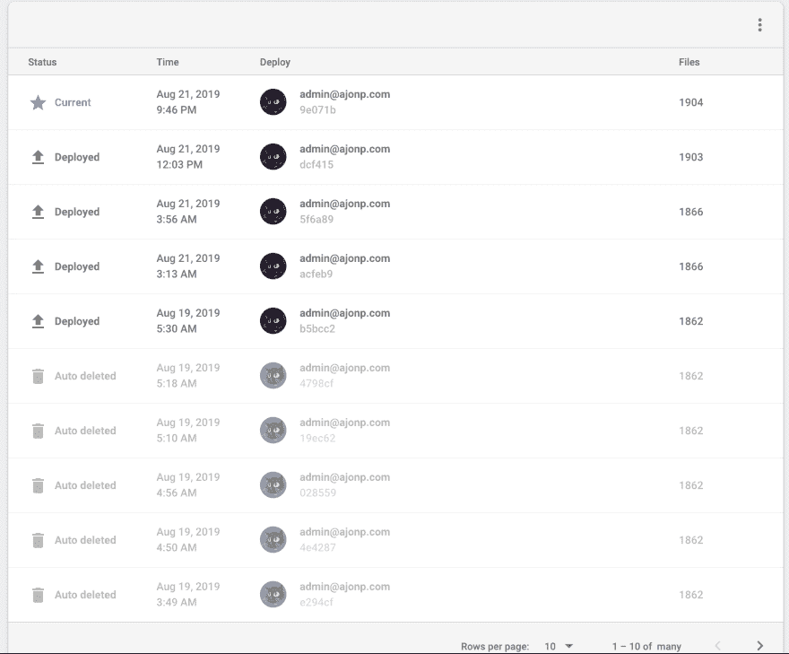

# Firebase 托管版本设置

> 原文：<https://dev.to/codingcatdev/firebase-hosting-version-settings-4430>

> 原帖:[https://ajonp.com/blog/firebase-hosting-version-settings/](https://ajonp.com/blog/firebase-hosting-version-settings/)

# Firebase 托管版本设置

如果你开始有这种感觉，比如“为什么我要为这个小小的应用付费”，那么这个博客就是为你准备的！

## 仪表盘

如果您的项目当前正在使用托管，您应该在进入项目后立即看到您的仪表板。你可以点击你最近的部署历史或者在菜单中选择主机。

[](https://res.cloudinary.com/practicaldev/image/fetch/s--pyPrf17i--/c_limit%2Cf_auto%2Cfl_progressive%2Cq_auto%2Cw_880/https://res.cloudinary.com/ajonp/image/upload/q_auto/ajonp-ajonp-com/blog/Screen_Shot_2019-08-22_at_12.58.22_PM.png)

## 托管使用情况

您可能会在此屏幕中看到您当前托管的多个站点。现在让我们切换到用法选项卡。您应该会看到一个图表，列出了您存储字节的趋势。在我的图表中，这显示了最近的上升趋势(因为我已经部署了很多)。

[](https://res.cloudinary.com/practicaldev/image/fetch/s--PgNbfLBi--/c_limit%2Cf_auto%2Cfl_progressive%2Cq_auto%2Cw_880/https://res.cloudinary.com/ajonp/image/upload/q_auto/ajonp-ajonp-com/blog/Screen_Shot_2019-08-22_at_1.02.32_PM.png)

如果这种类型的存储趋势继续下去，我最终会打破这个网站上 1GB 的存储限制，现在授予我 5MB，这将需要大量的时间。[](https://res.cloudinary.com/practicaldev/image/fetch/s--Ra3CsfuN--/c_limit%2Cf_auto%2Cfl_progressive%2Cq_auto%2Cw_880/https://res.cloudinary.com/ajonp/image/upload/q_auto/ajonp-ajonp-com/blog/Screen_Shot_2019-08-22_at_1.05.23_PM.png)

## 更新版本

如果您有多个域，请选择要更改的域的视图。一旦你进入管理站点区域，你会在顶部看到你所有的域，然后在底部看到发布历史。

[](https://res.cloudinary.com/practicaldev/image/fetch/s--Z0Z6RgKe--/c_limit%2Cf_auto%2Cfl_progressive%2Cq_auto%2Cw_880/https://res.cloudinary.com/ajonp/image/upload/q_auto/ajonp-ajonp-com/blog/Screen_Shot_2019-08-22_at_1.08.07_PM.png)

在版本历史部分，你可以从汉堡菜单中选择版本历史设置。

[](https://res.cloudinary.com/practicaldev/image/fetch/s--7cabYudF--/c_limit%2Cf_auto%2Cfl_progressive%2Cq_auto%2Cw_880/https://res.cloudinary.com/ajonp/image/upload/q_auto/ajonp-ajonp-com/blog/Screen_Shot_2019-08-22_at_1.10.24_PM.png)

当您进入模式屏幕更改版本时，您将看到基于您的选择的估计存储。如果您存储了几个(在我的例子中是 100 个)版本，您将会注意到一个后台作业启动了，它会将您的旧版本标记为删除。

[](https://res.cloudinary.com/practicaldev/image/fetch/s--nU9z2Nei--/c_limit%2Cf_auto%2Cfl_progressive%2Cq_auto%2Cw_880/https://res.cloudinary.com/ajonp/image/upload/q_auto/ajonp-ajonp-com/blog/Screen_Shot_2019-08-22_at_1.12.30_PM.png)

一旦删除操作完成，您会注意到您的旧部署将有一个`Auto deleted`指示器。

[](https://res.cloudinary.com/practicaldev/image/fetch/s---p3QZIGT--/c_limit%2Cf_auto%2Cfl_progressive%2Cq_auto%2Cw_880/https://res.cloudinary.com/ajonp/image/upload/q_auto/ajonp-ajonp-com/blog/Screen_Shot_2019-08-22_at_1.52.07_PM.png)

## 休息服务

如果您没有通过 [Firebase 托管 API](https://firebase.google.com/docs/hosting/reference/rest/v1beta1/sites.versions/delete) 进入管理 GUI，您也可以自动化这个过程。

### 外壳脚本

[andipaetzold/firebase-delete-releases . sh](https://gist.github.com/andipaetzold/94e470b4f74c85d426000d95791603fd)

```
#!/bin/bash
set -eo pipefail

echo "Deleting existing hosting releases"

SITE=$1
echo "Site: $SITE"

HEADER_AUTH="Authorization: Bearer "$(gcloud auth application-default print-access-token)"";

PAGE_TOKEN=
FIRST=true

while :
do
    echo "Fetching releases for $PAGE_TOKEN"

    RELEASES=$( \
        curl \
            -sS \
            -H "$HEADER_AUTH" \
            "https://firebasehosting.googleapis.com/v1beta1/sites/$SITE/releases?pageToken=$PAGE_TOKEN&pageSize=25" \
        )

    for RELEASE_ID in $(echo $RELEASES | jq '.releases | keys[]')
    do
        VERSION_NAME=$(echo $RELEASES | jq --raw-output ".releases[$RELEASE_ID].version.name")
        MESSAGE=$(echo $RELEASES | jq --raw-output ".releases[$RELEASE_ID].message")
        VERSION_STATUS=$(echo $RELEASES | jq --raw-output ".releases[$RELEASE_ID].version.status")

        if ["$VERSION_STATUS" == "FINALIZED"] && ["$FIRST" == false]
        then
            echo "Deleting release $MESSAGE ($VERSION_NAME)";

            curl \
                -sS \
                -X DELETE \
                -H "$HEADER_AUTH" \
                "https://firebasehosting.googleapis.com/v1beta1/$VERSION_NAME"
        fi

        FIRST=false
    done

    if [$(echo $RELEASES | jq --raw-output '.nextPageToken') == "null"]
    then
        exit 0
    fi

    PAGE_TOKEN=$(echo $RELEASES | jq --raw-output '.nextPageToken')
    sleep 1s
done 
```

<svg width="20px" height="20px" viewBox="0 0 24 24" class="highlight-action crayons-icon highlight-action--fullscreen-on"><title>Enter fullscreen mode</title></svg> <svg width="20px" height="20px" viewBox="0 0 24 24" class="highlight-action crayons-icon highlight-action--fullscreen-off"><title>Exit fullscreen mode</title></svg>