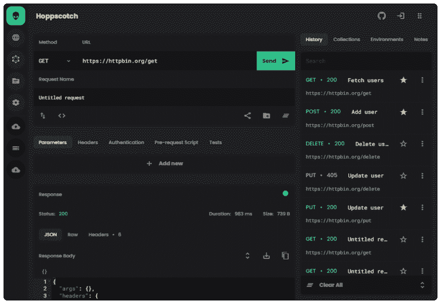
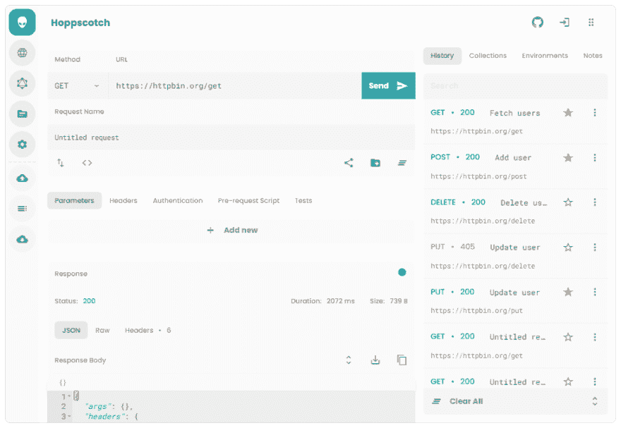

# 我创造了跳房子

> 原文：<https://dev.to/liyasthomas/i-created-postwoman-an-online-open-source-api-request-builder-41md>

# **[Hoppscotch👽](http://hoppscotch.io)**

## 欢迎在 [GitHub 上投稿💚](https://github.com/hoppscotch/hoppscotch)

* * *

万一你错过了呢！
**故事到此为止:**我加入了 Zartek，这是一家位于喀拉拉邦高知的初创公司，我在那里担任全栈开发人员。

Hoppscotch 背后的故事:我被分配的第一个任务是一个旧项目的 API 集成。这时候我偶然发现了 Postman API 测试工具。Postman 有针对每个电子操作系统的独立版本。我用的是低端电脑，可能负担不起运行另一个电子应用程序的费用。从那时起，我想做一个 API 测试平台，它是:

*   开放源码
*   在线运行
*   拥有多平台支持
*   支持多种设备
*   从任何地方都可以访问

Hoppscotch 就是这样诞生的(这根本不是 Postman 的替代品——然而，它非常漂亮地完成了这项工作。它需要更多的功能和爱，我希望我们都能通过[在 GitHub](https://github.com/hoppscotch/hoppscotch) 上做出贡献。

当我对 API 请求构建器进行背景调查时，Postman 提供了各种计划和定价，还有许多其他基于 cURL 的 API 请求构建器，等等。但是没有一个看起来是简单的、最小的和有效的。

所以我用纯 JavaScript(我用的是 Vue.js) + HTML + CSS 创建了自己的 API 请求生成器💖

我有没有提到这项服务是完全免费和 100%开源的？是的，它是免费的，并将永远免费。

Hoppscotch API 请求生成器可以帮助您更快地创建请求，节省宝贵的开发时间。

## 特性🔥

*   发送请求以验证您的 API 是否已准备好启动 GET、PUT、POST、DELETE 选项(更多内容即将推出)
*   认证支持
*   参数支持
*   请求身体支持
*   查看响应
*   渐进式 Web 应用程序支持
*   更新:增加了历史支持
*   (更多即将推出)

**近期计划的功能[我需要你的帮助](https://github.com/hoppscotch/hoppscotch)。**

*   自动完成
*   响应正文中突出显示的代码
*   更多方法
*   ~历史~ **更新:增加了历史支持**

🎁奖励:Hoppscotch 处于黑暗模式🌚

# [演示🚀](http://hoppscotch.io)

## 欢迎在 [GitHub 上投稿💚](https://github.com/hoppscotch/hoppscotch)

## 跳绳 / [跳绳](https://github.com/hoppscotch/hoppscotch)

### 👽开源 API 开发生态系统 https://hoppscotch.io