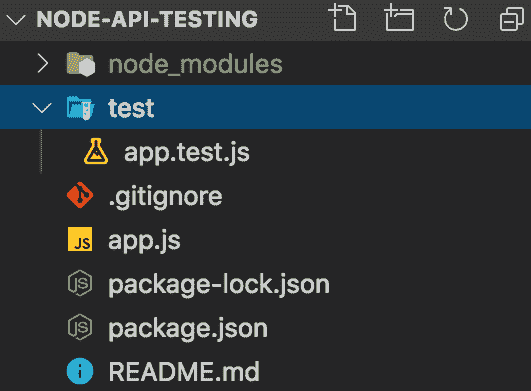
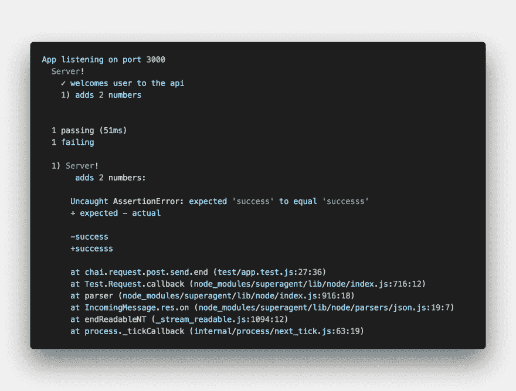

# 用 Mocha & Chai 测试节点 API

> 原文：<https://dev.to/easybuoy/testing-node-api-with-mocha-chai-248b>

### 摩卡是什么？

[Mocha](https://mochajs.org) 是一个功能丰富的 JavaScript 测试框架，运行在 Node.js 上和浏览器中，使异步测试变得简单有趣。

*   同步测试示例

```
it('two plus two is four', () => {
    expect(2 + 2).to.equals(4);
  }); 
```

*   异步测试代码

```
it("adds 2 numbers", (done) => {
   // perform asynchronous actions
   // write tests
    done(); // call the done function after test.
  }); 
```

### 柴是什么？

Chai 是一个用于 nodejs 和浏览器的 BDD(行为驱动开发)/ TDD(测试驱动开发)断言库，可以与任何 javascript 测试框架愉快地配对。

#### 断言类型

Chai 有几个界面可供开发者选择。它们是:

*   **[应该是](https://www.chaijs.com/guide/styles/#should)**

```
chai.should();
foo.should.be.a('string'); 
foo.should.equal('bar');
foo.should.have.lengthOf(3);
tea.should.have.property('flavors').with.lengthOf(3); 
```

*   **[期待](https://www.chaijs.com/guide/styles/#expect)**

```
var expect = chai.expect;  
expect(foo).to.be.a('string'); 
expect(foo).to.equal('bar'); 
expect(foo).to.have.lengthOf(3); expect(tea).to.have.property('flavors').with.lengthOf(3); 
```

*   **[断言](https://www.chaijs.com/guide/styles/#assert)**

```
var assert = chai.assert;  
assert.typeOf(foo, 'string'); 
assert.equal(foo, 'bar'); 
assert.lengthOf(foo, 3);
assert.property(tea, 'flavors'); 
assert.lengthOf(tea.flavors, 3); 
```

## 服务器测试

现在，我将带领我们完成设置一个基本节点 API 并为其编写测试的过程。

第一件事是创建我们的项目文件夹，并用 npm 初始化它以生成`package.json`文件。

```
npm init -y 
```

通过在您的终端上运行下面的命令来安装依赖项

```
npm i express --save
npm i mocha chai chai-http --save-dev 
```

#### 设置服务器

在项目的根目录下创建一个`app.js`文件，并在下面添加代码来创建一个带有 express 和端点的服务器，我们将对其进行测试。

```
const express = require("express");

const app = express();

app.use(express.json());

app.get("/", (req, res) => {
  res.json({ status: "success", message: "Welcome To Testing API" });
});

app.post("/add", (req, res) => {
  const { num1, num2 } = req.body;
  const add = (num1, num2) => {
    return num1 + num2;
  };
  res.json({
    status: "success",
    result: "Welcome To Testing API",
    result: add(num1, num2)
  });
});

const PORT = process.env.PORT || 3000;

app.listen(PORT, () => console.log(`App listening on port ${PORT}`));

module.exports = app; 
```

#### 设置脚本

将测试脚本添加到`package.json`文件。

```
"scripts":  {  "test":  "mocha"  } 
```

#### 写测试

在您的项目中创建一个测试目录，然后在创建的`test`目录中创建一个`app.test.js`文件。

> 注意:我们将测试添加到`test`目录的原因是默认情况下 mocha 会在您的项目中搜索一个测试目录，尽管这可以根据您的风格进行配置。在这里找到更多

然后在下面添加代码

```
const app = require("../app");
const chai = require("chai");
const chaiHttp = require("chai-http");

const { expect } = chai;
chai.use(chaiHttp);
describe("Server!", () => {
  it("welcomes user to the api", done => {
    chai
      .request(app)
      .get("/")
      .end((err, res) => {
        expect(res).to.have.status(200);
        expect(res.body.status).to.equals("success");
        expect(res.body.message).to.equals("Welcome To Testing API");
        done();
      });
  });

  it("adds 2 numbers", done => {
    chai
      .request(app)
      .post("/add")
      .send({ num1: 5, num2: 5 })
      .end((err, res) => {
        expect(res).to.have.status(200);
        expect(res.body.status).to.equals("success");
        expect(res.body.result).to.equals(10);
        done();
      });
  });
}); 
```

此时，你的文件夹结构应该如下图所示
[](https://res.cloudinary.com/practicaldev/image/fetch/s--cE13P8tn--/c_limit%2Cf_auto%2Cfl_progressive%2Cq_auto%2Cw_880/https://thepracticaldev.s3.amazonaws.com/i/bsb8hfofzkqr9m8fqkkx.png)

要运行测试，请在您的终端上运行以下命令。

```
npm test 
```

一旦测试运行，如果测试通过，您应该会在您的终端上得到成功的响应，如下例所示
[](https://res.cloudinary.com/practicaldev/image/fetch/s--AzHBepJH--/c_limit%2Cf_auto%2Cfl_progressive%2Cq_auto%2Cw_880/https://thepracticaldev.s3.amazonaws.com/i/jmx31vt0krx9odxyrbff.png)

...如果测试失败，您的终端上会出现一个错误响应，如下例所示
[](https://res.cloudinary.com/practicaldev/image/fetch/s--H1vGjdVX--/c_limit%2Cf_auto%2Cfl_progressive%2Cq_auto%2Cw_880/https://thepracticaldev.s3.amazonaws.com/i/7dy3lxnj52d9inm11i7u.png)

> 在 [Github](https://github.com/Easybuoy/node-api-testing)
> 上找到这个项目使用的代码在[这里](https://mochajs.org/#getting-started)找到更多关于 Chai [这里](https://www.chaijs.com/guide)找到更多关于

### 结论

在本文中，我们已经了解了如何使用 Mocha 和 Chai 设置测试，以及如何为我们的节点 API 编写测试。我将对这篇文章和项目进行改进，集成一个名为 Travis-CI 的持续集成工具。

如果您对本文有任何问题或反馈，请随时发表评论。
感谢阅读。