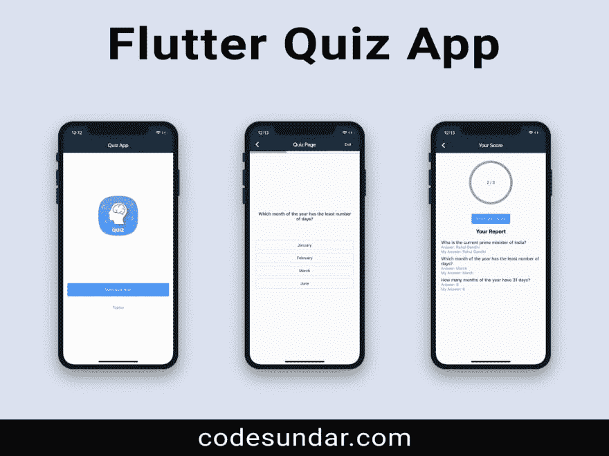

# Flutter 问答 App

> 原文：<https://dev.to/codesundar/flutter-quiz-app-59ag>

**Flutter Quiz App**with back end 帮助你使用 Flutter & PHP，MySQL backend(基于 Laravel)创建和运行 Android 和 iOS 应用。它包括文本&基于图像的测验、报告页面等

**原文:**[https://codesundar . com/downloads/flutter-quiz-app-with-back end/](https://codesundar.com/downloads/flutter-quiz-app-with-backend/)

## 竞猜 App 功能

### App 屏幕

*   主屏幕
*   主题方面还是类别方面
*   选择问题的数量
*   测验页面/问题页面
*   基于文本和图像的测验
*   进度指示器
*   带有图表的结果页面
*   测验的详细报告
*   分数社交分享

### 管理面板屏幕

*   用户验证/管理员登录和注册
*   用标签管理问题(CRUD)
*   标签智能搜索
*   页码
*   管理主题/类别
*   设置页面

