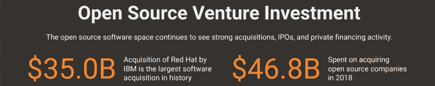
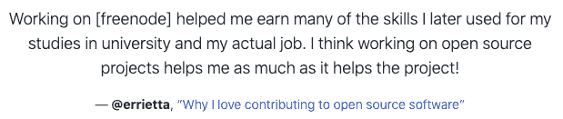
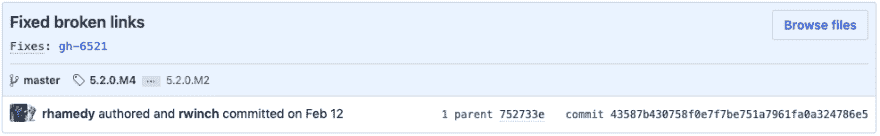
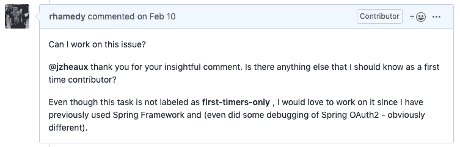
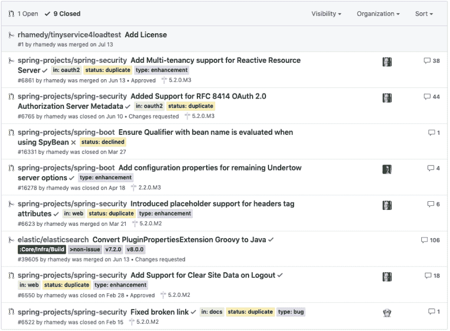

# 为什么你应该三思而后行

> 原文：<https://dev.to/rhamedy/why-you-should-think-twice-about-contributing-to-open-source-1l4d>

#### 10 个开发者中有 7 个为开源做贡献，这里有一些关于如何开始的提示和建议

众所周知，开源贡献是技术领域最受欢迎的技能之一。除就业福利外，还有其他优势，如

*   学习和分享知识
*   建立和提高你的品牌的知名度
*   通过代码评审和讨论与其他开发人员协作和交流
*   回馈社会❤
*   联系志同道合的人，找到你的员工、联合创始人、导师和学员

根据 Eclipse Foundation 的消息，开源软件在最近几年得到了大量的投资。

* * *

## 何必在意？

回顾 2016 年 StackOverflow [调查](https://insights.stackoverflow.com/survey/2016)，根本没有提到开源，然而，在 2017 年[调查](https://insights.stackoverflow.com/survey/2017#developer-profile-_-program-as-a-hobby)中，约 32.7%的受访者声称为开源做出贡献，这一数字在 2018 年[调查](https://insights.stackoverflow.com/survey/2018#developer-profile-_-contributing-to-open-source)中增加了近 10%(至 43.6%)，更有趣的是，贡献者的百分比在 2019 年上升了 20%(至 63.3%)。

根据 BlackDuck 的 [2016 年开源未来调查结果](https://www.slideshare.net/blackducksoftware/2016-future-of-open-source-survey-results)显示，大约 67%的开源参与者已经

*   修复 bug
*   添加新功能

> 59%的开发者参与开源以获得竞争优势。

考虑到上述事实、数字和趋势，我认为开放源码的贡献是值得考虑的。

> 成为你希望世界发生的变化——圣雄甘地

* * *

## 我没能早点投稿的原因？

我们大多数开发人员喜欢为开源做出贡献，但是由于各种原因，我们最终没有这样做。以下是我的一系列理由

*   大多数教育机构既不承认开源贡献是一种有效的学习方式，也不鼓励学生参与——在我看来，开源贡献应该是课程的一部分(如作业、项目等)。

*   你的地理位置——在我看来，你所在的国家也起着至关重要的作用，正如这篇文章中所强调的。
*   新年决心和生日承诺——我有过无数这样的承诺，但它们从未真正奏效。
*   不切实际的目标——我曾经决定对 docker 之类的存储库至少做二十(20)个拉请求(因为我是❤ docker ),而没有考虑到我没有足够的知识去做这件事。
*   工作、副业和生活借口——在每一次贡献失败后，我会问自己，我在其他垂直领域做得很好。

> 不管贡献有多小，如果你经常做，从长远来看确实会有所不同。

*   低估我的能力——有时我会研究现有的拉动式请求和问题，并得出“这很复杂”的结论。
*   忽略文档问题——大多数情况下，我会忽略所有与文档相关的问题。

*   我的雇主不在乎——我喜欢一份需要对开源社区有所贡献的工作。

*   拖延——肯定是各种原因的一个因素。

这些是阻止我尽早开始开源贡献的一些主要原因。

* * *

## 我的动力

> 对我来说，为开源做贡献的主要动机是变得有足够的知识来写它。

我非常重视知识共享，这是我个人以及在团队和组织层面的工作中努力去做的事情。

去年我在做一个兼职项目，我学到了一些关于加密的东西，所以我在这里写了一些。几个月后，我帮助编写了我们公司的编码指南，并用这些知识写了一篇关于它的[文章](https://medium.com/@rhamedy/a-short-summary-of-java-coding-best-practices-31283d0167d3)。

在两篇文章之后，我想写一些我认为对新开发人员和学生来说非常重要的东西([中型](https://medium.com/@rhamedy/key-habits-and-things-i-wish-i-knew-earlier-as-a-developer-43c9466a0407)版本，不计量)。

 [## 作为一名开发人员，我希望早点知道的关键习惯和事情

### 拉菲乌拉·哈米德 8 月 6 日 199 分钟阅读

#beginners #career #java #javascript](/rhamedy/key-habits-and-things-i-wish-i-knew-earlier-as-a-developer-2c97)

社区喜欢❤的文章，收到了大约 5 万次浏览，数千次鼓掌和赞赏的评论(在他们的付费墙之前)。

对我来说，下一篇大文章是写开源贡献(这篇文章)，为此我需要先做一些开源贡献。

所以，如果你发现自己也想有所贡献，但还没有，那就去寻找一个理由，动机，目标，动力，不管是什么。

* * *

## 我的贡献策略

我决定为一个我以前用过的库 [Spring Framework](https://spring.io/) 做贡献。我正在阅读**贡献指南**，当我注意到几个断开的链接时，我创建了一个[拉请求](https://github.com/spring-projects/spring-security/pull/6522)来修复它们。

拉请求被合并了，感觉很好，所以我决定继续下去，但是，有一个问题。在我有机会表达兴趣之前，GitHub 的大部分问题(例如，bug、首次、需要帮助、特性)都会被其他贡献者选中。

> 每当一个过程没有产生我想要的结果，我就会做出改变，重新评估结果，继续这样下去，直到结果是我想要的。

以下是我所做的

*   我订阅(观看)了 Spring repository
*   在我上班的路上，我会浏览电子邮件通知，并通过评论我能解决的问题来表现出兴趣

这个策略的结果是，我有一大堆问题要处理。第一项增强功能[功能](https://github.com/spring-projects/spring-security/issues/4187)

# [ 添加清除站点数据注销 #4187](https://github.com/spring-projects/spring-security/issues/4187) 

 **[rwinch](https://github.com/rwinch)** posted on [<time datetime="2017-01-06T15:29:12Z">Jan 06, 2017</time>](https://github.com/spring-projects/spring-security/issues/4187)

我们应该研究在 Spring Security 的 LogoutHandler 实现中添加清晰的站点数据。参见[https://w3c.github.io/webappsec-clear-site-data/](https://w3c.github.io/webappsec-clear-site-data/)

[View on GitHub](https://github.com/spring-projects/spring-security/issues/4187)

以及对它的拉取请求

# [ 增加对注销时清除站点数据的支持 #6550](https://github.com/spring-projects/spring-security/pull/6550) 

 **[rhamedy](https://github.com/rhamedy)** posted on [<time datetime="2019-02-22T06:06:47Z">Feb 22, 2019</time>](https://github.com/spring-projects/spring-security/pull/6550)

这个 PR 增加了对清除站点数据 HTTP 响应头的支持。更多详情请见本期。

修复#4187

[View on GitHub](https://github.com/spring-projects/spring-security/pull/6550)

我以这种方式继续讨论了其他几个问题，包括类型增强、bug 和新特性，从而产生了下面的 PRs

*   [为 header 标签属性添加占位符支持](https://github.com/spring-projects/spring-security/pull/6623) — **Spring Security**
*   [增加剩余回流的配置属性](https://github.com/spring-projects/spring-boot/pull/16278)——**Spring Boot**
*   [确保在使用 SpyBean](https://github.com/spring-projects/spring-boot/pull/16331)—**Spring Boot**—拒绝时评估带有 bean 名称的限定符
*   [将插件属性扩展 Groovy 转换成 Java](https://github.com/elastic/elasticsearch/pull/39605) — **弹性搜索**
*   [增加了对 RFC 8414 OAuth 2.0 授权服务器元数据的支持](https://github.com/spring-projects/spring-security/pull/6765)——**Spring Security**

所以，如果你正在努力寻找可以解决的问题，那就转向不同的策略。

* * *

## 提示和建议

根据我目前的知识和经验

*   参加 [Hacktoberfest](https://hacktoberfest.digitalocean.com/)
*   关于“如何做出贡献”的必读指南
*   学习 Git 基础知识
*   选择一种语言，如 Java、JavaScript
*   确定欢迎贡献的库——使用工具，如 [CodeTriage](https://www.codetriage.com/) 、 [Github Explorer](https://github.com/explore/) 和 [this](https://firstcontributions.github.io/)
*   阅读存储库政策，即投稿指南
*   了解你想参与的项目
*   以代码、文档、错误和新特性的形式做出贡献
*   根据标签过滤问题，如需要帮助、bug、首次等。
*   留意那些帮助你的时间维护者
*   确保你有必要的技能和时间来投资
*   按照问题和拉请求中的讨论，查看代码更改
*   **耐心等待反馈**

我挑选了一个弹性搜索[问题](https://github.com/elastic/elasticsearch/pull/39605)，**忽略了**我需要知道一些 Groovy 和弹性搜索如何构建的事实，结果我花了更多的时间和精力来完成公关阶段。

在选择研究一个问题之前做一些研究总是一个好主意。

* * *

## 推荐阅读

我强烈建议你阅读开源指南和 T2 文章，其中包含了大量关于如何开始的知识。这篇[文章](https://medium.com/mindsdb/contributing-to-an-open-source-project-how-to-get-started-6ba812301738)强调了一些好的建议，如果你是一个视觉型的人，那么这些由 Kent C. Dodds 制作的[视频](https://egghead.io/courses/how-to-contribute-to-an-open-source-project-on-github)可能会有所帮助。

我在 2020 年 1 月 27 日看到了这篇关于[开源贡献](https://dev.to/integerman/how-to-contribute-to-open-source-software-4pbl)的文章，并发现这是一篇有用且相关的文章。

* * *

感谢您的阅读。请随时关注我这里的更多文章，在 [LinkedIn](https://www.linkedin.com/in/rhamedy/) 和你选择的其他社交媒体平台上联系。

如果这篇文章以任何方式帮助你做出了你的第一个贡献，那么欢迎你分享你的想法、建议、反馈和请求。