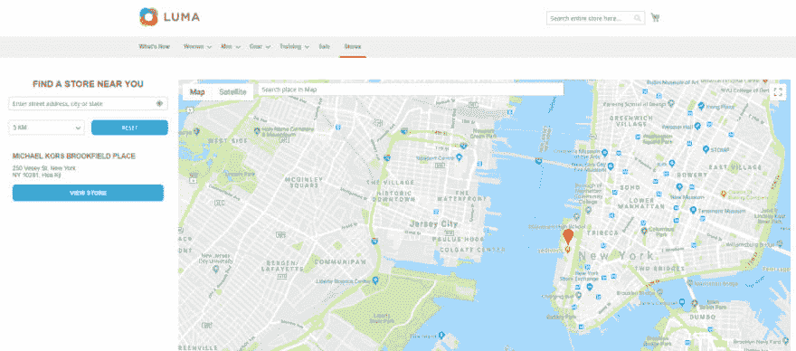
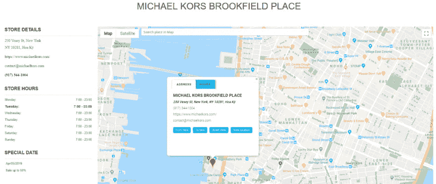
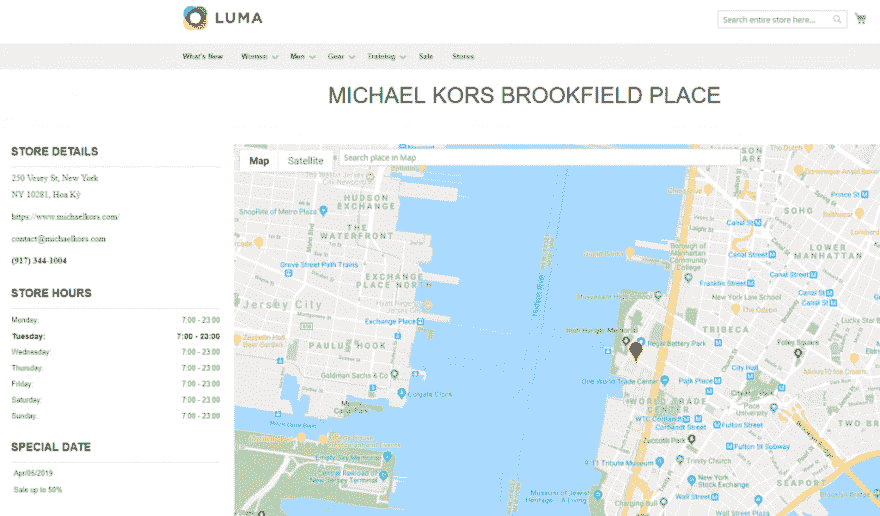
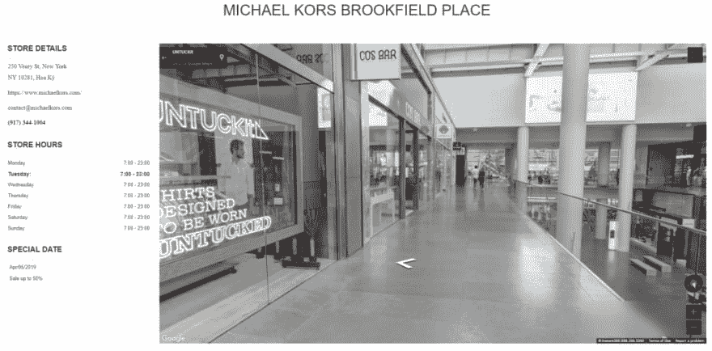
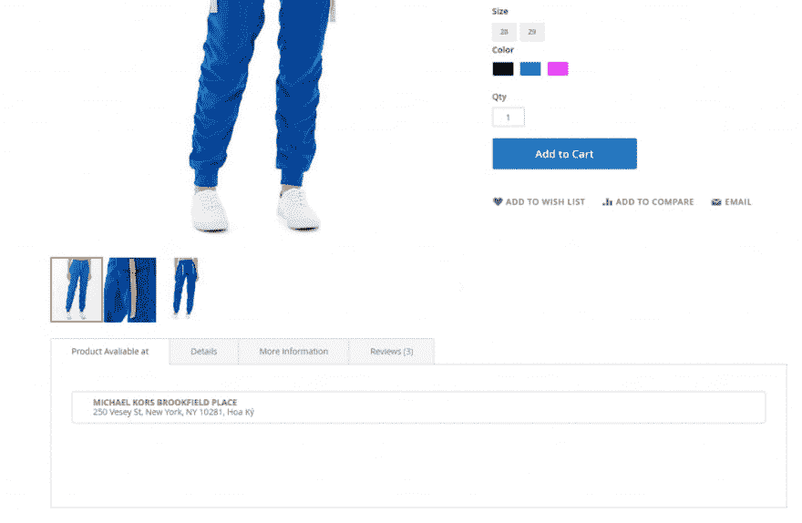
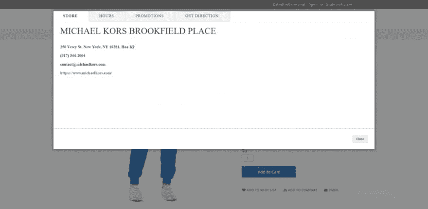

# 使用商店定位器升级您的 Magento 网站！

> 原文：<https://dev.to/magenestjsc/upgrade-your-magento-website-with-store-locator-3l5f>

即使你经营着一个成功的电子商务网站，突出你商店的位置也是极其重要的。忘记实体店的存在，只会减少获得更多收益和扩大自己品牌形象的机会。

随着技术的进步，将 O2O 模式(线上到线下)变为现实已经触手可及。抓住这个机会，将商店的位置与你的在线平台联系起来，这是一件非常重要的事情。

然而，对于买家和店主来说，都有许多与地址相关的问题。对于游客来说，他们可能会在该地区数百家商店中迷路，找不到正确的地址，或者只是不知道该去哪里。就商家而言，他们不知道如何为客户显示位置，或者他们将信息放在错误的地方，从而不可能被注意到。

这里最紧迫的问题是如何在你的店铺所在地吸引顾客的眼球？答案是使用 [商店定位器为 Magento 2](https://store.magenest.com/magento-2/store-locator.html)——Magenest 的一个惊人扩展。让我们告诉你为什么这是你的网站的最佳选择！

与谷歌地图集成，商店定位器列出并推荐最近的商店，为您的顾客提供想要的产品。通过简单的配置，您可以重定向到一个新窗口，谷歌地图显示引导客户到您的目的地。

该扩展具有显著的特色，提升了买卖双方的体验。

**——针对游客:**

他们可以根据距离和地区(国家、城市和邮政编码)搜索特定位置。先进的方向指导客户找到正确的地点，他们寻找估计的距离和时间。当点击商店名称或信息时，他们可以看到所选商店的精确位置。买家可以看到该地区的整个位置列表，最近的商店在哪里，哪个商店仍然有他们想要的商品。

**-针对店主:**

他们可以创建一个现代的、用户友好的界面，让顾客可以与实体店互动。一些主要功能有:

*   设置每个位置的图像
*   直接点击地图设置位置
*   使用纬度和经度手动指定位置
*   设置默认缩放级别
*   店铺详情页面显示可用商品的设置
*   在商品详情页显示店铺列表
*   控制搜索范围
*   启用/禁用地图中的特定商店
*   提供店铺详情、工作时间和特殊日期
*   在商店设置中将产品分配给商店，反之亦然。
*   存储商店的详细信息并更改其类别

以下是 Magento 2 商店定位器的一些功能截图，可帮助您的客户轻松找到您的地址:

<figure> 

<figcaption>找到最近的商店</figcaption>

</figure>

<figure> 

<figcaption>查看地图</figcaption>

</figure>

<figure> 

<figcaption>在地图页面上查看店铺详情</figcaption>

</figure>

<figure> 

<figcaption>街景</figcaption>

</figure>

<figure> 

<figcaption>店铺商品详情页上的</figcaption>

</figure>

<figure> 

<figcaption>更多详情</figcaption>

</figure>

**结论，**

在 Magento 2 商店定位器的帮助下，您可以通过添加有关商店地址的有用信息来优化您的页面。它也是移动友好的，这促进了目前移动商务的发展。

拥有 6 年与 Magento 合作经验的 Magenest 绝对是你的最佳选择。Magenest 还提供 6 个月内的全面支持。所以，不要犹豫，试试最适合你的电子商务网站的定位器- Magento 2 商店定位器 由 Magenest！