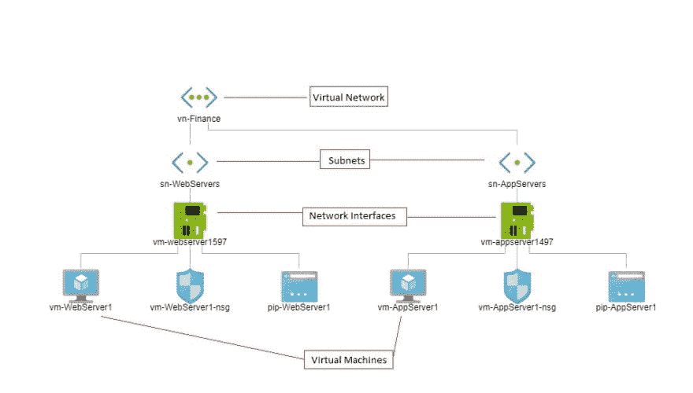

# Azure 网络服务教程

> 原文：<https://dev.to/patricksameerajayalath/azure-network-service-tutorial-5ce2>

在本教程中，我将展示如何:

创建新的资源组
创建虚拟网络并将其与资源组
相关联向虚拟网络添加子网
向虚拟网络添加虚拟机
远程访问虚拟机

在本教程的最后，我们将得到一个类似下图的网络拓扑。
[T3】](https://res.cloudinary.com/practicaldev/image/fetch/s--ANC4Q3nl--/c_limit%2Cf_auto%2Cfl_progressive%2Cq_auto%2Cw_880/https://thepracticaldev.s3.amazonaws.com/i/an4pyhysozcfzf89q2i2.JPG)

你可以在这里找到这个教程[的 PDF 版本。](https://github.com/patricksameerajayalath/AzureTutorials/blob/master/Azure%20Network%20Services.pdf)

你可以找到我所有的 Azure/。Net 教程[这里](https://dev.to/patricksameerajayalath)。

尽情享受吧！！