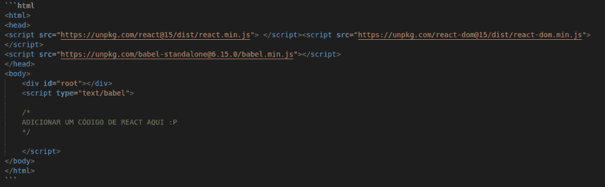
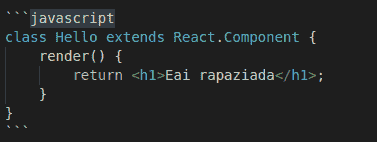
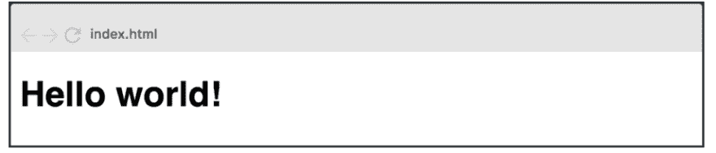
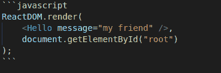
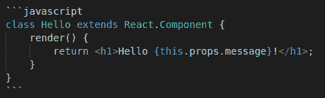
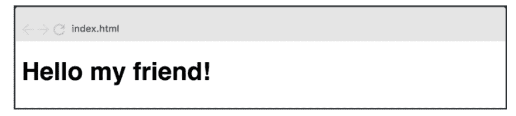

# 5 分钟后快速介绍 react . js。

> [https://dev . to/ananierdev/uma-fast-introduction Cao-over-react-js-em-5min-2191](https://dev.to/ananeridev/uma-rapida-introducao-sobre-react-js-em-5min-2191)

#### 本教程完全由我翻译和改编，所以内容不是完全属于我！！！但由于我觉得很有趣，我决定把它留在我的网站( [https://anabneri.com.br/](https://anabneri.com.br/) 上，因为它帮助了我，我相信它可以帮助更多的人！享受疑惑

## 构型

开始使用 REACT 时，应使用尽可能简单的设置:使用脚本标记导入库“`React`”和“`ReactDOM`”的 HTML 文件，如下所示:

我们也进口 Babel，因为 React 使用 JSX 来写标记。我们需要将 JSX 转换为简单的 JavaScript，以便浏览器能够理解它。

还有两件事你需要注意:

1.  a`#root`的 ID 为`#root`。这是我们应用程序的入口点。这是我们整个应用程序将要居住的地方。
2.  o〔t0〕体内的标记。这就是我们编写 React. js 代码的地方。

如果你想试试代码，看看这个 Scrimba 操场。

## 组件/部件

REACT 中的所有内容都是一个组件，这些组件通常采用 JavaScript 类的形式。您可以通过扩展`react-component`类来创建组件。我们将创建一个名为“`Eai rapaziada`”的组件。

所以这里我们把我们的组件`Hello`连接到应用程序的入口点(`

`。结果是:

刚才看(`<h1>`和`<Hello/>`的 html‘ish’语法是我前面提到的 JSX 代码。它实际上不是 HTML，尽管你在那里写的东西最终会在 DOM 中以 HTML 标记的形式出现。

下一步是获取我们处理数据的应用程序。

## 数据处理

React 中有两种数据类型:props 和 State。两者之间的区别一开始有点复杂，所以不要担心会发现他有点糊涂。当你开始和他们合作会变得更容易。

主要区别在于状态是专用的，可以在组件本身内更改。紧固件是外部的，不受零部件本身的控制。它从层次结构上方的组件移动，这些组件也控制数据。
**一个元件可以直接改变其内部状态。他不能直接改变自己的粘连。”**

我们先仔细看一下蜂胶/粘合剂。

## 清洁/粘接

我们的组件`Hello`非常静态，独立呈现相同的信息。REACT 的很大一部分是重用，这意味着能够编写一次组件，然后在不同的使用情况下重用该组件，例如显示不同的消息。

为了实现这种再利用，我们将增加粘合剂。您可以通过以下方式将附件传递给组件:

此属性名为`message`，值为【我的朋友】。我们可以通过引用`this. props. Message`来访问 Hello 组件中的此属性，如下所示:

因此，将在屏幕上渲染此内容:

我们写作的原因{this. props .message } with keys 是因为我们需要通知 JSX 我们要添加 JavaScript 表达式。这叫做* *逃跑* * this is called * * running * *。

现在，我们有了一个可重复使用的组件，它可以呈现我们想要在页面上显示的任何消息。哇哦！

...

继续在我的网站上阅读【5 分钟后回复】全文