# SQL 逐步注入第 2 部分

> 原文：<https://dev.to/nileshsanyal/sql-injection-step-by-step-part-2-6f8>

这篇文章最初发表在我的个人博客上，请点击查看文章[。](https://www.devhelperworld.in/2019/06/sql-injection-part-2.html)

这篇文章是 sql 注入系列的最后一部分。如果你错过了第一部分，你可以在这里阅读。

### **我们将创造什么**

我们将创建一个帖子列表页面，用户可以通过输入帖子标题或描述来搜索任何帖子。

[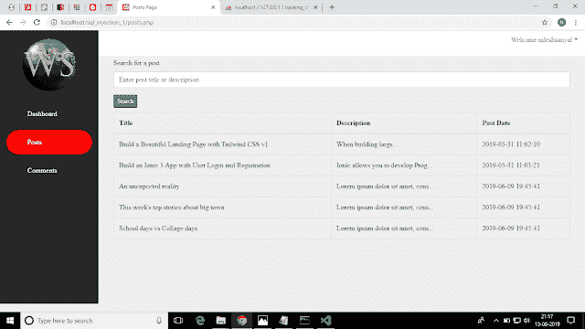](https://res.cloudinary.com/practicaldev/image/fetch/s--fjJKQX6q--/c_limit%2Cf_auto%2Cfl_progressive%2Cq_auto%2Cw_880/https://1.bp.blogspot.com/-EfbaQp3uNMQ/XQJws8cNluI/AAAAAAAAAzY/-JW45ehrar8fBwAppTF_aTy6VRxMZCpVgCLcBGAs/s640/posts_home_page.png)

### **创建帖子表**

你可能想知道文章是如何在文章页面中显示的。如果你看到上面的截图，用户不能创建文章，因为没有为他们提供这样做的表单。

嗯，我是有意这样做的，这样您就可以专注于深入学习 sql 注入的内部工作原理。

为了让帖子以这种方式可见，我们需要使用 php myadmin 实用程序创建 posts 表，在从 XAMPP 控制面板启动 apache 服务器和 mysql 数据库服务之后，我们可以通过在浏览器中输入这个 URL "[http://localhost/phpmyadmin/](http://localhost/phpmyadmin/)"来使用这个表。

posts 表的表结构如下。

[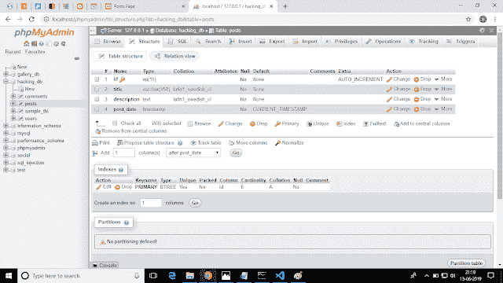](https://res.cloudinary.com/practicaldev/image/fetch/s---YtMs0ol--/c_limit%2Cf_auto%2Cfl_progressive%2Cq_auto%2Cw_880/https://1.bp.blogspot.com/-xpwouCQAb6w/XQJ9MzmITJI/AAAAAAAAAzw/TNMMf-Pmt-4cgnVloCIF-ow4NN8Bm9xkwCLcBGAs/s640/posts_tbl_structure.png)

posts 表的数据如下。

[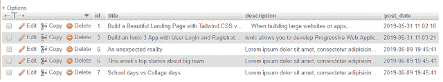](https://res.cloudinary.com/practicaldev/image/fetch/s--Ypfj_AEC--/c_limit%2Cf_auto%2Cfl_progressive%2Cq_auto%2Cw_880/https://1.bp.blogspot.com/-69rxk-NOvDY/XQJ-K1NJEKI/AAAAAAAAAz8/gf-nC372w-sd_3DRbFvyv2P-IqcRC0eKgCLcBGAs/s640/posts_tbl_data.png)

posts.php 页面的代码如下所示。

```
<?php session_start(); ?>
<?php
    if($_SESSION['session_username'] !='' && !empty($_SESSION['session_username'])){
?>
<!DOCTYPE html>
<html lang="en">
    <head>
        <meta charset="UTF-8">
        <title>Posts Page</title>
        <link href="css/bootstrap.min.css" rel="stylesheet" id="bootstrap-css">
        <link href="css/dashboard.css" rel="stylesheet">
        <link rel="stylesheet" href="css/datatable/dataTables.bootstrap4.min.css">
    </head>
    <body>
        <nav class="navbar navbar-expand-lg navbar-dark fixed-top" id="mainNav">
            <button class="navbar-toggler navbar-toggler" type="button" data-toggle="collapse" data-target="#navbarResponsive" aria-controls="navbarResponsive" aria-expanded="false" aria-label="Toggle navigation"><span class="navbar-toggler-icon"></span></button>
            <div class="collapse navbar-collapse" id="navbarResponsive">
                <ul class="navbar-nav navbar-sidenav">
                    <a class="nav-link navlogo text-center" href="dashboard.php">
                        
                    </a>
                    <li class="nav-item">
                        <a class="nav-link sidefrst" href="dashboard.php">
                            <span class="textside">  Dashboard</span>
                        </a>
                    </li>
                    <li class="nav-item">
                        <a class="nav-link sidesecnd active-nav-item" href="posts.php">
                            <span class="textside">  Posts</span>
                        </a>
                    </li>
                    <li class="nav-item">
                        <a class="nav-link sidesthrd" href="add_comment.php">
                            <span class="textside">  Comments</span>
                        </a>
                    </li>
                </ul>

                <ul class="navbar-nav2 ml-auto">
                    <li class="dropdown">
                        <a href="#" class="dropdown-toggle" data-toggle="dropdown">Welcome <?php echo $_SESSION['session_username']; ?></a>
                        <ul class="dropdown-menu">
                            <li class="resflset"><a href="logout.php"><i class="fa fa-fw fa-power-off"></i> Logout</a></li>
                        </ul>
                    </li>
                </ul>

            </div>
        </nav>
        <div class="content-wrapper">
            <div class="container-fluid">
                <div class="row"> <br>
                    <div class="col-md-12 text-right" style="margin-top: 3px;">
                        <a class="btn btn-primary btn-md" href="add_post.php">Add Post</a>
                    </div>
                    <div class="col-md-12">
                        <form method="get" action="">
                            <div class="form-group">
                                <label>Search for a post</label>
                                <input type="text" name="title" placeholder="Enter post title or description" class="form-control">

                            </div>
                            <input type="submit" value="Search" name="searchBtn" class="btn btn-sm btn-success">
                        </form>
                    </div>
                    <div class="col-md-12" style="margin-top:10px;">
                        <table id="post_tbl" class="table table-hover table-bordered" style="width:100%">
                            <thead>
                                <tr>
                                    <th>Title</th>
                                    <th>Description</th>
                                    <th>Post Date</th>
                                </tr>
                            </thead>

                            <?php 
                                $conn = mysqli_connect("localhost", "root", "", "hacking_db");
                                if(!$conn){
                                    die("connection error");
                                 }

                                $search_keyword = isset($_GET['title']) ? mysqli_real_escape_string($conn,  $_GET['title']) : '' ;

                                $posts_sql = "select * from `posts` WHERE title LIKE '%$search_keyword%' OR description LIKE '%$search_keyword%' ";

                                $posts = mysqli_query($conn,$posts_sql);

                             ?>

                            <tbody>

                                 <?php
                                    if(!$posts) { ?>

                                        <tr>
                                            <td><?php die("Error: " . mysqli_error($conn)); ?></td>
                                        </tr>

                                <?php   } ?>

                                <?php 
                                    if(mysqli_num_rows($posts) != 0){
                                        while($postsRow = mysqli_fetch_array($posts)) {
                                 ?>
                                        <tr>
                                            <td><?php echo isset($postsRow['title']) ? $postsRow['title'] : ''; ?></td>
                                            <td>
                                                <?php echo isset($postsRow['description']) ? mb_strimwidth($postsRow['description'], 0, 35, "...") : ''; ?>
                                            </td>
                                            <td>
                                                <?php echo isset($postsRow['post_date']) ? $postsRow['post_date'] : ''; ?>
                                            </td>
                                        </tr>
                                <?php 
                                        }
                                    }  else {

                                ?> 

                                <tr>
                                    <td colspan="3">No posts found!</td>
                                </tr>

                                <?php   
                                    }
                                    mysqli_close($conn);
                                ?>

                            </tbody>
                        </table>
                    </div>
                </div>
            </div>
        </div>
        <script src="js/jquery.min.js"></script>
        <script src="js/bootstrap.min.js"></script>
    </body>
</html>
<?php } else {
    header('Location: login.php');
} ?> 
```

<svg width="20px" height="20px" viewBox="0 0 24 24" class="highlight-action crayons-icon highlight-action--fullscreen-on"><title>Enter fullscreen mode</title></svg> <svg width="20px" height="20px" viewBox="0 0 24 24" class="highlight-action crayons-icon highlight-action--fullscreen-off"><title>Exit fullscreen mode</title></svg>

**posts.php 的解释**

在这个页面中，首先我们检查用户是否已经登录。如果用户已登录，则他或她可以查看帖子页面，否则他或她会被重定向到登录页面。

我们从文本框中获取搜索关键字，当用户提交表单时，我们通过 GET 请求收集文本框内容。

然后，我们通过比较帖子的标题或描述与搜索关键字来检查是否找到匹配。如果找到任何匹配，我们会在表格中显示结果。如果不存在与关键字完全匹配的帖子，我们会显示一条消息“没有找到帖子！”。

如果由于某种原因，数据库无法处理搜索关键字，我们会向用户显示一个 sql 错误。

**提取完整的数据库细节**

我们完成了这个应用程序的帖子搜索功能。让我们看看如何利用这个应用程序，这样我们就可以从中获得完整的数据库细节。为此，我们将使用 MySQL 数据库的 UNION 运算符。

**并集运算符基础**

*   使用 UNION 运算符是为了将两个或更多 sql 语句的多个结果链接在一起。

*   UNION 中的每个 SELECT 语句必须具有相等的列数。

所以，我们现在知道，成功运行 UNION 语句的基本要求是什么。让我们看看我们能做些什么。

为此，我们需要使用 MySQL 的 ORDER BY 子句。我们将在搜索文本框中输入特定的 ORDER BY 语句，并查看是否显示任何 sql 错误。如果发生这种情况，我们只需减少 ORDER BY 子句中使用的数值。

如果我们看到“找不到帖子！”消息，那么就可以了，我们可以通过增加 ORDER BY 子句中使用的数值来再次检查。完成这一步后，我们可以得到 posts 表中的列总数。

第一次尝试的屏幕截图如下所示。

[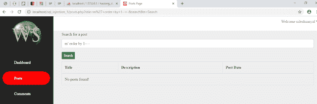](https://res.cloudinary.com/practicaldev/image/fetch/s--2hbRV7B6--/c_limit%2Cf_auto%2Cfl_progressive%2Cq_auto%2Cw_880/https://1.bp.blogspot.com/-TikXiU13wKY/XQR9hTOnr-I/AAAAAAAAA0s/9REmgaPRQiQBPKiqqlJn9mJoEk6Q3Y3dQCLcBGAs/s640/num_of_columns1.png)

最终尝试的屏幕截图如下所示。

[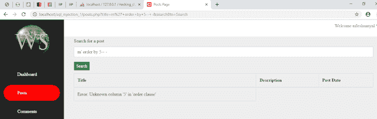](https://res.cloudinary.com/practicaldev/image/fetch/s--cGA3d_2I--/c_limit%2Cf_auto%2Cfl_progressive%2Cq_auto%2Cw_880/https://1.bp.blogspot.com/-aWvDgd4O_VU/XQR9viXcMbI/AAAAAAAAA0w/RdJVToOUrDIDfM3pG4zd0gHXd5smO_pfwCLcBGAs/s640/num_of_columns_final.png)

从上面的屏幕截图中，我们看到了错误消息。因此，我们知道，posts 表正好包含 4 列。

让我们**使用**这个信息来获得这个应用程序中使用的数据库的大量信息。

### **获取 MySQL 数据库名称**

[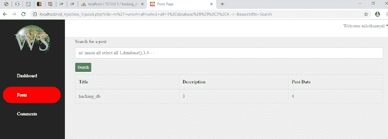](https://res.cloudinary.com/practicaldev/image/fetch/s--QeJ-UmFQ--/c_limit%2Cf_auto%2Cfl_progressive%2Cq_auto%2Cw_880/https://1.bp.blogspot.com/-Q0meLE5K1Gc/XQR_hLt3pZI/AAAAAAAAA08/VX7aV1JEBaocm6rSD5JgodiaV8RcKzqPgCLcBGAs/s640/get_db_details.png)

### **获取 MySQL 数据库表**

[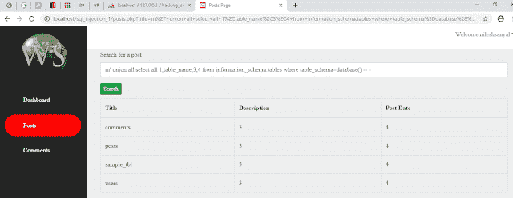](https://res.cloudinary.com/practicaldev/image/fetch/s--yVFfwpvn--/c_limit%2Cf_auto%2Cfl_progressive%2Cq_auto%2Cw_880/https://1.bp.blogspot.com/-4s8B-CnVNqM/XQSAK3GTwsI/AAAAAAAAA1Q/O61k5J3_vSQ-qCL3DYm2l9w4IirMNbgOQCLcBGAs/s640/list_of_tables.png)

### **获取用户表的列**

[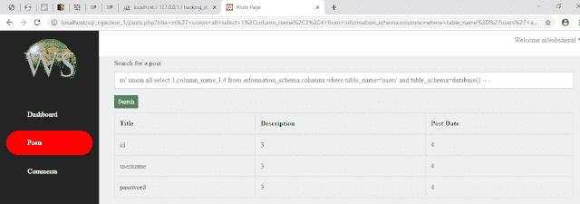](https://res.cloudinary.com/practicaldev/image/fetch/s--FVcLaFlU--/c_limit%2Cf_auto%2Cfl_progressive%2Cq_auto%2Cw_880/https://1.bp.blogspot.com/-9UjVWpak2SI/XQSAlXEnSuI/AAAAAAAAA1c/X0MMHz5etmEj4Ij4HgfRj4AazXz2m7f4wCLcBGAs/s640/users_table_columns.png)

### **获取用户表的 id、用户名和密码列**

[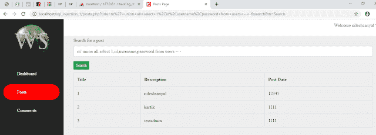](https://res.cloudinary.com/practicaldev/image/fetch/s--1ehbCodD--/c_limit%2Cf_auto%2Cfl_progressive%2Cq_auto%2Cw_880/https://1.bp.blogspot.com/-HiXXSkbqTuc/XQSA-nqXwrI/AAAAAAAAA1k/DcPFOFM3igkNTeLVj7yG9SurXRSg8MvtgCLcBGAs/s640/users_table_records.png)

### **阻止 SQL 注入**

如果您想要阻止 SQL 注入，那么本节将帮助您完全理解阻止 SQL 注入。如果不知道什么是 sql 注入，可以在这里阅读[。](https://dev.to/nileshsanyal/know-all-about-sql-injection-in-depth-4lb8)

为了防止 SQL 注入，你将能够得到一组实际的例子，这样你就不会觉得理解这个概念很难。

### **我们要做什么**

之前，我们看到了攻击者如何使用 sql 注入来绕过登录，利用数据库并能够获得有关数据库的详细信息。现在，我们将阻止攻击者这样做。

### **保护登录页面**

在下面的屏幕截图中，用白色标记的突出显示的文本将保护所有类型的 sql 注入攻击。

[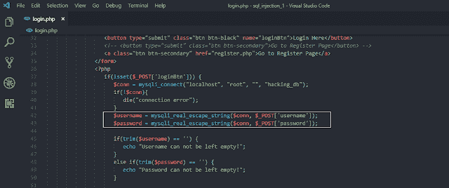](https://res.cloudinary.com/practicaldev/image/fetch/s--kqX0CXrS--/c_limit%2Cf_auto%2Cfl_progressive%2Cq_auto%2Cw_880/https://1.bp.blogspot.com/-dwNejrF6EAA/XQZSv-DfMAI/AAAAAAAAA3Y/QdTRe5XFg4AqhOvu0zQjyegRaNPzeFfmQCPcBGAYYCw/s640/protected_1_code.png)

完成这些更改后，刷新登录页面，并尝试再次进行登录绕过攻击，您将看到类似下面的屏幕截图。

[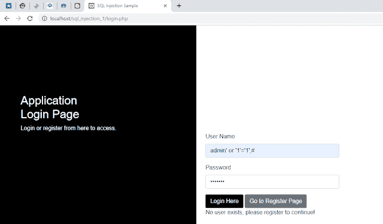](https://res.cloudinary.com/practicaldev/image/fetch/s--VWfc7NI5--/c_limit%2Cf_auto%2Cfl_progressive%2Cq_auto%2Cw_880/https://1.bp.blogspot.com/-rtPtHfwP1CA/XQZTM90glUI/AAAAAAAAA3k/JzODldH-3I0UJQqt_8qiWbNcyZncEo76QCPcBGAYYCw/s640/protected_1.png)

### **护帖页面**

简单地，添加标记的代码，如下面的屏幕截图所示。

[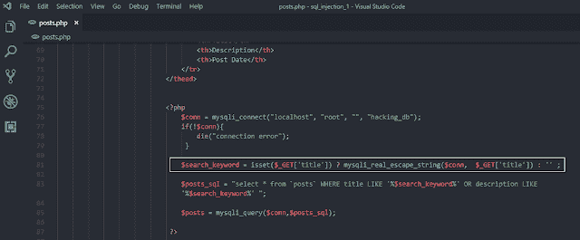](https://res.cloudinary.com/practicaldev/image/fetch/s--o5Rj-aeK--/c_limit%2Cf_auto%2Cfl_progressive%2Cq_auto%2Cw_880/https://1.bp.blogspot.com/-9WFflO7zSqQ/XQZTj4gb0dI/AAAAAAAAA3s/dNjAz9Ez8s4YDparoOBeWYN3exHOUVnCQCPcBGAYYCw/s640/protected_2_code.png)

完成此步骤后，尝试执行使用 union 语句的 sql 注入攻击。您将看到类似的结果，如下面的屏幕截图所示。

[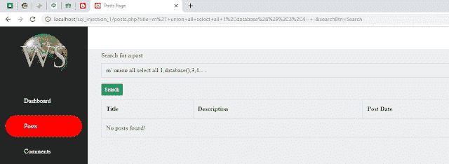](https://res.cloudinary.com/practicaldev/image/fetch/s--5z1jOPdk--/c_limit%2Cf_auto%2Cfl_progressive%2Cq_auto%2Cw_880/https://1.bp.blogspot.com/-H-BuM4iiQm8/XQZUFdOiccI/AAAAAAAAA30/FNryio0EpXwZD2vjFwydjTN9eUCE_K97wCPcBGAYYCw/s640/protected_2.png)

### **最后的话**

如果你觉得这篇关于学习 sql 注入的第 2 部分的文章很有帮助，请与他人分享。谢谢大家！