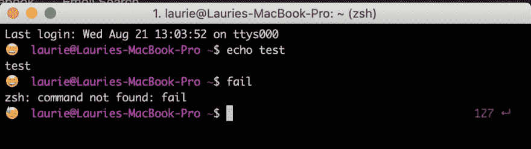

# 将表情状态添加到终端(ZSH)

> 原文：<https://dev.to/laurieontech/adding-an-emoji-status-to-terminal-zsh-4cnd>

这篇文章的灵感很大程度上归功于 [@yechielk](https://dev.to/yechielk) 。他昨晚发布了这条推文，我和其他人一样，也想添加表情符号来对我的命令的成功做出反应！

液体错误:内部

该指南可能适用于其他设置，但在这种情况下，我运行的是`zsh`，具体来说是`oh-my-zsh`，因此说明是基于此。

### 1 -导航至主题文件夹

`oh-my-zsh`使用主题来定义终端窗口的视觉显示。所以我们将从导航到主题所在的文件夹开始。

```
cd ~/oh-my-zsh/themes 
```

<svg width="20px" height="20px" viewBox="0 0 24 24" class="highlight-action crayons-icon highlight-action--fullscreen-on"><title>Enter fullscreen mode</title></svg> <svg width="20px" height="20px" viewBox="0 0 24 24" class="highlight-action crayons-icon highlight-action--fullscreen-off"><title>Exit fullscreen mode</title></svg>

### 2 -找出你正在运行的主题

该文件夹中有大量主题，但我们只想编辑我们正在运行的主题。所以让我们找出那是什么。

```
echo $ZSH_THEME 
```

<svg width="20px" height="20px" viewBox="0 0 24 24" class="highlight-action crayons-icon highlight-action--fullscreen-on"><title>Enter fullscreen mode</title></svg> <svg width="20px" height="20px" viewBox="0 0 24 24" class="highlight-action crayons-icon highlight-action--fullscreen-off"><title>Exit fullscreen mode</title></svg>

### 3 -导航到主题文件

我正在运行我多年来定制的`alanpeabody`。所以让我们打开那个文件。

> 对，我用`nano`！它对我有用。你可以使用`vim`或者其他任何对你有用的东西。

```
nano alanpeabody.zsh-theme 
```

<svg width="20px" height="20px" viewBox="0 0 24 24" class="highlight-action crayons-icon highlight-action--fullscreen-on"><title>Enter fullscreen mode</title></svg> <svg width="20px" height="20px" viewBox="0 0 24 24" class="highlight-action crayons-icon highlight-action--fullscreen-off"><title>Exit fullscreen mode</title></svg>

### 4 -创建一个将设置表情符号的变量

这是我们正在做的事情的核心，不是我写的。我是从[@ yechielk](https://dev.to/yechielk)[dot files](https://github.com/achasveachas/yechiels-dotfiles)里抄来的，做了一些修改。更聪明地工作，而不是更努力地工作！

请注意，你可以用任何你想要的表情符号，甚至文字来替换这些面孔。

```
local emoji="${debian_chroot:+($debian_chroot)}\$(if [ \$? == 0 ]; then echo 😊$; else echo 😓; fi) “ 
```

<svg width="20px" height="20px" viewBox="0 0 24 24" class="highlight-action crayons-icon highlight-action--fullscreen-on"><title>Enter fullscreen mode</title></svg> <svg width="20px" height="20px" viewBox="0 0 24 24" class="highlight-action crayons-icon highlight-action--fullscreen-off"><title>Exit fullscreen mode</title></svg>

### 5 -添加变量到提示

最后一步是找到你的提示在主题中的声明位置。我的在文件的底部，并被恰当地命名为`PROMPT`。使用适当的语法在定义前加上表情符号变量，我们就可以开始比赛了。

```
PROMPT="${emoji}${user}  ${pwd}$  " 
```

<svg width="20px" height="20px" viewBox="0 0 24 24" class="highlight-action crayons-icon highlight-action--fullscreen-on"><title>Enter fullscreen mode</title></svg> <svg width="20px" height="20px" viewBox="0 0 24 24" class="highlight-action crayons-icon highlight-action--fullscreen-off"><title>Exit fullscreen mode</title></svg>

请注意，该字符串中的空格也被考虑在内。我在最后有一个，所以我输入的命令与我的提示间隔开，但我删除了表情符号和我的用户之间的那个，因为它占用了表情符号视觉缓冲区之外不必要的空间。

### 完成！

仅此而已。请记住重新启动您的终端，以便这些更改可以生效。玩得开心！

> 劳里[@ laurieontech](https://dev.to/laurieontech)是的！！！开始工作了。欢迎表情符号来到我的终端🎉另外，出于好奇，我在使用 zsh。为了让这个工作正常，我遵循了这篇文章底部的说明:
> 2019 年 8 月 21 日下午 17:08[](https://twitter.com/intent/tweet?in_reply_to=1164222656717172736)[](https://twitter.com/intent/retweet?tweet_id=1164222656717172736)[](https://twitter.com/intent/like?tweet_id=1164222656717172736)