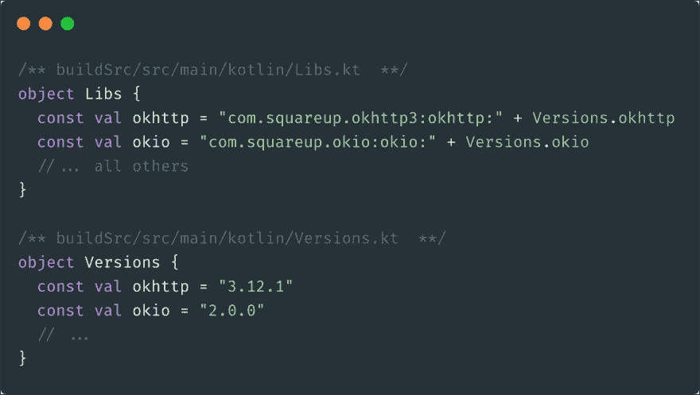

# Android Studio 3.5 中更好的依赖管理

> 原文：<https://dev.to/jmfayard/better-dependency-management-in-android-studio-3-5-with-gradle-buildsrcversions-34e9>

Android Studio 3.5 发布了！你更新了吗？去[https://developer.android.com/studio](https://developer.android.com/studio)，我会等。

就我个人而言，最让我兴奋的不是任何新功能，而是一个 bugfix，它让 android 开发者再次关注我的开源依赖管理项目。

## [【jmfaard】](https://github.com/jmfayard)/[刷新版](https://github.com/jmfayard/refreshVersions)

### 生命太短暂，没有时间去谷歌依赖和版本

<article class="markdown-body entry-content container-lg" itemprop="text">

# 什么是 refreshVersions？

**refreshVersions** 帮助**grade**用户完成**繁琐的手工工作**通常涉及添加和更新**依赖项及其版本**。

[](http://www.youtube.com/watch?v=VhYERonB8co "Gradle refreshVersions")

## 证明文件

*   [从这里开始](https://jmfayard.github.io/refreshVersions/)
*   [设置刷新版本](https://jmfayard.github.io/refreshVersions/setup/)
*   [迁移您的项目](https://jmfayard.github.io/refreshVersions/migrate/)
*   [查找可用的依赖关系更新](https://jmfayard.github.io/refreshVersions/update-dependencies/)
*   [添加依赖关系](https://jmfayard.github.io/refreshVersions/add-dependencies/)
*   [探索内置依赖符号](https://jmfayard.github.io/refreshVersions/dependency-notations/)
*   [计划刷新版本机器人](https://jmfayard.github.io/refreshVersions/refreshversions-bot/)
*   [使用 buildSrc](https://jmfayard.github.io/refreshVersions/gradle-buildsrcversions/)
*   [变更日志](https://jmfayard.github.io/refreshVersions/CHANGELOG/)

[**参见 https://jmfayard.github.io/refreshVersions**T3 的文档](https://jmfayard.github.io/refreshVersions/)

## 设置

```
// settings.gradle(.kts)
plugins {
    // See https://jmfayard.github.io/refreshVersions
    id("de.fayard.refreshVersions") version "0.50.2"
}
refreshVersions { // Optional: configure the plugin
    // ...
}
```

<svg width="20px" height="20px" viewBox="0 0 24 24" class="highlight-action crayons-icon highlight-action--fullscreen-on"><title>Enter fullscreen mode</title></svg> <svg width="20px" height="20px" viewBox="0 0 24 24" class="highlight-action crayons-icon highlight-action--fullscreen-off"><title>Exit fullscreen mode</title></svg>

[阅读友好文档](https://jmfayard.github.io/refreshVersions/setup/)

## 使用

确保项目设置正确(见上文)。

**迁移项目:**

任务可以帮助你在几分钟或者更短的时间内迁移你的项目。

在版本 0.50.0 中，增加了对 Gradle 版本目录的支持([参见这里的讨论线程](https://github.com/jmfayard/refreshVersions/discussions/592))，所以现在需要一个`--mode`选项。

在没有它的情况下运行它来查看完整的列表和完整的描述…

</article>

[View on GitHub](https://github.com/jmfayard/refreshVersions)

这个项目诞生于对 Android Studio 这个黑暗角落日益增长的厌恶:

> 🙀Gradle 项目同步失败。[ **再试一次**🙀

[](https://res.cloudinary.com/practicaldev/image/fetch/s--uoWw2rvR--/c_limit%2Cf_auto%2Cfl_progressive%2Cq_auto%2Cw_880/https://github.com/jmfayard/buildSrcVersions/raw/master/doc/try-again.png)

**“再试一次”**在这里有点用词不当。

## Android Studio 对编辑 Gradle 文件的支持很差😿

总的来说，Android Studio 是一个出色的 IDE，与 Gradle 的集成是它的一个重要组成部分。因此，您会期望拥有强大的工具支持来编辑您的构建文件。

相反，这个错误消息正是它崩溃的时刻。不要说*再试一次*，措辞应该更像这样:“*你在某个地方有一些错误，你要靠你自己去修正它。祝你好运，告诉我你什么时候**认为**你完成了。*”。

开发人员的体验变得更像是您对 JavaScript 世界的期望。你从某个网站复制/粘贴了一些东西，希望是在正确的地方(这不是小事！).抱着最好的希望，您运行它并抛出一个神秘的错误消息。重复一遍。

为什么明面这么差？与 javascript 世界中的原因非常相似:我们正在使用动态语言(Groovy)做大量的元编程工作(使用 Gradle 插件)。

Gradle 有正确的长期计划来克服这个问题:[少写 Groovy，多写 Kotlin](https://dev.to/jmfayard/how-kotlin-makes-editing-your-gradle-build-less-frustrating-232l) 。

虽然 Kotlin 可能是未来，但 Groovy 是现在。我们需要一些渐进的进展来帮助我们现在已经存在的构建。

## grad le " build src "模块😼

在 Android Studio 3.5 中，Gradle 的“buildSrc”模块可以派上用场。

> “buildSrc”是一个 Gradle 模块，在这里你可以像往常一样编写 Kotlin 代码(有完整的工具支持)。然后，您的所有构建文件都可以使用这些代码，而不是您的最终应用程序。关键的是 IntelliJ IDEA 和 Android Studio 很好地支持从`build.gradle`开始调用它

你可以把所有有点复杂或者应该重用的东西都放在那里，让你的`build.gradle`文件保持整洁。

我想到的主要用例是替换我们以前编写的 Groovy [libraries.gradle 文件](https://github.com/abbas-oveissi/SearchMovies/blob/607ce1c6f9aa48669ab1b91f8824e9251f2a1fa5/libraries.gradle):

[](https://res.cloudinary.com/practicaldev/image/fetch/s--P4AvL9p6--/c_limit%2Cf_auto%2Cfl_progressive%2Cq_auto%2Cw_880/https://miro.medium.com/max/1278/1%2A1Neqbi_bfoUscWrxhu2NbA.png)

这很简单，但是...我必须手动编写所有这些代码吗？

懒惰是程序员的三大美德之一，所以我写了一个插件，询问 Gradle 我的项目使用了哪些依赖项，并让 [KotlinPoet](https://github.com/square/kotlinpoet) 生成这些文件。

## Gradle buildSrcVersions😸

通过编辑根文件`build.gradle(.kts)`安装插件，如下所示: