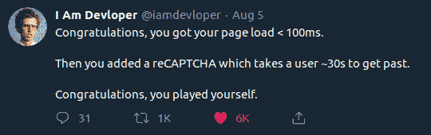

# 开发者的互联网

> 原文：<https://dev.to/bhupesh/internet-for-developers-gj2>

以下是我作为开发者对一些互联网社区/社交媒体的建议。这是一个个人建议，如果你发现更多，请在下面评论。

## [开发到](https://dev.to/)

> 程序员在这里分享想法，互相帮助成长。这是一个分享和发现伟大想法、进行辩论和交朋友的在线社区。任何人都可以分享文章、问题、讨论等。只要他们有权分享他们的话。欢迎从你自己的博客交叉发帖。

这个平台实现了它在关于页面中所说的，对于任何类型的开发者来说都是最好的社区之一。

DEV 是每个人的一切。

*   你是一个寻找联系的初学者，DEV 适合你，
*   你是一名专业开发人员，想要指导年轻的同事，DEV 就是为你准备的。
*   想写博客，DEV 是给你的。
*   想学编程，DEV 适合你。
*   想发布工作，开发是给你的。
*   想促进你的副业，开发是给你的。

## [产品搜索](https://www.producthunt.com)

这是一个创客的宫殿，你可以在这里找到一些谷歌搜索不到的酷东西。

从把你的谷歌电子表格变成一个 API 到使用人工智能寻找域名，你会在这里找到疯狂的东西。

## [电报](https://telegram.org/)

> 什么？电报当真？

是的，我觉得它有时比 Whats App 更好(这是一个长期的辩论，就让它去吧)有一些有趣的渠道和群体，你可以作为一个开发人员关注。

其中一些我跟随:

*   频道
    *   [雇佣](https://t.me/thehire)
    *   [终极免费增值课程](https://t.me/freecourse)
    *   github rest
    *   [GitHub 趋势](https://t.me/githubtrending)
    *   [开发人员](https://t.me/thedevs)
    *   [实习更新](https://t.me/internshipsIndia)
    *   [每日 C++](https://t.me/dailycpp)
    *   [🎓DevChampions —与我们一起成长](https://t.me/devchampions)
    *   [Techjobs](https://t.me/technicaljobs)
    *   [竞争性编程](https://t.me/daily1interviewprogram)
    *   [JavaScript 每日](https://t.me/javascriptdaily)
    *   计算机科学家
    *   [编程技巧💡](https://t.me/ProgrammingTip)
    *   [编程的艺术](https://t.me/theprogrammingart)
    *   [有声图书存档](https://t.me/AudiobooksArchive)
    *   [Python 资源](https://t.me/pythonres)
    *   [垃圾箱🛃👾](https://t.me/BinBreaker)
    *   [免费开源知识](https://t.me/free_open_source_knowledge)

顺便说一句，如果你想用电报联系我，我是@[bhupe 本人](https://t.me/bhupeshimself)

## [推特](https://twitter.com/)

Twitter 是一个很好的联系人们的社交平台，Twitter 上有一些很棒的开发者，他们提供了很大的动力。

我认为 Twitter 上的开发者生态系统比任何其他社交媒体(如 facebook、Insta)都好得多。你也可以在这里找到[# 100 daysofcode](https://twitter.com/hashtag/100daysfocode?src=hashtag_click)&[# 30 daysofcode](https://twitter.com/hashtag/30DaysOfCode?src=hashtag_click)的趋势。

## [黑客新闻](https://news.ycombinator.com/)

这是一个略有不同的平台，我用它来获取现成的科技新闻，这在你的社交媒体上不容易找到。我使用之后的[安卓应用在旅途中阅读黑客新闻。](https://play.google.com/store/apps/details?id=com.fynally.hackernews&hl=en_US)

## [堆栈溢出](https://stackoverflow.com/)

你肯定听说过，对吧？程序员复制东西的地方？但是你有关于 SO 的资料吗？不，去做吧。

从长远来看，在 SO 上出现可能会对你有所帮助(我是说我已经在 SO 上呆了很多年了😆，不过说真的)。

*   你将会了解这个社区是如何工作的(你已经按 Ctrl + Cing 有一段时间了)。
*   雇主可能会注意到你的简历。
*   当你帮助别人时，你会学到新的东西。

现在就去做吧，这对你肯定有好处。

## [T1](#techcrunch)[TechCrunch](https://techcrunch.com/)

这是一个科技新闻网站，就像黑客新闻一样，你可以将它添加到你的每日科技报道书签中，或者你可以下载他们的[安卓](https://play.google.com/store/apps/details?id=com.aol.mobile.techcrunch&hl=en_US)、 [iOS](https://apps.apple.com/in/app/techcrunch/id526058642) 应用。

## [哈克顿](https://hackernoon.com/)

你可能以前读过 HackerNoon 上的文章/故事，它们经常出现。

但是你知道你可以在 HackerNoon 上免费写作吗，在这里阅读。你也可以每周直接在你的邮箱里收到 HackerNoon 的文章，[订阅](https://hackernoon.com/#subscribe-embed)他们的时事通讯。你也可以在这里加入他们的社区[。](https://community.hackernoon.com/)

## [freeCodeCamp](https://www.freecodecamp.org/)

如果你想在今年学习编程，我会推荐你一定要去看看 freeCodeCamp，他们有很多免费的指导课程，教你从绝对的基础开始，它还提供免费的认证。

freeCodeCamp 也有一个出版系统，就像 HackerNoon 一样，它有超过 5000+的教程，或者如果你想，你可以为 freeCodeCamp 写，阅读[这里](https://www.freecodecamp.org/news/how-to-get-published-in-the-freecodecamp-medium-publication-9b342a22400e/)。

> PS:社区 freeCodeCamp 和 HackerNoon 过去都在 Medium 上发布他们的内容(文章/教程),但现在他们都维护自己的服务。

你还有什么建议吗？你喜欢我的吗😃？评论如下👇

> *最初发布于[bhupeshv . me](https://bhupeshv.me/internet-for-devs/)T3】*