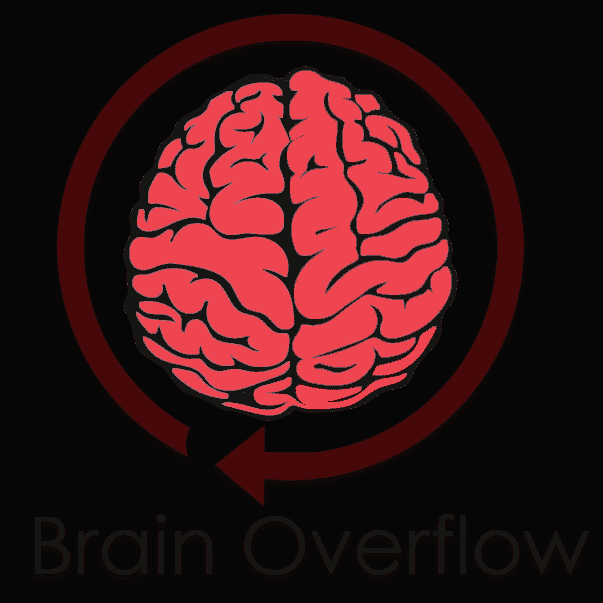
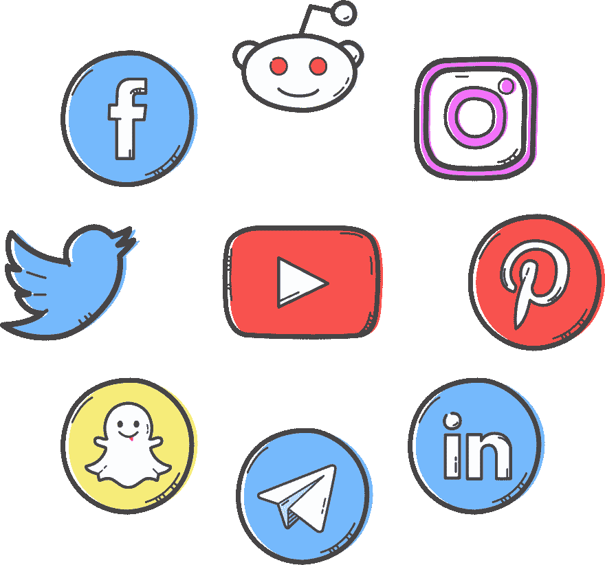

# 逆向编程的秘密|更快地学习编码

> 原文：<https://dev.to/thepylot/secrets-of-reverse-programming-learn-coding-faster-1dbm>

嘿 **DEV** 网络！

如何开始编程？**没有**，网上有很多关于这个话题的文章，所以我不会和你说同样的话，因为我会给你看**逆向编程的秘密**

#### 复杂性

当我第一次开始编码时，我犯了很多错误，我的学习速度非常慢，直到我改变了我的学习方式。正如我在社交媒体上看到的，大多数初学者都是从 HTML CSS 开始他们的编码之旅，这非常简单，不需要额外的努力。在这个时候，你没有提高你的算法思维技能，它降低了你的学习速度。

你必须不断挑战你的大脑，让它成长。这就是为什么选择一个综合体是如此有益。它让你的大脑学习新的东西，并提供改进的机会。

一项复杂的活动不仅能点燃激情，还能迫使你的大脑致力于特定的思维过程，比如解决问题和创造性思维

> 《心理科学》(Psychological Science)2013 年的一项研究发现，年龄在 60 至 90 岁之间的老年人，如果连续三个月每周平均进行 16 个小时的新的复杂活动，比如数码摄影或缝制被子，那么他们在工作和长期记忆测试中的得分要高于那些进行阅读和做填字游戏等更熟悉活动的人。

如果你从复杂的地方开始学习编程，你已经知道较简单的部分了。例如，当我试图用 Python 开发网络爬虫时，我对它一无所知。然而，几天后我用 Django (Web 框架)构建了我的第一个项目。我用这种方法取得了惊人的快速进步！

我知道你们中的一些人会认为个人的极限是有限的，基因为可能性设定了界限。然而，尽管基因影响表现，但它们并不决定表现。不要混淆命运和机遇。基因提供机会。他们不能决定我们的命运。它类似于纸牌游戏。如果你拿到一手更好的牌，你会有更好的机会，但你也需要打好这手牌才能赢。

参考:[原子习惯——建立好习惯的简单&证明方法&打破坏习惯](https://jamesclear.com/)

我完成了几份实习，它们都需要高科技技能或流行的框架，如 React 和 Django。如果你想专注于前端开发，不要拘泥于 HTML 和 CSS，而是考虑直接深入到 JS 框架，如 React、Vue 和 Angular。当你学习这些框架时，HTML 和 CSS 会自动完成。

#### 过度学习

过度学习指的是在绩效提高达到稳定水平后继续培训某项技能。

渡边捷昭(布朗大学认知、语言和心理科学教授，也是这项研究的作者)的研究表明，如果你在获得一项技能后就停止训练，大脑会停留在准备学习的状态。如果你在大脑还处于可塑性状态的时候训练第二个类似的任务，它会覆盖第一个技能。就好像你根本没有学过第一技能一样。

这叫做**逆行干扰**

渡边发现，如果你不过度学习，你的大脑会有更多谷氨酸主导的兴奋。谷氨酸盐是一种化学物质，它能让你的大脑具有可塑性或更强的学习能力。然而，过度学习会降低谷氨酸水平，增加 GABA 的数量，GABA 是一种稳定大脑的化学物质。渡边说:“如果你过度学习这项技能，你的大脑状态会很快从可塑状态转变为稳定状态。”这反过来意味着你的大脑有更多的时间锁定技能，防止它被覆盖。

参考:[科普](https://www.popsci.com/study-brain-overlearning-to-master-skills/)

熟能生巧，大脑功能也是如此。我记得当我完成了我的几个 Django 项目后，我改变了我的学习路线。过了一段时间，我两个都搞砸了。因此，我用 Django 开发了 30 多个博客项目，主要关注 Python。此外，我过去每天至少花 7 个小时写代码。

> 一个业余的练习直到他们能正确地演奏，一个专业的练习直到他们不能错误地演奏

熟能生巧，关键在于重复。一切都是重复。这是所有关于，嗯…你得到的想法…😅。

#### 早点醒来

早起给你新的一天一个良好的开端。除了让你有更多的工作时间，它还能提高你的速度。研究表明，当一个人早起时，他会更有精力，花更少的时间去做一件本来要花更多时间的事情。他也更善于做出更好的决定、计划和实现目标。

不要不吃早餐！通过吃一顿高质量的早餐来开始你的一天，你可以提高你的记忆力和注意力水平，也可以改善你的情绪和降低压力。对儿童的不同研究表明，吃早餐的孩子往往有更好的认知能力，在学校表现更好。

当我在国外上大学的时候，我住在 40 人的宿舍里，这是我人生中最糟糕的一段时间。没有足够的钱，机会和语言是不同的，所以与人沟通是困难的。我在这种情况下很痛苦，直到我组织了我的日常活动。早早醒来后，我拿着笔记本电脑出去买早餐。然后一整天都在图书馆学习逆向编程。我通过每天做同样的事情实现了我的目标，开始为客户建立网站，并搬到了更好的地方。

#### 教程和书籍

最好先从看网上教程开始，再买具体编程语言的书。我在 twitter 上问了这个问题，以下是经验丰富的开发人员的回答。

> Rama Sandeep@ chramasandeep[@ coderasha](https://twitter.com/coderasha)如果你对编码完全陌生，那么从视频教程开始吧。这将通过立即显示视觉效果来让你振奋。书籍永远是最好的资源，当视频教程中的概念充斥着你的头脑时，你可以打开它们。2019 年 7 月 26 日上午 11 点 26 分

> Laurynas Rekasius@ Laurynas rek[@ coderasha](https://twitter.com/coderasha)我会说两者兼而有之，选择的主要因素是材料水平和节奏与你目前的知识。我认为坚持学习最重要的是为自己找到一条正确的学习曲线。这很难，至少对我来说是这样🙂2019 年 7 月 30 日下午 15:38

> makneta[@ makneta](https://dev.to/makneta)[@ coderasha](https://twitter.com/coderasha)两个我都喜欢。在线课程&教程是为了更快地理解这个主题(它们通常有如何调整 IDE 之类的有用提示)。书籍是为了获得关于这个主题的更多信息。2019 年 7 月 26 日上午 11:35

> Cl。Maciel-Contreras[，@ CLC _ 80](https://dev.to/clc_80)[，@coderasha](https://twitter.com/coderasha) 我两样都做，但是第一次尝试学东西的时候看在线教程是很棒的。然后是书籍大参考2019 年 7 月 26 日 02:23 分

如果你想知道学习编程的好资源，请在下面发表评论，我的下一篇文章会涉及到它。

#### 撰写编程文章或教程

一旦你试图教别人你试图掌握的材料或任务，你可以加快你的学习，记住更多。

> 当教师准备教学时，他们倾向于找出关键点，并将信息组织成一个连贯的结构。我们的研究结果表明，当学生期望教学时，他们也会求助于这些类型的有效学习策略。

你可以在 **StackOverflow** 上回答问题，这个神奇的平台不仅仅是寻找解决方案和提出问题。通过解决不同的编程问题来增加你的知识是最好的方法之一。甚至你可以在申请工作或者实习生的时候提供你的 StackOverflow 账号。

#### 社会化媒体

加入社交媒体中的编程社区，跟踪你的进度，并与其他开发者互动，从他们的经验中学习一些东西。发布你的日常任务，你学到了什么，甚至与编程相关的问题。

#### 结论

耐心点，我的朋友！这不仅在编程中必不可少，在生活中也是如此。你必须明白编程有一个具有挑战性的学习曲线，你需要一些时间来理解事情。有一天你会成为一名伟大的程序员。

保持联系！