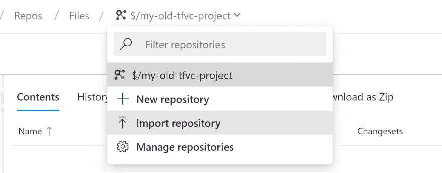

# 解决 TFVC 错误 TF14067 和 Azure 管道

> 原文：<https://dev.to/xpirit/solving-tfvc-error-tf14067-and-azure-pipelines-10cm>

[](https://res.cloudinary.com/practicaldev/image/fetch/s--5zXib5ho--/c_limit%2Cf_auto%2Cfl_progressive%2Cq_auto%2Cw_880/https://jessehouwing.net/conteimg/2019/08/Panorama-Italie-1.jpg)

如果你依赖于 TFVC 客户端对象模型或者 Azure 管道中的`tf.exe`，那么你可能会得到 TF14067 错误。这可能是由于代理依赖于与您使用的版本不同的 TFS 客户端对象模型造成的。

我最近遇到了这个问题，当时微软升级了 Azure Pipelines 代理附带的`tf.exe`，而[我在 TFVC 的管道任务](https://marketplace.visualstudio.com/items?itemName=jessehouwing.jessehouwing-vsts-tfvc-tasks)开始到处失败。[重新填充工作区缓存是解决这个问题的简单方法。](https://stackoverflow.com/a/57413056/736079)看起来我并不孤单，StackOverflow 上的[类似问题暗示了](https://stackoverflow.com/a/57413056/736079)。

当您遇到这个问题时，您将会看到以下神秘的错误消息，其中提到:

1.  `TF14067`
2.  一条你绝对确定存在的路
3.  生成代理初始化前几分钟创建的工作区名称

```
TF14067: The item {path} could not be found in the ws_{id};Project Collection Build Service workspace, or you do not have permission to access it. 
```

## 解

### 选项 1:迁移到 Git

说真的。TFVC 已经依靠生命维持了很长一段时间，很长一段时间没有接受新的功能爱，也不符合当今组织的快节奏和分布式的本质。

Azure DevOps，甚至在它之前的 Team Foundation Server，都有一个简单的导入功能，可以将一个稳定的 TFVC 分支转换成一个新的 Git 存储库。然后，It 部门可能需要做一些工作来清理回购，以遵守最新的清洁回购标准，但从技术上来说，这种变化非常简单。

[](https://res.cloudinary.com/practicaldev/image/fetch/s--I1UU6OKl--/c_limit%2Cf_auto%2Cfl_progressive%2Cq_auto%2Cw_880/https://jessehouwing.net/conteimg/2019/08/image-6.png) 

<figcaption>使用导入库从 TFVC 转换到 Git。</figcaption>

[](https://res.cloudinary.com/practicaldev/image/fetch/s--61JX0icv--/c_limit%2Cf_auto%2Cfl_progressive%2Cq_auto%2Cw_880/https://jessehouwing.net/conteimg/2019/08/image-7.png) 

<figcaption>挑树枝，拉进去。</figcaption>

### 选项 2:使用我的 TFVC 管道任务

为了帮助一个客户从 XAML 迁移到当时的 Visual Studio Online，我构建了 [TFVC 管道任务](https://marketplace.visualstudio.com/items?itemName=jessehouwing.jessehouwing-vsts-tfvc-tasks)。一小组简单的任务，允许您在构建管道中运行一些常见的 TFVC 场景。

```
- task: tf-vc-checkin@2
  displayName: 'Check changes into source control'
  inputs:
    ConfirmUnderstand: true
    BypassGatedCheckin: true
    OverridePolicy: true
    OverridePolicyReason: 'Override!'
    Recursion: Full 
```

我最近发布了版本 2，它增加了改进和清理的 YAML 支持，并使用了最新的代理功能，所以它可以持续一段时间。

这些任务是一种简单的方法，可以在培训您的团队和准备移植到 Git 的过程中赢得更多的时间。

### 选项三:安装使用正确的`tf.exe`。

代理的每个版本都附带了 TFS 客户端对象模型的副本。TFVC 依赖于本地工作区缓存，必须为每个版本的 TFS 客户端对象模型填充该缓存。代理只填充自己使用的缓存。

通过使用与 TFS 客户端对象模型的主版本号相同的版本`tf.exe`,它可以搭载到由代理填充的缓存上。

### 选项 4:强制工作区缓存填充

您可以从命令行强制在不同的主要版本上填充工作区缓存:

```
> tf vc workspaces /collection:$(System.TeamFoundationCollectionUri) /computer:$(Agent.MachineName) 
```

或者从代码:

```
$versionControlServer = $tfsTeamProjectCollection.GetService([Microsoft.TeamFoundation.VersionControl.Client.VersionControlServer])
$workstation = [Microsoft.TeamFoundation.VersionControl.Client.Workstation]::Current
$workstation.EnsureUpdateWorkspaceInfoCache($versionControlServer, $versionControlServer.AuthorizedUser) 
```

## 最后的想法

当我在 2015 年编写 TFVC 任务时，是为了帮助一个客户从他们的 TFS 2012 XAML 版本过渡到当时的新版本系统。这使得他们可以全力使用当时的 Visual Studio Online，并迁移到 Git。我们现在差不多是在 2020 年。这就提出了一个问题...

为什么人们仍然严重依赖 TFVC，只是现在才从 XAML 版本中迁移出来？2015 年引入的新构建代理已经有两个主要版本，XAML 已被正式否决，Visual Studio Online 已被重命名为 Visual Studio Team Services，然后被重命名为 Azure DevOps。我们已经到了很多人已经从基于 UI 的构建定义迁移到 YAML 的地步。

是时候继续前进了！