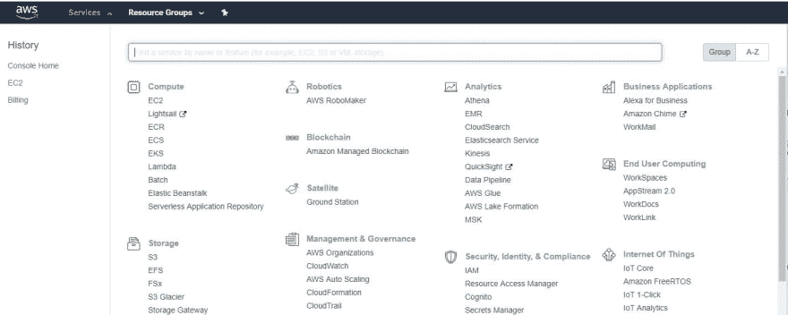
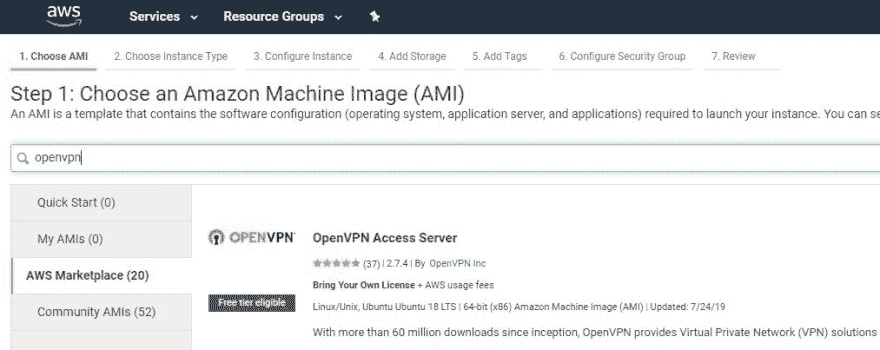
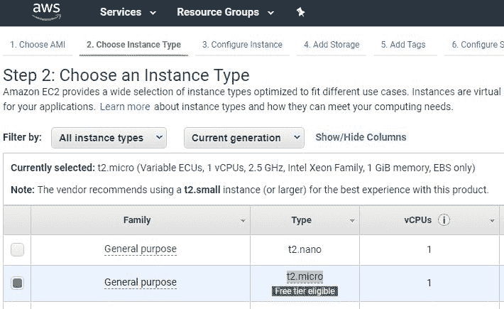
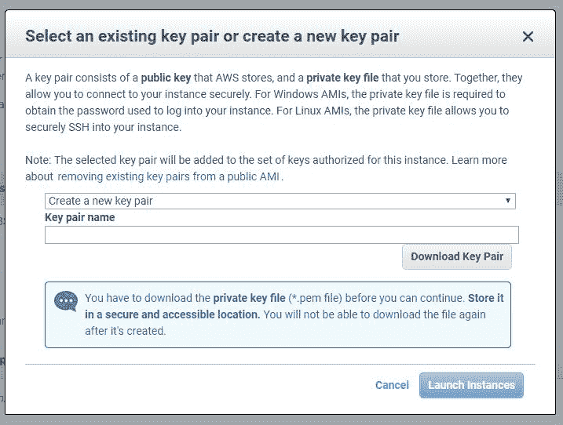
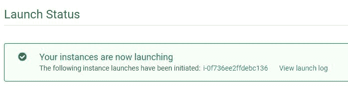
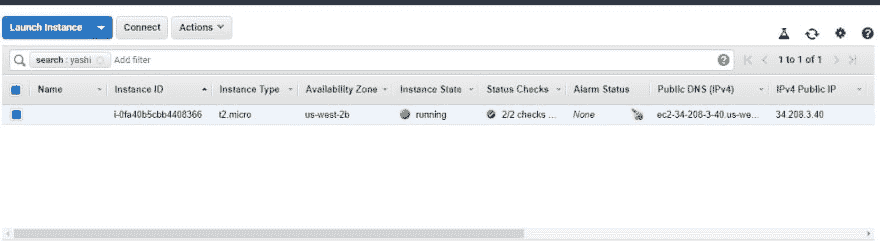
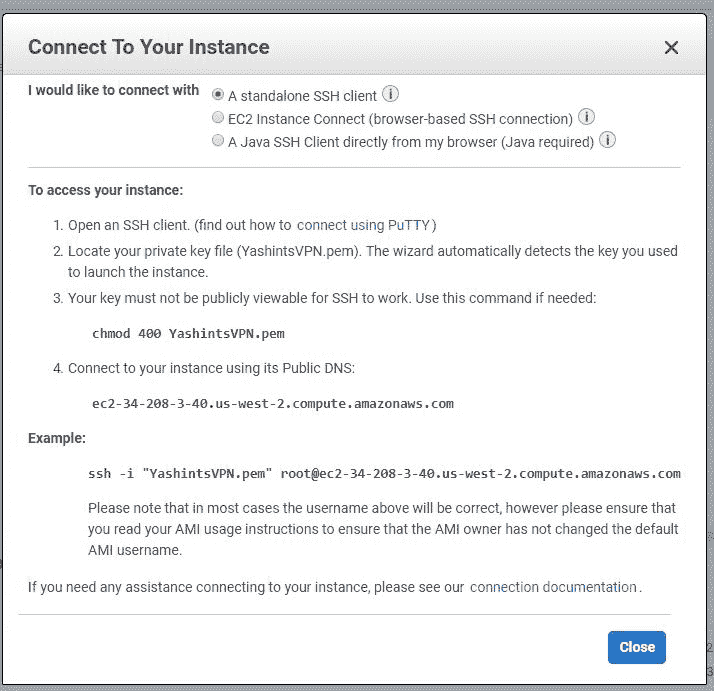
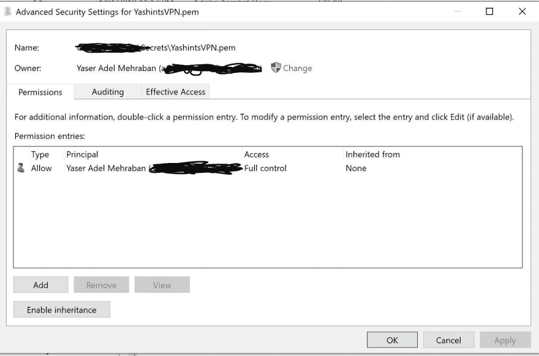
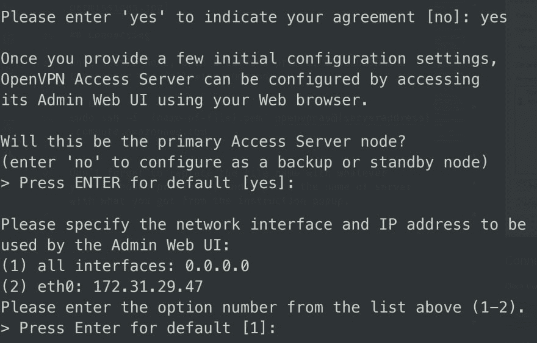

# 让我们在 AWS 上设置一个免费的 VPN 服务器，不到 5 分钟😱🤯🔥

> 原文：<https://dev.to/yashints/let-s-setup-a-vpn-server-for-free-on-aws-under-5-min-1mg4>

有时你想在没有人监视的情况下连接到互联网。这可能是由于政府、ISP 等施加的限制。在使用互联网时保持隐私对一些人来说非常重要，对我个人来说，这种体验就是绕过 Twitter 等网站和 Telegram 等软件上的一个可笑的传感器。

所以我想，对于一个网络开发者来说，安装一个 VPN 服务器有多难(因为我不想每月支付 5 美元)。在谷歌搜索了一下之后，我发现你可以很容易地在 [AWS(亚马逊网络服务)](https://aws.amazon.com/)上免费使用 [OpenVPN](https://openvpn.net/) 来做这件事。我开始设置它，几分钟后，我让它运行起来。

> OpenVPN 是一款流行的开源工具，经过充分测试，可为您提供生产就绪的 VPN 解决方案。

所以为了不忘记我是如何做到的，像往常一样，我想让我们写点东西，谁知道呢，也许对你也有用😉。

你准备好了吗？

## AWS 控制台

如果您在 [AWS(亚马逊网络服务)](https://aws.amazon.com/)上没有账户，请创建一个。这是免费的，但是你需要准备好你的信用卡信息。

注册后，登录并在服务菜单下寻找 EC2(你可以输入，它会在你输入时过滤服务)。

[](https://res.cloudinary.com/practicaldev/image/fetch/s--5bHZybZJ--/c_limit%2Cf_auto%2Cfl_progressive%2Cq_auto%2Cw_880/https://thepracticaldev.s3.amazonaws.com/i/8je0hvs5jx68r1h33hly.jpg)

单击 EC2，您将被重定向到它的仪表板。单击创建实例部分下的启动实例按钮。

## 选择 OpenVPN

许多文章将指导您设置一个新的 Linux VM 并手动安装 OpenVPN。然而，事情已经发生了变化，一些可爱的人已经在 AWS 市场上推出了现成的服务，所以我们会选择它。

进入仪表板后，点击左侧的`AWS Marketplace`菜单，键入 OpenVPN，然后按 enter 键。

[](https://res.cloudinary.com/practicaldev/image/fetch/s--C4spOoqp--/c_limit%2Cf_auto%2Cfl_progressive%2Cq_auto%2Cw_880/https://thepracticaldev.s3.amazonaws.com/i/tulweb56w4u3vt8ho1ne.jpg)

点击第一个带有`free tier eligible`徽章的按钮。

## 选择实例类型

在下一页点击继续，并从实例类型列表中选择`t2.micro`。

[](https://res.cloudinary.com/practicaldev/image/fetch/s--7OaRZFhV--/c_limit%2Cf_auto%2Cfl_progressive%2Cq_auto%2Cw_880/https://thepracticaldev.s3.amazonaws.com/i/ubh9unuynmxyi979skxm.jpg)

在此阶段点击 ***查看并启动*** 按钮。

## 启动实例

从弹出窗口中选择通用 SSD，然后单击下一步。现在点击`Launch`，你会看到一个弹出窗口，要求你选择一个密钥对。这是为了让您稍后访问实例。

[](https://res.cloudinary.com/practicaldev/image/fetch/s--HBuf3p9U--/c_limit%2Cf_auto%2Cfl_progressive%2Cq_auto%2Cw_880/https://thepracticaldev.s3.amazonaws.com/i/uhwahn8dxwo8t1b5iorc.jpg)

选择创建新的密钥对(或现有的密钥对，如果您已经有了)，输入名称并单击下载密钥对。

将`.pem`文件保存在安全的地方，因为这就像是你服务器的后门😁。单击启动实例，等待实例进入运行状态。

[](https://res.cloudinary.com/practicaldev/image/fetch/s--R8FCmE08--/c_limit%2Cf_auto%2Cfl_progressive%2Cq_auto%2Cw_880/https://thepracticaldev.s3.amazonaws.com/i/q93r3zgt2ty9sme8b1i6.jpg)

单击查看实例以查看实例列表。

[](https://res.cloudinary.com/practicaldev/image/fetch/s--hkEqeJJ0--/c_limit%2Cf_auto%2Cfl_progressive%2Cq_auto%2Cw_880/https://thepracticaldev.s3.amazonaws.com/i/k2bxqeh7375se021jhmj.jpg)

选择您的实例，然后单击连接。

## 准备

您将在弹出窗口中看到一组关于如何连接到您的实例的说明。

[](https://res.cloudinary.com/practicaldev/image/fetch/s--AEc3br_V--/c_limit%2Cf_auto%2Cfl_progressive%2Cq_auto%2Cw_880/https://thepracticaldev.s3.amazonaws.com/i/q5tkxgsm8nhdmhbj2nsf.jpg)

在指令集中，他们告诉你使用 [PuTTY](https://docs.aws.amazon.com/console/ec2/instances/connect/putty) 连接到使用`SSH`的实例。然而，我已经在`WSL`(Linux 的 windows 子系统)中安装了 Ubuntu，我们可以使用它。否则，您可以使用 PuTTY 甚至 web 浏览器连接。

在我们做任何事情之前，我们需要为我们的私钥设置权限👉🏽`.pem`👈🏽文件，否则它不允许您连接。如果您使用的是 Linux 或 Mac 机器，只需运行下面的命令:

```
chmod 400 {name-of-file}.pem 
```

Enter fullscreen mode Exit fullscreen mode

像我一样的其他人，右击`.pem`文件，点击*安全>推进*。然后将所有者更改为您自己，单击禁用继承并删除所有权限。单击添加，添加您自己并给予完全控制。

[](https://res.cloudinary.com/practicaldev/image/fetch/s--EofJ6tRf--/c_limit%2Cf_auto%2Cfl_progressive%2Cq_auto%2Cw_880/https://thepracticaldev.s3.amazonaws.com/i/bjhazj0pt1eoh1hkn3j1.jpg)

## 连接

完成后，打开命令提示符，键入 bash，然后输入以下命令:

```
sudo ssh -i "{name-of-file}.pem" openvpnas@{serveraddress}.compute.amazonaws.com 
```

Enter fullscreen mode Exit fullscreen mode

不要忘记将文件名替换为您之前选择的名称，并将服务器名称替换为您从弹出的说明中获得的名称。

[](https://res.cloudinary.com/practicaldev/image/fetch/s--MGlnBWw4--/c_limit%2Cf_auto%2Cfl_progressive%2Cq_auto%2Cw_880/https://thepracticaldev.s3.amazonaws.com/i/2vymhxiwu9r47r3sbxzo.jpg)

为协议键入 yes，然后只需按 enter 键确认所有默认值。当您到达终点时，更改用于登录的用户密码:

```
sudo passwd openvpn 
```

Enter fullscreen mode Exit fullscreen mode

输入两次新密码，一切就绪。打开一个浏览器窗口，输入`https://{server address}:943/admin`，用`openvpn`和你刚刚设置的密码登录。

## 整理一些设置

进入 OpenVPN 的管理仪表板后，单击配置并应用以下更改:

*   更改*的切换，客户端互联网流量是否应该通过 VPN 路由？*到**是**
*   将*让客户端使用特定的 DNS 服务器*切换为**是**
*   选择自定义 DNS 服务器，并将第一个框设置为`1.1.1.1` (CloudFlare DNS🦄)和第二个到`8.8.8.8`

现在保存设置，等待顶部的弹出窗口，然后单击将更改应用到服务器。

## 你可以走了

你都准备好了。你现在可以连接到你自己的 VPN 服务器，享受网上冲浪😎。在您之前打开的浏览器窗口的第一页上，有五个选项可以下载适用于不同平台的 OpenVPN 客户端。如果你点击 windows，你会得到一个预先配置好你的服务器地址的安装程序。只需输入你的用户名和密码，瞧。

如果你需要一个免费的 VPN 服务器设置，希望这能帮到你。