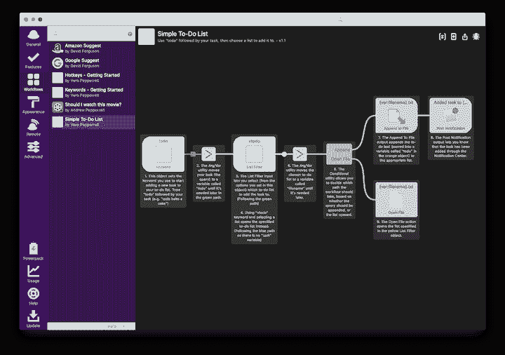
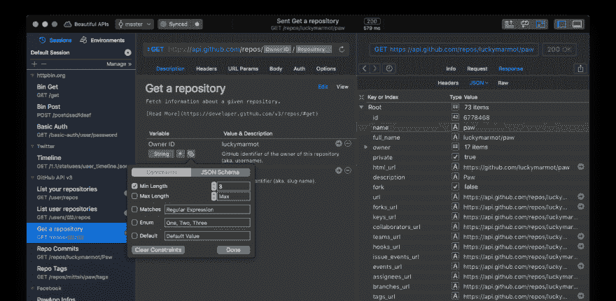
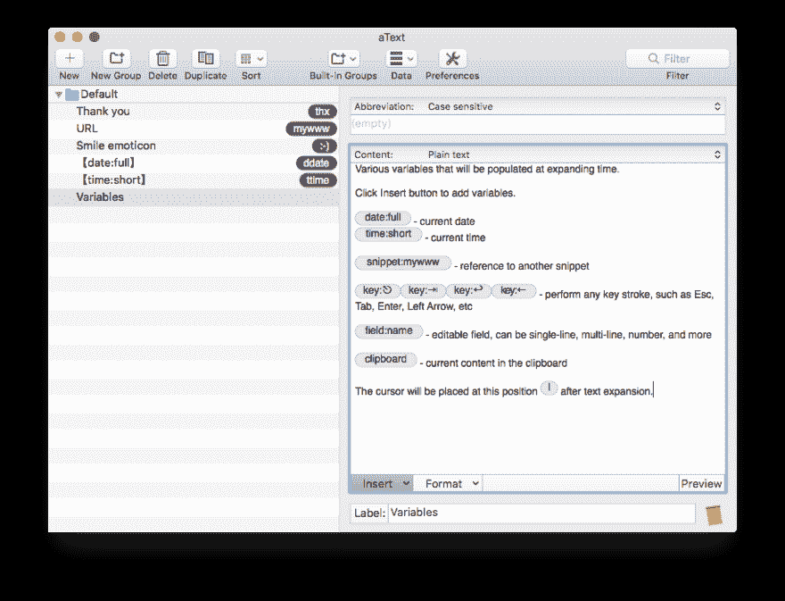
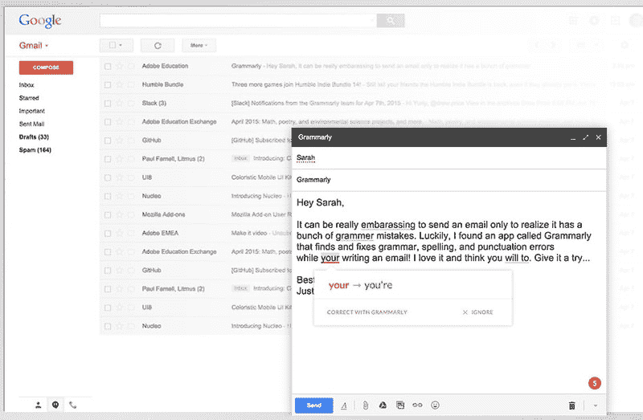
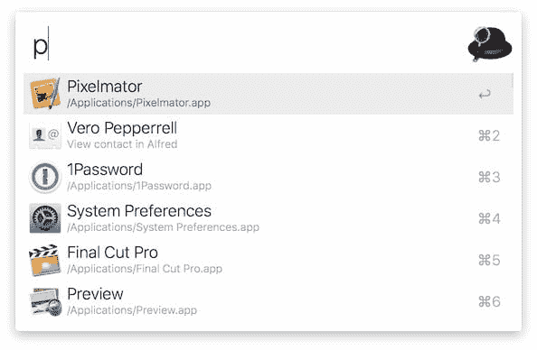
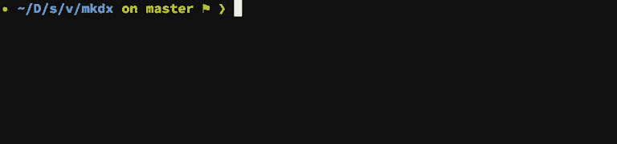
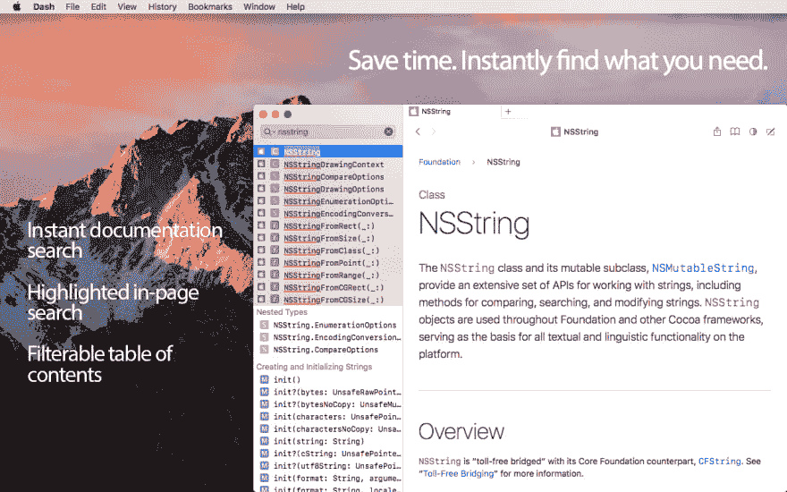
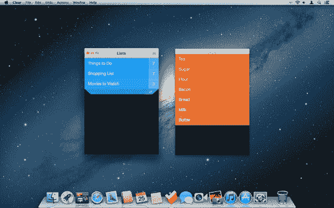
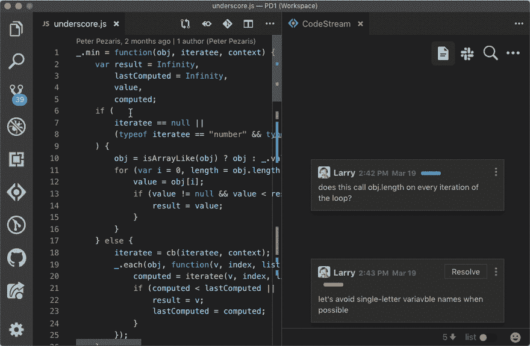

# 任何开发人员的八大生产力原则

> 原文：<https://dev.to/yaronwittenstein/top-8-productivity-principles-for-any-developer-42hm>

我一直非常热衷的一个主题是生产力。寻找用更少的时间和精力做更多事情的方法是非常重要的。在一个工作日内节省许多微小的能源消耗，总的来说可以节省大量的能源。

互联网上充斥着编程生产力的文章。写一个新的不是有点徒劳吗？😉

大多数关于编程效率的文章都非常具体。下面是一些你可能会找到的文章示例:

*   【2019 年任何 Mac Web 开发者都必须拥有的工具
*   *任何 Windows 程序员的 10 大工具*
*   *最流行的网络开发工具*

我想写一篇关于原则而不是工具的文章。

### **新工具来来往往。我们坚持的是原则。**

我挑选了我认为任何开发人员都应该采用的八大生产力原则。

因为我是 Mac 用户，所以我还会提供 Mac 的工具建议。我的部分建议也适用于其他操作系统。不管我的建议如何，将这些原则应用到其他操作系统或找到替代的 Mac 工具应该很容易。

还是那句话，重要的是坚持原则，而不是工具。

所以让我们往下钻...

### **原则 1——自动化工作流程**

程序员的大量时间都花在一遍又一遍的重复任务上。

以下是一些常见场景的一小部分:

*   通过谷歌搜索堆栈溢出。
*   终止一个挂起冻结的操作系统进程，或者由于内存泄漏而消耗过多的内存。
*   清除浏览器缓存并刷新我们的本地 [http://0.0.0.0:8000](http://0.0.0.0:8000) 开发页面。

这些例子中的一部分是非直接编程任务，但对于任何专业程序员来说仍然是不可或缺的。例如:查找世界其他地方的时区/天气。

这些重复性任务中有许多涉及一系列步骤:

*   当在*栈溢出*寻求帮助时，我们需要首先进入浏览器，通过一些搜索引擎进行搜索。然后，我们将选择一个最靠前的结果，这可能会将我们导向一个*堆栈溢出*页面，即使我们没有明确地将术语`stackoverflow`添加到搜索本身。
*   为了关闭一个冻结的操作系统进程，我们首先需要查找它的进程 id (PID ),然后执行一个 kill 命令。(或者转到一个 process explorer GUI，在那里找到它并要求杀死它)。

幸运的是，有各种工具致力于自动化这些手动重复操作。

如果你是 Mac 用户，那么 macOS 附带了一个名为 [Automator](https://support.apple.com/en-gb/guide/automator/welcome/mac) 的工具，可以让你创建非常复杂的工作流程。
我不能对这个工具说更多，因为我实际上没有使用它。我确实使用了另一个叫做[阿尔弗雷德](https://www.alfredapp.com/)的一站式生产力工具，我将在本文过程中多次提到它
。

Alfred 是一款面向 Mac 用户的多功能生产力应用。这是多年来最受欢迎的生产力 Mac 应用之一，理由很充分！
Alfred 的主要优势之一是工作流。
这里有一个形象的说明: 

基本上，每个工具都有自己的优势，这取决于具体情况。
以我的理解，[自动机](https://support.apple.com/en-gb/guide/automator/welcome/mac)更像是 [IFTTT](https://ifttt.com/) / [zapier](https://zapier.com/) 风格的工具。 [Automator](https://support.apple.com/en-gb/guide/automator/welcome/mac) 挂钩到低级操作系统事件，
而 [Alfred](https://www.alfredapp.com/) 主要是将不同的组件粘合在一起，并在我们命令它时开始运行。

像 [Automator](https://support.apple.com/en-gb/guide/automator/welcome/mac) / [Alfred](https://www.alfredapp.com/) 这样的工具是通用的工作流工具。各有利弊。
还有其他小众的工作流工具/功能。当我在工作中发现想要自动化的文本编辑循环模式时，我会使用 vim 宏。
使用 vim 宏的一个经典例子是扫描由逗号分隔的单词列表，每个单词用引号括起来。

如果你使用像 Excel 这样的工具，那么我知道它附带了一种全功能的编程语言，叫做 [VBA](https://en.wikipedia.org/wiki/Visual_Basic_for_Applications) 。
互联网上有文章讲述了那些利用 [VBA](https://en.wikipedia.org/wiki/Visual_Basic_for_Applications) 魔法，将大部分日常工作自动化的人！

有时候，最好的工作流解决方案本质上是编写代码。通常，它是一个像构建脚本一样消耗不到 100 LOC 的小脚本。其他时候，它会编写一个小的迷你项目。

要注意的关键点是，如果你发现自己手动重复一个面向工作流的流程，考虑一下是否可以使用通用工作流工具
或使用一些专用软件来实现自动化，或者从头开始开发一个解决方案是否可行。

重要的是对新的自动化机会保持警惕和开放。

### **原理#2 - API &检验工具**

*   **API 工具**

几乎所有开发人员在工作期间都至少与一个 HTTP 连接有某种联系(抱歉，这个双关语不好笑)。无论是伪造一个 HTTP 测试请求，还是在服务器端点上触发一些运行代码。良好的 HTTP 接口(也称为 API 工具)是必需的。

我强烈推荐使用 [Paw](https://paw.cloud/) 。大部分人用的是[邮差](https://www.getpostman.com)，功能更重。 [Postman](https://www.getpostman.com) 也有运行负载测试能力和许多集成。

一旦使用了 API 工具，请确保保存请求文件以备将来使用。如果你对相同的 API 端点做了大量的修改，只改变参数而不是在每次需要的时候从头开始合成，这可以节省大量的时间。此外，团队成员之间共享文件也很重要。您可能希望与广泛使用的请求共享一些空间。
它也可以作为你的系统知识库的补充。

如果您使用更高级的流行协议，如 gRPC，您可能会找到适合您需求的匹配 UI 工具。

*   **检验工具**

在其他情况下，您可能希望保持被动，只是嗅探流量并记录数据包，以便以后调查或重放流量。当我真的需要一个好的代理来检查 Mac 的数据时，我使用了[查尔斯](https://www.charlesproxy.com/)。许多年前，我曾经和[的小提琴手](https://www.telerik.com/fiddler)一起演奏过《寡妇》这首曲子。它不再支持任何流行的操作系统。

当然，如果不提到经典的 Wireshark ，这一条就不完整。
你可能知道，每个操作系统都有内置的命令行工具，比如 tcpdump / curl。

### **原则#3 -剪贴板历史**

您有没有想过，您将一些文本粘贴到您的 IDE 文件中，只是为了意识到剪贴板上有另一个更新的内容，而您
不再能够访问以前的剪贴板数据？

不再是了。使用剪贴板历史是一个必备的工具！

我用的是 [Flycut](https://apps.apple.com/us/app/flycut-clipboard-manager/id442160987) 但是 Mac 有更多的选择。实际上，[阿尔弗雷德](https://www.alfredapp.com/)有一个内置的剪贴板历史功能。
即使你的 IDE 中集成了剪贴板历史记录。拥有一个跨操作系统的剪贴板历史工具仍然是明智的。

一个小提示:如果你是 Mac 用户，想要一个非常好的工具来选择文本并复制到剪贴板，我强烈推荐 [PopClip](https://apps.apple.com/us/app/popclip/id445189367) 。
这个工具有很多扩展。比如，选择一个单词并要求字典翻译，或者选择一个单词并在该单词上打开[破折号](https://kapeli.com/dash)。

### **原则# 4——文字展开&缩写**

*   **通用文本扩展**

文本扩展的经典用法是编写一个代表较长文本的缩写，然后文本扩展器半神奇地用缩写
替换扩展的文本。

程序员可以从代码片段的文本扩展中受益匪浅。我目前没有使用代码片段管理器，虽然有一天我可能会使用。顺便说一句，[阿尔弗雷德](https://www.alfredapp.com/)也提供了开箱即用的代码片段管理器。

我通常使用文本扩展来访问链接，比如我经常访问的 Google Docs。我的 Mac 文本扩展软件是 [aText](https://www.trankynam.com/atext/) 。你可能猜对了[阿尔弗雷德](https://www.alfredapp.com/)提供了自己的文本扩展功能，我还没有尝试过，但我敢打赌这是真棒。

*   **命令行**

在命令行中，我对更长的命令使用许多缩写别名(在我的`.zshrc` dot 文件中定义)。

例如:我没有为本地 Git 存储库编写`git reset HEAD --hard`，而是编写了`grhh`。

如果我需要将分支`develop`合并到当前分支，我只需输入`gmd`。
或者不用`vim`命令打开 vim，我只是插入`v`。

*   **旁注**

作为旁注。书写文本领域的另一个工具在语法上叫做。
这是一款人工智能写作助手。我写邮件的时候一直用它(也是为了写这篇博文的时候修正错误；) )

### **原理#5 -即时本地搜索**

人们被数据淹没了。我们程序员也不例外。
为了缩短寻找一条信息的搜索时间，我们必须有好的搜索工具。

我们搜索什么？

*   **文件/目录/应用**

嗯，这与任何电脑用户都有关系。搜索是[阿尔弗雷德](https://www.alfredapp.com/)使用最多的功能。
比起 macOS 自带的*聚光灯*，我更喜欢它。

*   **模糊搜索命令行历史**

命令行是程序员最好的朋友。在任何一个编程会话中，我们都会执行大量的命令。我们通常会重复一些最近使用过的命令，但不一定是最后一个命令，让我们按下..↑为了找到想要的命令。

最酷的方法是模糊搜索我们的命令行历史。我想推荐一个很棒的工具，叫做 [fzf](https://github.com/junegunn/fzf) 。

这个 gem 让我们用随键入搜索(也称为模糊搜索/增量搜索)功能来丰富我们的命令行历史。不仅如此，它还有另一个很棒的功能，可以通过预览模式选项按名称搜索文件。
因此，如果我们搜索一个文件，我们可以看到它的预览，以确保这是我们在选择它之前寻找的。

这个宝贝可以被任何操作系统支持，甚至有一个官方的 vim 插件叫做 [fzf.vim](https://github.com/junegunn/fzf.vim) 。
(我相信其他 ide 也有非官方插件)。

如果你是 zsh 用户，一个超级方便的插件是[zsh-自动建议](https://github.com/zsh-users/zsh-autosuggestions)。
我使用[zsh-自动建议](https://github.com/zsh-users/zsh-autosuggestions)，当我键入一个命令时，我从我的命令行历史
中获得建议，这使得找到大多数命令变得轻而易举，甚至不需要寻求 [fzf](https://github.com/junegunn/fzf) 的帮助。

所以[fzf](https://github.com/junegunn/fzf)+[zsh-auto suggestions](https://github.com/zsh-users/zsh-autosuggestions)在一起是无与伦比的一对！

我们在工作中很大一部分使用命令行。能够搜索我们的命令行历史确实是必须的。

*   **离线文档**

编程时最常见的一个动作是询问“用编程语言 *Y* 做 *X* 的语法是什么？”

与其在谷歌上搜索一个语法关键字或一些展示如何使用标准库的例子，不如建议在我们的机器上准备好离线文档以便即时搜索。在编程时，它可以节省大量的时间并减少上下文切换。

我使用最流行的 Mac 离线文档工具 [Dash](https://kapeli.com/dash) 。它附带了几乎每一种编程语言
的文档集，以及许多流行的库。它还可以与任何已知的 IDE 集成。不仅如此，你还可以添加定制的库文档
，因为[破折号](https://kapeli.com/dash)也连接到许多包管理器。

为了激活 [Dash](https://kapeli.com/dash) ，大部分时间我都是使用 [Dash Alfred 工作流程](https://github.com/Kapeli/Dash-Alfred-Workflow)通过 Alfred 的提示进行*搜索&打开 Dash* (超级有用)。

### **原则之六——知识管理**

受著名的组织知识的 [GTD 方法](https://gettingthingsdone.com/)的启发，我正在使用一个*待办事项列表*应用程序来放松我的大脑，卸下我大脑中的任务。
每当我想到我需要做的事情，我首先会把它作为一个项目添加到我的*待办事项列表*应用程序中。稍后，这个项目可能会被翻译成 GitHub 问题，甚至是路线图/技术债务文档。

在过去的几年里，我一直使用 [Clear](https://apps.apple.com/us/app/clear-tasks-reminders-to-do-lists/id504544917) 。
我可能会在某个时候转移到另一个应用程序，因为上次更新是在 2016 年，因为我觉得它缺少一些功能。
但总的来说，它确实有效！

如果您想在浏览器中打开更少的标签页并获得更多的关注，请使用 [Pocket](https://getpocket.com/) 保存文章以备将来阅读。
这将帮助你理清思路，专注于当前的相关标签。

你也可以使用一个便签应用程序来记下你以后可能想要移动以用于另一个长期展示用途的片段。说到长期使用，我是 evernote 的长期忠实用户。一些人也使用 evernote 作为他们的待办事项应用。无论什么对你有用，只要确保你的大脑不会超载信息，你可以让别人替你储存。

不提到备份平台 Dropbox/iCloud/GoogleDrive 风格，知识管理就不完整。
本文提到的任何东西都鼓励备份。一些应用程序有一个`Connect-with`到云提供商的整合，
，从而使备份过程顺利。

### **原理#7 -键盘快捷键**

您可能知道在 IDE 中保存当前文件更改的快捷键。例如，你知道重新打开最近关闭的浏览器标签的快捷方式吗？

我相信，如果一个人发现自己在有键盘快捷键的情况下使用鼠标太频繁，那么他应该努力去启动它。记住这些快捷键的最好方法是使用间隔重复的抽认卡软件，比如安奇 T2。
[Anki](https://apps.ankiweb.net/) 适用于任何操作系统(Mac、Windows、Linux、Android、iOS)。

我是 Anki 的忠实粉丝，它帮助我学习新的东西(键盘快捷键是一个很好的用例)并保留它们供长期使用。

旁注:谈论抽认卡。间隔重复是扩大你的语言词汇量的最好方法。为此，我强烈推荐[超级演员](https://supermemo.com)。

花时间学习和记忆有用的键盘快捷键可以对生产力产生巨大的积极影响。

### **原理# 8——阅读代码**

除了编写代码，让我们阅读和浏览现有的源代码成为一种愉快的体验也是非常重要的。当我阅读别人的代码时，我通常更喜欢在 ide 之外阅读(这只是个人喜好)。

如果我浏览 GitHub 库，我有时会使用[八叉树](https://www.octotree.io)，但我通常更喜欢使用[源图](http://sourcegraph.com)。

我非常喜欢 [sourcegraph](http://sourcegraph.com) 的导航和搜索功能。 [GitHub 最近推出了](https://help.github.com/en/articles/navigating-code-on-github)代码导航，所以我们应该期待这只是
大事件的开始。

我最近遇到了一个叫做 [codestream](https://www.codestream.com/) 的工具，它可以让你在 IDE 中对代码进行内部讨论。
虽然我还没有尝试这个工具(vim 支持即将推出)，但我相信它可以成为阅读代码的好助手，因为它允许你添加书签(称为 [codemarks](https://www.codestream.com/codemarks) )。
[codestream](https://www.codestream.com/) 还将它与其他工具集成，如 Slack 和许多问题跟踪工具。

确保你在阅读别人的代码时享受良好的阅读体验。它可以减轻这个已经在精神上要求很高的过程。

**总结**

在这篇文章中，我总结了我所相信的，每个程序员都应该应用的八大生产力原则。我对我们应用这些原则的无数工具和技巧感到谦卑。

我相信运用这些原则，不仅能加快我们的工作，还能增加我们的快乐和成就感。

感谢您阅读这篇文章！我希望你喜欢阅读它，如果你喜欢，请与你的朋友/同事程序员分享。
谢谢！

链接:

1.  阿尔弗雷德
2.  [破折号](https://kapeli.com/dash)
3.  [爪子](https://paw.cloud/)
4.  [邮递员](https://www.getpostman.com)
5.  [查尔斯](https://www.charlesproxy.com/)
6.  [提琴手](https://www.telerik.com/fiddler)
7.  [Wireshark](https://www.wireshark.org)
8.  [逃狱](https://apps.apple.com/us/app/flycut-clipboard-manager/id442160987)
9.  [PopClip](https://apps.apple.com/us/app/popclip/id445189367)
10.  [a 文本](https://www.trankynam.com/atext/)
11.  [fzf](https://github.com/junegunn/fzf)
12.  [语法](https://www.grammarly.com)
13.  [Anki](https://apps.ankiweb.net/)
14.  [超级记忆](https://supermemo.com)
15.  [GTD](https://gettingthingsdone.com/)
16.  [evernote](https://evernote.com)
17.  [清除](https://apps.apple.com/us/app/clear-tasks-reminders-to-do-lists/id504544917)
18.  [口袋](https://getpocket.com/)
19.  [八叉树](https://www.octotree.io)
20.  [来源图](http://sourcegraph.com)
21.  [码流](https://www.codestream.com/)
22.  [https://github . com/YaronWittenstein/productivity-tips-for-MAC](https://github.com/YaronWittenstein/productivity-tips-for-mac)